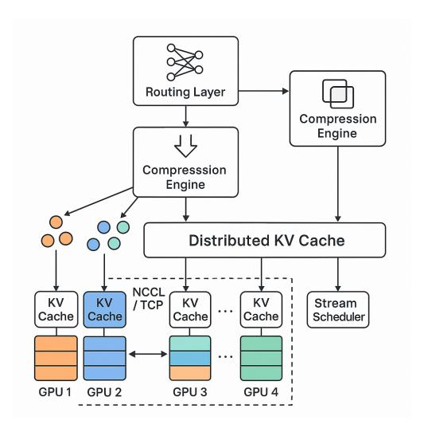

# PiKV: KV Cache Management System for MoE Architecture

## Dong Liu∗ 1 2 Yanxuan Yu 3 Ben Lengerich 4 Ying Nian Wu 1

## Abstract

As large-scale language models continue to scale up in both size and context length, the memory and communication cost of key-value (KV) cache storage has become a major bottleneck in multi-GPU and multi-node inference. While MoEbased architectures sparsify computation across experts, the corresponding KV caches remain dense and globally synchronized, resulting in significant overhead.

We introduce PiKV, a parallel and distributed KV cache serving framework tailored for MoE architecture. PiKV leverages *expert-sharded KV storage* to partition caches across GPUs, *PiKV routing* to reduce token-to-KV access, and a *PiKV Scheduling* to adaptively retain query-relevant entries. To further reduce memory usage, PiKV integrates *PiKV Compression* modules the caching pipeline for acceleration.

PiKV is recently publicly available as an open-source software library: [https://github.com/NoakLiu/PiKV.](https://github.com/NoakLiu/PiKV) PiKV is still a living project, aiming to become a comprehesive KV Cache management system for MoE Architectures.

## 1. Introduction

Large Language Models (LLMs) have become the foundation of modern AI applications, powering virtual assistants, code generation, document analysis, and multi-turn reasoning. With increasing demand for longer sequences and sparse expert models [\(Bai et al.,](#page-5-0) [2025;](#page-5-0) [Rajbhandari et al.,](#page-6-0) [2020;](#page-6-0) [Achiam et al.,](#page-5-1) [2023\)](#page-5-1), there is huge demand to deploy sparsely-gated Mixture-of-Experts (MoE) structures [\(Lep](#page-5-2)[ikhin et al.,](#page-5-2) [2020;](#page-5-2) [Du et al.,](#page-5-3) [2022\)](#page-5-3) to reduce computation costs at scale.

However, serving such models introduces significant system-

Code available at <https://github.com/NoakLiu/PiKV>.

Figure 1. PiKV Framework

level challenges. During inference, each token generation requires attending to the entire KV cache from prior tokens. For a 7B-scale MoE model with 128K context and 16 experts, the full KV cache can occupy >24GB of memory and incur excessive communication latency across GPUs and nodes. Even with FlashAttention-style optimizations [\(Dao](#page-5-4) [et al.,](#page-5-4) [2022\)](#page-5-4), the need to load and attend to dense KV structures becomes the dominant bottleneck, especially in autoregressive decoding.

Prior works [\(Zhang et al.,](#page-7-0) [2023;](#page-7-0) [Gao et al.,](#page-5-5) [2024\)](#page-5-5) have shown that a small fraction of tokens contribute disproportionately to the final attention output, motivating selective cache access. Yet most methods either use static heuristics or ignore the underlying system cost of accessing KV entries across distributed compute nodes. In this work, we ask a deeper question: *can we design a KV caching system that is both sparsity-aware and system-optimized for distributed MoE inference?*

We propose PiKV, a parallel distributed KV caching system tailored for sparse mixture of expert models training and inference. As shown in Figure [1,](#page-0-0) PiKV includes three synergistic components: (1) an *expert-sharded distributed KV cache* layout across multi-GPU or multi-node compute, (2) a *sparse expert routing layer* that dynamically selects top-k experts per query, and (3) an *adaptive stream scheduler* that

1University of California, Los Angeles 2Yale University 3Columbia University 4University of Wisconsin-Madison. Correspondence to: Dong Liu <dong.liu@aya.yale.edu>.

uses activity-based eviction to retain only high-utility KV entries.

To further reduce memory and bandwidth cost, PiKV compresses KV representations using modular schemes such as LoRA [\(Hu et al.,](#page-5-6) [2022\)](#page-5-6), PyramidKV [\(Cai et al.,](#page-5-7) [2024\)](#page-5-7), and Duo [\(Chen et al.,](#page-5-8) [2024\)](#page-5-8). We track metadata and usage patterns of each KV shard to guide eviction and cache streaming policies, enabling efficient inference under both static and streaming contexts.

- We present a novel system architecture that combines sparse expert routing and distributed KV cache layout with query-aware streaming scheduling.
- We propose compression-aware KV caching, integrating multiple compression schemes and eviction policies into a unified system-level framework.
- We validate efficiency of PiKV in KV Cache Management of MoE Architectures, achieving significant improvements in memory, latency, and end-to-end generation efficiency.

## 2. Related Work

### 2.1. Long-context LLMs

With the rapid growth in model size and sequence length, long-context LLMs have gained significant attention. Architectures such as Transformer-XL [\(Dai et al.,](#page-5-9) [2019\)](#page-5-9), Longformer [\(Beltagy et al.,](#page-5-10) [2020\)](#page-5-10), and BigBird [\(Zaheer et al.,](#page-6-1) [2020\)](#page-6-1) explored architectural sparsity to improve scalability. In practice, most LLMs adopt Rotary Position Embedding (RoPE) [\(Su et al.,](#page-6-2) [2024\)](#page-6-2), which has been extended to longer contexts through rescaling [\(Chen et al.\)](#page-5-11). Notably, Yarn-LLaMA [\(Peng et al.,](#page-6-3) [2023\)](#page-6-3) expanded the 4K-token LLaMA-2 model to 32K and 128K tokens, respectively. Context length scaling techniques have pushed limits beyond 1M tokens [\(An et al.,](#page-5-12) [2024\)](#page-5-12). For long-document semantic understanding, hierarchical memory structures [\(Liu](#page-6-4) [& Yu,](#page-6-4) [2025c\)](#page-6-4) organize content into local segment graphs and a compact global summary, reducing worst-case semantic parsing complexity from O(N2 ) to near-linear. Serving these long-context models introduces substantial KV cache pressure and decoding latency. PiKV addresses this by combining distributed KV cache design with token-level adaptive routing and scheduling.

### 2.2. Sparse Expert Routing and KV Lookup

MoE-based models [\(Lepikhin et al.,](#page-5-2) [2020;](#page-5-2) [Fedus et al.,](#page-5-13) [2022;](#page-5-13) [Du et al.,](#page-5-3) [2022\)](#page-5-3) reduce compute cost by activating a small subset of experts per token. However, inferencetime memory and KV access patterns remain dense in most implementations. DeepSeek-V2 [\(Liu et al.,](#page-6-5) [2024a\)](#page-6-5) and M6-MoE [\(Zheng et al.,](#page-7-1) [2023\)](#page-7-1) explored dynamic expert selection and sparsity-aware routing. PiOne [\(Lu et al.,](#page-6-6) [2024\)](#page-6-6)

and RingAttention [\(Liu et al.,](#page-6-7) [2023\)](#page-6-7) explored multi-GPU KV alignment but did not optimize for token-expert selectivity. At the hardware level, CXL-SpecKV [\(Liu & Yu,](#page-6-8) [2026\)](#page-6-8) leverages CXL interconnects and FPGA accelerators to disaggregate KV caches to remote memory, combining speculative prefetching with on-chip compression to reduce GPU memory pressure in datacenter deployments. Our work differs by tightly coupling token-level sparse routing with expert-sharded KV cache layouts and a lightweight backend gating network, reducing lookup and communication cost simultaneously.

### 2.3. KV Compression and Stream-aware Scheduling

To alleviate memory and bandwidth bottlenecks, several methods have been proposed to compress and truncate KV caches. H2O [\(Zhang et al.,](#page-7-0) [2023\)](#page-7-0) prioritizes tokens with high cumulative attention weights. FastGen [\(Sheng et al.,](#page-6-9) [2023\)](#page-6-9) selects KV entries based on token type sensitivity. StreamingLLM [\(Xiao et al.,](#page-6-10) [2024\)](#page-6-10) introduce streaming sinks and proxy scoring methods to handle infinite-length texts. Quest [\(Tang et al.,](#page-6-11) [2024\)](#page-6-11) and TOVA [\(He et al.,](#page-5-14) [2025\)](#page-5-14) further propose query-aware KV selection by evaluating relevance to the current query.

TinyServe [\(Liu & Yu,](#page-6-12) [2025e\)](#page-6-12) introduces query-aware page selection via bounding-box metadata to estimate per-block attention relevance, enabling selective KV loading with a fused CUDA kernel that integrates page scoring, sparse memory access, and masked attention in a single pass. LLMEasyQuant [\(Liu & Yu,](#page-6-13) [2025a\)](#page-6-13) further reduces KV footprint through scalable quantization tailored for parallel and distributed inference. Cache acceleration has also been studied in diffusion transformer models: FastCache [\(Liu](#page-6-14) [et al.,](#page-6-14) [2025b\)](#page-6-14) employs learnable linear approximation to skip redundant cache computations, while AdaCorrection [\(Liu](#page-6-15) [et al.,](#page-6-15) [2026\)](#page-6-15) applies adaptive offset correction to maintain generation fidelity under aggressive caching—insights that transfer to autoregressive LLM caching pipelines.

While effective, most methods either discard unused tokens too early or require full cache for scoring. In contrast, PiKV retains a unified KV cache layout with on-demand query-aware page loading, hierarchical compression (e.g., LoRA [\(Hu et al.,](#page-5-6) [2022\)](#page-5-6), PyramidKV [\(Cai et al.,](#page-5-7) [2024\)](#page-5-7)), and streaming-aware eviction based on token activity scores. This provides a practical tradeoff between throughput, memory, and attention fidelity.

## 2.4. Efficient ML Systems and Adaptive Planning

Beyond KV cache management, broader system-level efforts have demonstrated that adaptive compute allocation improves efficiency across diverse ML workloads. Recent surveys comprehensively review efficiency techniques for large foundation models [\(Liu et al.,](#page-6-16) [2024b\)](#page-6-16). GraphSnapShot (Liu & Yu, 2025b) accelerates graph machine learning by decoupling the sampling and feature aggregation stages, showing that principled system co-design yields significant throughput gains. EchoRL (Liu et al., 2025a) exploits experience replay to guide adaptive planning in reinforcement learning, illustrating how learned scheduling policies reduce wasted computation. Mt2St (Liu & Yu, 2025d) studies adaptive multi-task to single-task distillation, demonstrating that task-aware resource allocation can simplify complex inference pipelines—an insight directly applicable to expert-routing decisions in MoE serving. CoPrimeEEG (Yu et al., 2026) applies co-prime sub-Nyquist sampling with dual-branch reconstruction to EEG signals, illustrating how structured sparsity and adaptive reconstruction principles extend across data modalities. These works collectively motivate PiKV's philosophy of treating cache management as a dynamic, query-driven decision problem rather than a static policy.

### 3. Methodology

The PiKV system is designed to rethink Key–Value (KV) cache management as a query-driven, memory-latency optimized process, tailored for sparse MoE inference at scale. In contrast to conventional cache systems that statically retain all past tokens, PiKV makes two fundamental shifts:

- C1 (Sparsity-aware serving): Only a small set of experts and KV pages are relevant per query;
- C2 (Resource-constrained scheduling): The memory and bandwidth budget must be dynamically partitioned across queries, experts, and streams.

To this end, we decompose PiKV into four co-designed modules: (i) distributed expert-sharded KV storage, (ii) adaptive routing (PiKVRouting), (iii) modular compression (PiKVCompression), and (iv) query-aware stream scheduling (PiKVScheduling), with an optional (v) hardware-aware FPGA mapping (§3.5) that offloads metadata-heavy stages to reconfigurable accelerators.

All components are executed in an asynchronous pipeline orchestrated by a general decoding loop, as shown in Algorithm 1. Each submodule operates independently but passes metadata to adjacent stages to inform decisions.

We now describe each module and its underlying theoretical and system-level formulation.

#### 3.1. PiKV Expert-Sharded Storage

Given a KV tensor pair  $(K_t, V_t) \in \mathbb{R}^{d \times 2}$  at time t, the goal is to store these vectors in a distributed cache that minimizes redundancy and maximizes parallel retrieval. Unlike traditional schemes that replicate the full KV across G GPUs, we assign tokens to shards via a hash function h(t, e) and

### Algorithm 1 General PiKV Execution Framework

- 1: **Input:** query stream  $\{q_t\}_{t=1}^T$ , expert set  $\mathcal{E}$ , shard size S2: Initialize: distributed cache C, routing policy R, scheduler S, compressor  $C_{cmp}$ 3: **for** t = 1 to T **do**  $g_t \leftarrow \mathcal{R}(q_t)$ // PiKV Routing  $K_t, V_t \leftarrow f_{\text{enc}}(q_t)$ 5: for expert  $e \in g_t$  do  $s \leftarrow \mathsf{Shard}(t, e)$ 7:  $(K, V) \leftarrow \mathcal{C}_{cmp}(K_t, V_t)$ 8: // PiKV Compression  $C[e][s] \leftarrow \text{Insert}((\hat{K}, \hat{V}), \text{metadata})$ 9: 10: end for
- $\mathcal{C} \leftarrow \mathcal{S}(\mathcal{C}, q_t)$ // PiKV Scheduling 11:
- $y_t \leftarrow f_{\mathsf{attn}}(q_t, \mathcal{C}[q_t])$ 12:

assign each shard to one GPU:

$$s(t, e) = (t \mod N_{\mathsf{tok}}) \oplus (e \mod N_{\mathsf{exp}}).$$

Each GPU stores only  $\mathcal{O}(L/G + L/E)$  tokens, reducing per-device memory cost from  $\mathcal{O}(EL)$ .

Storage invariants. Each shard s maintains a circular buffer of capacity S, so that insertions cost  $\mathcal{O}(1)$  time and reallocation is avoided. If  $(K_t, V_t)$  is compressed to  $(\hat{K}_t, \hat{V}_t)$ of dimension d', the per-shard memory is:

$$\mathcal{M}_s = 2d'S = \frac{2dS}{\rho}, \text{ with } \rho = d/d'.$$

Total memory per GPU is then:

$$\mathcal{M}_{\rm kv} = \frac{2d}{\rho} \left( \frac{L}{GS} + KS \right),$$

where K is the number of retained pages in PiKV schedul-

### 3.2. PiKV Routing

PiKV Routing decides which experts  $g_t \subseteq \mathcal{E}$  to activate for each query  $q_t$ . Formally, we define a routing function  $\mathcal{R}: \mathbb{R}^d \to \{0,1\}^E$  satisfying  $||g_t||_0 = k$ . PiKV supports multiple routing methods as in the following table 1.

Attention Complexity Reduction of PiKV Routing. Let B be batch size, L sequence length, h head width, E experts,  $k \ll E$  routed per token.

$$C_{\text{dense}} = B L h E$$
,  $C_{\text{sparse}} = B L h k$ ,  $\Longrightarrow$  speedup  $= \frac{E}{k}$ .

Table 1. PiKV routing methods and their computational profiles (E = experts).

| ID                          | Mechanism                   | Penalty Term                       | Cost                        |
|-----------------------------|-----------------------------|------------------------------------|-----------------------------|
| $\mathcal{R}_{\mathbf{B}}$  | Base hash / round-robin     | _                                  | $\mathcal{O}(1)$            |
| $\mathcal{R}_{\mathbf{T}}$  | TopK softmax                | _                                  | $\mathcal{O}(E \log k)$     |
| $\mathcal{R}_{\mathbf{LB}}$ | TopK + load balance         | $-\alpha(\mu_e - \bar{\mu})$       | $\mathcal{O}(E)$            |
| $\mathcal{R}_{\mathbf{P}}$  | Cache-aware (PiKVRouter)    | $-\lambda \log(1 + \text{miss}_e)$ | $\mathcal{O}(E)$            |
| $\mathcal{R}_{\mathbf{E}}$  | Entropy-penalised LB (EPLB) | $-\beta H(p_e)$                    | $\mathcal{O}(E)$            |
| $\mathcal{R}_{\mathbf{A}}$  | RL-adaptive gating          | learned                            | $O(k^2)$                    |
| $\mathcal{R}_{\mathbf{H}}$  | Hierarchical coarse→fine    | two-stage TopK                     | $\mathcal{O}(E + k \log k)$ |

Memory traffic (Key-Value fetch, bytes):

$$M_{\rm dense} = 2B \, L \, h \, E, \qquad M_{\rm sparse} = 2B \, L \, h \, k, \quad {\rm relief} = \frac{E}{k}.$$

Reuse-distance:

$$RD_{dense} = \frac{L}{E}$$
,  $RD_{sparse} = \frac{L}{k} \implies hit\text{-rate} \approx \frac{k}{E}$ .

#### 3.3. PiKV Compression

PiKV compression controls the space–fidelity trade-off for KV storage. Given  $(K, V) \in \mathbb{R}^d \times \mathbb{R}^d$ , a compressor  $\mathcal{C}$  maps:

$$C(K, V) = (\hat{K}, \hat{V}) \in \mathbb{R}^{d'} \times \mathbb{R}^{d'}, \quad d' < d.$$

We define the reconstruction error as:

$$\epsilon = \frac{\|K - \mathcal{D}(\hat{K})\|_2}{\|K\|_2}, \quad \text{with decoder } \mathcal{D}.$$

PiKV supports multiple compression methods as in the following table 2.

Table 2. Analytic reconstruction bounds and asymptotic compression cost (d =width,  $r \ll d$  retained rank).

| ID                  | Mechanism                                              | $\epsilon^2$ (squared error bound)                             | Cost (Big-O)          |
|---------------------|--------------------------------------------------------|----------------------------------------------------------------|-----------------------|
| $C_{\mathbf{Lo}}$   | $\operatorname{LoRA}\left(\operatorname{rank}r\right)$ | $\sum_{i=r+1}^{d} \sigma_i^2$                                  | $\mathcal{O}(dr)$     |
| $C_{\mathbf{Lo}^+}$ | LoRA ++                                     | $  K - W_d W_u K - b  _2^2$                                    | $\mathcal{O}(dr)$     |
| $C_{\mathbf{Py}}$   | PyramidKV ( $L$ levels)                                | $\sum_{\ell=0}^{L-1} \frac{\ P^{(\ell)}K - K\ _2^2}{4^{\ell}}$ | $\mathcal{O}(d)$      |
| $C_{\mathbf{Ch}}$   | ChunkKV (block PCA)                                    | $\sum \sum \sigma_i^2$                                         | $\mathcal{O}(dr)$     |
| $C_{\textbf{SVD}}$  | Truncated SVD $(r)$                                    | $\sum_{i>r}^{\text{blk }i>r} \sigma_i^2$                       | $\mathcal{O}(d^2r)^1$ |
| $C_{\mathbf{F}}$    | FastV (crop to r)                                      | $\ K_{r:d}\ _{2}^{2}$                                          | $\mathcal{O}(d)$      |
| $C_{\mathbf{Dis}}$  | Distillation (offline)                                 | $\mathrm{KL}(q_{\mathrm{teach}} \parallel q_{\mathrm{stud}})$  | $\mathcal{O}(dr)$     |
| $C_{\mathbf{Pr}}$   | Structured Pruning                                     | $\sum_{j\in\mathcal{Z}}K_j^2$                                  | $\mathcal{O}(d)$      |

Compression-Aware Latency of PiKV Compression. Variables: d full width,  $d' = d/\rho$  compressed width  $(\rho > 1)$ , k experts/query, B tokens/batch,  $\beta$  HBM bandwidth (B/s),  $\gamma$  core throughput (B/s),  $\eta \le 2$  decode factor.

$$T_{\text{read}} = \frac{2d'kB}{\beta} = \frac{2dkB}{\rho\beta},$$
 (1)

$$T_{\text{decode}} = \frac{\eta d' k B}{\gamma} = \frac{\eta d k B}{\rho \gamma},\tag{2}$$

$$T_{\text{step}} = T_{\text{read}} + T_{\text{decode}} = \frac{dkB}{\rho} \left(\frac{2}{\beta} + \frac{\eta}{\gamma}\right).$$
 (3)

**Speed-up.** For two compression ratios  $\rho_1 < \rho_2$ ,

Speedup(
$$\rho_1 \rightarrow \rho_2$$
) =  $\frac{T_{\text{step}}(\rho_1)}{T_{\text{step}}(\rho_2)} = \frac{\rho_2}{\rho_1}$ . (4)

Higher  $\rho$  linearly reduces both read and decode time until  $T_{\rm decode} \approx T_{\rm read}$ , after which the gain plateaus.

#### 3.4. PiKV Scheduling

PiKV Scheduler implements dynamic retention of cached KV pages under bounded memory. Instead of static eviction rules, PiKV formulates scheduling as a per-page scoring problem, where each entry i is assigned a scalar utility score  $u_i$  based on features such as attention intensity, recency of access, and reuse patterns. PiKV supports multiple scheduling methods as in following table 3

Table 3. Summary of PiKV scheduling strategies. Notation:  $a_i$  = attention,  $r_i$  = recency,  $f_i$  = frequency,  $t_i$  = age,  $\phi_j(i)$  = feature scores,  $\theta$  = eviction threshold,  $\eta$  = hit-rate.  $\checkmark$  = adaptive threshold,  $\times$  = fixed.

| ID                           | Scheduling Methods $u_i$                                                             | Adaptive     |
|------------------------------|--------------------------------------------------------------------------------------|--------------|
| $\mathcal{S}_{\text{H2O}}$   | $u_i = a_i$                                                                          | ×            |
| $\mathcal{S}_{\text{SL}}$    | $u_i = \mathbb{I}[t_i > \tau]$                                                       | ×            |
| $\mathcal{S}_{\text{QUEST}}$ | $u_i = \mathrm{MLP}_{\theta}([K_i, V_i])$                                            | $\checkmark$ |
| $\mathcal{S}_{\text{Flex}}$  | $u_i = \mathcal{M}_{\textsf{plan}}(\grave{t}_i)$                                     | ×            |
| $\mathcal{S}_{\text{LRU}}$   | $u_i = -r_i$                                                                         | ×            |
| $\mathcal{S}_{\text{LRU+}}$  | $u_i = -r_i + \lambda \cdot f_i$                                                     | ×            |
| $\mathcal{S}_{\text{AdaKV}}$ | $u_i = \sum_j \alpha_j \phi_j(i),  \theta \leftarrow \theta + \gamma(\eta^* - \eta)$ | $\checkmark$ |
| $\mathcal{S}_{\text{Duo}}$   | $u_i = \sum_{\ell=1}^{L} a_i^{(\ell)}$                                               | $\checkmark$ |

**Memory Usage of PiKV.** We analyze the total per-GPU memory consumption  $\mathcal{M}_{total}$  of PiKV under compressed KV storage and bounded scheduling. Let:

- d: original hidden size of each KV vector;
- $\rho = d/d'$ : compression ratio, where d' is the reduced dimensionality;

- L: number of cached tokens per expert globally;
- G: number of GPUs (i.e., KV shards);
- S: circular buffer size (in tokens) per expert shard;
- K: number of active cache pages selected by the scheduler per GPU.

The total memory per GPU decomposes into two parts:

$$\mathcal{M}_{\text{token}} = \frac{2d'}{G} \cdot \frac{L}{S},$$
 (sharded token buffer)  
 $\mathcal{M}_{\text{page}} = 2d' \cdot K \cdot S,$  (scheduled page buffer)

Summing the two and replacing  $d' = d/\rho$  yields:

$$\mathcal{M}_{\text{total}} = \mathcal{M}_{\text{token}} + \mathcal{M}_{\text{page}} = \frac{2d}{\rho} \left(\frac{L}{GS} + KS\right).$$

To minimize  $\mathcal{M}_{\text{total}}$  with respect to S, we take the derivative:

$$\begin{split} \frac{\partial \mathcal{M}_{\text{total}}}{\partial S} &= -\frac{2dL}{\rho G S^2} + \frac{2dK}{\rho},\\ \text{set } \frac{\partial \mathcal{M}_{\text{total}}}{\partial S} &= 0 \quad \Rightarrow \quad S^* = \sqrt{\frac{L}{KG}}. \end{split}$$

Therefore, the optimal buffer size  $S^*$  trades off between sharding granularity and reuse coverage. Substituting back:

$$\mathcal{M}^*_{\text{total}} = \frac{4d}{\rho} \sqrt{\frac{KL}{G}}.$$

This closed-form provides a practical design rule for setting shard capacity S to minimize GPU memory cost under fixed compression  $\rho$ , token budget L, and scheduler retention K.

#### 3.5. Hardware-Aware FPGA Mapping

While §3.1–§3.4 optimize KV management in GPU-centric clusters, datacenter MoE serving increasingly faces a *memory wall*: HBM capacity scales more slowly than context length and expert count. PiKV's modular pipeline is deliberately structured so that metadata-intensive stages can be lifted to a **hardware-aware** FPGA tier without changing the logical API seen by the GPU attention kernels.

**System topology.** Table 4 shows the **PiKV-FPGA** stack. The host GPU runs  $f_{\text{enc}}$  and  $f_{\text{attn}}$ ; an FPGA SmartNIC (e.g., AMD Alveo U55C / Intel Agilex) sits on a CXL Type-3 link (Liu & Yu, 2026) to expanded DDR and exposes a 32 B MMIO command queue to the driver. KV *payloads* live in disaggregated memory; the FPGA keeps only metadata, scores, and codec weights on chip.

$$\begin{array}{c} \textbf{GPU} \xrightarrow{\text{MMIO}} \textbf{PiKV-CTRL} \rightarrow \{\mathcal{D}, \text{ScoreFuse}, \text{Codec}_{\rho}, \\ \text{DMA}\} \xrightarrow{\text{CXL.mem}} \textbf{DDR pool} \\ \text{GPU} \xleftarrow{\text{PCIe/CXL}} \text{packed} \ \{(\hat{K}, \hat{V}, \text{idx})\}_{i \in \mathcal{P}_t} \end{array}$$

Figure 2. PiKV-FPGA topology: control on FPGA, KV bodies in CXL-attached memory.

Table 4. Hardware-aware mapping of PiKV methods to FPGA engines ( $T_{\rm fpga}$ : on-chip cycles).

| ID                             | Method                   | $\mathcal{E}.$                                       | $T_{\rm fpga}$              |
|--------------------------------|--------------------------|------------------------------------------------------|-----------------------------|
| Routing                        |                          |                                                      |                             |
| $\mathcal{R}_{\mathbf{B}}$     | hash / round-robin       | $\mathcal{D}$ lookup                                 | $\mathcal{O}(1)$            |
| $\mathcal{R}_{\mathbf{T}}$     | TopK softmax             | ScoreFuse + radix Top-k                              | $\mathcal{O}(E \log k)$     |
| $\mathcal{R}_{LB}$             | load balance             | ScoreFuse $-\alpha(\mu_e - \bar{\mu})$               | $\mathcal{O}(E)$            |
| $\mathcal{R}_{\mathbf{P}}$     | cache-aware              | ScoreFuse $-\lambda \log(1+m_e)$ + prefetch          | $\mathcal{O}(E)$            |
| $\mathcal{R}_{\mathbf{E}}$     | entropy-penalised LB     | ScoreFuse $-\beta H(p_e)$                            | $\mathcal{O}(E)$            |
| $\mathcal{R}_{\mathbf{H}}$     | hierarchical TopK        | 2-stage ScoreFuse                                    | $\mathcal{O}(E + k \log k)$ |
| Compressio                     | n                        |                                                      |                             |
| $C_{Lo}$                       | LoRA(r)                  | rank-r URAM matvec                                   | O(dr)                       |
| $C_{\mathbf{P}\mathbf{v}}$     | PyramidKV                | multi-level Codec o                       | $\mathcal{O}(d)$            |
| $C_{\mathbf{Ch}}$              | ChunkKV                  | block-PCA engine                                     | $\mathcal{O}(dr)$           |
| $C_{\mathbf{F}}$               | FastV                    | tail crop + pad                                      | $\mathcal{O}(d)$            |
| $C_{\mathbf{Pr}}$              | structured prune         | sparse mask gen.                                     | $\mathcal{O}(d)$            |
| Scheduling                     |                          |                                                      |                             |
| $S_{\rm H2O}$                  | $u_i = a_i$              | max-reduce attention                                 | $\mathcal{O}(K)$            |
| $S_{\mathrm{SL}}$              | sliding window           | age comparator                                       | $\mathcal{O}(1)$            |
| $S_{QUEST}$                    | MLP scorer               | DSP MLP + $\theta$ BRAM                              | $\mathcal{O}(dK)$           |
| $\mathcal{S}_{\text{LRU}}$     | $u_i = -r_i$             | recency sort network                                 | $O(K \log K)$               |
| $\mathcal{S}_{\mathrm{AdaKV}}$ | multi-feature + $\theta$ | fused $\sum_{j} \alpha_{j} \phi_{j}$ ; MMIO $\theta$ | $\mathcal{O}(K)$            |
| $\mathcal{S}_{\mathrm{Duo}}$   | layer-sum attention      | $L$ -way acc. on $a_i^{(\ell)}$                      | $\mathcal{O}(LK)$           |

**Module-to-engine mapping.** Table 4 maps each PiKV method variant (§3.2–§3.4) to a reconfigurable engine; Table 5 summarizes the shared on-chip modules and state.

**Resource budget.** On-chip memory is allocated as follows (bit-widths in parentheses):

$$\begin{split} \text{BRAM}_{\Gamma} &= E \cdot S \cdot (32 + 48), \\ \text{BRAM}_{\text{meta}} &= kKS \cdot (16 + 16 + 16), \\ \text{URAM}_{W} &= d \cdot r \text{ (LoRA)}. \end{split}$$

For a representative MoE serving tile (E=64, S=256, k=4, K=16, d=128), BRAM $_{\Gamma}$  $\approx$ 176 KB and BRAM $_{meta}$  $\approx$ 48 KB, fitting a single U55C SLR with headroom for ScoreFuse and DMA buffers.

**Latency and bandwidth.** End-to-end FPGA latency per token is

$$T_{\rm fpga} = T_{\rm route} + k \big( T_{\Gamma} + K (T_{\rm ddr} + T_{\rm codec}) \big),$$
 with  $T_{\rm route} = \lceil E/16 \rceil / f_{\rm fpga}$ ,  $T_{\Gamma} = 2/f_{\rm fpga}$ , and  $T_{\rm ddr} = 2d'/B_{\rm mem}$ . Host–GPU traffic is

$$B_{\mathrm{step}} \approx \frac{2kd'|\mathcal{P}_t|}{\rho_{\mathrm{link}}} + k\log E,$$

Table 5. Shared PiKV-FPGA modules (Γ: page table, me: miss count).

| Module | E·           | SRAM         |
|--------|--------------|--------------|
| C      | D + gather   | Γ: (t, e)7→a |
| R      | Top-k◦L      | {µe, me}     |
| Ccmp   | Codecρ       | {W, σ}       |
| S      | ≷ ui θ | {(ri, fi)}   |

where ρlink is on-chip compression and |Pt|≤kK. When Bstep ≪ 2dL, the GPU sees only C[gt] and stays off the metadata critical path. Adaptive SAdaKV updates θ in BRAM every ∆ tokens via MMIO without re-synthesis.

## 4. Conclusion

We present PiKV, a parallel and distributed KV cache management framework optimized for sparsely activated MoEbased large language models. PiKV introduces a KV cache management system for MoE, including sparse expert routing, cache compression, and stream-aware scheduling. This architecture rethinks KV caching not only as passive memory storage, but as a dynamic, query-driven retrieval system.

[PiKV](https://github.com/NoakLiu/PiKV) is a living project for scalable MoE serving, aiming to bridge MoE sparsity and efficient system design optimization. Future work will explore online adaptation, hierarchical memory tiers, and integration with training-time sparsity strategies for end-to-end efficient large model deployment with MoE architecture.

## References

- Achiam, J., Adler, S., Agarwal, S., Ahmad, L., Akkaya, I., Aleman, F. L., Almeida, D., Altenschmidt, J., Altman, S., Anadkat, S., et al. Gpt-4 technical report, 2023.
- An, C., Huang, F., Zhang, J., Gong, S., Qiu, X., Zhou, C., and Kong, L. Training-free long-context scaling of large language models. *arXiv preprint arXiv:2402.17463*, 2024.
- Bai, S., Chen, K., Liu, X., Wang, J., Ge, W., Song, S., Dang, K., Wang, P., Wang, S., Tang, J., et al. Qwen2. 5-vl technical report. *arXiv preprint arXiv:2502.13923*, 2025.
- Beltagy, I., Peters, M. E., and Cohan, A. Longformer: The long-document transformer. *arXiv preprint arXiv:2004.05150*, 2020.
- Cai, Z., Zhang, Y., Gao, B., Liu, Y., Liu, T., Lu, K., Xiong, W., Dong, Y., Chang, B., Hu, J., et al. Pyramidkv: Dynamic kv cache compression based on pyramidal information funneling. *arXiv preprint arXiv:2406.02069*, 2024.
- Chen, L., Zhao, H., Liu, T., Bai, S., Lin, J., Zhou, C., and Chang, B. An image is worth 1/2 tokens after layer

- 2: Plug-and-play inference acceleration for large visionlanguage models. In *European Conference on Computer Vision*, pp. 19–35. Springer, 2024.
- Chen, S., Wong, S., Chen, L., and Tian, Y. Extending context window of large language models via positional interpolation, 2023. *URL https://arxiv. org/abs/2306.15595*.
- Dai, Z., Yang, Z., Yang, Y., Carbonell, J., Le, Q. V., and Salakhutdinov, R. Transformer-xl: Attentive language models beyond a fixed-length context. *arXiv preprint arXiv:1901.02860*, 2019.
- Dao, T., Fu, D., Ermon, S., Rudra, A., and Re, C. Flashat- ´ tention: Fast and memory-efficient exact attention with io-awareness. *Advances in neural information processing systems*, 35:16344–16359, 2022.
- Du, N., Huang, Y., Dai, A. M., Tong, S., Lepikhin, D., Xu, Y., Krikun, M., Zhou, Y., Yu, A. W., Firat, O., et al. Glam: Efficient scaling of language models with mixture-ofexperts. In *International conference on machine learning*, pp. 5547–5569. PMLR, 2022.
- Fedus, W., Zoph, B., and Shazeer, N. Switch transformers: Scaling to trillion parameter models with simple and efficient sparsity. *Journal of Machine Learning Research*, 23(120):1–39, 2022.
- Gao, B., He, Z., Sharma, P., Kang, Q., Jevdjic, D., Deng, J., Yang, X., Yu, Z., and Zuo, P. {Cost-Efficient} large language model serving for multi-turn conversations with {CachedAttention}. In *2024 USENIX Annual Technical Conference (USENIX ATC 24)*, pp. 111–126, 2024.
- He, Z., Cao, Y., Qin, Z., Prakriya, N., Sun, Y., and Cong, J. HMT: Hierarchical memory transformer for efficient long context language processing. In Chiruzzo, L., Ritter, A., and Wang, L. (eds.), *Proceedings of the 2025 Conference of the Nations of the Americas Chapter of the Association for Computational Linguistics: Human Language Technologies (Volume 1: Long Papers)*, pp. 8068– 8089, Albuquerque, New Mexico, April 2025. Association for Computational Linguistics. ISBN 979-8-89176- 189-6. URL [https://aclanthology.org/2025.](https://aclanthology.org/2025.naacl-long.410/) [naacl-long.410/](https://aclanthology.org/2025.naacl-long.410/).
- Hu, E. J., Shen, Y., Wallis, P., Allen-Zhu, Z., Li, Y., Wang, S., Wang, L., Chen, W., et al. Lora: Low-rank adaptation of large language models. *ICLR*, 1(2):3, 2022.
- Lepikhin, D., Lee, H., Xu, Y., Chen, D., Firat, O., Huang, Y., Krikun, M., Shazeer, N., and Chen, Z. Gshard: Scaling giant models with conditional computation and automatic sharding. *arXiv preprint arXiv:2006.16668*, 2020.

- Liu, A., Feng, B., Wang, B., Wang, B., Liu, B., Zhao, C., Dengr, C., Ruan, C., Dai, D., Guo, D., et al. Deepseek-v2: A strong, economical, and efficient mixture-of-experts language model. *arXiv preprint arXiv:2405.04434*, 2024a.
- Liu, D. and Yu, Y. Llmeasyquant: Scalable quantization for parallel and distributed llm inference. 2025a. URL <https://arxiv.org/abs/2406.19657>.
- Liu, D. and Yu, Y. Graphsnapshot: A system for graph machine learning acceleration. In *Machine Learning for Computer Architecture and Systems 2025*, 2025b. URL [https://openreview.net/forum?](https://openreview.net/forum?id=KeHes2SVxs) [id=KeHes2SVxs](https://openreview.net/forum?id=KeHes2SVxs).
- Liu, D. and Yu, Y. HSGM: Hierarchical segment-graph memory for scalable long-text semantics. In Frermann, L. and Stevenson, M. (eds.), *Proceedings of the 14th Joint Conference on Lexical and Computational Semantics (\*SEM 2025)*, pp. 328–337, Suzhou, China, November 2025c. Association for Computational Linguistics. ISBN 979-8-89176-340-1. doi: 10.18653/v1/2025.starsem-1. 26. URL [https://aclanthology.org/2025.](https://aclanthology.org/2025.starsem-1.26/) [starsem-1.26/](https://aclanthology.org/2025.starsem-1.26/).
- Liu, D. and Yu, Y. Mt2st: Adaptive multi-task to single-task learning. In *Proceedings of the 1st Workshop on Multimodal Augmented Generation via Multimodal Retrieval (MAGMaR 2025)*, pp. 79–89, 2025d.
- Liu, D. and Yu, Y. Tinyserve: Query-aware cache selection for efficient llm serving. In *Proceedings of the 33rd ACM International Conference on Multimedia*, MM '25, pp. 12529–12537, New York, NY, USA, 2025e. Association for Computing Machinery. ISBN 9798400720352. doi: 10.1145/3746027.3758181. URL [https://doi.](https://doi.org/10.1145/3746027.3758181) [org/10.1145/3746027.3758181](https://doi.org/10.1145/3746027.3758181).
- Liu, D. and Yu, Y. Cxl-speckv: A disaggregated fpga speculative kv-cache for datacenter llm serving. In *Proceedings of the 2026 ACM/SIGDA International Symposium on Field Programmable Gate Arrays*, FPGA '26, pp. 56–66, New York, NY, USA, 2026. Association for Computing Machinery. ISBN 9798400720796. doi: 10.1145/3748173.3779188. URL [https://doi.](https://doi.org/10.1145/3748173.3779188) [org/10.1145/3748173.3779188](https://doi.org/10.1145/3748173.3779188).
- Liu, D., Yu, Y., Wang, Y., Wu, J., Wan, Z., Alinejad, S., Lengerich, B., and Wu, Y. N. Designing large foundation models for efficient training and inference: A survey. *arXiv preprint arXiv:2409.01990*, 2024b.
- Liu, D., Yu, Y., and Wu, Y. N. EchoRL: Learning to plan through experience for efficient reinforcement learning. In *The 5th Workshop on Mathematical Reasoning and AI at NeurIPS 2025*, 2025a. URL [https:](https://openreview.net/forum?id=34d8tFWoOR) [//openreview.net/forum?id=34d8tFWoOR](https://openreview.net/forum?id=34d8tFWoOR).

- Liu, D., Yu, Y., Zhang, J., Li, Y., Lengerich, B., and Wu, Y. N. Fastcache: Fast caching for diffusion transformer through learnable linear approximation. *arXiv preprint arXiv:2505.20353*, 2025b.
- Liu, D., Yu, Y., Lengerich, B., and Wu, Y. N. Adacorrection: Adaptive offset cache correction for accurate diffusion transformers. *arXiv preprint arXiv:2602.13357*, 2026.
- Liu, H., Zaharia, M., and Abbeel, P. Ring attention with blockwise transformers for near-infinite context. *arXiv preprint arXiv:2310.01889*, 2023.
- Lu, X., Liu, Q., Xu, Y., Zhou, A., Huang, S., Zhang, B., Yan, J., and Li, H. Not all experts are equal: Efficient expert pruning and skipping for mixture-of-experts large language models. *arXiv preprint arXiv:2402.14800*, 2024.
- Peng, B., Quesnelle, J., Fan, H., and Shippole, E. Yarn: Efficient context window extension of large language models. *arXiv preprint arXiv:2309.00071*, 2023.
- Rajbhandari, S., Rasley, J., Ruwase, O., and He, Y. Zero: Memory optimizations toward training trillion parameter models. In *SC20: International Conference for High Performance Computing, Networking, Storage and Analysis*, pp. 1–16. IEEE, 2020.
- Sheng, Y., Zheng, L., Yuan, B., Li, Z., Ryabinin, M., Chen, B., Liang, P., Re, C., Stoica, I., and Zhang, C. Flexgen: ´ High-throughput generative inference of large language models with a single gpu. In *International Conference on Machine Learning*, pp. 31094–31116. PMLR, 2023.
- Su, J., Ahmed, M., Lu, Y., Pan, S., Bo, W., and Liu, Y. Roformer: Enhanced transformer with rotary position embedding. *Neurocomputing*, 568:127063, 2024.
- Tang, J., Zhao, Y., Zhu, K., Xiao, G., Kasikci, B., and Han, S. Quest: Query-aware sparsity for efficient long-context llm inference. *arXiv preprint arXiv:2406.10774*, 2024.
- Xiao, G., Tian, Y., Chen, B., Han, S., and Lewis, M. Efficient streaming language models with attention sinks. 2024. URL [https://arxiv.org/abs/](https://arxiv.org/abs/2309.17453) [2309.17453](https://arxiv.org/abs/2309.17453).
- Yu, Y., Liu, D., and Wu, Y. N. Coprimeeeg: Crt-guided dual-branch reconstruction from co-prime sub-nyquist eeg. *bioRxiv*, pp. 2026–02, 2026.
- Zaheer, M., Guruganesh, G., Dubey, K. A., Ainslie, J., Alberti, C., Ontanon, S., Pham, P., Ravula, A., Wang, Q., Yang, L., et al. Big bird: Transformers for longer sequences. *Advances in neural information processing systems*, 33:17283–17297, 2020.

- Zhang, Z., Sheng, Y., Zhou, T., Chen, T., Zheng, L., Cai, R., Song, Z., Tian, Y., Re, C., Barrett, C., et al. H2o: ´ Heavy-hitter oracle for efficient generative inference of large language models. *Advances in Neural Information Processing Systems*, 36:34661–34710, 2023.
- Zheng, N., Jiang, H., Zhang, Q., Han, Z., Ma, L., Yang, Y., Yang, F., Zhang, C., Qiu, L., Yang, M., et al. Pit: Optimization of dynamic sparse deep learning models via permutation invariant transformation. In *Proceedings of the 29th Symposium on Operating Systems Principles*, pp. 331–347, 2023.