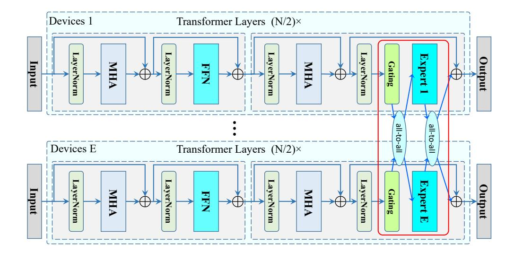
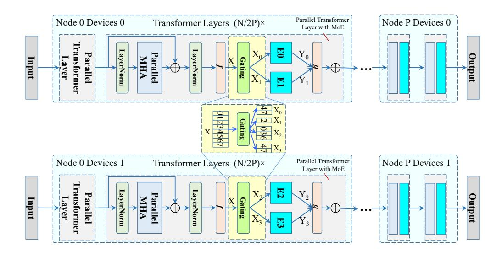

# 3.1.4 MIXTURE OF EXPERTS

Mixture of Experts (MoE) is first introduced in machine learning to divide a problem space into homogeneous regions and conquer them with distinct experts. Recently, MoE is leveraged into sparse model architectures to increase model capacity while keeping computational complexity unchanged. As shown in Fig. [3,](#page-4-0) an MoE system is usually bound with data parallel, and an MoE layer is built upon the FFN module and placed across multiple devices with expert parallel (EP). Inside an MoE

Figure 3: Illustration of an MoE model. A re-built version of Figure 3 from GShard paper [Lepikhin](#page-13-3) [et al.](#page-13-3) [\(2020\)](#page-13-3).

layer, token embeddings of each data-parallel rank are firstly fed into a gating module composed of a linear layer and a softmax function, to generate scores for each token embedding that decide which expert (FFN) this token should be processed in. Then token embeddings are dispatched to their destination experts via an all-to-all communication and processed by those experts. After that, processed embeddings are combined with the pre-gating order with another all-to-all communication.

In this way, each token embedding is automatically sharded to the expert that is well-learned to process such tokens, which implicitly strengthens the representative power of the model with negligible computational overhead. However, the price is two additional all-to-all operations for each MoE layer, which may largely slow down training and inference. Besides, a data parallel replica usually holds all layers except for MoE layers on a single GPU or a node, largely limiting the backbone size (nearly equal to the model with only one expert on each MoE layer). One way to scale up the model may be partitioning along the layer axis, but distributing experts into all devices makes it much more complicated to design the parallel scheme.

## 3.2 A SYSTEMATIC VIEW ON TRAINING EFFICIENCY OF MOE

The parallel architecture of MoE is a natural choice for scaling up model size and capacity. Most existing parallel techniques including data parallel, tensor parallel, and expert parallel are adjusted into its training framework. In this subsection, we showcase the parallel architecture of existing MoE systems and analyze its advantages and drawbacks in terms of training efficiency in a systematic view. Two important conclusions can be drawn:

- (1) The parallel architecture with bound DP and EP of existing MoE models is the key bottleneck of training efficiency.
- (2) Current parallel architecture hinders the integration of TP and PP into existing MoE models, especially TP.

In the rest of this paper, we call the MoE with this typical architecture DPMoE (Data Parallel MoE) since it is firmly bound with data parallel.

Expert Parallel and Data ParallelAs we discussed previously, data parallel and expert parallel are bound together to guarantee that experts are evenly distributed in the training cluster, which also limits the flexibility of model architecture and training configuration. Assuming that there are Dway data parallel and E experts, there are E/D experts on each data parallel rank[1](#page-4-1) . As introduced in subsection [3.1.4,](#page-3-1) token embeddings need to be dispatched to each expert and return to the original data parallel rank after finishing processing on each expert, resulting in two inter-device all-to-all

1E is always divisible by D in typical configurations.

communication of  $b \times s \times h$  data size in the forward pass. Thus, the forward time of an MoE layer is composed of gating, 1st all-to-all (*1st a2a* in the equation), FFN forward, and 2nd all-to-all (*2nd a2a*), as shown in Eq.  $1^2$ .

$$t_{forward} = t_{gating} + t_{1st\ a2a} + t_{FFN} + t_{2nd\ a2a} \tag{1}$$

Here, we only consider the situation of DP + EP and leave TP for simplicity. Since the latency of the gating module  $(t_forward)$  is relatively small compared to the other three items, we simply omit it here, and thus,  $t_{forward} \approx t_{1st~a2a} + t_{FFN} + t_{2nd~a2a}$ . According to Narayanan et al. (2021), the FFN module consumes  $16bsh^2/E$  FLOPs on each expert. Assume that each expert is able to process F FLOPs per second, then the theoretical latency of the FFN module is  $t'_{FFN} = 16bsh^2/(EF)^3$ . The latency of an all-to-all operation is rough  $(N-1)\times(t_s+mN/(2B))$ , where  $t_s$  is an initial time and we omit it for simplicity since it is small compared to the other item, B is the communication bandwidth, B is the number of ranks involved in the all-to-all operation and is equal to B in this case, and B is the data count on each rank, which is equal to B in this each element consumes B bytes. Thus, the theoretical latency of an all-to-all operation is roughly B is the combining these terms together, we have:

$$t'_{a2a}/t'_{FFN} = (E-1)EF/(16Bh). (2)$$

Taking the Nvidia SXM2 server with 8 V100 GPU as an example,  $F = 125 \times 10^{12}$ ,  $B = 12.5 \times 10^9$  for inter-node communication (InfiniBand inter-node connection in the Huawei Cloud cluster we experiment on) which is the case of PPMoE, and h is generally in the range of  $10^3 \sim 10^4$ . Thus, we roughly have:

$$t'_{a2a}/t'_{FFN} > (E-1)E/16.$$
 (3)

Thus, for normally used value of E, e. g., 64 or 256,  $t'_{a2a} \gg t'_{FFN}{}^4$  and these two all-to-all operations would be a critical bottleneck of the DPMoE framework.

In practice, there are other components in the forward process, and the ratio of  $t'_{a2a}/t'_{FFN}$  will be largely shrunk. We count the elapsed time of each part in a forward step of a 6.7B-to-143B DPMoE model and list numbers in Table 1. These two all-to-all operations in MoE layers occupied 65.5% of total forward time and 79.2% of MoE forward time, making it still a critical bottleneck in training and inference. Besides, it also results in two other drawbacks: relatively low base-model capacity (small backbone) and requiring a large cluster to train the model.

Table 1: Components of elapsed time in a forward step. Elapsed time is in ms and the Percentage represents the proportion to the total forward time.

|              | Total Fwd. | MoE Fwd. | 1st all-to-all | 2nd all-to-all | Gating | Others |
|--------------|------------|----------|----------------|----------------|--------|--------|
| Elapsed time | 7617       | 6294     | 2566           | 2423           | 156    | 1323   |
| Percentage   | 100%       | 82.6%    | 33.7%          | 31.8%          | 2.1%   | 17.3%  |

Tensor Parallel Tensor parallel is usually applied when a single device cannot hold the model, or one data parallel rank and its corresponding on-device experts in MoE model that roughly contains a backbone and E/D-1 experts. Under such circumstances, tensor parallel is able to enlarge the backbone that can be held on a data parallel rank by almost  $T\times$ , where T is the world size of tensor parallel and usually set to be the device count in a single node, with the price of two additional all-reduce communications of a bsh tensor each self-attention and FFN module. Fortunately, these all-reduce communications are inner-node and the latency is relatively low since high-speed inner-node interconnection techniques like Nvidia NV-Link are standard configurations of GPU servers.

Tensor parallel can be applied on all self-attention and FFN modules, or only on non-MoE blocks in the current PPMoE implementation. Here, we take a tensor-paralleled FFN module as an example to showcase the components of its forward latency. The forward latency of a tensor-paralleled FFN module is composed of the computational latency and the all-reduce latency:

$$t_{FFN} = t_{cal} + t_{all-reduce}. (4)$$

&lt;sup>2This equation can be well applied to the backward pass, with the gating and FFN computation time roughly doubled while communication time unchanged.

&lt;sup>3This is the best case that tokens are evenly distributed in all experts. For the worst case that all tokens are processed on one expert,  $t'_{FFN} = 16bsh^2/(F)$ .

&lt;sup>4Even for the worst case that  $t'_{FFN} = 16bsh^2/(F)$ ,  $t'_{a2a}$  is still multiple times larger than  $t'_{FFN}$  since the discarded terms in Eq. 2 to Eq. 3 is larger than 1 in practice.

As discussed previously,  $t_{cal}=16bsh^2/(TF)$ , where T is the tensor parallel world size and is usually set to be 8, the number of GPUs inside a node. According to the NCCL document, the latency of an all-reduce operation can be formulated as  $t_{all-reduce}=2(N-1)\times(t_s+m/B)$ ). Ignoring the  $t_s$  term and fitting to the discussed scenario, we have  $t_{all-reduce}\approx 4(T-1)bsh/B$ . Thus, we have:

$$t_{all-reduce}/t_{cal} = (T-1)TF/(4Bh). (5)$$

Taking  $F=125\times 10^{12}, B=300\times 10^9, T=8$  and  $h=10^3$  into Eq. 5,  $t_{all-reduce}/t_{cal}=35/6\approx 6$ . Thus, the communication overhead of tensor parallel with inner-node all-reduce is dramatically smaller compared to expert parallel with inter-node all-to-all, which is a strong motivation for us to design the proposed framework.

**Pipeline Parallel**Pipeline parallel is a powerful scheme to scale models to hundreds or even thousands of billions of parameters when collaborated with tensor parallel, while tensor parallel can only reach a few billion since inter-node all-reduce of large data is time-consuming. Currently, pipeline parallel is mostly leveraged in dense model training, *e. g.*, BLOOM Scao et al. (2022), and barely applied in MoE. The reason is two folds. On one hand, existing DPMoE frameworks usually involve data parallel, expert parallel, and tensor parallel, composing a complex parallel system that requires a lot of engineering effort. Combining such a complex scheme with pipeline parallel is an even further complicated task5. On the other hand, with a large number of experts, the combination of data parallel, expert parallel, and tensor parallel is already able to scale models to a trillion level. However, the configuration of a small base model and massive experts may hurt the representative power of MoE models and some recent work empirically shows that a large backbone with limited experts performs better Du et al. (2022); Zoph et al. (2022). Recall that the upper bound of tensor parallel to scale backbone is relatively low due to resource constraints of an individual node, pipeline parallel becomes a significant approach to scale MoE models.

Figure 4: Illustration of Pipeline MoE.

#### 3.3 PIPELINE MOE

To tackle drawbacks described in subsection 3.2, we propose a novel MoE framework called Pipeline MoE (PPMoE) to efficiently improve the configuration flexibility and largely speed up its training

 $^5$ There may be two ways to integrate pipeline parallel into existing frameworks: splitting the whole network (both MoE and non-MoE layers) into stages and splitting only non-MoE layers and distributing experts in the whole training cluster. The former requires a  $P \times$  larger cluster to train the model since it replicates existing systems for P times. The latter brings about additional communication overhead instead of resource burden because both pipeline parallel and expert parallel requires inter-node communication. Besides, the parallel scheme is much more complex since all types of parallelisms and communications are coupled and involved.

and inference process. In this subsection, we will delve into the framework of PPMoE and show how it works.

#### 3.3.1 OVERVIEW

Pipeline MoE decouples expert parallel from data parallel, in order to conveniently enjoy the benefits of all four parallel strategies (TP, DP, EP and PP) Before entering into the MoE layer, hidden embeddings are synchronized by the all-reduce communication after the self-attention block so that each tensor parallel rank receives identical inputs, which is guaranteed by tensor parallel. Hidden embeddings are then fed to the gating module and generate the dispatching order. Since all inputs, parameters, and algorithms are exactly the same, the dispatching order on each rank is also identical. Then token embeddings are dispatched to their corresponding experts according to the dispatching order by an index selection operation. After processed by related experts, token embeddings are gathered by an all-reduce communication, finishing forward computing of this MoE layer. A global view of Pipeline MoE is illustrated in Fig. [4.](#page-6-2)

## 3.3.2 EXPERT PARALLEL

Unlike previous expert parallel of DPMoE built upon data parallel, expert parallel in our scheme is coupled with tensor parallel. On a tensor parallel group with a world size of T (T devices in this group), E experts are evenly distributed on these T devices, where there are N experts on each device and N × T = E. Note that there are N experts on each device and we have to serialize the computation of each expert on each device. Fortunately, the computational speed of serially processing a few small tensors is nearly the same as processing a big tensor, according to our measurement with multiple experiments, indicating that there is little extra latency introduced by the serial computing of experts[6](#page-7-0) . Such a satisfactory property guarantees a comparable computational efficiency to DPMoE on experts.

#### 3.3.3 GATING AND DISPATCHING

The gating module of an MoE layer usually consists of a linear mapping, a softmax score function, and the gating schedule to generate dispatching orders. Our framework is compatible with existing gating schedules including top-1, top-2, *etc.* Token embeddings are then dispatched to corresponding experts with the generated dispatching order. Recall that all token embeddings and dispatching orders on each tensor parallel rank are identical and that all experts are located in the same tensorparallel group, *i. e.*, the same node, we can easily replace the communication-intensive all-toall operation with a simple index selection operation that is well supported in most existing deep learning platforms like PyTorch [Paszke et al.](#page-13-14) [\(2019\)](#page-13-14) or MindSpore [Huawei Technologies Co.](#page-12-14) [\(2022\)](#page-12-14).

We instantiate this process with fig. [4](#page-6-2) as an example. Assume that we have 8 token embeddings (X) as input with a shape of [8, ...], 2 slices in the tensor-parallel group, and 4 experts in the expert parallel group. The dispatching order is 2, 3, 1, 2, 0, 3, 2, 0, which means that the 1st, 4th and 7th token embedding should be sent to expert 2 (E2), the 2nd and 6th token embedding should be processed on expert 3 (E3), the 3rd on expert 1 (E1), and the 5th and 8th on expert 0 (E0). Since X is on all ranks of the tensor-parallel group, we can dispatch token embeddings to corresponding experts by X0 = X[[4, 7], ...], X1 = X[2, ...], X2 = X[[0, 3, 6], ...] and X3 = X[[1, 5], ...]. After processed by corresponding experts, output embeddings are first gathered inside each tensor parallel rank by index assignment and then collected by an all-reduce communication across the tensor parallel group. A PyTorch-like pseudo code is shown in Algorithm [1.](#page-8-0)

#### 3.3.4 COMMUNICATION OVERHEAD

In the forward pass, output embeddings with a shape of b × s × h need to be collected via an allreduce communication since the Dropout layer requires full access to its input data inside the data parallel rank, which is the same as tensor parallel. In the backward pass, the corresponding gradients should be synchronized before feeding into the LayerNorm layer via another all-reduce communication. Besides, parameters inside the gating module need to be synchronized in each training step via

6This may be due to well-optimized low-level operators of PyTorch

