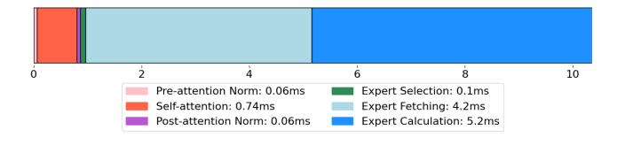

# 1 INTRODUCTION

The Mixture-of-Experts (MoE) architecture is widely adopted by the latest Large Language Models (LLMs) such as Llama 4 [\(Meta,](#page-11-0) [2025\)](#page-11-0), DeepSeek-V3 [\(DeepSeek-AI et al.,](#page-10-0) [2025\)](#page-10-0), and QWen-3 [\(Team,](#page-11-0) [2025\)](#page-11-0). MoE LLMs can achieve high cognition and generation performance while keeping inference cost relatively low. The key reason is that MoE LLMs only activate part of the experts in the Feed-Forward Networks (FFNs), which avoids the high computation cost of using all experts. For example, DeepSeek-V3 only activates 1 shared expert and 8 of 256 routed experts (activates 37 out of 671 billion parameters), significantly reducing runtime memory and computation overhead. As the MoE routers are placed inside the FFNs, the expert selectionloading-computation pipeline suffers from the long expert loading time, especially when the MoE models are too large to fit in the GPU memory.

To solve the expert-loading bottleneck in MoE LLMs, various prediction and caching methods have been proposed to efficiently prefetch and serve the experts. MoE-Infinity [\(Xue et al.,](#page-11-0) [2025\)](#page-11-0) designs a sparsity-aware expert cache to trace the activated experts to reduce the Time-Per-Output-

Under review by a journal. Copyright 2025 by the author(s). Token (TPOT). PopFetcher [\(Zhang et al.,](#page-11-0) [2025a\)](#page-11-0) prefetches the experts of the next layer based on their popularity. HOB-BIT [\(Tang et al.,](#page-11-0) [2024\)](#page-11-0) proposes a multi-dimensional cache manager and dynamic expert loader to accelerate expert loading. Pre-Gated MoE [\(Hwang et al.,](#page-10-0) [2024\)](#page-10-0) modifies the gate function to select the experts of the next layer and applies caching methods for faster inference.

However, we observe three problems in these prediction systems. First, it is very hard to achieve high prediction accuracy by predicting from the previous layer. SP-MoE [\(Chen](#page-10-0) [et al.,](#page-10-0) [2025\)](#page-10-0) prefetches the experts for speculative decoding that drafts multiple tokens per step and achieves more than 70% of prediction accuracy in most layers. DuoServe-MoE [\(Zhang et al.,](#page-11-0) [2025b\)](#page-11-0) accelerates the inference by duo CUDA streams and a layer-level expert predictor with 54- 67% of top-2 accuracy. FATE [\(Fang et al.,](#page-10-0) [2025\)](#page-10-0) uses the activations from the previous layer for prediction, and the prediction part contributes 78.8% to accuracy. In addition, many proposals report only the performance gain, without the prediction accuracy. Second, predicting from the previous layer has a limitation on prefetching for the first layer. Although they still predict the experts for the first layer, the actual prediction accuracy for the first and second layers is significantly lower than that of the other layers [\(Fang](#page-10-0) [et al.,](#page-10-0) [2025\)](#page-10-0). For this reason, AdapMoE [\(Zhong et al.,](#page-11-0) [2024\)](#page-11-0) tries to mitigate the prediction accuracy gap of the first few layers by integrating prefetching and cache management techniques. Third, increasing the complexity of the predic-

1 Systems Group, D-INFK, ETH Zurich, Switzerland. Correspondence to: Shien Zhu <shien.zhu@inf.ethz.ch>, Gustavo Alonso <alonso@inf.ethz.ch>.

Figure 1. Token generation pipeline in typical MoE architectures (profiled on DeepSeek-V2-Lite on a Nvidia V100 GPU).

tor can bring higher prediction accuracy, but also incur high computational overhead. The prediction latency has to be as short as possible to leave enough time to fetch the experts, otherwise the prefetching benefits will diminish.

In this paper, we propose pre-attention expert prediction to achieve accurate and lightweight expert prefetching for MoE LLM inference. Our key insight is that the softmax and layer normalization functions are ranking-preserving, allowing ranking-based expert selection to be approximated by simple linear functions, as in the original expert router. First, in contrast to related work predicting based on the previous layer, we propose to predict experts within the same layer before the attention block to achieve a more accurate prediction. This also solves the problem of expert prefetching in the first layer. Second, we design lightweight pre-attention expert routers with 2 linear layers with the intermediate size being 2048, which has significantly lower computation cost than methods with standalone networks. Third, as we infer that matching the ranking of selected experts is possible, we propose ranking-aware loss functions to train the expert prediction routers.

Our pre-attention expert routers achieve 93.03% accuracy on DeepSeek V2 Lite, 94.69% on Qwen3-30B, and 97.62% on Phi-mini-MoE, showing 15% improvement on absolute accuracy over the results in FATE [\(Fang et al.,](#page-10-0) [2025\)](#page-10-0).

