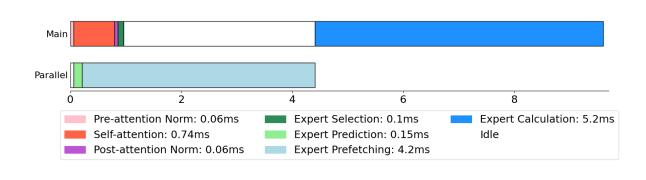
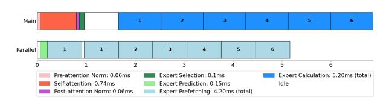

# 5 EXPERIMENTAL RESULTS

### 5.1 Experimental Setup

We evaluate our pre-attention expert prediction across three representative MoE models: DeepSeek V2 Lite [\(DeepSeek-](#page-10-0)[AI,](#page-10-0) [2024\)](#page-10-0), Qwen3 [\(Team,](#page-11-0) [2025\)](#page-11-0), and Phi-mini [\(Abdin et al.,](#page-9-0) [2024\)](#page-9-0), spanning different architectural configurations and expert selection strategies. Our training regimen employs 10M samples in 30 epochs to achieve high accuracy across these models. We conducted all experiments on a system equipped with an NVIDIA TITAN RTX 24GB GPU, 128GB of system memory, and 8 CPU cores. Training the predictors for each Transformer layer using GPU is necessary, given the large sample volume. Nevertheless, GPU is not a strict requirement for inference of the predictors. CPU-only inference of the predictors is sufficient for deployment scenarios where the predictor overhead must be minimized.

We evaluate three metrics. First, the exact match accuracy, where the prediction must precisely identify the selected experts. Exact match accuracy measures the percentage of predictions that correctly identify all k selected experts. Second, the over-provisioning accuracy, where loading additional experts can achieve higher hit rates at an increased I/O cost. Third, the top-1 accuracy of the predictor, which evaluates the percentage of cases where the single highestscoring predicted expert is among the k experts that will actually be selected. This is critical for edge deployment scenarios where I/O bandwidth constraints limit parallel expert loading to a single expert during attention computation.

### 5.2 Prediction Accuracy Results

Our experimental results demonstrate substantial improvements over existing approaches across all evaluated models. As Table [4](#page-7-0) shows, we achieve 93.03% exact-match accuracy on DeepSeek-V2-Lite, representing a 15% improvement on absolute accuracy over Fate's [\(Fang et al.,](#page-10-0) [2025\)](#page-10-0) 78.79% decoding accuracy. Qwen3-30B achieves approximately 94.69% exact-match accuracy, while Phi-mini reaches 97.62% accuracy, demonstrating that simpler MoE configurations benefit more from our approach.

The superior performance on Phi-mini could highlight an important characteristic of our method: prediction ac-

| Arch | Accuracy     | DeepSeek-V2-Lite | Qwen3-30B | Phi-mini-MoE |
|------|--------------|------------------|-----------|--------------|
|      | Exact-match  | 93.03%           | 94.69%    | 97.62%       |
| 1    | Over-provis. | 98.65%           | 98.81%    | 99.05%       |
|      | Top-1        | 98.85%           | 99.55%    | 98.95%       |
|      | Exact-match  | 92.31%           | 91.82%    | 96.63%       |
| 2    | Over-provis. | 98.15%           | 97.21%    | 98.34%       |
|      | Top-1        | 98.64%           | 98.07%    | 98.02%       |

Table 4. Prediction accuracy of the first layer on three models. Note that the first layer is the hardest one in related works. Other layers have similar or better accuracy than the first layer.

curacy might correlate with model complexity. Simpler routing decisions are easier to predict using pre-attention weights, while more complex routing patterns in larger models present greater challenges but still achieve substantial improvements over existing methods.

The over-provisioning results reveal the practical trade-offs available for different deployment scenarios. Loading 10 experts instead of the required 6 for DeepSeek achieves 98.65% hit rate, representing around 67% additional I/O overhead for a 4.5% improvement in hit rate. Similarly, over-provisioning Qwen3 with 12 experts loaded instead of 8 achieves 98.81% accuracy, while Phi-mini with 3 experts instead of the required 2 leads to 99.05% accuracy. These trade-offs prove attractive for cloud deployments where I/O bandwidth is abundant, but prediction accuracy is critical for performance.

Top-1 accuracy results demonstrate the effectiveness of our approach for I/O bandwidth-constrained edge scenarios. We achieve 98.85% top-1 accuracy on DeepSeek V2 Lite, 99.55% on Qwen3-30B, and 98.95% on Phi-mini-MoE. These results indicate that our prediction method can reliably identify at least one correct expert for parallel loading during attention computation, providing substantial benefits for edge deployments where I/O bandwidth constraints limit the number of experts that can be loaded simultaneously with layer execution.

#### 5.3 Expert Loading Performance Analysis

To establish the practical requirements for expert prediction accuracy, we conducted comprehensive timing benchmarks on representative hardware configurations using DeepSeek-V2-Lite. Our experimental setup measured expert loading latencies across three scenarios: Tesla V100-32GB, A100- 40GB, and A100-80GB systems, representing typical deployment environments for MoE inference. Each expert contains 16.5MB of parameters (5.78M parameters × 2 bytes per bfloat16 value), and standard token processing requires loading 6 experts. We measured both disk-to-GPU and memory-to-GPU transfer times using optimized implementations with pinned memory, contiguous tensor layouts, and non-blocking CUDA streams.

| Hardware        | Disk→GPU | Memory→GPU |
|-----------------|----------|------------|
| Tesla V100-32GB | 48.1 ms  | 9.5 ms     |
| A100-40GB       | 49.8 ms  | 8.5 ms     |
| A100-80GB       | 33.5 ms  | 4.0 ms     |

Table 5. Expert Loading Performance (6 experts, 99MB total)

Storage-to-GPU transfers represent the critical bottleneck in MoE inference. As the profiling results in Table 5 shows, loading 6 experts requires 33.5-49.8ms across the tested hardware, with per-expert costs ranging from 5.6-8.3ms. The high latency is due to storage bandwidth limitations and the inherent serialization of disk I/O operations. Pre-cached experts in system memory achieve dramatically improved transfer rates. Loading 6 experts from memory requires 4.0- 9.5ms depending on hardware generation, representing 5- 8.4× speedup over disk access. Per-expert memory transfer costs range from 0.7-1.6ms, approaching the theoretical limits imposed by PCIe bandwidth and memory hierarchy overhead.

Analysis of the inference pipeline reveals the computational context for expert prediction and the opportunities for parallel execution. The transformer layer processes tokens through the sequence: pre-attention norm → self-attention → post-attention norm → expert selection + gating → expert computation, illustrated by Figure [1.](#page-1-0) Our prediction system utilizes the weights available immediately after preattention norm (0.075-0.129ms) to predict expert requirements in 0.15ms, then executes this prediction pipeline in parallel with the subsequent self-attention (0.738-1.128ms) and post-attention norm (0.080-0.129ms) computations.

Parallel execution of expert predictor and attention blocks is necessary to leave enough time to prefetch the experts. Compared with the naive parallel execution in Fig. [8a,](#page-8-0) we can apply fine-grained expert computation like Fig. [8b](#page-8-0) to hide all expert loading latency. This parallel execution strategy provides 0.818-1.257ms of available time for expert prefetching operations before the pipeline reaches the standard expert gating step (0.097-0.143ms). During this window, correctly predicted experts can be loaded from memory (0.7-1.6ms per expert) and made ready for immediate use. When the pipeline reaches expert selection, our predictions are validated against the standard gating decisions. Correctly predicted experts proceed immediately to computation, while mispredicted experts trigger emergency loading (5.6-8.3ms per expert) during the expert computation phase (6.197-10.308ms total). The parallel execution model ensures that prediction accuracy directly impacts overall throughput by enabling immediate expert access, depicted in Figure [8b,](#page-8-0) or not requiring additional latency in the event of a misprediction, as shown in Figure [8c.](#page-8-0)

(a) A Naive Expert Prefetching Pipeline

(b) Best-Case Scenario with accurate expert prediction

(c) Worse-Case Scenario with incorrect expert prediction

Figure 8. Execution pipelines of a Transformer layer.

