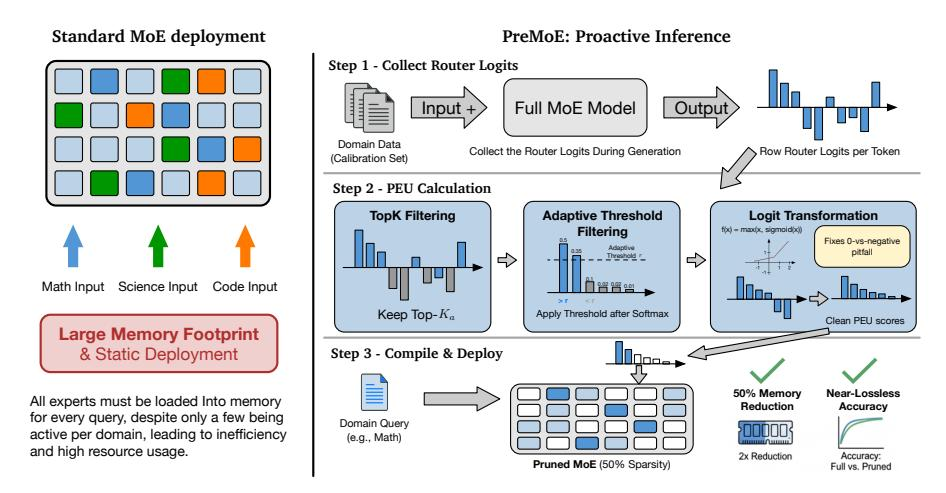

# **1 Introduction**

Mixture of Experts (MoE) architectures [\(Shazeer et al.,](#page-10-0) [2017;](#page-10-0) [Lepikhin et al.,](#page-9-0) [2020;](#page-9-0) [Zhou](#page-10-1) [et al.,](#page-10-1) [2022\)](#page-10-1) have enabled unprecedented scaling of language models [\(Jiang et al.,](#page-9-1) [2024;](#page-9-1) [Dai](#page-9-2) [et al.,](#page-9-2) [2024;](#page-9-2) [Guo et al.,](#page-9-3) [2025;](#page-9-3) [Tang et al.,](#page-10-2) [2025\)](#page-10-2), yet despite their dynamic design, they face a practical contradiction: they are deployed statically. This approach requires the entire set of experts to reside in memory, failing to capitalize on the model's potential for specialization and leading to significant inefficiency. Prior work has explored expert pruning to address this challenge [\(Chen et al.,](#page-9-4) [2022;](#page-9-4) [Muzio et al.,](#page-10-3) [2024;](#page-10-3) [Lu et al.,](#page-10-4) [2024\)](#page-10-4), but these methods rely on coarse statistics like activation frequency that fail to capture activation quality, often requiring costly finetuning to recover performance, or employ search procedures that become intractable at scale. We propose a proactive compilation approach that uses a refined signal to compile specialized MoE instances before deployment, without finetuning or expensive search.

We introduce **PreMoE**, a training-free framework that actualizes this approach (Figure [1\)](#page-1-0). At its heart is our novel Predicted Expert Utility (PEU) metric, which robustly measures expert importance by analyzing the model's native router logits through high-confidence filtering (TopK filtering and adaptive threshold filtering) and logit transformation. By computing PEU scores for all experts across all layers on a domain-specific calibration dataset, PreMoE yields a layer-wise PEU ranking that quantifies which experts are critical for that domain. We refer to this ranking as the domain's "computational pattern" and use it as a blueprint to identify minimal, high-performance expert subsets and compile specialized model instances.

Our contributions are:

• We find that expert utility is highly domain-specific and predictable when measured with a principled signal (Figure [2\)](#page-2-0), enabling effective pre-deployment expert selection.

2Huawei Technologies Co., Ltd

1Code: <https://github.com/JarvisPei/PreMoE>

Figure 1: Overview of PreMoE. **Left:** Standard MoE deployment requires all experts in memory despite only a few being active per domain. **Right:** PreMoE's proactive inference pipeline: (1) collect router logits during generation on calibration data, (2) compute PEU scores via a processing pipeline (TopK filtering → Adaptive threshold filtering → Logit transformation), and (3) compile a pruned MoE with 50% sparsity achieving near-lossless accuracy and 2× memory reduction.

- We propose PreMoE, a training-free framework built on our Predicted Expert Utility (PEU) metric, which refines router logits via high-confidence filtering and logit transformation to compile specialized MoE instances.
- We demonstrate training-free expert pruning across models from 30B to 718B parameters, achieving 50% sparsity with nearly no performance loss.

