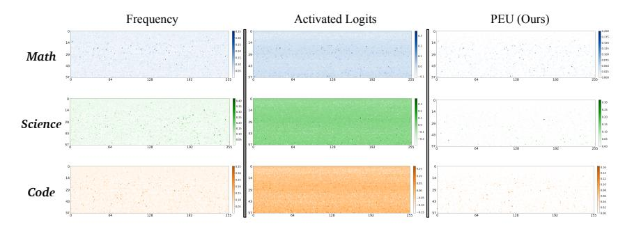

# **2 Related Work**

Expert pruning methods target the unique structure of Mixture-of-Experts (MoE) models, where expert utility is often imbalanced across tasks. Prior approaches can be broadly categorized into two paradigms, each with significant limitations. We provide broader context on MoE architectures and general LLM efficiency techniques in Appendix [E.](#page-19-0)

The first paradigm relies on *observation-based statistics*. These methods analyze activation patterns during calibration, using metrics like activation frequency or gating scores to identify and prune experts [\(Chen et al.,](#page-9-4) [2022;](#page-9-4) [Muzio et al.,](#page-10-3) [2024\)](#page-10-3). While straightforward, these approaches often require expensive finetuning to recover performance, and their coarse signals fail to distinguish between broadly useful generalist experts and infrequently used but critical specialists.

A second paradigm attempts to find optimal expert subsets through computationally intensive *search* procedures. For instance, EEP [\(Liu et al.,](#page-10-5) [2024\)](#page-10-5) employs an evolutionary search, while NAEE [\(Lu et al.,](#page-10-4) [2024\)](#page-10-4) uses enumeration to evaluate expert combinations based on minimizing reconstruction loss. Although these methods can yield better results than simple heuristics, their computational cost makes them intractable for modern, large-scale MoE models. These search-based techniques are typically demonstrated on models with a small number of experts (e.g., 8 in Mixtral-7B) and would be infeasible for models like DeepSeek-R1 with 256 experts per layer.

PreMoE departs from these paradigms by using a refined router logits with confidence filtering, to predict expert utility, enabling training-free compilation that scales to large MoE models.

Figure 2: Comparison of expert utility estimation methods across three domains (Math, Science, Code) on DeepSeek-R1. Each heatmap shows 58 MoE layers (y-axis) by 256 experts (x-axis). Left column (Frequency): Simple activation counting produces diffuse, noisy patterns with minimal domain-specific structure. Middle column (Activated Logits): Aggregating logits only from activated experts yields denser but still broadly distributed signals. Right column (Ours): Our PEU metric, combining high-confidence filtering and logit transformation, reveals sharp, sparse, and highly structured patterns unique to each domain. The contrast demonstrates that expert utility is predictable and domain-specific when measured with a principled signal, motivating our proactive approach.

### 3 The PreMoE Framework

### 3.1 Motivation: The Predictability of Expert Activations

The foundation of PreMoE rests on a key insight: expert utility in large MoE models is not random, but highly structured and therefore predictable when measured with the right signal. Figure 2 compares three approaches to estimating expert utility across Math, Science, and Code domains. In contrast to simple frequency or activated-logits aggregation, our PEU metric reveals sharp, sparse, and highly domain-specific patterns. These patterns are not only visually distinct across domains but also stable within each domain, indicating that expert utility is predictable when properly measured. This predictability enables a paradigm shift: from reactive, static deployment to proactive compilation, where we build specialized, efficient model instances tailored to specific deployment scenarios.

**Notation.** We briefly recap the MoE forward pass to establish notation. For an input token  $\mathbf{x}$ , a router network produces logits  $\mathbf{s}(\mathbf{x}) = \{s_1(\mathbf{x}), \dots, s_{N_r}(\mathbf{x})\}$ , where  $s_i(\mathbf{x})$  represents the unnormalized preference for the i-th routed expert. The top K experts, forming set K, are activated with gating scores  $g_i$ . The layer output is  $F_{\text{MoE}}(\mathbf{x}) = \mathbf{x} + \sum_{i \in K} g_i E_i^r(\mathbf{x})$ .

### 3.2 Forecasting Expert Utility

To build a proactive system, we need a reliable, low-overhead signal to forecast expert utility. The most natural choice is the router's own logits, as they represent the model's internal, token-by-token preference for each expert. Crucially, unlike simple activation frequency, logits capture the *strength* of the router's preference. However, raw logits can be noisy. Our goal is to refine this signal to robustly measure the router's *decisive preference*.

To achieve this, we introduce a two-stage process. First, we **filter for high-confidence activations** using a top- $K_a$  candidate pool and a confidence threshold r. Second, for only the logits that pass this filter, we apply a **logit transformation** f(s) to make them suitable for robust aggregation. This yields a token-level utility score  $\tilde{s}_i(\mathbf{x})$  for each expert, formalized as:

$$\mathcal{E}_{K_a} = \text{TopK}(\{s_j(\mathbf{x})\}_{j=1}^{N_r}, K_a)$$
(1)

$$p_i(\mathbf{x}) = \frac{\exp\left(s_i(\mathbf{x})\right)}{\sum_{k \in \mathcal{E}_{K_a}} \exp\left(s_k(\mathbf{x})\right)}, \quad i \in \mathcal{E}_{K_a}$$
 (2)

$$\tilde{s}_i(\mathbf{x}) = \begin{cases} f(s_i(\mathbf{x})), & i \in \mathcal{E}_{K_a} \land p_i(\mathbf{x}) \ge r, \\ 0, & \text{otherwise.} \end{cases}$$
(3)

Why high-confidence filtering? Router preference signals are heavy-tailed across tokens; without filtering, aggregations are contaminated by many low-confidence activations that dilute expert utility estimates. Our high-confidence filtering comprises two stages: (1) **TopK** filtering, which narrows the candidate pool to the top- $K_a$  experts by logit magnitude, and (2) adaptive threshold filtering, which applies a confidence threshold r to retain only decisive activations. Together, these act as a principled denoiser. We set r adaptively for each MoE layer l as the average probability of the top-ranked expert within the top- $K_a$  pool:

$$r_{l} = \mathbb{E}_{\mathbf{x} \in \mathcal{X}_{T}} \left[ \max_{i \in \mathcal{E}_{K_{a}}(\mathbf{x})} p_{i}^{l}(\mathbf{x}) \right]$$
(4)

This layer-wise adaptive rule is computed on the calibration set and makes our method robust across different models and domains with minimal tuning.

Why logit transformation? Raw router logits are signed, and naive averaging leads to a 0-vs-negative pitfall where unselected experts (scored as 0) can spuriously outrank selected experts with negative logits. A transformation that maps negatives away from the positive range is therefore necessary. Our default choice,  $f(s) = \max(s, \operatorname{sigmoid}(s))$ , retains large positive evidence while rectifying negatives via  $\operatorname{sigmoid}(s)$ , avoiding compression of strong signals. In practice, threshold filtering stabilizes utility estimation and largely removes sensitivity to the particular transformation choice, enabling recovery of full-model accuracy at high sparsity. The final **Predicted Expert Utility (PEU)** for an expert is the average of these token-level scores over a calibration dataset,  $\operatorname{PEU}_i^T = \mathbb{E}_{\mathbf{x} \in \mathcal{X}_T}[s_i(\mathbf{x})]$ . This PEU score provides a robust forecast of expert importance for a given domain T. Full derivations are in Appendix A.1.

**From PEU to Computational Patterns.** By computing PEU scores for all  $N_r$  experts across all MoE layers in the model, we obtain a complete ranking of expert importance for domain T. We define this layer-wise collection of PEU scores as the **computational pattern** for domain T:

$$Pattern^{T} = \left\{ \left\{ PEU_{i}^{T,l} \right\}_{i=1}^{N_{r}} \right\}_{l=1}^{L}$$
(5)

where *L* is the number of MoE layers in the model. This pattern is a compact, interpretable representation of which experts are critical for a domain, serving as a blueprint for constructing specialized model instances. Crucially, extracting a pattern requires only a forward pass over a small calibration set (typically hundreds of samples), making it highly efficient even for models with hundreds of billions of parameters.

### 3.3 Compiling Instances from Patterns

Given a computational pattern, we compile specialized MoE instances by populating a lightweight model skeleton *only* with the expert weights identified by the pattern—the full model is never loaded into memory. The detailed algorithm is provided in Appendix A.2.

We propose two primary compilation strategies based on computational patterns:

- **1. Compiling Domain-Specific Specialists.** For an application with a narrow focus, we identify the computational pattern for that domain. The top-M experts with the highest PEU scores are selected, where M is the desired budget. These selected experts form the new, pruned set of routed experts  $\{E_i^r(\mathbf{x})\}_{i=1}^M$  for the compiled specialist instance.
- **2. Compiling High-Efficiency Generalists.** For general-purpose applications, we create a single, multi-domain model by synthesizing a unified computational pattern. Instead of taking a simple union of top experts, we aggregate the token-level utility scores,  $\tilde{s}_i(\mathbf{x})$ , from the calibration sets of several key domains  $(\mathcal{X}_{T_1},\ldots,\mathcal{X}_{T_D})$ . The final PEU for the generalist model is then calculated by averaging these synthesized scores. This creates a blended, multi-domain PEU ranking that identifies experts crucial across all targeted domains. The top-M experts from this ranking then become the routed experts  $\{E_i^r(\mathbf{x})\}_{i=1}^M$  for the compiled generalist instance, which remains highly sparse but retains strong performance across all constituent domains.

Table 1: Performance of Domain-Specific Specialists. For each base model we prune routed experts to the highest sparsity that preserves near loss-less accuracy: DeepSeek-R1 at 50% (keep 128/256 per layer), openPangu-Ultra at 31.25% (keep 176/256), and Qwen3-30B-A3B at 50% (keep 64/128). Entries are accuracy (%); **Avg** is the macro average over the listed benchmarks;  $\Delta$  is the average accuracy change compared to the full model. Baselines: Random, Frequency (activation counts), Act-Logits (aggregate logits of activated experts without threshold filtering), All-Logits (aggregate logits of all experts), SEER (L) and SEER (G) from Muzio et al. (2024), and EASY-EP.

| Method     | MATH-500              | AIME 2024 | AIME 2025 | CNMO 2024 | GPQA  | LiveCodeBench | Avg   | Δ      |
|------------|-----------------------|-----------|-----------|-----------|-------|---------------|-------|--------|
| DeepSeek-l | R1 (50% sparsi        | ty)       |           |           |       |               |       |        |
| Full       | 96.60                 | 77.08     | 65.83     | 71.18     | 73.23 | 69.12         | 75.51 | -      |
| Random     | 54.00                 | 6.67      | 1.25      | 30.88     | 39.90 | 27.43         | 26.69 | -48.82 |
| Frequency  | 88.80                 | 60.83     | 46.19     | 64.58     | 33.33 | 5.88          | 49.93 | -25.58 |
| All-Logits | 3.60                  | 0.00      | 0.00      | 0.35      | 28.79 | 0.00          | 5.46  | -70.05 |
| SEER (L)   | 54.80                 | 2.91      | 2.08      | 36.63     | 36.87 | 8.09          | 23.56 | -51.95 |
| SEER (G)   | 53.00                 | 3.33      | 1.67      | 36.63     | 36.87 | 14.34         | 24.31 | -51.20 |
| Act-Logits | 88.20                 | 70.00     | 55.00     | 62.62     | 48.48 | 52.94         | 62.87 | -12.64 |
| EASY-EP    | 97.20                 | 79.17     | 68.33     | 72.18     | 70.12 | 61.11         | 74.69 | -0.82  |
| PreMoE     | 97.60                 | 79.58     | 68.33     | 75.00     | 72.22 | 66.36         | 76.52 | +1.01  |
| openPangu  | -Ultra (31.25%        | sparsity) |           |           |       |               |       |        |
| Full       | 97.40                 | 80.83     | 75.42     | 77.43     | 76.77 | 67.65         | 79.25 | _      |
| Random     | 85.00                 | 41.25     | 34.17     | 54.51     | 60.10 | 25.74         | 50.13 | -29.12 |
| Frequency  | 96.40                 | 76.25     | 65.83     | 75.69     | 52.02 | 51.84         | 69.67 | -9.58  |
| All-Logits | 12.00                 | 0.00      | 0.00      | 2.95      | 16.67 | 0.74          | 5.39  | -73.86 |
| SEER (L)   | 95.20                 | 75.41     | 62.08     | 73.61     | 62.63 | 58.82         | 71.29 | -7.96  |
| SEER (G)   | 96.00                 | 71.67     | 69.17     | 72.40     | 57.58 | 58.82         | 70.93 | -8.32  |
| Act-Logits | 97.20                 | 77.50     | 73.33     | 72.40     | 79.29 | 61.76         | 76.91 | -2.34  |
| EASY-EP    | 96.82                 | 77.20     | 72.17     | 73.43     | 76.74 | 62.36         | 76.45 | -2.80  |
| PreMoE     | 96.80                 | 80.41     | 71.67     | 79.17     | 75.76 | 66.91         | 78.45 | -0.80  |
| Qwen3-30B  | - <b>A3B</b> (50% spa | arsity)   |           |           |       |               |       |        |
| Full       | 97.20                 | 91.25     | 82.92     | 78.65     | 68.69 | 65.44         | 80.69 | _      |
| Random     | 44.80                 | 5.00      | 2.92      | 7.99      | 17.68 | 0.00          | 13.07 | -67.62 |
| Frequency  | 90.40                 | 60.42     | 46.67     | 54.69     | 47.98 | 25.37         | 54.26 | -32.76 |
| All-Logits | 1.60                  | 0.00      | 0.00      | 0.00      | 0.51  | 0.00          | 0.35  | -80.34 |
| SEER (L)   | 1.60                  | 0.00      | 0.00      | 0.00      | 0.00  | 2.21          | 0.64  | -80.05 |
| SEER (G)   | 0.20                  | 0.00      | 0.00      | 0.00      | 0.00  | 1.84          | 0.34  | -80.35 |
| Act-Logits | 1.40                  | 0.00      | 0.00      | 0.00      | 3.54  | 0.00          | 0.82  | -79.87 |
| EASY-ĔP    | 58.62                 | 62.46     | 44.92     | 52.65     | 50.48 | 56.44         | 54.26 | -26.43 |
| PreMoE     | 96.40                 | 88.33     | 79.58     | 81.94     | 68.18 | 65.07         | 79.92 | -0.77  |

