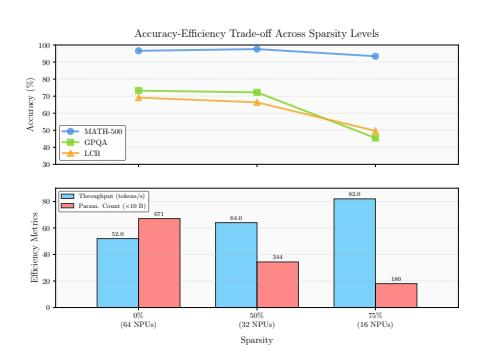
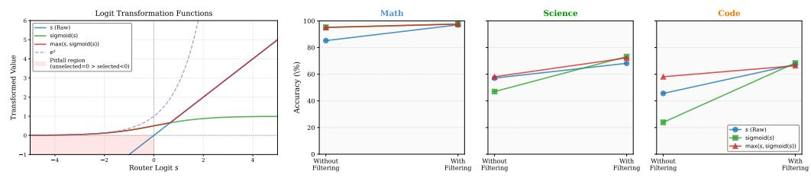

# 4 Experiments

### 4.1 Experimental Setup

Models and Datasets. Our experiments are conducted on three state-of-the-art MoE models: DeepSeek-R1-671B (Guo et al., 2025) (256 experts per layer), openPangu-Ultra-MoE-718B (Tang et al., 2025) (256 experts per layer), and Qwen3-30B-A3B (Qwen3-235B-A22B-Thinking-2507) (Team, 2025) (128 experts per layer). We use a diverse set of open-source training datasets to create calibration sets for three primary domains: Math (800 samples from Nemotron-Post-Training-Dataset-v1 (Nathawani et al., 2025) "math" split), Science (200 samples from Nemotron-Post-Training-Dataset-v1 (Nathawani et al., 2025) "stem" split), and Code (600 samples from OpenCoder (Huang et al., 2024), with 300 samples under opc-sft-stage1 and 300 samples under opc-sft-stage2). For the High-Efficiency Generalist, we augment this data with 600 samples from LMSYS-Chat-1M (Zheng et al., 2023) to broaden its capabilities. We use only the questions from these datasets and the corresponding full-model reasoning outputs to extract computational patterns (we find this context choice significantly improves accuracy; see Appendix C.6). Notably, PreMoE is data-efficient: just 5–10 calibration samples achieve near-optimal performance (Appendix C.7).

**Evaluation Benchmarks.** To evaluate the performance of the compiled models, we use a challenging set of reasoning benchmarks across our three target domains. For **Math**, we use MATH-500 (Hendrycks et al., 2020), AIME 2024, AIME 2025, and CNMO 2024. For **Science**, we use GPQA (Rein et al., 2024), a graduate-level question-answering benchmark. For **Code**, we use LiveCodeBench (Jain et al., 2024) (272 problems in the window from 8/1/2024 to 1/1/2025) for evaluating code generation capabilities.

Table 2: Performance of the High-Efficiency Generalist. The PreMoE Generalist is compiled by synthesizing PEU scores at the same sparsity as specialists. The "Trivial Union" baseline unions smaller fixed-size per-domain expert sets, yielding lower effective sparsity than PreMoE. Delta ( $\Delta$ ): average accuracy change compared to the full model.

| Setting           | Sparsity | MATH-500 | AIME 2024 | AIME 2025 | CNMO 2024 | GPQA  | LiveCodeBench | Avg   | Δ     |
|-------------------|----------|----------|-----------|-----------|-----------|-------|---------------|-------|-------|
| DeepSeek-R1       |          |          |           |           |           |       |               |       |       |
| Full Model        | 0%       | 96.60    | 77.08     | 65.83     | 71.18     | 73.23 | 69.12         | 75.51 | _     |
| Trivial Union     | 39.87%   | 96.60    | 78.75     | 70.42     | 75.17     | 72.22 | 66.18         | 76.56 | +1.05 |
| PreMoE Generalist | 50%      | 96.40    | 78.33     | 70.42     | 75.17     | 70.71 | 65.07         | 76.02 | +0.51 |
| openPangu-Ultra   |          |          |           |           |           |       |               |       |       |
| Full Model        | 0%       | 97.40    | 80.83     | 75.42     | 77.43     | 76.77 | 67.65         | 79.25 | -     |
| Trivial Union     | 26.24%   | 97.00    | 80.00     | 70.42     | 80.38     | 74.24 | 63.60         | 77.61 | -1.64 |
| PreMoE Generalist | 31.25%   | 97.40    | 80.00     | 73.34     | 78.82     | 78.79 | 65.81         | 79.03 | -0.22 |
| Qwen3-30B-A3B     |          |          |           |           |           |       |               |       |       |
| Full Model        | 0%       | 97.20    | 91.25     | 82.92     | 78.65     | 68.69 | 65.44         | 80.69 | -     |
| Trivial Union     | 33.76%   | 96.40    | 87.92     | 84.17     | 83.33     | 71.72 | 61.76         | 80.88 | +0.19 |
| PreMoE Generalist | 50%      | 96.60    | 86.25     | 79.17     | 79.34     | 68.69 | 54.04         | 77.35 | -3.34 |

**Implementation Details** Pattern collection is performed offline on servers equipped with 64 Ascend 910B2-64GB NPUs. For hyperparameters, we set  $K_a$  to match the model's default number of activated experts (e.g., 8 for DeepSeek-R1-671B), and we use  $f(s) = \max(s, \operatorname{sigmoid}(s))$  as our default logit transformation. The confidence threshold r is set adaptively for each domain and for each MoE layer l following the definition in Eq. 4 (see Methodology). This layer-wise adaptive approach makes our method robust across different models and domains with minimal tuning.

**Baselines** We compare PreMoE against a suite of baselines: **Random** selection, expert ranking by activation **Frequency**, and several variants of logit collection based on **all-logits** and **activated-logits** (denoted 'All-Logits' and 'Act-Logits' in tables). We also compare against two baselines, one is **SEER-MoE** (Muzio et al., 2024) method, using both its local and global variants ('SEER (L)' and 'SEER (G)'), which represents the state-of-the-art for expert pruning, and the other one is EASY-EP (Dong et al., 2025), which leverages a few domain-specific demonstrations to identify and retain only the most relevant experts.

### 4.2 Main Results: Efficacy of PreMoE

### 4.2.1 Compiling Domain-Specific Specialists

We first evaluate PreMoE's ability to create sparse, high-performance models specialized for a single domain. For each base model, we first determine a target sparsity using a small sweep with PreMoE, selecting the highest sparsity at which the compiled specialist remains within a 1-point average drop from the full model. We then evaluate all baselines under the same sparsity budget for a fair comparison: 50% for DeepSeek-R1 (keeping 128 of 256 experts per MoE layer), 31.25% for openPangu-Ultra-MoE (keeping 176 of 256), and 50% for Qwen3-30B-A3B (keeping 64 of 128). Table 1 shows the results.

Across all three models, PreMoE is the only method that consistently matches the full baseline, achieving  $\Delta$ =+1.01 on DeepSeek-R1,  $\Delta$ =-0.80 on openPangu-Ultra, and  $\Delta$ =-0.77 on Qwen3-30B-A3B. The ablation variant Act-Logits—which uses only TopK filtering, without threshold filtering or logit transformation—is substantially less stable, with drops of 12.64 points on DeepSeek-R1, 2.34 points on openPangu-Ultra, and 79.87 points on Qwen3-30B-A3B. This shows that our threshold filtering and logit transformation are not merely incremental refinements, but are crucial for robust expert selection under aggressive sparsity.

Compared with EASY-EP, PreMoE achieves higher average accuracy on all three base models: 76.52 vs. 74.69 on DeepSeek-R1, 78.45 vs. 76.45 on openPangu-Ultra, and 79.92 vs. 54.26 on Qwen3-30B-A3B. The contrast is especially striking on Qwen3-30B-A3B, where EASY-EP suffers a 26.43-point average drop while PreMoE remains near loss-less. In this challenging regime, nearly all alternative baselines fail: on Qwen3-30B-A3B, Random, All-Logits, SEER, and Act-Logits collapse almost entirely, while Frequency still incurs a 32.76-point drop. Overall, these results show that PreMoE can reliably compile domain-specific specialists across a wide range of MoE scales, with the largest advantage appearing precisely where expert sharing makes pruning hardest.

### 4.2.2 Compiling High-Efficiency Generalists

A key advantage of PreMoE is its ability to create a single, sparse model that retains broad, multi-domain capabilities. We compile a generalist model by synthesizing patterns from the Math, Science, and Code domains, rather than simply concatenating per-domain specialist masks. As shown in Table 2, the compiled generalist achieves minimal performance loss on the larger models ( $\Delta$ =+0.51 on DeepSeek-R1;  $\Delta$ =-0.22 on openPangu-Ultra) at the same sparsity as specialists. On Qwen3-30B-A3B, the generalist shows a larger drop ( $\Delta$ =-3.34), consistent with the specialist results and suggesting lower expert redundancy at this scale.

We compare to a Trivial Union baseline that unions fixed-size per-domain expert sets. While Trivial Union maintains similar accuracy, it achieves lower effective sparsity, showing that our synthesis approach is more efficient. This indicates that multi-domain compilation is not simply a set-union problem: retaining broad capability requires balancing shared experts with a small number of domain-critical ones. As we show below, this structure also explains why specialists can be highly efficient in-domain while the synthesized generalist offers a better operating point when broader capability retention is required.

### 4.3 Where PreMoE Helps Most: Accuracy-Efficiency Trade-offs

We investigate how performance and deployment efficiency scale with sparsity on DeepSeek-R1. Figure 3 visualizes the accuracy-efficiency trade-off, revealing domain-dependent robustness and significant infrastructure savings.

Domain-Dependent Robustness. Mathematical reasoning exhibits remarkable robustness: MATH-500 maintains 96–97% accuracy even at 62.5% sparsity. At 75% sparsity, it retains 93.4%, while GPQA drops to 45.45% and LCB to 49.63%. This suggests that domains differ substantially in expert redundancy: mathematical reasoning appears to rely on a more redundant expert pool, whereas science and code depend on more diverse and specialized capabilities. This result is consistent with the overlap analysis above, where only a small subset of topranked experts remains strongly domain-specific.

Figure 3: Accuracy-efficiency trade-off: 75% sparsity preserves MATH accuracy; 50% sparsity halves infrastructure with 23% throughput gain..

Practical Deployment Benefits. At 50% sparsity,

we achieve near-lossless accuracy with substantial infrastructure savings: 2× fewer NPUs and parameters, plus 23% throughput gain. At 75% sparsity, despite accuracy degradation on some tasks, we gain 4× resource reduction and 58% throughput increase; a potentially acceptable trade-off for latency-critical applications. Complete accuracy and efficiency metrics at various sparsity levels, including comparisons between domain-specific specialists and multi-domain generalists, are provided in Appendix C.8, C.9, and C.10.

### 4.4 Why PreMoE Works

### 4.4.1 Logit Transformation and Threshold Filtering

All experiments in this subsection use TopK filtering as the baseline, on top of which we study threshold filtering and logit transformation. Raw router logits s can be negative or positive. When utilities are aggregated across tokens, unselected experts receive a default score of 0, which can incorrectly exceed the scores of selected experts with negative logits. Averaging raw logits is therefore problematic. To address this, we transform logits before aggregation. A natural choice is  $\sigma(s)$ , which maps logits to (0,1) and avoids the sign issue, but it also compresses large positive values. Our default rectifier,  $f(s) = \max(s, \sigma(s))$  uses  $\sigma(s)$  for negative logits while preserving positive logits unchanged. We also evaluate an exponential variant  $f_{\exp}(s) = e^s$ ; additional results are deferred to Appendix B.

(a) Transformation functions

(b) Convergence with filtering across domains

Figure 4: Analysis of logit transformation and threshold filtering. (a) Transformation curves illustrating the 0-vs-negative issue; the shaded region marks cases where unselected experts (score 0) outrank selected experts with negative logits. (b) Convergence across Math, Science, and Code. Without threshold filtering, performance depends strongly on the transformation; with filtering, all methods converge, showing that thresholding is the main factor in stabilizing utility estimation.

Table 3: Expert role diversity. **Left:** Frequently activated generalists with low utility: often selected, but rarely the top choice, so frequency overestimates them while PEU demotes them. **Right:** Infrequent specialists with high utility: rarely selected, but often the top choice when activated, so frequency overlooks them while PEU promotes them.

