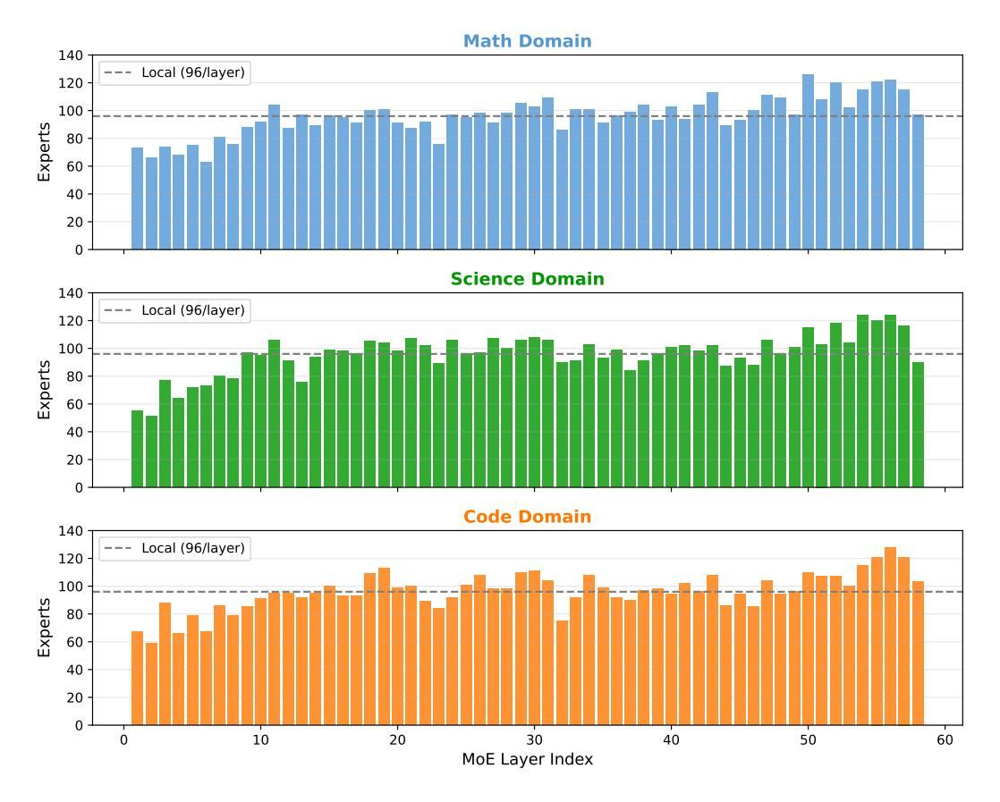

# **C.2 PEU Ranking Validity: Top vs. Bottom Experts**

To validate that our PEU rankings meaningfully identify important experts, we compare keeping the top-ranked experts (PreMoE) versus keeping the bottom-ranked experts (Last) on DeepSeek-R1 and openPangu-Ultra.

Table C.2: Comparison of keeping top-ranked vs. bottom-ranked experts. DeepSeek-R1 at 50% sparsity (128/256 experts); openPangu-Ultra at 50% sparsity (128/256 experts).

| Model           | Method            | MATH-500 | LCB   | GPQA  |
|-----------------|-------------------|----------|-------|-------|
| DeepSeek-R1     | Last-128 (bottom) | 1.4      | 0.0   | 21.72 |
|                 | PreMoE (top-128)  | 97.6     | 66.36 | 72.22 |
| openPangu-Ultra | Last-128 (bottom) | 2.2      | 0.0   | 18.69 |
|                 | PreMoE (top-128)  | 96.8     | 66.91 | 75.76 |

Keeping the bottom-ranked experts results in near-complete collapse across both models (1–2% on MATH-500, 0% on LCB), while PreMoE with top-ranked experts achieves near-full accuracy. This stark contrast confirms that PEU rankings accurately identify which experts are critical for task performance.

### **C.3 Threshold Strategy Ablation**

We compare our adaptive threshold strategy against fixed thresholds on DeepSeek-R1 at 50% sparsity. Table [C.3](#page-15-1) shows the results.

The adaptive threshold consistently outperforms fixed values across all benchmarks. This is because the optimal threshold varies across layers and domains; our layer-wise adaptive rule (Eq. [4\)](#page-3-0) automatically calibrates to each layer's activation distribution.

Table C.3: Ablation of threshold strategies on DeepSeek-R1 at 50% sparsity.

| Threshold              | MATH-500 | LCB   | GPQA  |
|------------------------|----------|-------|-------|
| = Fixed (r 0.15) | 94.2     | 64.34 | 68.69 |
| = Fixed (r 0.3)  | 96.2     | 65.07 | 68.18 |
| Adaptive (Ours)        | 98.0     | 64.71 | 70.71 |

## **C.4 Local vs. Global Expert Ranking**

Our default approach ranks experts *locally* within each layer, keeping a fixed number (e.g., 96) per layer. An alternative is *global* ranking across all layers, keeping the top-*K* experts overall (e.g., 96×58 = 5568 total for DeepSeek-R1). Table [C.4](#page-15-2) compares these strategies.

Table C.4: Local vs. global expert ranking on DeepSeek-R1 at 62.5% sparsity (96 experts per layer for local; 5568 total for global).

| Strategy            | MATH-500 | GPQA  | LCB   |
|---------------------|----------|-------|-------|
| Local (96/layer)    | 96.0     | 64.65 | 61.03 |
| Global (5568 total) | 96.6     | 64.65 | 63.60 |

Global ranking slightly outperforms local ranking, suggesting that some layers benefit from more experts while others need fewer. Figure [C.1](#page-16-2) shows the layer-wise expert distribution under global ranking: early layers retain fewer experts (51–73), while later layers retain more (up to 128), indicating that deeper layers require more diverse expert coverage.

### **C.5 MMLU-Pro Out-of-Distribution Analysis**

We evaluate compiled models on MMLU-Pro, a broad benchmark spanning 14 subject areas, to assess out-of-distribution generalization. Table [C.5](#page-15-3) shows the complete breakdown.

Key observations: (1) Domain-specific specialists excel in their target areas but degrade sharply elsewhere (e.g., Code Specialist achieves only 27.12% on History). (2) The base

Table C.5: MMLU-Pro sub-task breakdown on DeepSeek-R1 at 50% sparsity. Bold indicates best among compiled models.

| Subject     | Full  | Generalist | +More Data | Math Spec. | Code Spec. | Sci Spec. |
|-------------|-------|------------|------------|------------|------------|-----------|
| Math        | 92.37 | 92.37      | 91.97      | 92.77      | 89.56      | 88.76     |
| Physics     | 89.72 | 87.85      | 88.32      | 81.31      | 60.75      | 87.85     |
| Chemistry   | 90.37 | 90.37      | 88.77      | 75.94      | 48.66      | 89.84     |
| Law         | 67.18 | 35.38      | 66.67      | 29.23      | 27.69      | 38.97     |
| Engineering | 81.75 | 73.72      | 76.64      | 64.96      | 51.09      | 78.10     |
| Other       | 81.06 | 61.36      | 68.94      | 46.97      | 52.27      | 59.85     |
| Economics   | 84.76 | 76.83      | 82.32      | 75.00      | 68.90      | 81.10     |
| Health      | 75.51 | 59.86      | 69.39      | 32.65      | 34.69      | 66.67     |
| Psychology  | 82.17 | 65.89      | 75.97      | 53.49      | 54.26      | 78.29     |
| Business    | 81.34 | 79.85      | 82.84      | 76.87      | 78.36      | 78.36     |
| Biology     | 91.18 | 89.22      | 91.18      | 79.41      | 73.53      | 91.18     |
| Philosophy  | 78.75 | 63.75      | 67.50      | 58.75      | 52.50      | 66.25     |
| Computer    | 83.10 | 80.28      | 83.10      | 73.24      | 74.65      | 67.61     |
| History     | 72.88 | 42.37      | 52.54      | 38.98      | 27.12      | 52.54     |
| Average     | 82.29 | 71.36      | 77.58      | 62.82      | 56.71      | 73.24     |

Figure C.1: Expert distribution across 58 MoE layers under global ranking for three domains. The dashed line indicates the local baseline (96 experts/layer). Global ranking allocates fewer experts to early layers and more to later layers.

Generalist (calibrated on Math/Code/Science) retains 71.36% average but struggles on subjects like Law (35.38%) and History (42.37%). (3) Augmenting calibration with additional domain data significantly improves generalization to 77.58%, with the largest gains on Law (+31.29%), Health (+9.53%), and Psychology (+10.08%). This demonstrates that broader calibration coverage directly translates to better out-of-distribution performance.

