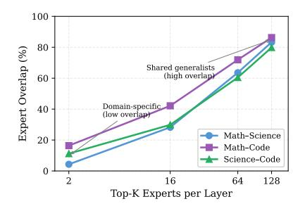

# (a) Frequently-Activated Generalists (Low Utility)

| (b) Infrequent | Specialists | (High | Contextual |
|----------------|-------------|-------|------------|
| Utility)       | _           |       |            |

| Expert    | #Top-K a | #Rank-1 | R-1 Ratio | Freq. | PEU |
|-----------|---------------------|---------|-----------|-------|-----|
| (0, 161)  | 31182               | 7       | 0.02%     | 140   | 256 |
| (57, 205) | 42802               | 0       | 0.00%     | 63    | 252 |
| (2, 54)   | 48168               | 3       | 0.01%     | 22    | 256 |
| (6, 158)  | 61977               | 92      | 0.15%     | 10    | 254 |
| (57, 24)  | 47556               | 0       | 0.00%     | 53    | 253 |

| Expert    | #Top-K a | #Rank-1 | R-1 Ratio | Freq. | PEU |
|-----------|---------------------|---------|-----------|-------|-----|
| (3, 243)  | 8382                | 4979    | 59.4%     | 256   | 51  |
| (36, 9)   | 2518                | 1482    | 58.9%     | 255   | 77  |
| (45, 220) | 640                 | 368     | 57.5%     | 256   | 137 |
| (50, 223) | 655                 | 352     | 53.7%     | 256   | 148 |
| (57, 95)  | 8254                | 4370    | 53.0%     | 227   | 58  |

Figure 4 shows two main findings. First, without threshold filtering, the choice of logit transformation matters:  $f(s) = \max(s, \sigma(s))$  is the most consistent across domains, while  $\sigma(s)$  performs well on Math but degrades on Science and Code. Second, once threshold filtering is introduced, all transformations achieve similarly strong performance. This indicates that logit transformation mainly corrects the negative-logit scoring issue, whereas threshold filtering is the primary factor in stabilizing utility estimation. We therefore use  $\max(s,\sigma(s))$  as the default.

We further ablate the thresholding strategy. On DeepSeek-R1 at 50% sparsity, the adaptive threshold achieves 98.0/64.71/70.71 on MATH-500/LCB/GPQA, outperforming fixed thresholds of 0.15 (94.2/64.34/68.69) and 0.3 (96.2/65.07/68.18). A full component ablation is provided in Appendix C.1.

### 4.4.2 Diverse and Critical Expert Roles

Analyzing the PEU rankings on the Code domain reveals distinct expert roles, which in turn clarify why frequency-based pruning fails under aggressive sparsity.

Frequently-Activated Generalists (Low Utility). Some experts are considered by the router thousands of times but are rarely the decisive top choice. Table 3a shows five such examples from the Code domain. Frequency-based methods rank these in the top-63, while PEU correctly demotes them to positions 252 to 256. These are "frequent but weak" generalists that occupy model capacity without providing critical utility for code generation tasks.

Infrequent Specialists (High Contextual Utility). Conversely, some experts are rarely activated but are almost always the top choice when they are. Table 3b shows five such examples. Frequency-based methods rank these at the tail, effectively discarding them, while PEU promotes them to positions 51 to 148. These are rare-but-critical specialists whose removal would eliminate essential capabilities for specific code constructs or programming patterns that occur infrequently in the calibration set but are vital when they appear.

Figure 5: Top-2 specialists exhibit <17% overlap, while top-128 sets share 80-86% experts, revealing strong specialization.

Figure 6: Cross-domain performance of DeepSeek-R1 specialists at 50% sparsity. **Bold** = in-domain; specialists excel in-domain but degrade sharply out-of-domain.

| Model                              | MATH-500     | LCB            | GPQA           | MMLU-Pro       |
|------------------------------------|--------------|----------------|----------------|----------------|
| Full                               | 96.6         | 69.12          | 73.23          | 82.30          |
| Math Specialist Code Specialist | 97.6 87.8 | 58.46 66.36 | 59.09 40.91 | 62.82 56.71 |

These contrasting cases explain why PreMoE maintains performance at high sparsity while frequency-based methods fail: PEU preserves mission-critical specialists while pruning low-utility generalists, whereas frequency does the opposite. This distinction is critical: when we prune to 50% sparsity on DeepSeek-R1 (keeping 128/256 experts), PEU retains the high-utility specialists while Frequency-based methods lose them, explaining the 60.48 percentage point accuracy gap on Code (66.36% vs. 5.88% in Table [1\)](#page-4-0).

