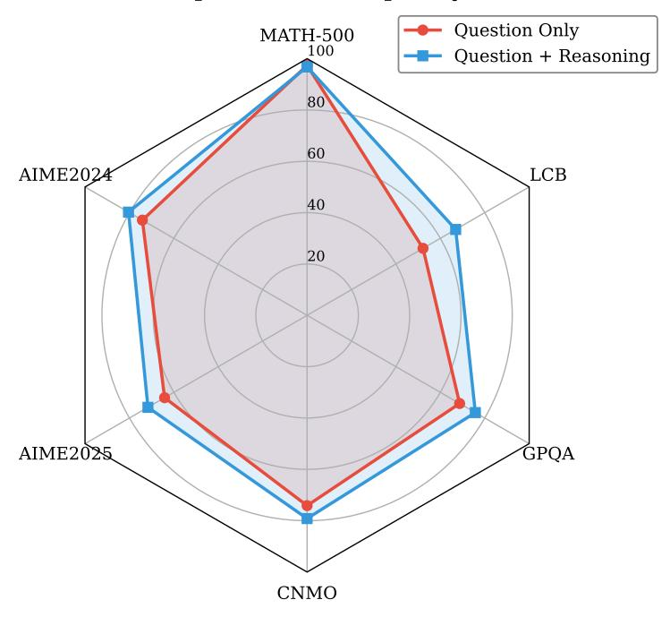

# **C.7 Calibration Data Efficiency**

PreMoE requires surprisingly few calibration samples to achieve near-optimal performance. Table [C.6](#page-17-1) shows results on DeepSeek-R1 specialists at 50% sparsity across three domains.

Performance stabilizes rapidly for specialists: just 5–10 samples approach the full accuracy. For generalists, using only 10 samples per domain (30 total) also matches full performance (Table [C.7\)](#page-17-2).

## **Impact of Calibration Data Context (DeepSeek-R1, 50% sparsity)**

Figure C.2: Impact of calibration data context. The radar chart compares performance when extracting computational patterns using question-only calibration data versus question + reasoning output. Including the full reasoning context consistently improves accuracy across all six benchmarks, with the largest improvements on AIME 2024 (+6.24%), LiveCodeBench (+14.70%), and CNMO (+5.04%).

Table C.6: Specialist accuracy vs. calibration sample size on DeepSeek-R1 at 50% sparsity. Performance stabilizes rapidly with just 5–10 samples.

| Samples                   | MATH-500                             | GPQA                                     | LCB                                       |
|---------------------------|--------------------------------------|------------------------------------------|-------------------------------------------|
| Full                      | 96.6                                 | 73.23                                    | 69.12                                     |
| 1 5 10 50 100 | 93.2 97.0 98.0 97.6 98.0 | 41.21 71.21 70.71 70.2 71.21 | 52.57 64.71 64.71 66.91 66.36 |

Table C.7: Generalist accuracy with reduced calibration data on DeepSeek-R1 at 50% sparsity.

| Calibration                 | MATH-500     | GPQA           | LCB            | AIME 24        | AIME 25        | CNMO Avg                      |
|-----------------------------|--------------|----------------|----------------|----------------|----------------|----------------------------------|
| Full 10+10+10 (30 total) | 96.6 96.4 | 73.23 73.74 | 69.12 68.38 | 77.08 79.58 | 65.83 62.92 | 71.18 75.52 74.88 75.98 |

Table C.8: DeepSeek-R1 Domain-Specific Specialists: accuracy (%) vs. sparsity. Average is over MATH-500, GPQA, LCB.

| # Experts | Sparsity | MATH-500 | GPQA  | LCB   | Avg   |
|-----------|----------|----------|-------|-------|-------|
| 256       | 0%       | 96.60    | 73.23 | 69.12 | 79.65 |
| 128       | 50%      | 97.60    | 72.22 | 66.36 | 78.73 |
| 96        | 62.5%    | 96.00    | 64.65 | 61.03 | 73.89 |
| 64        | 75%      | 93.40    | 45.45 | 49.63 | 62.83 |

Table C.9: DeepSeek-R1 High-Efficiency Generalist: accuracy (%) vs. sparsity. Average is over MATH-500, GPQA, LCB.

| # Experts | Sparsity | MATH-500 | GPQA  | LCB   | Avg   |
|-----------|----------|----------|-------|-------|-------|
| 256       | 0%       | 96.60    | 73.23 | 69.12 | 79.65 |
| 128       | 50%      | 97.40    | 67.68 | 68.01 | 77.69 |
| 96        | 62.5%    | 93.60    | 62.63 | 56.99 | 71.07 |
| 64        | 75%      | 89.80    | 38.38 | 20.22 | 49.46 |

