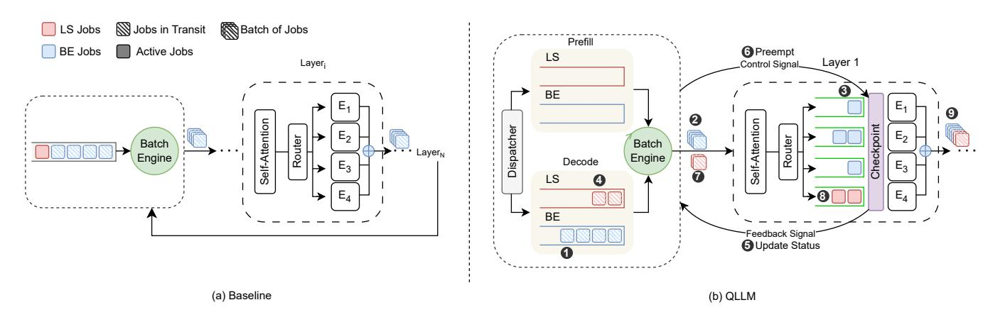

# 3.1 Challenges and Design Decisions

We set the following objectives when developing QLLM.

Generic and low overhead preemption mechanism. Fine-grained control of the system state (*e.g.*, KV caches, hidden states) within the inner layers and orchestration of the execution flow is a generic need in LLM serving systems. We use a centralized state management mechanism for sequences and batches that enables real-time tracking and updating of sequence states within layers, avoiding delayed updates at the iteration level.

Minimizing LS Job latency without sacrificing throughput. The key challenge is reacting to high-priority workloads with fine-grained timing. To address this, QLLM implements a priority-aware scheduler working in tandem with a low-overhead preemption mechanism, enabling scheduling decisions at each layer to optimize LS task responsiveness while maintaining efficient execution flow.

Unified sequence and batch management. In contrast to current systems that keep concatenated batch tensors throughout response generation, a system such as QLLM requires manipulating the batch within inner layers due to context switching. Therefore, we designed a *unified lifecycle management abstraction*, which encapsulates all sequence-associated states and metadata into a sequence and batch framework. This framework simulates a single batch tensor to ensure compatibility with existing models, while also allowing asynchronous updates to each sequence's individual tensors using a facade pattern abstraction.

**User-defined scheduling policies.** Tailored scheduling policies specific to the workload can optimize performance in various systems. QLLM facilitates user-defined scheduling policies (in Python) at the expert level by employing a checkpointing mechanism alongside a closed-loop controller system.

**Top-k expert selection.** Top-k expert selection for each token is an additional challenge for preemptive schedulers. To maximize QLLM's flexibility for user-defined policies, we need a solution that enables partial processing with preemption while avoiding queue stalls due to delayed experts. Our per-expert queuing and single source of truth for state management make this efficient by pushing sequence references into multiple queues and tracking outputs as state. QLLM distinguishes fully from partially processed tokens, ensuring only complete tokens contribute to the hidden state of the next layer.

**Modular architecture.** QLLM addresses architectural bottlenecks in systems like vLLM [30] by adopting a modular and extensible design. Through *modularization*, *encapsulation*, and *dependency injection*, it decouples the system logic, minimizing interdependencies, and enabling seamless policy updates.

### 3.2 System Architecture

Figure 1 illustrates the architecture of QLLM. At a high level, a *scheduler* component receives a sequence of prompts over time—each referred to as a *job*—and schedules them on the *inference engine*, which processes jobs through the layers of the model. The scheduler is architected around two primary components: a *dispatcher* and a *batch engine*. The dispatcher enqueues incoming jobs into prefill queues based on priority and directs model output tokens into their corresponding decode queues. Simultaneously, the batch engine groups tokens into batches for each iteration, following Algorithm 1, before dispatching them to the inference engine. Unlike existing work, the QLLM scheduler enables *preemption & scheduling of jobs at fine granularity*. For example, QLLM allows preempting a batch of best-effort jobs at any processing layer to replace one of the jobs with a newly arrived latency-sensitive job, then resuming their execution.

The QLLM scheduler utilizes four separate queues to monitor unfinished LS and BS jobs. Two of these queues manage jobs that need to be processed through the prefill stage, while the other two handle jobs that have progressed to the decode phase. Queues are implemented with an FCFS policy. The batch engine in the scheduler extracts jobs from these queues to implement a pre-configured (or a user-defined) batch policy. We show the pre-configured policy in Algorithm 1 where we prioritize the execution of LS jobs by

Figure 1: Comparison of a baseline and QLLM. The baseline employs iteration-level scheduling and continuous batching, with control returning to the scheduler only upon execution of all N layers. The figure on the right demonstrates a streamlined execution of QLLM's fine-grain scheduling within layer 1. LS jobs arrive after BE jobs and are batched in step 7.

