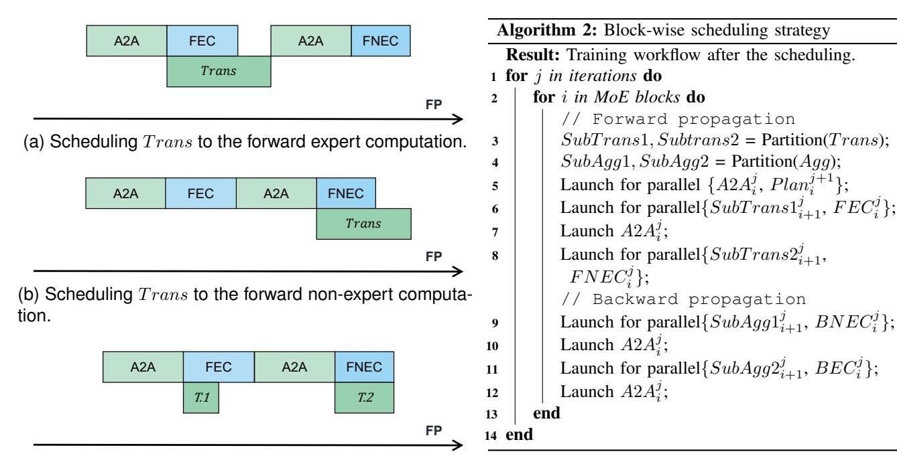
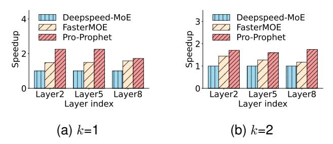
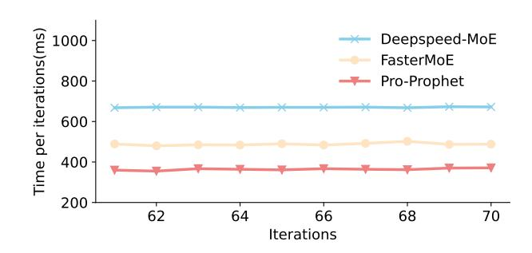
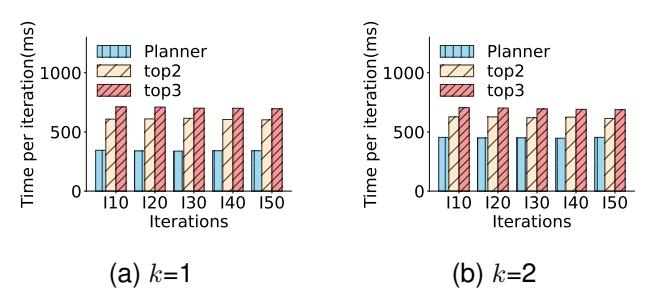
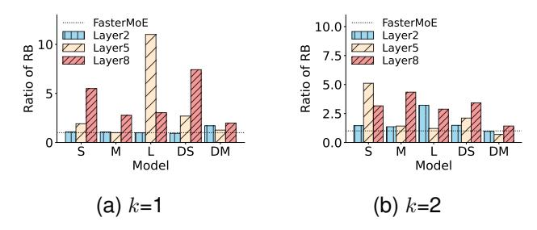

# *A. Scheduling space establishment*

23 RETURN P oE;

As shown in Fig. [1,](#page-2-0) a MoE model consists of both MoE and non-MoE layers stacked on top of each other. We combine

Fig. 7. The device state of operators in a MoE block. FEC and BEC are forward and backward computations of the MoE layer. FNEC and BNEC are forward and backward computations of the non-MoE layer. An operator is marked as *comm* and a green rectangle if devices only communicate during its execution. Similarly, we use *comp* and blue rectangle to mark computation operators.

every adjacent pair of MoE layer and non-MoE layer into a MoE block.

Fig. 7 presents the device state of operators in a MoE block. Only primary operations are presented for clarity description. During the FP, two primitives related to load balancing(i.e., Plan and Trans) and three basic operations(i.e., two A2A communications and a forward expert computation FEC) are performed in a MoE layer. For the non-MoE layer, only a forward computation FNEC is executed. After the gate network produces the routing decision and input distribution, a Plan operator is performed to identify a load-balancing strategy based on the load of devices. The Trans primitive can only be launched once the strategy is determined. And then, two A2A communications and an expert computation can be launched. During the BP, the MoE layer executes a Agg operation, two A2A communications, and a backward expert computation BEC. Only a backward computation BNEC is performed in the non-MoE layer, the Agg operation is carried out to aggregate the gradient of experts following the completion of their backward computation.

We label an operation as *comm* if devices communicate during the execution of this operation. Similarly, if an operation computes all the time, we label it as *comp*. Before the launching of Plan, information related to produce a load-balancing strategy is stored in each device. Therefore, there are only computations during Plan. We label it as *comp*. As Trans primitive only exchanges the parameters of experts based on the load balancing strategy, we label it as *comm*. According to the description of Sec. II, the A2A is marked as *comm*, and the computation of the MoE layer and non-MoE layer are tagged as *comp*. As for Agg primitive, gradients of the same expert are aggregated into a device. We flag it as *comm*.

The operators with data dependency are tightly interconnected along the timeline, constraining the scheduling of computation and communication. However, the locality mentioned in Sec. II enables the pre-launch of some data-dependent operations without breaking the data dependency. We can insert the data-independent operation into data-dependent operators to make room for communication and computation overlapping. Specifically, in the case of a MoE layer, the input distribution for the current iteration can be estimated by leveraging the distribution from former iterations, which allows us to produce

the load-balancing strategy by invoking a plan operator within earlier iterations. Subsequently, Trans primitives can be scheduled to earlier locations on the timeline. We also find that the Agg primitive is independent of computation operations later, thus we can schedule it to later positions.

The analysis above provides the potential for computation and communication scheduling. However, there are several constraints for arbitrarily scheduling. Firstly, the estimation of the distribution means that we can establish a load-balancing strategy within a former iteration. As the distribution of the last iteration is necessary for higher estimation accuracy, the earliest position of a plan primitive in i-th iteration is the i-1-th iteration. Secondly, there are two main ways to update parameters. It is necessary to update the expert parameters before the Trans primitive. We can perform the updating procedure layer by layer [34] or update at the end of the BP [8]. For the layer-by-layer updating, we can launch the Trans primitive of a MoE layer of an iteration within the last iteration, which does not apply to concentrated updating works. For the concentrated updating, the Trans primitive could be performed at the end of the BP of the last iteration, which has a similar effect as starting it within this iteration. For the universality of our method, we confine the scheduling of the Trans primitive within a single iteration. Lastly, it is necessary to aggregate the gradients of experts at each iteration. Therefore, the replacing of the Agg primitive is also confined within a single iteration.

Fig. 8 illustrates our scheduling space. The subscript denotes the index of the MoE block of the operation and the superscript denotes its iteration. All Plan computations of iteration j+1 can be scheduled to the A2A communication of iteration j. The Trans primitives from block i+1 to l during the j-th iteration are overlapped with the forward computations of the i-th block, where l is the total number of blocks. Similarly, the Agg primitives from block i+1 to l are orchestrated to overlap with backward computations of the i-th block. Our scheduling space considers a MoE block as a unified reordering entity, thus overcoming the limitations in observation imposed by previous methods.

#### B. Block-wise scheduling strategy

The scheduling space provides extensive strategies for scheduling. However, operator-grained scheduling is far from making full use of overlapping space. We partition the operator into sub-operators and take a scheduling at the sub-operator level. We take a brief example to describe the advantage of sub-operator scheduling in Fig. 9 which shows three types of scheduling for a Trans primitive. The overhead of Trans primitive is varied as the load of devices (e.g., the number of heavy-load experts changed as the training). As shown in Fig. 9a and Fig. 9b, a forward computation of a MoE layer or a non-MoE layer cannot afford the hiding of a Trans primitive as their short duration time. Consequently, the Trans primitive will block the process of the model training. Fig. 9c presents the sub-operators scheduling. The Trans primitive is split into two sub-operators scheduled to two computations respectively. The sub-operator scheduling

Fig. 8. Scheduling space. The subscript denotes the index of the MoE block and the superscript denotes that of the iteration. For example,  $Trans_j^{i+1:l}$  denotes the set of Trans operations spanning from the block i+1 to the block l during the iteration j, where l is the number of MoE blocks.

(c) Splitting and scheduling Trans to both the forward expert computation and non-expert computation.

Fig. 9. Different scheduling strategies for a Trans primitive.

improves the utilization of overlapping space and reduces the communication overhead.

A dynamic scheduling strategy is beneficial as the load of devices fluctuates with the training process. However, the nonnegligible overhead will be introduced if we determine an optimal scheduling strategy that as far as possible hides the overhead of three types of primitives involved by systematical load balancing methods in the runtime. Therefore, we design an offline scheduling policy to overlap communication and computation while avoiding the extra overhead. The policy is founded on static elements within dynamics, not intuition. Our block-wise scheduling strategy is summarized in Algorithm 2. The first primitive is Plan. We schedule the Plan primitive of the *i*-th block in the iteration j + 1 to the A2A communication of the i-th block in the j-th iteration. For the Trans primitive, we overlap it with computations of the former block within an iteration. Specifically, the forward computation of the *i*-th block is responsible for overlapping the Trans primitive of block i + 1. As two computations are executed in the i-th block, we split the Trans primitive into two sub-primitives and launch them simultaneously with the two computations. Even though the duration of Trans and EFC varies as the device loads, the forward computation overhead of the non-MoE layer and the transferring overhead of an expert's parameters are static. We can estimate them before training and properly split the Trans primitive. The advantage of the estimation is that we can exhaustively fill in the communication idle in the performing of the forward computation of the non-MoE layer. Finally, we schedule the Agg of block i+1 into the backward computation of the i-th one. Similarly, we can estimate the backward computation overhead of the non-MoE layer and do a suitable communication partition.

## C. Effective collaboration with planner

To better integrate the planner and scheduler, we combine the scheduling performed by the scheduler into the performance model of the planner.

Specifically, we define the parallel execution time of the Trans and Agg primitives as  $T_{PTrans}(H,s,n)$  and  $T_{PAgg}(H,s,n)$  respectively. Besides, we denote  $T_{FNEC}$  and  $T_{BNEC}$  as the execution time of FNEC and BNEC. If  $T_{Trans}(s,n)$  can be hidden by  $T_{FEC}(H)$  and  $T_{FNEC}$ , then  $T_{PTrans}(H,s,n)$  is equal to 0. Otherwise,  $T_{PTrans}(H,s,n)$  is equal to  $T_{Trans}(s,n) - T_{Trans}(s,n) - T_{Trans}(s,n)$ . That means

that TP T rans(H, s, n) = max(0, TT rans(s, n) − TF EC (H) − TF NEC ). Similarly, TP Agg(H, s, n) can be expressed as max(0, TAgg(s, n) − TBEC (H) − TBNEC ).

With the above analysis, the overall execution time of the MoE layer estimated by the performance model of the planner is changed as below:

$$T'(R, H, s, n) = 4T_{A2A}(R) + 3T_{FEC}(H) + T_{PTrans}(H, s, n) + T_{PAgg}(H, s, n).$$
(8)

By combining the planner and scheduler, we can achieve a fine-grained pre-allocation of hardware resources to experts, efficiently addressing the load imbalance problem during training.

## VI. EVALUATION

Testbed. We test Pro-Prophet on three types of nodes named *HPWNV*, *HPNV* and *LPWNV* respectively. Each *HPWNV* node is equipped with 2 Intel Xeon CPUs (2.40GHz) and 4 NVIDIA 3090 GPUs with 24GB graphics memory. Each CPU is connected to two GPUs through PCI-Express 3.0. 100Gb/s Infiniband is used for inter-node communication. The difference between *HPWNV* and *HPNV* is that GPUs within a *HPNV* node are connected by NVLink-3.0 connections. Specifically, four GPUs are divided into two groups. Two GPUs within a group are connected by a NVLink connection. The difference between *HPWNV* and *LPWNV* is that the type of GPUs of a *LPWNV* node is 2080Ti.

Models and baselines. As shown in table [III,](#page-8-0) we use five variants of MoE-GPT models in our experiments. All FFN layers are replaced by a MoE layer. The number of experts within a MoE layer is consistent with the number of GPUs.

We compared Pro-Prophet with two representative MoE training systems: 1) Deepspeed-MoE [\[4\]](#page-11-3): Deepspeed-MoE is an efficient MoE framework developed by Microsoft. It exclusively implements EP. 2) FasterMoE [\[8\]](#page-11-7): This training system employs a systematic load balancing method, *dynamic shadowing*, to effectively accelerate the model training.

Default settings. Unless otherwise specified, we fix some training settings. We train MoE models on the cluster consisting of *HPWNV* nodes. We evaluate Pro-Prophet within the first 100 iterations as the input distribution tends to stabilize with the training process.

## *A. End-to-end Performance*

In summary, Pro-Prophet achieves 1.36-2.66x and 1.01- 1.48x speedups compared to Deepspeed-MoE and FasterMoE respectively.

TABLE III MODEL CONFIGURATION.

| Name       | Layers | Embedding | Hidden |
|------------|--------|-----------|--------|
| MoE-GPT-S  | 12     | 512       | 1024   |
| MoE-GPT-M  | 12     | 1024      | 2048   |
| MoE-GPT-L  | 12     | 2048      | 4096   |
| MoE-GPT-DS | 24     | 512       | 1024   |
| MoE-GPT-DM | 24     | 1024      | 2048   |

TABLE IV THE OVERALL SPEEDUP ON 4 *HPNV* NODES.

|  | K GPUs | Tokens |            | Speedup to DeepspeedMoE |             |
|--|-----------|--------|------------|-------------------------|-------------|
|  |           |        | Model      | FasterMoE               | Pro-Prophet |
|  | 1         | 16384  | MoE-GPT-S  | 1.63                    | 1.98        |
|  |           |        | MoE-GPT-M  | 1.99                    | 2.22        |
|  |           |        | MoE-GPT-L  | 1.62                    | 1.80        |
|  |           |        | MoE-GPT-DS | 1.34                    | 1.70        |
|  | 16        |        | MoE-GPT-DM | 1.68                    | 2.26        |
|  | 2         |        | MoE-GPT-S  | 2.31                    | 2.62        |
|  |           |        | MoE-GPT-M  | 1.82                    | 2.10        |
|  |           |        | MoE-GPT-L  | 1.94                    | 2.23        |
|  |           |        | MoE-GPT-DS | 1.77                    | 1.94        |
|  |           |        | MoE-GPT-DM | 1.84                    | 2.07        |

1 The label "Token" is the number of tokens trained in an iteration.

Experiments on *HPWNV*. We first evaluate the end-to-end performance of Pro-Prophet on two *HPWNV* clusters. They contain 4 and 8 *HPWNV* nodes respectively. We fixed the number of tokens trained in an iteration to 16384 and 32768.

As shown in previous works, the k is set to 1 or 2 [\[1\]](#page-11-0), [\[6\]](#page-11-5), [\[35\]](#page-12-14) for better balancing between the model quality and training efficiency. We conducted experiments under both values to validate the generality of Pro-Prophet.

Fig. [10a](#page-9-0) and Fig. [10b](#page-9-1) illustrate speedups achieved by Pro-Prophet under five benchmark models with a top-1 gate network. Pro-Prophet achieved 1.47-2.66x end-to-end performance gains in comparison with Deepspeed-MoE. As to FasterMoE, Pro-Prophet achieves performance enhancements of up to 1.31x with an average of 1.19x.

As shown in Fig. [10c](#page-9-2) and Fig. [10d,](#page-9-3) speedups under a top-2 gate network achieved by Pro-Prophet are 1.36-2.37x and 1.05-1.48x compared to Deepspeed-MoE and FasterMoE respectively. The result shows the coarse-grained and blocked manner of FasterMoE will introduce additional runtime overhead and hinder the further improvement of the training efficiency. Our method can precisely pre-allocate resources to experts, thereby avoiding this issue.

Experiments on HPNV and LPWNV clusters. Different hardware conditions significantly affect the effectiveness of the method. For example, the device memory may serve as a constraint on the maximum training tokens in an iteration. Besides, the training issue may be altered by variations in computing throughput and communication bandwidth, causing a significant influence on the effectiveness of methods. To verify the generality of Pro-Prophet, we conduct experiments on diverse hardware environments with varying memory consumption, and the rate of computing throughput and communication bandwidth.

Due to the limited memory capacity compared to the *HPWNV* and *HPNV*, we only train the four smaller models listed in Table [III](#page-8-0) on the *HPWNV* cluster. The number of tokens trained in one iteration is set to 4096.

Table [IV](#page-8-1) shows the speedup results under various models and values of k in a cluster consisting of 4 *HPNV* nodes. The highest speedups are highlighted in the table. With the equipment of NVLink connections in the cluster, communication

Fig. 10. End-to-end performance. The numbers in the captions denote speedups achieved by Pro-Prophet over the best baseline.

TABLE V THE OVERALL SPEEDUP ON A 2 LPWNV NODES.

| l K | K GPUs | Tokens | Model -    | Speedup to DeepspeedMoE |             |  |
|-----|--------|--------|------------|-------------------------|-------------|--|
| ıx. |        |        |            | FasterMoE               | Pro-Prophet |  |
|     | 1 8    | 8 4096 | MoE-GPT-S  | 1.20                    | 1.30        |  |
| ١,  |        |        | MoE-GPT-M  | 1.02                    | 1.18        |  |
| 1   |        |        | MoE-GPT-DS | 1.12                    | 1.30        |  |
|     |        |        | MoE-GPT-DM | 0.96                    | 1.26        |  |
|     |        |        | MoE-GPT-S  | 1.56                    | 1.91        |  |
| 2   |        |        | MoE-GPT-M  | 1.29                    | 1.94        |  |
|     |        |        | MoE-GPT-DS | 1.44                    | 1.64        |  |
|     |        |        | MoE-GPT-DM | 1.25                    | 1.58        |  |

&lt;sup>1 The label "Token" is the number of tokens trained in an iteration.

Fig. 11. Speedups across different layers over the Deepspeed-MoE in the MoE-GPT-M model with different values of k. Pro-Prophet achieves 1.09-1.49x single-layer speedups compared to FasterMoE.

processes such as A2A will be accelerated. Under this condition, Pro-Prophet achieves 1.71-2.63x speedups compared to Deepspeed-MoE and 1.10-1.35x to FasterMoE, demonstrating its adaptability to conditions with higher communication bandwidth. We also test Pro-Prophet on a cluster consisting of 2 *LPWNV* nodes. The results are presented in Table V and the highest speedups are emphasized too. Due to the lower computation ability of the 2080Ti compared to the 3090 GPU, the impact of the computation process becomes more significant. In this environment, Pro-Prophet achieved a speedup of 1.18-1.94x compared to Deepspeed-MoE and 1.08-1.50x compared to FasterMoE, showing its robustness in conditions with lower computation power.

The result of the MoE-GPT-DM model with k=1 shows that Deepspeed-MoE achieves higher performance compared to FasterMoE as FasterMoE transports parameters to unnecessary devices, resulting in additional runtime overhead. However,

Fig. 12. Per-iteration execution time in the MoE-GPT-M model when k=1. Pro-Prophet achieved 1.34x speedup on average compared to fasterMoE.

Pro-Prophet can accurately find a communication-efficient expert placement, thereby avoiding this trouble.

## B. Fine-grained analysis of Pro-Prophet

We conducted a fine-grained analysis of Pro-Prophet according to speedups in a single layer and a single iteration. Experimental results demonstrate that Pro-Prophet enhances training performance in each layer and iteration during training.

**Single-layer speedup.** We first evaluate the single-layer performance of Pro-Prophet. Fig. 11 illustrates the execution time across different layers of three methods on the MoE-GPT-M model. We randomly select the index of layers and use the Pytorch Profiler to collect the training time. As shown in the figure, Pro-Prophet achieves 1.60-2.25x single-layer speedups compared to Deepspeed-MoE and 1.09-1.49x to FasterMoE.

Varying loads of experts across layers occur in the training process. This phenomenon leads to fluctuating speedups for Pro-Prophet. However, it consistently outperforms two baselines in different layers, demonstrating its superior capability of load balancing under diverse load-imbalance conditions.

**Single-iteration speedups.** We also evaluate the single-layer performance of Pro-Prophet. We conduct experiments on the MoE-GPT-M model with k=1. The results are presented in Fig. 12. Compared to fasterMoE, Pro-Prophet achieved 1.34x speedup on average. The iteration time of Pro-Prophet is consistent and lower. This phenomenon can mainly be attributed to the fact that Pro-Prophet is capable of adapting to dynamic situations.

Fig. 13. The accuracy of the performance model. The mean estimation error is less than 5%.

#### C. Ablation study

**Necessity of the dynamic adaptation.** Dynamic adaption is necessary for MoE models. It's reasonable to transfer heavyload experts to other GPUs, but it's unclear if Pro-Prophet's dynamic search algorithm is necessary.

To certify the necessity of our algorithm, we compare the planner with two simple dynamic policies. Specifically, two policies transfer 2 and 3 experts with the heaviest load to all GPUs. We named them top2 and top3 respectively. We use PyTorch's topk function to implement these strategies. The overhead of determining the heaviest experts is negligible.

Figure 15 illustrates the latency of three policies in a single iteration with different values of k. As shown in Fig. 15a, the planner gains 1.77-1.82x speedups compared to the top2 policy and 2.04-2.10x speedups to the top3 policy when k=1. The results shown in Fig. 15b demonstrate that the planner gains speedups ranging from 1.38-1.40x compared to different policies when k=2.

The experimental results indicate that fixing the number of experts and passing them to all GPUs does not yield good results. The input distribution changes as training progresses, resulting in different optimal expert placements. Compared to these two dynamic strategies, our algorithm introduces more overhead, but it's necessary for faster training speeds.

Accuracy of performance model. Fig. 13 illustrates the accuracy of the performance model. We compare the estimated time to the real time on A2A, expert computation (EC), Trans and Agg operations. The results show that our mean estimation error is less than 5%.

**Effectiveness of components.** To verify the effectiveness of the components, we conduct incremental experiments. We first turn off all optimizations for Pro-Prophet and use it as a baseline. Based on this, we activate the planner and scheduler sequentially and record the speedup they attain relative to the baseline. Finally, we verify the effective combination of the planner and scheduler mentioned in Sec. V.

Fig. 14 demonstrates speedups on the MoE-GPT-M under different k. Compared to the baseline, the planner gains 1.26x and 1.12x speedups when k=1 and k=2 respectively. These results show that the planner can efficiently and accurately

Fig. 14. The effectiveness of components. The baseline is Pro-Prophet without any optimizations. Full is the condition of turning on the effective combination of the planner and scheduler. The planner, scheduler and Full achieve a speedup of 1.19x, 1.075x and 1.025x on average respectively.

Fig. 15. The iteration latency of different policies in the MoE-GPT-M model.

determine a communication-efficient expert placement for well load-balancing under different conditions. Besides, the scheduler gains 1.14X and 1.01x speedups when k=1 and k=2 respectively. These verify that the scheduler can hide the overhead of load-balancing, further improving the training performance. The speedups achieved by the scheduler are significantly influenced by the expert placement produced by the planner. Finally, we test the effectiveness of the effective combination (*Full* in the figure). As the performance model estimates the overlapped execution time, the planner will further balance the load based on the scheduler's capability of communication and computation overlapping. The results demonstrate that it achieves 1.03x and 1.02x speedups under different values of k.

Balance capability. Balance capability serves as a key

Fig. 16. The ratio of RB of the planner to FasterMoE in different models and k. The balance degree is the standard deviation of the input distribution tensor. The ratio of the balance degree before and after employing a load-balancing solution is RB of the solution. The planner achieves up to 11.01x ratio of RB.

metric for load-balancing methods. We define the balance degree as the standard deviation of the input distribution tensor. Besides, we denote the ratio of the balance degree before and after employing a load-balancing solution as *RB* to describe its effect on the load.

Fig. [16](#page-10-5) demonstrates the ratio of *RB* of Pro-Prophet planner to that of fasterMoE on different layers in different values of k. It is worth mentioning that the training time for the planner is lower than that of FasterMoE. In most cases, the planner achieves a higher *RB* than fasterMoE. A ratio of *RB* up to 11.01x indicates its ability to enhance training efficiency by fully exploiting the potential of load balancing. In experimental conditions including k=1 with layer=2, k=2 with layers=2 and 5, the ratios of *RB* are below 1, suggesting that the planner tailors expert placement to the actual load, preventing the unnecessary allocation of experts.

In summary, the planner can dynamically determine the load-balancing strategy to maximize training efficiency, showing its superior balance capability.

