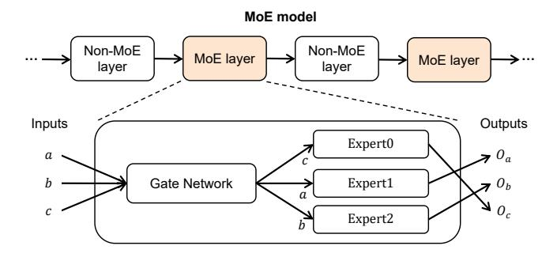
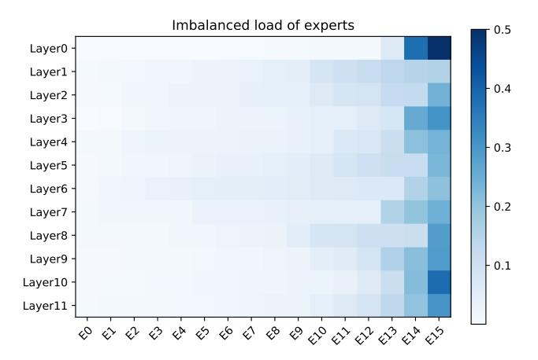
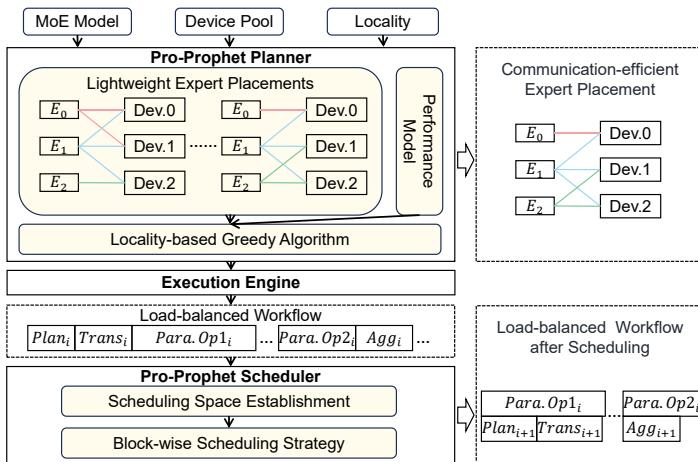

# I. INTRODUCTION

R ECENT years, large-scale deep neural networks have achieved superior performance in various domains(e.g., NLP, CV). Previous works have shown that the model capacity is improved with the increased model size, further promoting

The first two authors contributed equally to this work.

Wei Wang, Zhiquan Lai, Shengwei Li, Weijie Liu, Keshi Ge, Ao Shen, Huayou Su and Dongsheng Li are with the National Key Laboratory of Parallel and Distributed Computing, College of Computer, National University of Defense Technology in Changsha, Hunan, China. (Corresponding author: Dongsheng Li)

E-mail: {wwking, zqlai, swli, liuweijie, gekeshi, shenao, shyou, dsli}@nudt.edu.cn

This work is supported by the National Key R&D Program of China (No. 2022YFB4501400) and the National Natural Science Foundation of China under Grant No. 62025208 and 62421002.

the model scaling. However, the substantial computational demand of extra-large models makes the training process excessively time-consuming. As one of the most promising solutions, Mixture of Expert (MoE) enables a nearly constant computational budget as model scaling. Generally, we replace some layers of a foundation model with MoE ones to generate a MoE model. Each MoE layer contains a gate network and a range of sub-modules named *experts*. The gate network can route each input to top-k experts that excel in processing the input. As the k is a super-parameter, the MoE model can be scaled with consistent computational requirements by increasing the number of experts.

1

As the model further scales, the effective collaboration of devices is necessary for extra-large MoE model training. Unfortunately, it is inefficient to train the model with traditional parallelism such as Data Parallelism (DP), Model Parallelism (MP), and Pipeline Parallelism (PP). To overcome the trouble, Gshard [\[1\]](#page-11-0) introduced a specific parallel strategy named *Expert Parallelism* (EP). Nowadays, extra-large MoE models trained with EP have demonstrated the highest accuracy in multiple tasks [\[2\]](#page-11-1), [\[3\]](#page-11-2).

However, training MoE models using EP presents a dynamic load imbalance among devices. For each MoE layer, EP equally divides experts into devices before training and dynamically arranges its inputs according to the gate network during training. Most inputs are transferred to and processed by a few devices, resulting in prolonged communication and computation of inputs. Furthermore, the imbalance varies throughout the training process, making it difficult to resolve.

Numerous attempts in load-balancing have been proposed to improve training throughput. Algorithmic works often restrict the upper bound of each expert's load [\[4\]](#page-11-3), [\[5\]](#page-11-4) or add auxiliary losses to the loss function [\[6\]](#page-11-5), [\[7\]](#page-11-6) for a more balanced load. However, they impact the model convergence and even deteriorate the model quality. Considering the drawback above, systematic solutions of the MoE system draw more attention. Popular systematic works [\[8\]](#page-11-7), [\[9\]](#page-12-0) dynamically readjust the expert placement according to the load, achieving a balanced load without harming the model quality.

However, these systematic solutions struggle to enhance training efficiency effectively due to two drawbacks. 1) Heavy communications of model states (i.e., parameters, gradients and optimizer states [\[10\]](#page-12-1)) are introduced. The previous expert placements introduce a global transfer of parameters and gradients or a whole model states communication. These transferring strategies involve unnecessary communications across devices, hindering the improvement of training efficiency. 2) Devices experience significant communication and computation idle during training. Due to data dependencies among operators, the solutions have to perform some communications and computations sequentially. For example, only the experts have been selected and their model states have been transmitted, their computations of inputs can be launched. And then, the aggregation of gradients occurs only after the computation of gradients is finished. They neglect the potential of communication and computation overlapping, thus significantly influencing device utilization.

In this paper, we propose a systematic load-balancing solution, Pro-Prophet, which overcomes two drawbacks by a planner and scheduler respectively.

To adapt dynamic features presented in the training of a MoE model, we profile the *input distribution* (i.e., the number of inputs processed by each expert) for each MoE layer. We observe that distributions of a MoE layer between adjacent iterations present high similarity. This *locality* is the key to effective load balancing.

To reduce the communication volume, Pro-Prophet planner introduces a series of *lightweight expert placements*. In a lightweight expert placement, each expert is independently allocated to a subset of devices. Communication of parameters and gradients for the expert occurs in these specific devices. Serve to evaluate expert placements, the planner proposes a *performance model* that estimates the execution time of a MoE layer employing a lightweight expert placement. However, it is non-trivial to find the optimal one due to the combinatorial explosion of the number of expert placements. To tackle this, the planner designs a *locality-based greedy algorithm*. The algorithm employs a greedy strategy to search for a communication-efficient expert placement. Besides, its launching frequency is reduced based on the locality, further improving the training throughput.

To exploit the potential of communication-computation overlapping, Pro-Prophet scheduler comprehensively schedules operations based on the locality and the feature of operations. The locality means that we can estimate the input distribution of the upcoming iteration according to the current one. Once the upcoming distribution is obtained, we can promptly determine a communication-efficient expert placement for the upcoming iteration and can transmit the parameters of experts in advance, which provides the opportunity to overlap communications and computations within adjacent iterations. Besides, the gradient aggregation can be scheduled backward for better overlapping. Based on these, the scheduler identifies a scheduling space and designs a *block-wise scheduling strategy* to comprehensively overlap communications and computations.

We implement Pro-Prophet on top of PyTorch and conduct extensive experiments on four different clusters of up to 32 devices with five variant models. The results demonstrate that Pro-Prophet achieves speedups of up to 2.66x compared to two popular MoE frameworks. Additionally, Pro-Prophet has demonstrated load-balancing enhancements of up to 11.01x compared to a representative load-balancing work, FasterMoE.

Our main contributions are summarized as follows:

- We profile input distributions among adjacent iterations and identify a locality that guides the design of Pro-Prophet.
- We design a Pro-Prophet planner that identifies several lightweight expert placements, abstracts a performance model and designs a locality-based greedy algorithm to reduce the heavy communication of model states.
- We propose a Pro-Prophet scheduler, which generates a scheduling space and establishes a block-wise scheduling strategy based on the locality and the feature of operations for comprehensive overlapping of computations and communications.
- We conduct comprehensive experiments for Pro-Prophet on different clusters and models. The results demonstrate that Pro-Prophet achieved up to 1.50x end-to-end speedup and 11.01x load-balancing enhancements with the representative load-balancing method.

## II. BACKGROUND AND MOTIVATION

## *A. Background*

Recent works in DNN model training have shown that the model capacity can be improved with increasing training data, model scale, and computational budget [\[11\]](#page-12-2). Extraordinary performance has been achieved in several deep learning domains including natural language processing (NLP), computer vision (CV), and so on.

However, significant training overhead comes along with the superior model capacity. The extra large-scale model [\[12\]](#page-12-3)– [\[17\]](#page-12-4) training often takes months on thousands of dedicated accelerators (e.g., MT-NLG [\[18\]](#page-12-5) spends three months to train on over two thousand A100 GPUs), which influences the development of deep learning.

In recent years, dynamic sparse-activated architectures have been proposed to solve the trouble. One of the popular approaches is the Mixture of Experts (MoE), which can significantly improve the model capacity while maintaining a consistent computational budget. Nowadays, MoE has been successfully applied to large language models [\[19\]](#page-12-6)–[\[25\]](#page-12-7). Excellent MoE models that appeared in industry and academia greatly draw researchers' attention. For example, Google has trained a series of MoE models called Glam [\[2\]](#page-11-1). The largest Glam model is seven times larger than GPT-3, but the training cost is less than 1/3 of it. Experiments show that these models achieve higher accuracy than GPT-3 in 29 zero, single, and small sample learning tasks, representing the superiority of MoE models. The other example is GPT-4 [\[26\]](#page-12-8). The technical report of OpenAI indicates that the GPT-4 is a MoE model, which achieved the highest performance in various downstream tasks. Besides, the ChatGPT based on the GPT-4 has caused a tremendous sensation.

Fig. [1](#page-2-0) illustrates the architecture of a MoE model and a MoE layer. The MoE model comprises a stack of non-MoE and MoE layers. A MoE layer consists of two components: 1) a series of experts (3 experts in the figure), where each excels in a specific domain. 2) a gate network, which routes each input to a few experts that are skilled in dealing with this input, rather than all experts. In a MoE layer, for each input, the gate

Fig. 1. The structure of a MoE model and MoE layer. The MoE model consists of both MoE and non-MoE layers stacked on top of each other. The MoE layer consists of a series of experts and a gate network for routing input to experts. For each input, the gate network computes the relationship between the input with three experts and allocates it to the top-1 expert for computation.

Fig. 2. A workflow of Expert Parallelism (EP) in a MoE layer. Following the gate network, batched inputs are first exchanged via an All-to-All (A2A) operation. After the expert computation on all devices, a second A2A operation is used to pass the expert's outputs back to the device where corresponding inputs were originally located.

network computes the relationship between that input and all the experts. Then it routes the input to top-k (k=1 in the figure) expert(s) for computation. Even as we increase the number of experts (the model size is increased), each input is still routed to a fixed number (k) of experts, and the negligible increased computational budget of the gate network, thereby enabling the scaling of the model with nearly constant computational overhead.

With the increase of the model scale, an isolated device cannot support the training of the MoE model thus various parallelisms have been proposed. Two common parallel approaches are DP and MP. DP equally divides inputs of an iteration across all devices and replicates the model into all devices. In forward propagation (FP), each device computes its local inputs independently by utilizing its model replicas. In the backward propagation (BP), the Allreduce primitive will be performed after the backward computation. Different from DP, MP partitions the model into devices in a specific manner and each device contains a complete copy of the data. The aggregation primitive will be launched whenever required in FP and BP.

For efficient training of a MoE model, Google combines DP and MP into an EP. From the input side, EP adopts the same input partitioning paradigm as DP. From the model side, EP divides the same number of experts to each device and copies other parts of the model (i.e., the gate network and non-MoE

Fig. 3. The imbalanced load of experts in an iteration. The model contains 12 MoE layers and each MoE layer contains 16 experts. The vertical axis indicates layer indexes, and the horizontal axis denotes the index of experts. The depth of color represents the proportion of total inputs that an expert handles. Three of the heaviest experts are responsible for over 50% inputs while the three least experts only compute less than 5%.

layer) to all devices.

Fig. 2 illustrates a workflow of EP in a MoE layer. Firstly, the gate network determines top-1 expert for each input. Then inputs are transferred to corresponding devices via an All-to-All (A2A) communication operation [27]–[29]. Subsequently, each device performs the expert computation for collected inputs and then launches another A2A to reorganize the results back to the inputs' original devices for computations of the subsequent non-MoE layer. Nowadays, many popular distributed frameworks support the training of large-scale MoE models using EP [4], [30]–[33].

Even though EP makes it feasible to train extra-large MoE models with up to trillions of parameters, a dynamic load imbalance occurs among devices. Specifically, most of the training inputs are transferred and processed by a few devices. These heavy-load devices vary as the training. Fig. 3 presents the imbalanced load of experts in an iteration. The vertical axis indicates layer indexes, and the horizontal axis denotes the index of experts. The MoE model contains 12 MoE layers and each MoE layer contains 16 experts. Each expert is set into a dedicated device. The depth of color represents the proportion of total inputs processed by an expert. In most MoE layers, the three heaviest experts hold over 50% of inputs, while the three least less than 5%. The unbalanced load of experts means that devices containing light-load experts have to wait for devices containing heavy-load ones, incurring significant under-utilization of devices during training.

#### B. Motivation

A series of methods have been proposed to balance the load. We divide them into algorithmic and systematic methods. From the algorithmic side, researchers constrain the upper bound of inputs received by an expert or add auxiliary losses to the loss function. They change the inputs-to-experts mapping, thus affecting and even deteriorating the model convergence.

Different from algorithmic works, systematic solutions do not affect model convergence and fit into the hardware, thus

Fig. 4. The locality of input distributions. The discrepancies between the different colored curves represent the number of inputs received by each of the different experts. It shows that distributions of adjacent iterations remain relatively constant.

attracting extensive attention. These solutions adaptively adjust experts-to-devices mapping based on the device load during training, effectively improving the training efficiency. However, their heavy load-balancing overhead hinders the further improvement of the efficiency.

TABLE I
TIME BREAKDOWN OF TRAINING. L.B. IS SHORT FOR LOAD BALANCING

| Model      | L.B.  | Search | Place | Reduce | Others |
|------------|-------|--------|-------|--------|--------|
| MoE-GPT-S  | 29.9% | 6.8%   | 11.6% | 11.5%  | 70.1%  |
| MoE-GPT-M  | 29.2% | 3.2%   | 12.5% | 12.5%  | 70.8%  |
| MoE-GPT-L  | 34.5% | 2.6%   | 14.2% | 17.7%  | 64.5%  |
| MoE-GPT-DS | 33.8% | 6.1%   | 13.8% | 13.9%  | 66.2%  |
| MoE-GPT-DM | 37.1% | 6.1%   | 16.1% | 14.9%  | 62.9%  |

As shown in Table I, previous solutions introduce a *Search*, *Place* and *Reduce* processes to balance the load. However, the overhead of load-balancing is up to 37.1%. There are two reasons behind this huge cost. Firstly, they do heavy communication of model states. They have to transfer the parameters and gradients of heavy-load experts among all devices or transmit the whole model states of experts. Secondly, they cannot sufficiently overlap the communication and computations during the training of a MoE model. Due to the data dependency, they have to do communication and computation sequentially.

Locality. Fortunately, we have discovered a property in the training of MoE models. This property makes it possible to address these challenges efficiently. Fig. 4 depicts input distributions in the second MoE layer of a MoE model. The areas with different colors represent inputs received by different experts. It is worth noting that the distribution in other MoE layers follows a similar pattern. As shown in the figure, the slight fluctuation of the distribution occurs across adjacent iterations, which indicates that the load of each expert remains relatively stable in adjacent iterations. This phenomenon suggests that the distribution exhibits a locality among iterations.

#### III. OVERVIEW OF PRO-PROPHET

Motivated by Section II, we propose a systematical loadbalancing approach, Pro-Prophet, which can efficiently balance

Fig. 5. The overview of Pro-Prophet. Pro-Prophet is composed of Pro-Prophet planner and Pro-Prophet scheduler. MoE model, locality, and device pool are three inputs of it. Firstly, Pro-Prophet planner searches for a communication-efficient expert placement using its locality-based greedy algorithm. The algorithm iteratively generates and evaluates a lightweight expert placement utilizing its performance model until the load is balanced. Then the execution engine produces a load-balancing workflow based on the planner. Finally, Pro-Prophet scheduler schedules three data-dependent operations to parallel operations for communication and computation overlapping, further improving the training throughput.

the load of devices. The overview of Pro-Prophet is presented in Fig. 5. Pro-Prophet is composed of a planner and a scheduler. MoE model, locality, and device pool are three inputs of it. The device pool defines the topology of devices. The utilization of the locality is the key advantage of Pro-Prophet.

Firstly, Pro-Prophet planner searches for a communicationefficient expert placement from a series of lightweight expert placements using its locality-based greedy algorithm. The algorithm iteratively generates and evaluates a lightweight expert placement utilizing a performance model until the load is balanced.

Then, the execution engine analyzes the procedures of the planner and produces a load-balanced workflow for load balancing.

Finally, after analyzing the workflow, Pro-Prophet scheduler establishes the scheduling space and schedules data-dependent operations (i.e., Plan, Trans, and Agg) to parallel operations (i.e., Para.Op1 and Para.Op2) for communication and computation overlapping. The meaning of operations are presented in Sec IV.

#### IV. PRO-PROPHET PLANNER

## A. Lightweight Expert Placement

The design of the expert placement is crucial for efficient load balancing. For less communication of model states transferring, the planner introduces a series of lightweight expert placements.

In a lightweight expert placement, each expert is mapped to one or more devices independently. Only the parameters and gradients rather than all model states are transferred among its devices. We use Trans and Agg primitives to describe these two communications respectively. In the forward pass, a

#### (a) Traditional expert placement.

