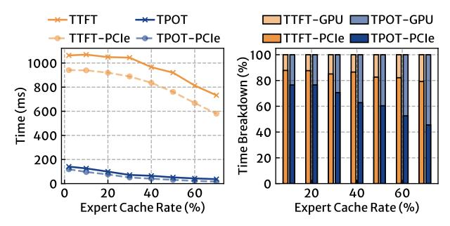
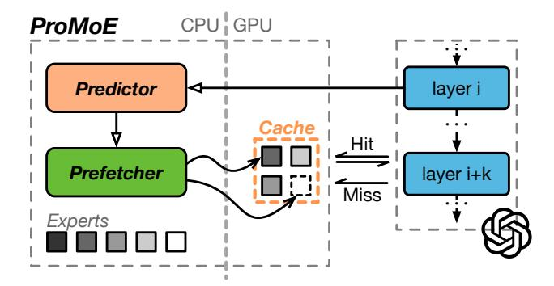

# 2 Background

### 2.1 Mixture-of-Experts (MoE) based LLMs

Large Language Models (LLMs) perform inference in two stages: prefill and decode, as illustrated in Figure 2(a). During the prefill stage, the model processes the user's input prompt in a single iteration. The tokens within the prompt are processed in parallel by the model, and the first token of the response is generated at the end of this iteration. In the decode stage, each iteration processes only one token generated from the previous iteration, producing the next token. These tokens are fed into the model sequentially and ultimately concatenated to form the complete response. Due to the differing computational scales between the two stages of LLM inference, their performance is typically measured separately. The performance of the prefill stage is usually quantified by the Time to First Token (TTFT), which represents the duration users wait for the LLM to process the prompt before it starts generating output. For the decode stage, performance is commonly measured using either Tokens Per Second (TPS) or Time Per Output Token (TPOT).

Large Language Models (LLMs) consist of a series of transformer layers. Each layer contains a self-attention block (self-attn) and a feed-forward network (FFN), as shown in Figure 2(b). These components process the input hidden states, add the results back to the inputs, and pass them to the next layer. Due to layer normalization, the outputs are numerically smaller than their inputs, leading to a slow change in hidden states across layers [33, 36]. Typically, the cosine similarity between hidden states of adjacent layers averages around 90%.

The Mixture-of-Experts (MoE) architecture enhances LLMs by expanding the FFN into multiple experts, as depicted in Figure 2(c). This approach increases the model's parameters while reducing overall computation, since only a subset of experts is activated during each forward pass. Specifically, each MoE block consists of a gate function and multiple experts. The gate function prioritizes which experts should process the current token. Each expert is structurally similar to the original FFN but contains fewer parameters. The output of the MoE block is a weighted average of the outputs from all activated experts.

In MoE-based LLMs, expert selection occurs independently for each token, as shown in Table 1. When processing multiple tokens

Figure 3: The (a) latency and (b) time breakdown of LRU caching under different cache rates in transformers with DS-1 model.

Figure 4: The (a) latency and (b) time breakdown of LRU caching under different cache rates in llama.cpp with QW-2 model.

simultaneously (e.g., when processing prompts or batching multiple requests), a larger portion of experts is activated, ranging from over 50% to nearly 100%, depending on the number of tokens.

#### 2.2 Caching MoE-based LLMs

In MoE-based LLMs, each token utilizes only a subset of experts. Most experts can be offloaded to CPU memory, with only the necessary experts loaded into GPU memory. This allows MoE-based LLMs to run on consumer-grade hardware with limited GPU memory. However, due to the limited PCIe bandwidth, directly offloading parameters to CPU memory can lead to high latency and low GPU utilization. For instance, when running the DS-1 model with 50% of experts offloaded to CPU memory, the TPOT is 67.9 ms, while fetching experts from host memory takes 58.1 ms, accounting for 85.6% of the total time. Each output token requires 2.67 GiB of expert parameters in FP16 precision, with 1.33 GiB needing to be transferred from CPU memory to GPU memory due to offloading. The achieved bandwidth is 23 GB/s, which matches the achievable bandwidth (23.9 GB/s in our bandwidth test) from host to GPU using PCIe 4.0x8.

To mitigate the performance issues caused by offloading, a traditional method is to cache frequently accessed experts in GPU memory. A common approach is to use LRU (Least Recently Used) or static caching to store these frequently accessed experts. For example, Mixtral-offloading [18] implements an LRU cache for the Mixtral model. Another example is CUDA's Unified Memory (UM), which leverages a paging mechanism to transfer data between the GPU and CPU on demand.

Figure 5: The (a) CDF of expert access frequency and (b) hit rate of LRU caching. The upper figures show results of traditional encoder-decoder models (switch-transformer [19], NLLB [13]), while the lower figures show results of modern decoder-only models listed in Table 1.

The major challenge of caching in MoE is its **reactive** nature when handling cache misses. When the inference process encounters an expert that is missing from GPU memory, the computation is blocked until the expert is fetched from host memory, resulting in high latency overhead in the critical path of inference.

We evaluated the performance of LRU caching in transformers [45] with the DS-1 (fp16) model, along with llama.cpp [22] using the QW-2 (int4) model. Figure 3 and 4 illustrate the inference latency and the time breakdown for both the prefill and decode stages. In the case of the DS-1 model, caching 50% of experts results in a blocking time of 60.4% on the critical path during the decode stage. The blocking time during the prefill stage is more severe, as more experts are accessed, leading to an 82.7% blocking time on the critical path. For llama.cpp, which achieves faster inference by eliminating the overhead of the Python interpreter, the proportion of blocking time is even greater. Caching 50% of experts results in 94.2% blocking time during the prefill stage and 79.0% during the decode stage.

Another factor that exacerbates the impact of blocking time on the critical path is the access frequencies of different experts in MoE-based LLMs, particularly modern decoder-only LLMs, which tend to be less skewed. Figure 5 shows the cumulative access frequency of experts and the hit rate of LRU caching. Traditional encoder-decoder MoE models like switch-transformer [19] (SWI) and NLLB [13] released in 2022 exhibit a power-law distribution in expert access frequencies, where a small number of experts are accessed more frequently than others. This high skewness leads to high hit rates and benefits both static and dynamic caching like LRU. In contrast, modern decoder-only MoE models exhibit a more uniform access pattern, as shown in the bottom of Figure 5. This

Figure 6: The architecture of ProMoE.

low skewness creates unique challenges for offloading and caching in modern MoE models.

This uniform access pattern can be attributed to the deliberate design of modern MoE models, which utilize various techniques during training to prevent any single expert from becoming a hotspot. This is crucial because uneven expert utilization can lead to inadequate training of certain experts, ultimately impacting the model's performance. This phenomenon is referred to as "routing collapse" [\[39\]](#page-13-7). To mitigate routing collapse, contemporary MoE models incorporate strategies such as Device-Limited Routing [\[17\]](#page-12-4) and Expert-Level Balance Loss [\[15\]](#page-12-3) during the training process. Consequently, the access frequencies of different experts tend to be more uniform during inference. Combined with the reactive handling of cache misses, the caching solution significantly degrades the critical path latency.

