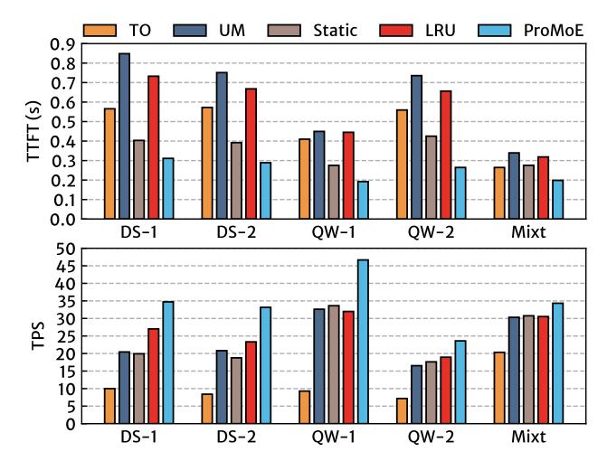
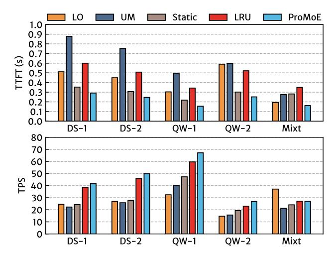

# 6.2 System Integration

We have integrated ProMoE into two popular LLM frameworks: transformers and llama.cpp. To achieve this integration, we added hooks to capture input logits from the MoE layers and to reorder experts. We also implemented a dependency mechanism to ensure efficient prefetching and computation. Furthermore, ProMoE takes over the memory management for expert parameters. We did not integrate ProMoE with frameworks like vLLM and TGI due to their inadequate support for quantized MoE at the time of submission. Moreover, these frameworks primarily focus on batched inference for data centers and fuse the execution of multiple experts to enhance GPU utilization. However, this optimization assumes that all experts are ready before computation can begin, which is atypical on memory-constrained GPU platforms that ProMoE targets. It necessitates additional GPU memory for activated experts and hampers the overlap between expert loading and execution.

### 6.3 Training of Predictor

Each layer's predictor in ProMoE is implemented as a two-layer multi-layer perceptron (MLP) with approximately 2 million parameters. The training of the learned predictor and the data collection for training takes less than 1–2 hours on a single GPU. This is a one-time offline task that can be parallelized across multiple GPUs. Given the extensive pre-training times of large language models (LLMs), we consider this time commitment acceptable.

#### 7 Evaluation

### 7.1 Experimental Setup

Hardware. The evaluation is conducted on a PC equipped with an NVIDIA RTX 4090 GPU (24 GB GDDR6X). The PC also features an Intel i9-14900K CPU and 128 GB of host DRAM. The GPU is connected to the CPU via PCIe 4.0, providing a unidirectional bandwidth of 32 GB/s. To simulate GPUs with varying memory capacities, we include an evaluation in §7.4 that adjusts the cache ratio to control memory occupancy.

Workload. We evaluated a broad range of MoE-based LLMs, as listed in Table 1. By default, we evaluate DS-1, DS-2, and QW-1 using FP16 precision, while QW-2 and Mixt are evaluated using INT4 precision. To further study the impact of model size, we also include an evaluation in §7.6 that varies the parameter size of the same model from FP16 to INT4. The evaluation utilizes the shareGPT dataset [3], which consists of user interactions with ChatGPT and serves as a representative example of real LLM services. We also conducted evaluations using the Alpaca dataset [43] and observed similar performance trends; results for this dataset are omitted due to space limitations. By default, we set the batch size to 1 to reflect edge deployment scenarios, and we include an evaluation in §7.5 that varies the batch size from 1 to 4.

**Baselines**. Our evaluation relies on two well-known codebases: Hugging Face transformers [23, 45] and llama.cpp [22]. Transformers supports a wide range of models and is easy to deploy, but it lacks optimal inference performance. We enhanced the efficiency of the MoE block by reducing CPU-GPU synchronization. Llama.cpp, which is written in C++, delivers state-of-the-art inference performance by eliminating overhead from the Python interpreter.

Both systems offer offloading baselines: transformers offloads only the parameters to the CPU (referred to as **TO**), while llama.cpp offloads both parameters and computations (referred to as **LO**). We improved TO by incorporating pinned memory and asynchronous copies. Additionally, we integrated PROMOE into both codebases and introduced three baselines: Unified Memory (**UM**), **static** cache, and **LRU** cache. These baselines, along with PROMOE, manage only expert parameters, while non-expert parameters consistently reside on the GPU. The UM baseline is optimized using cudaMemAdvise to enable instantaneous page invalidation without incurring the cost of swapping pages back to CPU memory. The static baseline caches a fixed set of experts and utilizes two additional expert buffers to load any missing experts.

**Metrics** We evaluate the performance of ProMoE and its baselines in the prefill and decode stages separately. The prefill stage performance is assessed by TTFT (Time To First Token), which reflects the latency in processing the user's prompt. The decode stage performance is measured using TPS (Tokens Per Second) and TPOT (Time Per Output Token), indicating the throughput and latency of the decoding process. We primarily report TPS as it is more intuitive and switch to TPOT for detailed breakdown analyses. The total latency for a single request can be expressed as  $Latency_{total} = TTFT + N \times TPOT$  (where N is output length). We measure the prefill and decode stages separately for two main reasons: (1) the significant variance in output lengths (ranging from tens to thousands of tokens) renders aggregated metrics unreliable

Figure 10: The overall performance of (a) prefill and (b) decode stage in transformers codebase.

for system comparisons, and (2) the prefill and decode stages exhibit distinct computational patterns (e.g. more experts are activated in the prefill stage).

#### 7.2 Overall Performance

Figure 10 shows the overall performance of the prefill and decode stages within the transformers codebase. In the prefill stage, Pro-MoE outperforms static and LRU baselines by an average of 1.42× (up to 1.61×) and 2.21× (up to 2.48×), respectively. The improvement of ProMoE primarily stem from its prefetching technique, which maximizes the overlap between loading parameters and computation. When comparing ProMoE with LRU, the greater improvement is attributed to the cache thrashing caused by LRU (see §5.3). In the prefill stage, nearly all experts are accessed since each token usually requires a different set of experts. As experts are accessed according to their IDs, LRU evicts a cached expert with a higher ID when it accesses a missing expert with a smaller ID first. The static cache avoids thrashing by fixing its cache set, while ProMoE intelligently reorders experts to minimize thrashing and reduce the blocking time caused by missing experts on the critical path.

In the decode stage, ProMoE outperforms the static and LRU baselines by an average of  $1.47\times$  (up to  $1.77\times$ ) and  $1.31\times$  (up to  $1.46\times$ ), respectively. LRU outperforms the static cache during the decode stage because cache thrashing occurs less frequently, and there is some reuse of experts across iterations. ProMoE excels over these baselines by keeping most copies of missing experts off the critical path through effective prefetching.

The TO (resp. UM) baseline consistently perform worse than the static (resp. LRU) baseline. Comparing to these baselines, ProMoE achieves a average speedup of 2.15× (up to 2.78×) in the prefill stage and 2.47× (up to 5.02×) in the decode stage. This performance gap arises because the static and LRU baselines can be seen as improved implementations of static and dynamic cache, respectively. In static cache, the TO baseline offloads non-expert parameters to the CPU, while the static baseline only offloads parameters of the experts. In dynamic cache, the UM baseline fetches parameters at the page level, which increases the volume of transferred data compared to

Figure 11: The overall performance of (a) prefill and (b) decode stage in llama.cpp codebase.

the LRU baseline. Therefore, in subsequent experiments, we mainly focus on comparing the static, LRU, and ProMoE.

Figure 11 shows the overall performance in the llama.cpp codebase. ProMoE surpasses the static and LRU baselines by an average of 1.36× (up to 1.75×) and 2.12× (up to 2.22×) in the prefill stage, and by 1.49× (up to 1.79×) and 1.09× (up to 1.17×) in the decode stage, respectively. The improvement in the llama.cpp codebase follows the same trend observed in transformers. However, it is less pronounced due to the removal of the Python interpreter overhead during inference, which provides fewer opportunities for ProMoE to prefetch experts.

As expected, the UM baseline consistently performs worse than the LRU baseline. The LO baseline in llama.cpp offloads both parameters and computations to the CPU, resulting in slower performance than that of the static baseline. Compared to these baselines, PROMOE achieves an average speedup of 2.25× (up to 3.21×) in the prefill stage and 1.66× (up to 2.07×) in the decode stage. However, when evaluating the Mixt model, the LO baseline is significantly faster and even surpasses PROMOE in the decode stage. This is because the Mixt model activates a larger ratio of experts (25%) for each token, increasing the cost of fetching parameters to the GPU compared with directly computing them on the CPU. We believe this does not undermine the significance of our work, as most recently released MoE-based LLMs typically activate a smaller ratio of experts (averaging 10%), and the TO baseline continues to show inferior performance across most cases.

