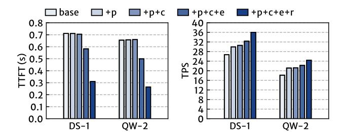
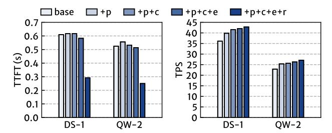
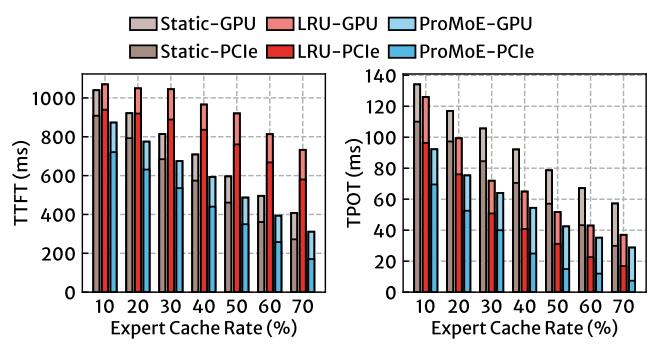
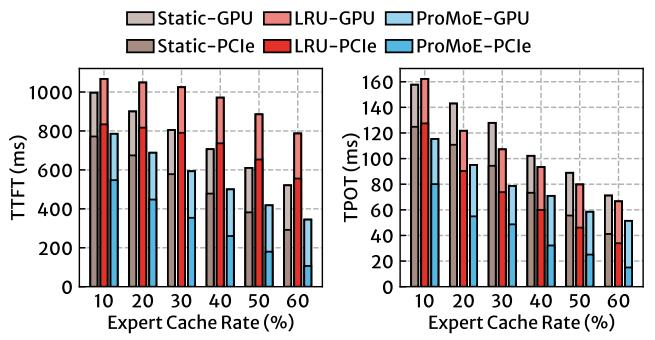

# 7.3 Ablation Study

Figure 12 shows the performance of transformers with different optimizations enabled in ProMoE, starting from the LRU baseline. During the prefill stage, enabling prefetching shows minimal improvement and may even degrade performance. This is because nearly all experts are accessed, and prefetching alone merely replaces the cache set. Additionally, naive prefetching delays the handling of missing experts. The techniques of early preemption and reordered inference provide significant improvements, yielding speedups of  $1.27\times$  and  $2.39\times$  compared to the baseline, respectively.

Figure 12: The ablation study of (a) prefill and (b) decode stage in transformers codebase with different optimizations in PROMOE enabled. Base represents the LRU baseline, with prefetch, chunked-prefetch, early-preemption and reordered-inference applied.

Figure 13: The ablation study in llama.cpp codebase, following the same setup and naming convention as Figure 12.

In the decode stage, these techniques gradually enhance performance, resulting in a 1.35× increase over the baseline. Figure 13 presents an ablation study for the llama.cpp. The trends is similar to those observed in the transformers, except that in the prefill stage, most of the improvement is attributed to the reordered inference.

#### 7.4 Impact of Cache Rate

To examine the impact of GPU memory capacity on PROMoE's performance, we varied the cache rate to control the memory occupied by the expert cache. Figure 14 and 15 show the performance of prefill and decode stages of systems in the transformers codebase, with DS-1 and QW-2 models using different cache rates. During the prefill stage, LRU performs the worst due to cache thrashing, while PROMoE outperforms LRU on the DS-1 and QW-2 models by 1.72× (up to 2.36×) and 1.82× (up to 2.28×) on average, respectively. Compared to static caching, ProMoE achieves speedups of 1.22× and 1.39× on average in the prefill stages of these two models, respectively. The enhancement in the QW-2 model is more pronounced due to its increased computation during inference, allowing more opportunities for ProMoE to prefetch experts. Figure 15 also shows the breakdown of time spent loading parameters on the critical path. PROMOE reduces the loading time on the critical path from 69.68% to 30.96% in the QW-2 model as the cache rate increases, whereas the static cache still suffers from a reduction of only 77.44% to 56.04%. In the decode stage, PROMOE outperforms both static and LRU baselines by 1.60× and 1.29× on average, respectively. PROMoE decreases the loading time on the critical path to 25.61% and 29.20% for the DS-1 and QW-2 models, while LRU (the fast baseline) continues to endure loading times on the critical path of 45.52% and 50.89%, respectively.

We conducted similar experiments on the llama.cpp codebase, using layer-offloading (LO) included as a baseline. The results are

Figure 14: The (a) TTFT and (b) TPOT of systems in transformers codebase with DS-1 model using different cache rates.

Figure 15: The (a) TTFT and (b) TPOT of systems in transformers codebase with QW-2 model using different cache rates.

Figure 16: The (a) TTFT and (b) TPOT of systems in llama.cpp codebase with QW-2 model using different cache rates.

shown in Figure 16. In this case, the speedup of ProMoE over the fast baseline is reduced due to the faster inference speed of the llama.cpp codebase. ProMoE achieves performance improvements of 1.53× (resp. 1.14×) and 1.10× (resp. 1.27×) over LRU and static baselines on average during the prefill (resp. decode) stage, respectively. Notably, in the decode stage with a low cache rate, LO outperforms the other systems. Under low cache rates, the cache-based systems must fetch a significant number of experts through PCIe, while the limited computation makes offloading to the CPU more advantageous. As the cache rate increases, however, the cache-based systems quickly surpass LO.

