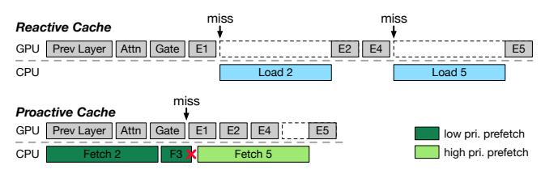

# PROMOE: Fast MoE-based LLM Serving using Proactive Caching

Xiaoniu Song1 Zihang Zhong3,\* Rong Chen1,‡ Haibo Chen1,2

1Institute of Parallel and Distributed Systems, Shanghai Jiao Tong University 2Key Laboratory of System Software (Chinese Academy of Sciences) 3Zhejiang University

#### Abstract

The promising applications of large language models are often limited by the constrained GPU memory capacity available on edge devices. Mixture-of-Experts (MoE) models help address this issue by activating only a subset of the model's parameters during computation. This approach allows the unused parameters to be offloaded to host memory, thereby reducing the overall GPU memory demand. However, existing cache-based offloading solutions handle cache misses reactively, which significantly impacts system performance. In this paper, we introduce ProMoE, a novel proactive caching system that utilizes intermediate results to predict subsequent expert usage. By proactively fetching experts in advance, PROMoE eliminates passive cache misses, removes loading time from the critical path, and reduces the performance overhead associated with offloading. Our evaluations demonstrate that PROMoE achieves an average speedup of  $2.20\times$  (up to  $3.21\times$ ) and  $2.07\times$  (up to  $5.02\times$ ) in the prefill and decode stages, respectively, compared to existing offloading solutions.

### 1 Introduction

Large language models (LLMs) have revolutionized various fields, including natural language processing, content generation, and decision support [10, 29, 38, 44, 52]. Traditionally, these models have been deployed in data centers equipped with high-end GPUs. However, there is growing interest in running LLMs on consumer-grade platforms to enhance privacy and speed [12, 41, 50]. Despite this growing interest, significant challenges remain due to memory limitations. LLMs typically require substantial memory (often hundreds of gigabytes) [29, 44, 52], which exceeds the capacities of consumergrade GPUs, generally limited to around a dozen gigabytes. This limitation leads to serious performance issues, ultimately hindering the efficiency and adoption of LLMs on personal computers.

Mixture-of-Experts (MoE) [15, 17, 27, 28, 49] offers an opportunity to address the GPU memory constraints faced by LLMs by dividing the model into multiple experts and activating only a few during inference. This approach allows most experts to be offloaded to host memory, loading only the necessary ones into GPU memory. While this significantly reduces GPU memory requirements, *expert offloading* also introduces severe performance degradation up to 8.9× [30] due to limited PCIe bandwidth between host and GPU memory (32GB/s unidirectional on PCIe 4.0).

Recently, researchers have proposed caching frequently accessed experts in GPU memory to minimize offloading costs [18]. However, this caching approach handles missing experts in a **reactive** manner. Specifically, a cache miss is triggered passively when an expert is

Figure 1: A comparison of execution flow between reactive and proactive caching.

accessed during inference, leaving the expensive loading on the critical path (see Figure 1). For instance, when caching 50% of the experts in the deepseek-moe [4] model, the time spent on loading missing experts accounts for over 60% of the total inference time. Additionally, the inherent low skewness and poor locality of expert access patterns in MoE models, especially in modern decoder-only architectures, significantly limit the potential improvements that can be achieved through better caching policies.

In this paper, we propose ProMoE, a novel system to address the performance challenges associated with offloading in MoE-based LLMs through **proactive** caching, as shown in Figure 1. By actively predicting which experts will be needed and prefetching their parameters into a cache in GPU memory, ProMoE can take the time required for fetching missing experts off the critical path. This allows for better overlap with computation, enhancing overall performance and GPU utilization.

To achieve effective proactive caching, PROMOE addresses two main questions. First, given the dynamic nature of MoE models, PROMOE requires a predictive approach for prefetching. To evaluate the quality of a prediction method, PROMOE introduces a metric called GoodPred. This metric considers both the accuracy and efficiency of the predictions. To achieve a high GoodPred score, PROMOE proposes a learned predictor that prefetches experts in a stride manner. This learned predictor identifies correlations between intermediate results and expert selections , allowing for accurate predictions of experts while the stride prefetching technique perfectly hides prediction latency, ensuring high efficiency of prefetching.

Second, the processes of prefetching and inference can interfere with each other, leading to low utilization of the GPU, cache, and bandwidth for prefetching. Therefore, PROMOE needs to carefully coordinate these two processes to minimize interference. We observed that the required experts for each layer can be identified all at once, which creates opportunities to optimize prefetching and inference for better overlap. Based on this insight, PROMOE proposes several techniques to coordinate the execution of prefetching and inference processes, including chunked prefetching, early preemption, and reordered inference. These techniques eliminate passive cache misses and maximize the overlap between prefetching

‡ Rong Chen is the corresponding author (rongchen@sjtu.edu.cn).

\* During internship at Shanghai Jiao Tong University.

Figure 2: (a) The execution flow of large language models (LLMs), (b) the architecture of a transformer layer in LLMs, and (c) the architecture of a Mixture-of-Experts (MoE) block that replaces FFN in a transformer layer.

Table 1: MoE-based LLMs description. P, L, and E denote parameters, layers, and experts, respectively. Act. indicates the number of activated parameters or experts during the inference of a single token.

| MoE-based LLM               | #P    |       | #L | #E per L |      |
|-----------------------------|-------|-------|----|----------|------|
|                             | Total | Act.  |    | Total    | Act. |
| Deepseek-moe (DS-1) [4]     | 16.4B | 2.8B  | 28 | 64       | 6    |
| Deepseek-v2-lite (DS-2) [5] | 15.7B | 2.7B  | 27 | 64       | 6    |
| Qwen1.5-moe (QW-1) [7]      | 14.3B | 2.7B  | 24 | 60       | 4    |
| Qwen2-moe (QW-2) [8]        | 57.4B | 14.2B | 28 | 64       | 8    |
| Mixtral-8x7B (Mixt) [1]     | 46.7B | 12.9B | 32 | 8        | 2    |

and inference, thereby reducing inference latency and improving utilization.

To demonstrate the effectiveness of ProMoE in serving MoE-based LLMs on consumer-grade hardware, we integrated ProMoE into two widely used LLM frameworks: transformers and llama.cpp. Compared to hand-crafted caching baselines with state-of-the-art performance, ProMoE achieves an average speedup of 1.78× (up to 2.48×) in the prefill stage and 1.34× (up to 1.79×) in the decode stage. When compared to existing offloading methods available in open-source LLM frameworks, ProMoE achieves an average speedup of 2.20× (up to 3.21×) and 2.07× (up to 5.02×) for these two stages. The source code of ProMoE is publicly available at https://github.com/promoe-opensource/promoe.

### **Contributions**. We make the following contributions.

- (1) A new metric called "GoodPred" that can holistically evaluate various predictors in expert prefetching (§4).
- (2) A novel learned predictor, coupled with a stride mechanism, that achieves high accuracy while hiding prediction latency (§4).
- (3) A sophisticated proactive cache that eliminates passive cache misses by coordinating prefetching and inference (§5).
- (4) An implementation integrated into mainstream LLM frameworks (§6), along with an evaluation showing the efficacy and efficiency of ProMoE compared to state-of-the-art solutions (§7).

