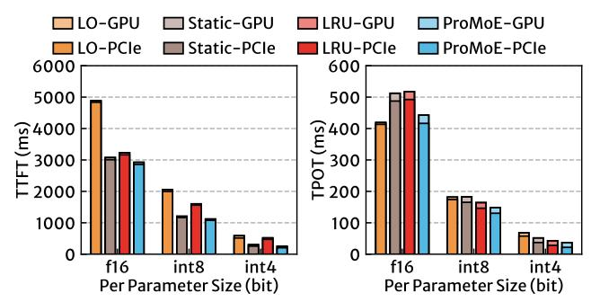
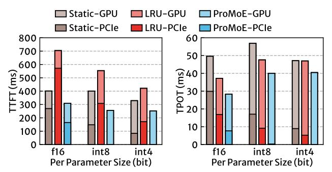

# 7.6 Impact of Model Size

To understand how model size affects PROMOE's performance, we varied the number of bits per weight (BPW) from 16 to 4 for the same model. The variance in BPW impacts the model's total memory footprint while keeping the amount of computation, measured in

Figure 23: The (a) TTFT and (b) TPOT of systems in llama.cpp codebase with QW-2 model using different bits per weight.

Figure 24: The (a) TTFT and (b) TPOT of systems in transformers codebase with DS-1 model using different bits per weight.

FLOPs (floating-point operations), constant. This variability can alter the relative speed of parameter loading and computation.

Figure 22 and 23 present the results for the DS-1 and QW-2 models within the llama.cpp codebase. In the DS-1 model, we maintained a fixed cache rate to keep a consistent ratio of parameters stored in the GPU. The GPU memory occupancy decreases with lower BPW values. As shown in Figure 22, the relative performance remains stable despite changes in BPW. PROMOE achieves an average speedup of  $2.05\times(1.21\times)$  and  $1.29\times(1.74\times)$  over LRU and static baselines during the prefill (decode) stage, respectively.

In the QW-2 model, we reduce the cache rate as BPW increases from the default 4-bit to 16-bit to ensure the model fits within our 24 GB GPU memory. The decreased cache rate and increased memory footprint per expert limit PROMOE's improvement. For example, at INT4, PROMOE outperforms LRU by 2.06× in the prefill stage while the speedup drops to 1.105× at FP16.

We also conducted similar experiments in the transformers codebase using the DS-1 model, as illustrated in Figure 24. The quantization was performed using the mainstream method GPTQ [21]. In this scenario, ProMoE effectively overlaps the prefetching of experts with computations as BPW decreases.

### 8 Related Work

Serving MoE-based LLMs with limited resources. Pre-gated MoE [26] modifies the computation flow of MoE models by providing gate results for the subsequent layer from the previous layer directly, allowing accurate layer-wise prefetching by determining the required experts in advance. SwapMoE [30] maintains a set of important experts in the GPU memory, using only these during

inference to prevent offloading overhead. In the background, it dynamically adjusts this set based on workload changes. However, these systems alter the original MoE model computation, inevitably affecting model accuracy. In contrast, ProMoE performs computations that are equivalent to the original model, accelerating the inference of MoE-based LLMs on edge devices without compromising accuracy.

Mixtral-offloading [18] implements an LRU cache for the Mixtral MoE model and introduces a skip-based prediction method to support expert prefetching. Brainstorm [14] designs a router abstraction to capture the dynamic aspects of models and proposes speculative loading and execution based on static skewness statistics. MoE-infinity [48] develops an Expert Activation Tracing mechanism for sequence-level prediction to facilitate prefetching, specifically designed for MoE-based encoder-decoder LLMs and aimed at throughput-oriented inference. In contrast, PROMOE utilizes a learned predictor with high GoodPred, focusing on latency-oriented inference for edge devices.

LLM serving on resource-constrained devices. Most modern frameworks [6, 22, 25, 32, 45] for serving LLMs provide basic offloading support that utilizes the CPU to handle parameters or computations, thereby reducing the GPU memory requirements. FlexGen [40] aggregates memory and computation resources from the GPU, CPU, and disk. It optimizes tensor storage and access patterns while also compressing weights and the attention cache. These frameworks mainly target general LLMs and emphasize throughput-oriented inference with large batch sizes. Model quantization [9, 21, 35] and pruning [20, 42] are techniques to reduce the memory requirements of LLMs. DejaVu [36] takes advantage of contextual sparsity in LLMs to lower inference costs with minimal impact on model quality. It employs a low-cost algorithm to predict input-dependent sparse subsets of attention heads and MLP parameters on-the-fly, which reduces the number of parameters needed during inference. Building on DejaVu, PowerInfer [41] utilizes the power-law distribution of neuron activations in LLMs, preloading frequently activated "hot" parameters onto the GPU while processing less active "cold" parameters on the CPU. Pro-MoE is orthogonal to these techniques and can be integrated with them to further minimize memory usage and enhance inference speed.

Generic LLM serving optimization. The rising demand for LLMs has prompted various system optimizations [2, 11, 16, 34, 37, 46] to improve their performance and efficiency. vLLM [32] introduces PagedAttention, which manages the key-value cache for LLM serving and allows for sharing the cache across requests. This improves batching efficiency and reduces memory fragmentation. Orca [51] proposes continuous and selective batching to optimize the performance of batched LLM serving. While these systems focus on enhancing batched LLM serving in the cloud environment, Pro-MoE is designed specifically for low-latency, single-request LLM inference on edge devices.

### 9 Conclusion

This paper presents ProMoE, a proactive caching system that enhances expert offloading for MoE-based LLMs. ProMoE leverages a learned predictor and carefully coordinates prefetching with inference. Our evaluation shows the efficacy and efficiency of ProMoE.

