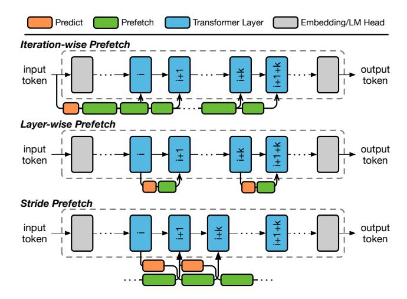
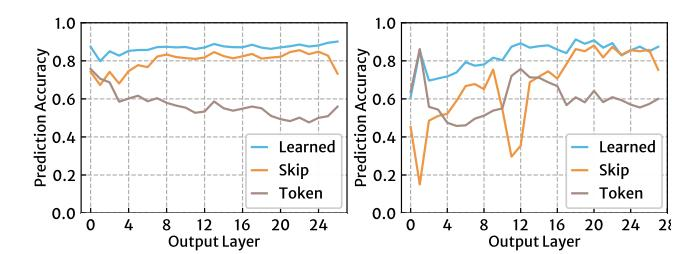

# 4 GoodPred, Prediction, and Prefetching

The dynamic nature of MoE models necessitates the deployment of a predictor in ProMoE to make approximate predictions of experts for prefetching. To ensure effective prefetching, the predictor must meet two primary requirements: accuracy and efficiency. In this section, we first define a key metric called GoodPred, which combines these two aspects to evaluate the performance of a predictor. Subsequently, we introduce ProMoE's learned predictor and explain how it improves both accuracy and efficiency.

### 4.1 A New Prediction Metric: GoodPred

A good predictor requires both high accuracy and efficiency. Higher accuracy increases the likelihood that predicted experts will be utilized, while higher efficiency allows more time to load these predicted experts. These two goals must be pursued simultaneously, though these two goals might initially seem contradictory improving accuracy often requires more prediction time, which can reduce the time available for prefetching.

To assess the performance of the predictor, we define the Good-Pred metric as follows:

## GoodPred = Accuracy × FetchRate

GoodPred evaluates the effectiveness of the predictor in predicting experts for prefetching by considering both Accuracy and FetchRate. The Accuracy denotes the proportion of correctly predicted experts, while the FetchRate signifies the portion of predicted experts that can be prefetched in time before they are accessed during LLM inference. Thus, GoodPred measures the volume of correct experts that can be prefetched in a timely manner.

### 4.2 Existing Approaches

Recent research has proposed two main methods for predicting expert usage. Previous studies [\[28,](#page-12-6) [47\]](#page-13-8) introduced a token-based predictor that predicts expert usage based on input tokens, allowing for an iteration-wise prefetch pattern, as illustrated in Figure [7\(](#page-4-0)a). These studies suggest that the selection of experts in one iteration is closely related to the input token ID. This relationship can be intuitively explained: LLMs convert the input token ID into an embedding vector through a fixed mapping, and the computation in each iteration gradually adds contextual information to these embeddings. Consequently, the input token ID can be utilized to

Figure 7: Candidate prefetch manners.

predict the selection of experts across all layers within that iteration. Specifically, in the offline stage, a trace of input token IDs and their selected experts is collected. Then, during online inference, the predictor determines which experts to select for one iteration by identifying the most frequently used experts from this trace based on the input token ID.

By predicting experts for all layers before an iteration begins, the token-based predictor achieves optimal FetchRate, maximizing available time for prefetching. However, this approach suffers from low Accuracy. The iteration-wise pattern conducts prediction over a long distance, leading to decreased accuracy. Moreover, the input token ID lacks contextual information concerning the entire sequence. As shown in Figure 8, the average accuracy of the token-based predictor is only 58.3%. Despite delivering a high FetchRate through iteration-wise prefetching, the low Accuracy renders nearly half of this prefetching ineffective, resulting in a low GoodPred.

Another recent system [18] proposed a **skip-based** predictor that facilitates a **layer-wise** prefetch manner, as illustrated in Figure 7(b). This approach leverages the high similarity between inputs across layers in LLMs [33, 36]. It establishes a skip connection that transmits the input from i-th layer's MoE gate directly to the MoE gate in i + 1-th layer, thereby predicting the experts for i + 1-th layer at the point of i-th layer. For instance, in the DS-2 model, the cosine similarity between the consecutive layers' inputs is 91.7%. Thus, passing the input of the i-th layer to the i + 1-th layer's gate is likely to yield accurate predictions.

However, the skip-based predictor's accuracy remains limited.It depends on the similarity of inputs across different layers and the numerical stability of the gate function, which does not uniformly apply across all models. In Figure 8, the skip-based predictor achieves high accuracy with noticeable accuracy drop in the head and tail layers for the DS-1 model. However, the QW-2 model experiences a significant accuracy decline with an average accuracy of only 66.9%. This discrepancy arises because the gate function in the QW-2 model is sensitive to input variations, causing shifts in priority for expert selection even with slight input changes. Additionally, the layer-wise prefetch pattern of the skip-based predictor incurs higher prediction overhead, thus limiting prefetch efficiency.

Figure 8: The prediction accuracy of each layer in (a) DS-1 model and (b) OW-2 model.

