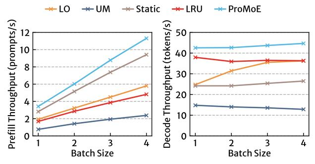
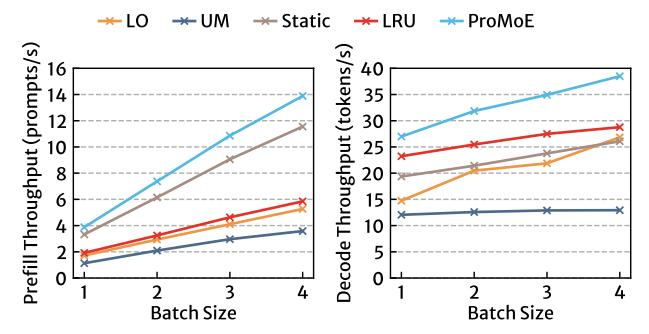
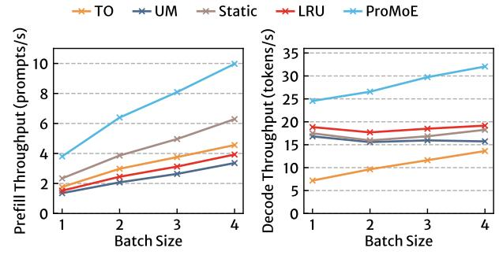
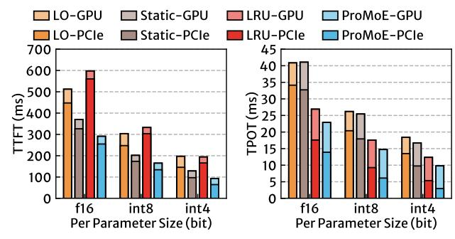

# 7.5 Impact of Batch Size

We also evaluated the impact of batch size on the performance of ProMoE. Figure 17 and 18 show the throughput of systems in

Figure 17: The (a) prefill and (b) decode throughput of systems in llama.cpp codebase with DS-1 model as the batch size changes.

Figure 18: The (a) prefill and (b) decode throughput of systems in llama.cpp codebase with QW-2 model as the batch size changes.

Figure 19: The (a) TTFT and (b) TPOT of systems in llama.cpp codebase with QW-2 model as the batch size changes.

the llama.cpp codebase with DS-1 and QW-2 models as the batch size varies. During the prefill stage, throughput increases linearly with the batch size. This linear growth occurs because the time is primarily dominated by loading all experts, and the increased computation associated with a larger batch size is almost "free". This is supported by Figure 19(a), which shows the time breakdown of the prefill stage for the QW-2 model. As the batch size increases, the latency for one iteration in the prefill stage remains relatively stable. On average, PROMOE outperforms LRU and static baselines by 2.19× and 1.19×, respectively, in the prefill stage.

In the decode stage, the number of experts activated grows almost linearly with the batch size. This rapid increase in latency per iteration during the decode stage limits the improvement of throughput as the batch size increases. In this context, PROMOE outperforms both the LRU and static baselines by averages of 1.22× and 1.59×, respectively. The improvement of PROMOE over LRU grows progressively with increasing batch sizes. For instance, in the

Figure 20: The (a) prefill and (b) decode throughput of systems in transformers codebase with QW-2 model as the batch size changes.

Figure 21: The (a) TTFT and (b) TPOT of systems in transformers codebase with QW-2 model as the batch size changes.

Figure 22: The (a) TTFT and (b) TPOT of systems in llama.cpp codebase with DS-1 model using different bits per weight.

QW-2 model, the speedup of ProMoE over LRU is 1.16× when the batch size is 1 and increases to 1.34× when the batch size reaches 4. This improvement is attributed to cache thrashing that occurs as the batch size grows.

We further illustrate the impact of batch size in the transformers codebase in Figure 20 and 21. Here, ProMoE outperforms LRU and static baselines by averages of  $2.47\times(1.48\times)$  and  $1.54\times(1.87\times)$  in the prefill (decode) stage, respectively. The higher speedup is a result of longer computation times in the transformers codebase, which provides ProMoE with more opportunities to perform additional prefetches.

