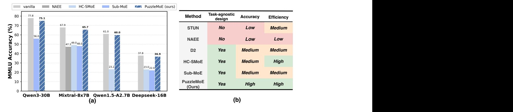
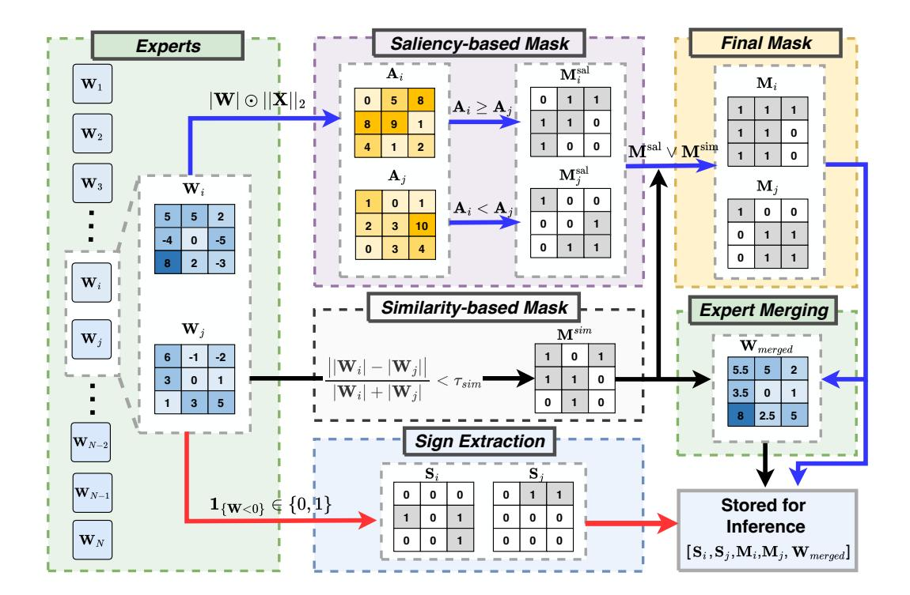
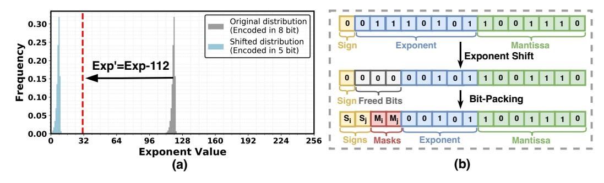
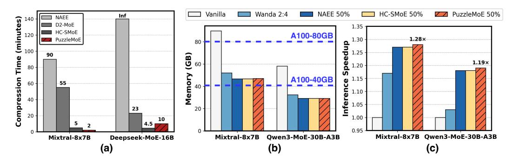
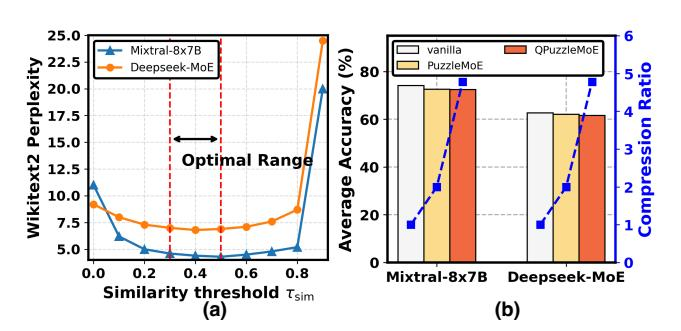
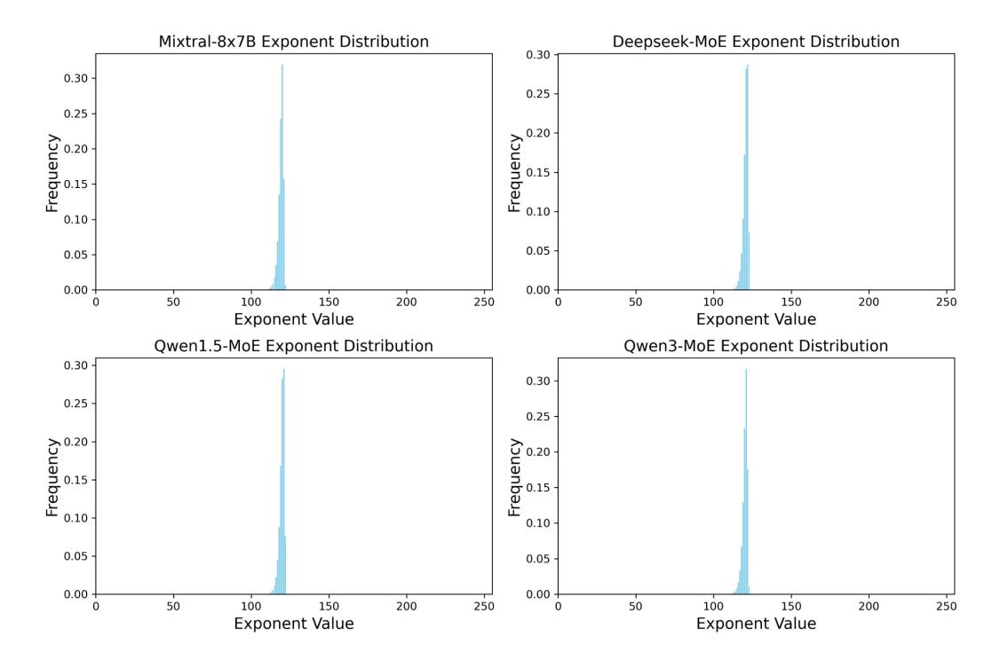
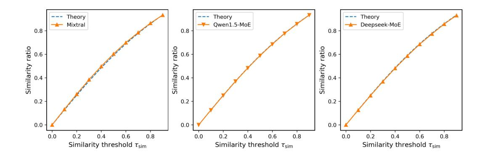
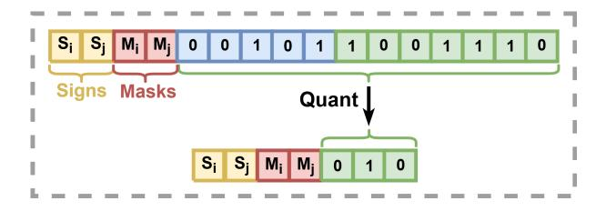

# PUZZLEMOE: EFFICIENT COMPRESSION OF LARGE MIXTURE-OF-EXPERTS MODELS VIA SPARSE EXPERT MERGING AND BIT-PACKED INFERENCE

Yushu Zhao1,∗,† Zheng Wang2,<sup>∗</sup> Minjia Zhang<sup>2</sup> <sup>1</sup> Tsinghua University <sup>2</sup> University of Illinois Urbana-Champaign zhaoys22@mails.tsinghua.edu.cn {zhengw10, minjiaz}@uiuc.edu

### ABSTRACT

Mixture-of-Experts (MoE) models have shown strong potential in scaling language models efficiently by activating only a small subset of experts per input. However, their widespread deployment remains limited due to the high memory overhead associated with storing all expert parameters, particularly as the number of experts increases. To address this challenge, prior works have explored expert dropping and merging strategies, yet they often suffer from performance drop at high compression ratios. In this paper, we introduce PuzzleMoE, a trainingfree MoE compression method that achieves both high accuracy and efficient inference through two key innovations: First, PuzzleMoE performs sparse expert merging by identifying element-wise weight redundancy and specialization. It uses a dual-mask to capture both shared and expert-specific parameters. Second, to avoid the overhead of storing binary masks and signs, PuzzleMoE introduces a bit-packed encoding scheme that reuses underutilized exponent bits, enabling efficient MoE inference on GPUs. Extensive experiments demonstrate that PuzzleMoE can compress MoE models by up to 50% while maintaining accuracy across various tasks. Specifically, it outperforms prior MoE compression methods by up to 16.7% on MMLU at 50% compression ratio, and achieves up to 1.28× inference speedup. The code is available at https://github.com/Supercomputing-System-AI-Lab/PuzzleMoE.



<span id="page-0-0"></span>Figure 1: (a): Accuracy of different MoE models on MMLU benchmark under 50%compression ratio with various expert compression methods, among which PuzzleMoE achieves the best accuracy. (b): Comparison of different expert compression methods, among which PuzzleMoE effectively and efficiently retains MoE models performance after compression with task-agnostic design.

<sup>\*</sup>Equal contribution.

<sup>†</sup>Work done while intern at UIUC.

### 1 INTRODUCTION

Mixture-of-Experts (MoE) architectures have demonstrated remarkable scalability in language models by activating only a subset of expert sub-networks per input. However, deploying these models in real-world applications remains challenging in practice due to their large memory footprint: all expert weights must be stored in memory, regardless of which subset is activated during inference. As the number of experts grows, as evidenced by recent advances such as Mixtral [\(Jiang et al., 2024\)](#page-11-0), DeepSeek-MoE [\(Dai et al., 2024\)](#page-11-1), and Qwen-MoE [\(Team, 2024\)](#page-12-0), this memory overhead becomes increasingly prohibitive, especially for resource constrained deployments. For instance, Mixtral-8x7B has 47 billion parameters, about 45 billion of which are in the expert modules, requiring at least two A100-80GB GPUs to load in Bfloat16.

To reduce this memory cost, previous studies have investigated bit-level compression techniques, such as quantization, to eliminate redundancy within individual experts [\(Hu et al., 2025;](#page-11-2) [Huang](#page-11-3) [et al., 2025\)](#page-11-3). However, these methods are designed to eliminate the redundancy of individual experts without considering the redundancy across different experts [\(He et al., 2025a\)](#page-11-4). Recent works have thus focused on expert dropping and expert merging. Expert dropping methods [\(Lu et al., 2024;](#page-12-1) [Lee](#page-12-2) [et al., 2025b\)](#page-12-2) remove entire experts considered less important based on their output over a calibration dataset. However, it is easy for them to accidentally discard important knowledge, leading to sharp accuracy drop [\(Chen et al., 2025\)](#page-11-5). In contrast, expert merging methods attempt to combine similar experts rather than removing them entirely, typically via expert clustering [\(Chen et al., 2025\)](#page-11-5) or using low-rank approximations [\(Li et al., 2025\)](#page-12-3). Although these methods generally outperform expert dropping, they still experience significant accuracy degradation, with performance drops of over 20% on the MMLU benchmark [\(Chen et al., 2025;](#page-11-5) [Li et al., 2025\)](#page-12-3) as demonstrated in Figure [1.](#page-0-0)

The non-negligible performance degradation indicates a deeper tension of MoE compression: experts often contain a mix of shared knowledge (e.g., weights that are crucial for general language modeling) and expert-specialized knowledge (e.g., parameters that handle particular inputs, domains, or linguistic patterns). Existing compression methods, whether dropping experts or merging full expert weights, risk discarding one or both types: dropping may eliminate critical specialization capabilities, while coarse-grained merging may hurt the distinctions between experts. As such, effective MoE compression must consider both preserving shared knowledge across experts while retaining expert specialization, which remain very challenging to achieve simultaneously. Moreover, many methods are not task-agnostic in design [\(Lu et al., 2024;](#page-12-1) [Lee et al., 2025b\)](#page-12-2) and require extensive offline compression time, as explored in Section [4.4.](#page-7-0) This highlights the need for an effective MoE merging approach that delivers both strong accuracy and practical compression efficiency.

In this paper, we propose PuzzleMoE, a training-free MoE compression method that achieves both high accuracy and efficient compression. First, we introduce a novel sparse expert merging algorithm that merges experts selectively at fine-grained weight entry level. Specifically, PuzzleMoE constructs two complementary masks: (1) An entry-wise similarity mask that identifies expert weights with high entry-wise similarity between expert pairs, which aims to identify the shared knowledge between experts; and (2) An activation-weight saliency mask that identifies weights critical to each expert's unique behavior, which ensures the unique knowledge of each expert can be reserved. By exploiting this dual-mask design, PuzzleMoE selectively merges only redundant parameters at fine-grained entry level while preserving expert specialization.

While entry-wise merging improves the preservation of shared and unique weights, it introduces the challenge of storing binary masks and sign bits per merged expert, which adds nontrivial overhead at scale. To overcome this, we introduce a bit-packed encoding scheme that reuses underutilized floating point bit representation. Specifically, we observe that the exponent field of expert weights often occupies a narrow range during inference, leaving multiple bits underutilized. We leverage these bits to embed binary masks and sign bits directly into the weight tensors, eliminating the need for auxiliary metadata storage. To support this format during inference, we design a custom CUDA kernel that decodes masks on the fly, enabling fast and memory-efficient execution of PuzzleMoE. Our contributions are summarized as follows:

• We propose PuzzleMoE, a sparse expert merging method that constructs entry-wise masks based on weight similarity and activation saliency and selectively merges expert in finegrained ways to effectively preserve both shared knowledge and expert specialization.

- We design a bit-efficient encoding scheme that embeds masks and signs directly into weights, enabling metadata-free MoE inference with a lightweight custom CUDA kernel.
- We demonstrate PuzzleMoE's effectiveness across four MoE models and seven benchmarks. Specifically, it achieves up to 16.7% higher accuracy than prior methods under 50% compression ratio, along with 45× faster compression and 1.28× inference speedup for Mixtral-8x7B.

### 2 RELATED WORKS

Quantization and pruning are two widely adopted techniques for model compression. Recent research [\(Chen et al., 2025;](#page-11-5) [Gu et al., 2025;](#page-11-6) [Huang et al., 2025;](#page-11-3) [Duanmu et al., 2025;](#page-11-7) [Hu et al., 2025;](#page-11-2) [Li et al., 2025;](#page-12-3) [Lu et al., 2024\)](#page-12-1) has explored their application to MoE models. Quantization techniques [\(Frantar et al., 2023;](#page-11-8) [Lin et al., 2024\)](#page-12-4) reduce memory footprint by exploiting per-weight redundancy, lowering weight precision to 4 bits. While quantization has achieved notable compression ratios with minimal impact on accuracy, the performance of pruning (including expert dropping and merging) within MoE models remains suboptimal. Specifically, pruning at a 50% sparsity ratio with existing methods results in a significant decline in accuracy (e.g. over 18.7% of accuracy drop on MMLU benchmark for Mixtral-8x7B) [\(Chen et al., 2025;](#page-11-5) [Gu et al., 2025;](#page-11-6) [Li et al., 2025;](#page-12-3) [Lu](#page-12-1) [et al., 2024\)](#page-12-1), indicating that MoE model pruning still requires substantial advancement.

Expert Dropping. Expert dropping methods reduce MoE model size by eliminating entire expert modules considered unimportant. NAEE [\(Lu et al., 2024\)](#page-12-1) performs an exhaustive search to determine which experts to retain, while STUN [\(Lee et al., 2025b\)](#page-12-2) accelerates this process by reducing the selection complexity to a constant O(1) by leveraging a latent structure between experts based on behavior similarity. These expert dropping methods suffer from a significant drawback: different downstream tasks require different selected calibration datasets. For the commonsense benchmarks, NAEE uses C4 for calibration, while for math tasks, it uses MATH dataset for calibration. MoE-I<sup>2</sup> [\(Yang et al., 2024a\)](#page-13-0) performs inter-expert pruning followed by intra-expert low-rank decomposition. However, it requires finetuning to recover the performance of the compressed model.

Expert Merging. To better preserve accuracy, several recent works have proposed merging similar experts rather than dropping them. Methods like HC-SMoE [\(Chen et al., 2025\)](#page-11-5) use hierarchical clustering based on expert output similarity to identify and combine experts, while MC-SMoE [\(Li et al.,](#page-12-5) [2024\)](#page-12-5), D2 [\(Gu et al., 2025\)](#page-11-6), and Sub-MoE [\(Li et al., 2025\)](#page-12-3) adopt multi-stage merging pipelines, e.g., first merging experts based on similarities, and then adding low-rank matrices to approximate the residual information. While these methods generally outperform expert dropping in accuracy, they often require complex procedures like SVD decomposition. In addition, they rely on coarse-grained expert merging, which risks hurting the distinctions between specialized experts. Different from existing methods, PuzzleMoE focuses on fine-grained entry-wise merging while being training-free and performing merging in a single pass.

Model Merging in Dense Models. Model merging is a promising approach for consolidating the capabilities of multiple pretrained and fine-tuned models into a single unified model [\(Yang](#page-13-1) [et al., 2024b\)](#page-13-1). Recent methods [\(He et al., 2025b;](#page-11-9) [Zhao et al., 2025\)](#page-13-2) have explored sparse merging, which selectively merges important parameters while avoiding the destructive effects of naive weight averaging. For instance, Localize-and-Stitch [\(He et al., 2025b\)](#page-11-9) identifies task-specific subspaces within each model and merges only the aligned regions to preserve fine-tuned capabilities. LoRS-Merging [\(Zhao et al., 2025\)](#page-13-2) combines low-rank decomposition with sparsity-aware pruning to preserve critical model structures while eliminating redundancy. Different from those work, PuzzleMoE introduces sparse merging principles to MoE models: it performs entry-wise merging with efficient inference through bit-packing optimization. To our knowledge, PuzzleMoE is the first method that explores sparse merging for experts in MoE models at fine-grained entry level.

### 3 METHOD

In this section, we introduce our design of PuzzleMoE, which achieves efficient fine-grained sparse expert merging through a deliberately designed pairwise dual-mask merging algorithm and a system co-design with bit-level packing technique. These two designs can effectively maintain MoE mod-



<span id="page-3-1"></span>Figure 2: Procedure of sparse expert merging algorithm. We merge two experts by computing saliency-based masks to keep only important weights for each expert, a cross-expert similarity mask to keep aligned weights, and extracting weights' signs. Then, the merged weights Wmerged are formed via Eq. (7). Finally, we store M<sup>i</sup> , M<sup>j</sup> , S<sup>i</sup> , S<sup>j</sup> , and Wmerged for inference usage. Masks and signs are bit-packed for compact storage as demonstrated in Section [3.1.](#page-3-0)

els' performance after compression while minimizing the masking overhead at the inference stage. We detail these two designs in Section [3.1](#page-3-0) and Section [3.2,](#page-4-0) respectively.

### <span id="page-3-0"></span>3.1 PAIRWISE DUAL-MASK EXPERT MERGING

Consider two weight matrices W<sup>i</sup> and W<sup>j</sup> ∈ Rd×<sup>h</sup> , which correspond to experts E<sup>i</sup> and E<sup>j</sup> from an MoE layer of a model with N experts ε = {E1, E2, . . . , E<sup>N</sup> }, our goal is to construct a merged expert Wmerged ∈ Rd×<sup>h</sup> that preserves shared information among experts' weights while retaining expert-specific, high-saliency parameters. To this end, we propose a dual-mask element-wise merging strategy to obtain Wmerged: A *similarity-based mask* that identifies shared weight entries, and a *saliency-based mask* used to preserves divergent yet important weight entries. Additionally, we store the original signs of each expert's weights and reapply them to Wmerged during inference. The overall algorithm design is illustrated in Figure [2.](#page-3-1)

Pair-wise Merging. We adopt a pairwise merging strategy for efficiency and tractability. The rationale is that when attempting to merge k ≥ 3 experts jointly, each weight index admits (2<sup>k</sup> − 1) choices, yielding a combinatorial masking problem whose difficulty scales exponentially in k and is intractable in practice, especially for the modern MoE models with a large number of experts. By contrast, pairwise merging enables closed-form mask construction with linear-time complexity and compact encoding. Moreover, pairwise merging performs better than the combinatorial merging under the same merging sparsity as discussed in Section [5.](#page-8-0)

Similarity-based Mask. Given two experts weights W<sup>i</sup> and W<sup>j</sup> , we measure their per-entry magnitude similarity using a symmetric percent difference [\(Miller, 2011\)](#page-12-6):

<span id="page-3-2"></span>
$$\Delta := \frac{\left| |\mathbf{W}_i| - |\mathbf{W}_j| \right|}{|\mathbf{W}_i| + |\mathbf{W}_j|},\tag{1}$$

where smaller values indicate greater similarity between two weight entries. Eq.1 cleanly identifies entries in two experts' weights that are similar in magnitude regardless of direction to avoid spurious penalties from opposite signs and minimize distortion in the reconstructed weights when signs are restored at inference. After that, the similarity-based mask between two experts can be defined as:

$$\mathbf{M}^{\text{sim}} := \mathbf{1}_{\{\Delta \le \tau_{\text{sim}}\}} \in \{0, 1\}^{d \times h},\tag{2}$$

where  $\tau_{sim} \in [0,1]$  is the pre-defined similarity threshold.  $\mathbf{M}^{sim}$  is used to identify experts' entries with comparable magnitude so that they can be safely aggregated. We also analyze the reason why different experts have weight similarity in Appendix B.2 to support this design. As discussed, we also need to store each expert's sign pattern and reapply it to  $\mathbf{W}_{merged}$  at inference, ensuring that shared merged entries reconstruct the original signed weights with minimal distortion:

$$\mathbf{S}_i := \mathbf{1}_{\{\mathbf{W}_i < 0\}} \in \{0, 1\}^{d \times h}, \qquad \mathbf{S}_j := \mathbf{1}_{\{\mathbf{W}_j < 0\}} \in \{0, 1\}^{d \times h}.$$
 (3)

Saliency-based Mask. To decide which expert's entries to preserve, we extend the idea of quantifying the importance of weights by combining the magnitude of weights with the saliency of input activations in dense models (Sun et al., 2024) to MoE experts:

$$\mathbf{A}_i = |\mathbf{W}_i| \odot ||\mathbf{X}_i||_2, \qquad \mathbf{A}_j = |\mathbf{W}_j| \odot ||\mathbf{X}_j||_2, \tag{4}$$

where X represents a sample of input activations to a certain expert. Therefore, the complementary saliency masks can be obtained as:

$$\mathbf{M}_{i}^{\text{sal}} := \mathbf{1}_{\{\mathbf{A}_{i} \ge \mathbf{A}_{j}\}} \in \{0, 1\}^{d \times h}, \qquad \mathbf{M}_{j}^{\text{sal}} := \mathbf{1} - \mathbf{M}_{i}^{\text{sal}}.$$
 (5)

These two masks indicate which expert has the more important weight to be reserved at each entry position of the final  $\mathbf{W}_{merged}$  .

**Sparse Expert Merging.** To achieve the preservation of critical importance weights between two experts while minimizing the redundancy within them, we average the magnitudes of entries whose values are similar in terms of  $M_{\rm sim}$ , whereas dissimilar entries are selected from the more salient expert using the saliency masks. This sparse merging process can be expressed as:

$$\mathbf{M}_i = \mathbf{M}_i^{\mathrm{sal}} \vee \mathbf{M}^{\mathrm{sim}}, \qquad \mathbf{M}_j = \mathbf{M}_j^{\mathrm{sal}} \vee \mathbf{M}^{\mathrm{sim}},$$
 (6)

$$\mathbf{M}_{i} = \mathbf{M}_{i}^{\mathrm{sal}} \vee \mathbf{M}^{\mathrm{sim}}, \qquad \mathbf{M}_{j} = \mathbf{M}_{j}^{\mathrm{sal}} \vee \mathbf{M}^{\mathrm{sim}},$$

$$\mathbf{W}_{\mathrm{merged}} = \mathbf{M}^{\mathrm{sim}} \odot \frac{|\mathbf{W}_{i}| + |\mathbf{W}_{j}|}{2} + (\mathbf{1} - \mathbf{M}^{\mathrm{sim}}) \odot (\mathbf{M}_{i}^{\mathrm{sal}} \odot |\mathbf{W}_{i}| + \mathbf{M}_{j}^{\mathrm{sal}} \odot |\mathbf{W}_{j}|).$$
(6)

The merging process is done offline, and  $W_{\rm merged}$ ,  $M_i$ ,  $M_j$ ,  $S_i$ ,  $S_j$  are stored. At the inference stage, once an expert is activated, its weights are reconstructed element-wise as

$$\widehat{\mathbf{W}}_i = (-1)^{\mathbf{S}_i} \odot \mathbf{M}_i \odot \mathbf{W}_{\text{merged}}.$$
 (8)

Unlike prior search-based methods, our merging process requires only a single forward pass to compute expert saliency scores using the Wanda (Sun et al., 2024) metric, completely obviating the need for an expensive search procedure in NAEE (Lu et al., 2024). The detailed comparison of offline compression can be found in Section 4.4.

How to select the pairwise experts grouping strategy? We propose two strategies for grouping experts into pairs for merging: (1) random grouping, (2) search-based grouping. In practice, we find that random grouping performs sufficiently well, as discussed in Section 5. Therefore, we adopt random grouping as the default strategy for pairwise expert combination. Additional details and sensitivity analyses on hyperparameter configurations are provided in Section 5.

#### <span id="page-4-0"></span>3.2 EFFICIENT INFERENCE WITH BIT-PACKING

The sparse expert merging process transforms each pair of experts into a merged expert, 2 sign matrices, and 2 corresponding binary masks, which present a significant challenge to achieving efficient inference. As revealed by Lasby et al. (2025), employing Compressed Sparse Row format to store a tensor with 50% unstructured sparsity does not result in any memory savings. This inefficiency arises primarily from the considerable overhead associated with storing index information. Furthermore, existing expert calculation relies on dense matrix multiplications, which is highly optimized on modern GPUs and they don't support calculation with masks. The need to dynamically fetch the appropriate mask during inference introduces considerable latency, particularly in the scheduling and memory access of matrix multiplication kernels. To overcome these limitations, we propose a solution combining efficient bit-level packing with a high-performance GEMV CUDA kernel.



Figure 3: Illustration of the mask packing procedure. (a): the distribution of Bfloat16 weight exponents in Mixtral-8x7B. After shifting, the exponents can be encoded in 5 bits. (b): bit-level organization of masks and signs within the packed Bfloat16 format.

### 3.2.1 OBSERVATION

The Bfloat16 data format, which allocates 1 sign, 8 exponent, and 7 mantissa bits, is standard for LLM inference. Recent analyses [\(Su et al., 2024;](#page-12-9) [Zhang et al., 2025;](#page-13-3) [Lee et al., 2025a\)](#page-12-10) reveal significant underutilization of the 8-bit exponent range for dense LLMs in Bfloat16 format. We found that this also applies for MoE models. As illustrated in Figure [3,](#page-5-0) for the Mixtral-8x7B [\(Jiang](#page-11-0) [et al., 2024\)](#page-11-0) model, the exponent values of expert weights are predominantly concentrated within a narrow range of 112 to 128. We also observe this in other MoE models as shown in Appendix [B.1.](#page-14-1)

### 3.2.2 SYSTEM CO-DESIGN

Leveraging the concentrated exponent distribution, we apply a fixed shift to map all exponents into a 5 bit range, as illustrated in Figure [3.](#page-5-0) Specifically, any exponent smaller than 112 is rounded up to 112, and then all exponents are shifted down by 112, resulting in values that fall within the range of 0 to 31. As

<span id="page-5-1"></span><span id="page-5-0"></span>Table 1: Perplexity results on Wikitext2 before and after bit-packing.

| Model        | Before Pack | After Pack |
|--------------|-------------|------------|
| Mixtral-8x7B | 4.37        | 4.37       |
| Deepseek-MoE | 6.88        | 6.88       |

detailed in Table [1,](#page-5-1) this transformation incurs no perplexity degradation for the existing large MoE models because crafting an FP16 model from a Bfloat16 model follows similar procedure for the exponent part. This shift operation frees 3 bits within the original 8-bit exponent field, which can be used to pack the binary mask bits and a sign bit. Hence, the resultant Wmerged is stored in a standard Bfloat16 data format, effectively embedding the masks and signs without additional storage.

### Algorithm 1 PuzzleMoE weight decoding

```
Input: W: Merged weight value, expert pos: 0 or 1 expert in the merge group
Output: W decoded
```

```
1: mask bit ← (W ≫ (13 - expert pos)) & 1 ▷ Extract the packed mask bit for the weight
2: if mask bit==0:
3: W decoded ← 0 ▷ The weight value is 0 if it is marked as pruned
4: else:
5: sign bit ← (W ≫ (15 - expert pos)) & 1 ▷ Extract the packed sign bit for the weight
6: exp ← (W & 0x0F80) + (112 ≪ 7) ▷ Rebuild the bfloat16 exponent
7: W decoded ← (sign bit ≪ 15) | exp | (W & 0x007F) ▷ Reconstruct the weight value
8: W decoded.view(bfloat16)
```

We develop a specialized GEMV CUDA kernel that incorporates on-the-fly decoding to realize the above bit leveraging idea. As detailed in Algorithm [1,](#page-5-2) each weight W[i, j] is dynamically decoded from its packed format immediately prior to its use in the multiplication X[i, j] × W[i, j]. The performance of this approach hinges on its synergistic design. The decoding logic is a computationally trivial, in-place operation that piggybacks on the kernel's existing data-loading path. This path is already highly optimized for maximum memory throughput via techniques like warp-level scheduling and coalesced memory access. We eliminate the need for a separate materialization of the decoded matrix in memory, thereby avoiding significant latency and memory access overhead. This special-

<span id="page-6-0"></span>Table 2: Zero-shot comparison of Mixtral-8x7B, Deepseek-MoE, Qwen1.5-MoE, and Qwen3-MoE under 25% and 50% sparsity.

| Method    | Sparsity | Wiki   | ARC-c | ARC-e     | Hella    | Piqa        | BoolQ | Wino | MMLU | Avg                        |
|-----------|----------|--------|-------|-----------|----------|-------------|-------|------|------|----------------------------|
|           |          |        |       | Mixtral-8 | 8x7B-v0. | 1           |       |      |      |                            |
| Vanilla   | 0%       | 3.84   | 56.7  | 84.1      | 64.9     | 82.4        | 85.4  | 77.2 | 67.9 | 74.1                       |
| NAEE      | 25%      | 5.01   | 52.0  | 82.0      | 61.9     | 80.9        | 84.0  | 75.1 | 58.1 | 70.6                       |
| STUN      | 25%      | -      | 52.7  | 81.8      | 60.8     | -           | 83.1  | 72.7 | 63.3 | -                          |
| D2        | 20%      | 4.65   | 51.0  | 80.0      | 61.0     | 81.0        | -     | 75.0 | -    | -                          |
| HC-SMoE   | 25%      | 5.31   | 50.3  | 79.3      | 61.3     | 80.7        | 84.9  | 75.4 | 59.4 | 70.2                       |
| Sub-MoE   | 25%      | 5.16   | 49.0  | 80.0      | 62.0     | -           | 86.0  | 75.0 | 59.0 | -                          |
| PuzzleMoE | 25%      | 4.10   | 55.3  | 83.2      | 64.2     | 82.1        | 85.4  | 75.5 | 66.8 | $73.2{\scriptstyle\pm0.2}$ |
| NAEE      | 50%      | 6.49   | 48.1  | 78.5      | 57.8     | 79.1        | 81.0  | 73.0 | 47.3 | 66.4                       |
| D2        | 40%      | 5.28   | 47.0  | 78.0      | 57.0     | 78.0        | -     | 73.0 | -    | -                          |
| HC-SMoE   | 50%      | 7.65   | 41.1  | 72.0      | 55.5     | 76.0        | 80.8  | 72.1 | 49.0 | 63.8                       |
| Wanda     | 2:4      | 5.89   | 48.3  | 78.8      | 58.7     | 79.5        | 79.2  | 74.5 | 62.0 | 68.7                       |
| Sub-MoE   | 50%      | 6.97   | 45.0  | 75.0      | 57.0     | -           | 84.0  | 72.0 | 48.0 | -                          |
| PuzzleMoE | 50%      | 4.36   | 53.8  | 82.4      | 63.3     | 81.7        | 85.3  | 75.8 | 65.7 | $72.6 \pm 0.2$             |
|           |          |        |       | Deepseek  | -MoE-16  | ób –        |       |      |      |                            |
| Vanilla   | 0%       | 6.51   | 44.6  | 75.9      | 58.1     | 78.8        | 72.8  | 70.1 | 37.8 | 62.6                       |
| D2        | 20%      | 6.84   | 41.0  | 74.0      | 55.0     | 76.0        | -     | 69.0 | -    | -                          |
| HC-SMoE   | 25%      | 24.48  | 36.7  | 65.1      | 44.3     | 73.1        | 66.4  | 65.7 | 24.5 | 53.7                       |
| Sub-MoE   | 25%      | 8.48   | 40.0  | 72.0      | 54.0     | _           | 73.0  | 70.0 | 27.0 | -                          |
| PuzzleMoE | 25%      | 6.68   | 44.0  | 75.7      | 57.2     | <b>78.7</b> | 73.1  | 70.6 | 37.2 | $62.4 \pm 0.3$             |
| D2        | 40%      | 7.93   | 36.0  | 69.0      | 45.0     | 72.0        | -     | 65.0 | -    | -                          |
| Wanda     | 2:4      | 8.46   | 37.4  | 71.2      | 51.4     | 76.2        | 75.9  | 69.2 | 31.0 | 58.9                       |
| HC-SMoE   | 50%      | 89.94  | 22.3  | 41.9      | 31.2     | 62.3        | 62.3  | 55.3 | 23.0 | 42.6                       |
| Sub-MoE   | 50%      | 13.71  | 32.0  | 63.0      | 44.0     | -           | 68.0  | 65.0 | 22.0 | -                          |
| PuzzleMoE | 50%      | 6.88   | 43.0  | 75.2      | 56.3     | 78.4        | 74.5  | 70.3 | 36.9 | $62.1 \pm 0.4$             |
|           |          |        | (     | Qwen1.5-N | ЛоЕ-А2.  | 7B          |       |      |      |                            |
| Vanilla   | 0%       | 7.22   | 41.0  | 73.2      | 58.0     | 80.0        | 79.5  | 68.9 | 61.0 | 65.9                       |
| HC-SMoE   | 25%      | 11.28  | 34.8  | 67.5      | 50.4     | 74.1        | 74.2  | 66.1 | 51.0 | 59.7                       |
| PuzzleMoE | 25%      | 7.37   | 40.9  | 73.4      | 57.3     | 79.7        | 79.2  | 69.6 | 60.4 | $65.8{\scriptstyle\pm0.2}$ |
| Wanda     | 2:4      | 8.81   | 38.7  | 72.2      | 52.6     | 77.5        | 76.2  | 67.8 | 55.8 | 63.0                       |
| HC-SMoE   | 50%      | 78.04  | 23.9  | 41.1      | 31.2     | 60.9        | 56.6  | 56.1 | 23.2 | 41.9                       |
| PuzzleMoE | 50%      | 7.55   | 40.7  | 73.5      | 56.5     | 79.4        | 78.6  | 69.4 | 60.0 | $65.4{\pm}0.2$             |
|           |          |        | C     | wen3-Mo   | E-30B-A  | 3B          |       |      |      |                            |
| Vanilla   | 0%       | 8.70   | 52.7  | 79.3      | 59.5     | 79.6        | 88.7  | 70.4 | 77.8 | 72.6                       |
| HC-SMoE   | 25%      | 15.84  | 34.3  | 60.9      | 44.6     | 69.8        | 80.8  | 54.0 | 39.6 | 54.9                       |
| Sub-MoE   | 25%      | 13.59  | 44.0  | 70.0      | 47.0     | -           | 86.0  | 66.0 | 65.0 | -                          |
| PuzzleMoE | 25%      | 9.08   | 51.6  | 78.9      | 58.3     | 79.3        | 88.2  | 70.4 | 76.6 | $71.9{\scriptstyle\pm0.3}$ |
| Wanda     | 2:4      | 11.77  | 48.2  | 76.1      | 51.1     | 76.3        | 88.0  | 70.5 | 72.1 | 68.9                       |
| HC-SMoE   | 50%      | 174.68 | 18.3  | 30.4      | 27.4     | 55.9        | 53.5  | 50.0 | 24.8 | 37.2                       |
| Sub-MoE   | 50%      | 21.05  | 40.0  | 69.0      | 41.0     | -           | 84.0  | 63.0 | 56.0 | -                          |
| PuzzleMoE | 50%      | 9.50   | 51.0  | 78.5      | 57.1     | 78.9        | 88.0  | 70.1 | 75.1 | $71.2{\scriptstyle\pm0.4}$ |

ized GEMV kernel serves as the cornerstone of our end-to-end inference system for PuzzleMoE, effectively balancing a compact memory footprint with high runtime performance.

#### 4 EXPERIMENTS

#### 4.1 EXPERIMENTAL SETTINGS

**Models and Baselines.** We conduct a comprehensive evaluation of PuzzleMoE on four state-of-the-art MoE models: Mixtral-8x7B (Jiang et al., 2024), Deepseek-MoE (Dai et al., 2024), Qwen1.5-MoE-A2.7B (Team, 2024), and Qwen3-MoE-30B-A3B (Yang et al., 2025).

We follow prior work to evaluate two distinct compression ratios of 25% and 50%, reducing the number of experts to 75% and 50% of the original count, while keeping the other modules unchanged.

We compare PuzzleMoE against existing MoE compression methods, including expert dropping methods NAEE (Lu et al., 2024), STUN (Lee et al., 2025b) and expert merging methods D2 (Gu

[et al., 2025\)](#page-11-6), HC-SMoE [\(Chen et al., 2025\)](#page-11-5), Sub-MoE [\(Li et al., 2025\)](#page-12-3). We also compare with LLM pruning algorithm Wanda [\(Sun et al., 2024\)](#page-12-7), whose 2:4 semi-structured sparsity is applied exclusively to the experts to ensure a fair comparison [\\*](#page-7-1)

Benchmarks and Evaluation. We evaluate the compressed models on language modeling perplexity and zero-shot task performance. Language modeling capabilities are assessed on the WikiText-2 [\(Merity et al., 2016\)](#page-12-12) with a sequence length of 2048. For downstream tasks, we evaluate zero-shot accuracy across seven common benchmarks: ARC-c [\(Clark et al., 2018\)](#page-11-10), ARC-e [\(Clark et al., 2018\)](#page-11-10), HellaSwag [\(Zellers et al., 2019\)](#page-13-4), PIQA [\(Bisk et al., 2019\)](#page-11-11), BoolQ [\(Clark et al., 2019\)](#page-11-12), Winogrande [\(Sakaguchi et al., 2019\)](#page-12-13), and MMLU [\(Hendrycks et al., 2021\)](#page-11-13). For all experiments, the calibration dataset has 128 samples, each with a sequence length of 2048 drawn from the C4 dataset [\(Raffel](#page-12-14) [et al., 2023\)](#page-12-14). We set the similarity threshold τsim = 0.4 fixed for all models and tasks, and evaluated 16 different random seeds for expert combination. The results in Table [2,](#page-6-0) Table [3,](#page-7-2) and Table [4](#page-7-3) for PuzzleMoE are the average result. The detailed results for each seed are shown in Appendix [B.4.](#page-16-0)

#### 4.2 PERFORMANCE ON GENERAL TASKS

From Table [2,](#page-6-0) we observe that for Mixtral-8x7B, PuzzleMoE achieves an average accuracy of 73.2% at 25% sparsity and 72.6% at 50% sparsity, substantially outperforming other baselines. For DeepSeek-MoE, PuzzleMoE incurs only minimal accuracy drops of 0.2% and 0.5% at 25% and 50% sparsity, respectively. Similarly, for Qwen1.5-MoE, the degradation is limited to 0.1% and 0.5%, while for Qwen3-MoE, the drops are 0.7% and 1.4% under 25% and 50% sparsity. These results highlight the effectiveness of PuzzleMoE on reserving MoE models performance after aggressive expert merging, whose superior performance arises from its fine-grained sparse expert merging strategy, effectively reserving MoE LLMs' language processing ability on general tasks.

### 4.3 PERFORMANCE ON DOMAIN-SPECIFIC TASKS

We further evaluate PuzzleMoE on domainspecific mathematical reasoning tasks to assess its ability to preserve reasoning performance under sparsity, as shown in Table [3.](#page-7-2) PuzzleMoE consistently achieves the best results among all methods, with accuracies of 55.4% and 51.7% at 25% and 50% sparsity, respectively. Moreover, the effectiveness of NAEE is strongly influenced by the choice of calibration data, performing better with the Math dataset than with C4. In contrast, PuzzleMoE remains robust regardless of calibration as shown in Section [5.](#page-8-0)

We also evaluate the Qwen3-MoE-30B-A3B model, which demonstrates strong reasoning ability [\(Yang et al., 2025\)](#page-12-11), on the more challenging reasoning benchmarks with results reported in Table [4.](#page-7-3) Notably, under 25% sparsity, PuzzleMoE effectively reserves the model's reasoning ability after compression, retaining

<span id="page-7-2"></span>Table 3: 8-shot GSM8K accuracy on Mixtral-8x7B.

| Sparsity | Method    | Calib. data | GSM8K |
|----------|-----------|-------------|-------|
| 0%       | -         | -           | 57.6  |
|          | NAEE      | C4          | 41.5  |
| 25%      | NAEE      | Math        | 48.7  |
|          | PuzzleMoE | C4          | 55.4  |
|          | NAEE      | C4          | 28.6  |
|          | NAEE      | Math        | 38.8  |
| 50%      | Wanda     | C4          | 32.2  |
|          | PuzzleMoE | C4          | 51.7  |

<span id="page-7-3"></span>Table 4: Performance on math reasoning benchmarks.

| Method          | Math-500 | AIME24 | AIME25 |
|-----------------|----------|--------|--------|
| Baseline (0%)   | 97.2     | 83.3   | 72.9   |
| HC-SMoE (25%)   | 24.6     | 0.0    | 0.0    |
| PuzzleMoE (25%) | 96.2     | 71.1   | 61.5   |

99%, 92%, and 84% of accuracy for the three benchamrks, respectively. In sharp contrast, HC-SMoE collapses to 24.6, 0.0, and 0.0 under the same sparsity. This highlights the effectiveness of PuzzleMoE in preserving the reasoning capability of MoE model compared to the previous method.

#### <span id="page-7-0"></span>4.4 EFFICIENCY ANALYSIS

Compression Cost. We measure the time required to compress the MoE models to 50% expert sparsity on 2 A100-80G GPUs for PuzzleMoE, D2, HC-SMoE, and NAEE. As shown in Figure [4,](#page-8-1)

<span id="page-7-1"></span><sup>\*</sup>This is different from the setting in NAEE. In NAEE, the Wanda pruning is applied uniformly across all linear modules in the MoE model, which introduces an unfair comparison. Specifically, the attention module is more sensitive to pruning than the experts module.

PuzzleMoE only takes 2 minutes for compressing Mixtral-8x7B, while D2 takes 55 minutes due to the heavy computation cost of SVD operation. For Deepseek-MoE, PuzzleMoE takes 10 minutes for compression, indicating the efficiency of PuzzleMoE on MoE models with a large number of experts. Note that NAEE's reliance on exhaustive search makes the compression time quite expensive. For instance, applying it to DeepSeek-MoE with 64 experts requires 10<sup>18</sup> on the order of forward passes, rendering it infeasible in practice.



<span id="page-8-1"></span>Figure 4: System performance for different MoE models and tasks. (a): Compression time comparison across Mixtral and Deepseek-MoE. (b): Memory usage during inference for Mixtral-8x7B and Qwen3-MoE. (c): Inference speedup comparison for Mixtral-8x7B and Qwen3-MoE.

Memory Usage and Inference Speedup. We evaluate the memory usage and inference speedup of Mixtral-8x7B and Qwen3-MoE-30B-A3B under 50% compression ratio as shown in Figure [4.](#page-8-1) The prefill and decode lengths are set to 1024 and 512, respectively. For Mixtral-8x7B, the full model necessitates two A100-80G GPUs for inference, whereas the compressed model can be deployed on a single A100-80G GPU. Similarly, for Qwen3-MoE, which is evaluated on A100-40G GPUs, the full model requires two GPUs for inference, while the compressed model is capable of inference on a single GPU. Moreover, PuzzleMoE achieves an inference speedup of 1.28× for Mixtral-8x7B and 1.19× for Qwen3-MoE, which are marginally better than the existing compression methods and with great accuracy gains as shown in Table [2.](#page-6-0) Therefore, PuzzleMoE attains efficiency gains comparable to existing compression methods while providing markedly better accuracy, making it a more balanced approach for deploying MoE models.

## <span id="page-8-0"></span>5 ABLATION STUDY

Impact of Calibration Datasets. We explore the impact of different calibration datasets on PuzzleMoE, and the results are illustrated in Table [5.](#page-8-2) We can observe that whether using C4 or MATH as the calibration dataset doesn't lead to a big variance in the performance on different downstream tasks, emphasizing the robustness of PuzzleMoE on the choice of calibration dataset. Practically, this removes the need for costly domain-specific calibration runs and simplifies deployment.

Number of Experts to Merge. We ablate the number of experts to merge in PuzzleMoE. As shown in Table [6,](#page-9-0) at a 50% sparsity level, increasing the merge group size from 2 to 3 experts leads to degraded performance, as reflected by higher perplexity. Moreover, merging three experts introduces notable hardware inefficiencies: encoding the selection

<span id="page-8-2"></span>Table 5: PuzzleMoE with different calibration datasets for Mixtral-8x7B.

| Calib. data | GSM8K | Avg Accuracy |
|-------------|-------|--------------|
| C4          | 51.7  | 72.6         |
| Math        | 51.7  | 72.5         |
|             |       |              |

masks and signs for three experts requires 5 bits, which exceeds the 3 redundant bits available in the Bfloat16 format, making the design impractical.

Expert Grouping Strategy. We compare our random pairwise expert grouping strategy with an evolutionary search-based pairwise grouping strategy. As shown in Table [7,](#page-9-1) the search-based grouping strategy only leads to a slight performance increase compared with the random one, indicating that PuzzleMoE's effectiveness is highly attribute to the sparse expert merging algorithm itself and hardly influenced by the pairwise grouping strategy. Therefore, PuzzleMoE uses random expert grouping by default for simplicity.

<span id="page-9-0"></span>Table 6: Impact of different numbers of experts to merge with 50% sparsity.

| Model        | Merge Number | Wiki |
|--------------|--------------|------|
| Mixtral-8x7B | 2            | 4.36 |
|              | 3            | 5.22 |
|              | 2            | 6.88 |
| Deepseek-MoE | 3            | 7.75 |

<span id="page-9-1"></span>Table 7: Impact of different expert grouping strategies with 50% sparsity.

| Model        | Method   | Wiki      | Avg Acc  |
|--------------|----------|-----------|----------|
|              | Random   | 4.36±0.01 | 72.6±0.2 |
| Mixtral-8x7B | Searched | 4.35      | 72.9     |
|              | Random   | 6.88±0.01 | 62.1±0.3 |
| Deepseek-MoE | Searched | 6.86      | 62.4     |

Similarity Threshold τsim. We report perplexity results for PuzzleMoE with different values of τsim as shown in Figure [5.](#page-9-2) It is clear that small values underuse magnitude similarity, while large values merge too aggressively and leads a substantially higher loss across the two experts. Values of τsim within the range of 0.3 to 0.5 yield the best performance; therefore, we fix τsim = 0.4 across models by default.

Combining PuzzleMoE with Quantization. We also investigated the compatibility of PuzzleMoE with quantization. Specifically, we apply a symmetric group quantization scheme to the resultant merged weights. As depicted in Figure [5,](#page-9-2) this combined approach achieves a substantial compression ratio of 4.8×, with a minimal accuracy drop of only 1.7% for Mixtral-8x7B and 1.0% for Deepseek-MoE compared with full models, demonstrating that our merging strategy can be effectively combined with quantization without significant performance loss. Further details of quantized PuzzleMoE are shown in Appendix [B.3.1.](#page-16-1)



Figure 5: (a): Wikitext2 perplexity of Mixtral and Deepseek-MoE under different similarity thresholds. (b): Accuracy performance of combining PuzzleMoE with quantization.

Impact of Importance Scoring Function. To validate the choice of importance scoring function for saliancy-based mask construction, we compare the activation based scoring function against the one that relies solely on weight magnitude. As demonstrated in Table [8,](#page-9-3) the activation-aware scoring function yields equal or better results on both Mixtral-8x7B and Deepseek-MoE models. These observations

<span id="page-9-3"></span><span id="page-9-2"></span>Table 8: Performance results of PuzzleMoE using different importance scoring functions.

| Model        | Metric    | Wiki | Avg Acc |
|--------------|-----------|------|---------|
|              | ours      | 4.36 | 72.6    |
| Mixtral-8x7B | Magnitude | 4.38 | 72.6    |
|              | ours      | 6.88 | 62.1    |
| Deepseek-MoE | Magnitude | 6.98 | 61.8    |

align with prior pruning insights from Wanda, which pairs weight magnitude with input activation to form a stronger criterion for pruning weights.

## 6 CONCLUSION

We introduce PuzzleMoE, an efficient compression method for large Mixture-of-Experts models. Our approach utilizes a sparse expert merging strategy guided by dual masks, which enables model compression within minutes while effectively preserving downstream task performance. Furthermore, by incorporating bit-packed encoding, PuzzleMoE facilitates efficient decoding on GPUs, offering a practical solution for deploying large MoE models in real-world applications. The future work could be focusing on further pushing the boundaries of reasoning ability of compressed MoE LLMs. As indicated by our results, even though PuzzleMoE can effectively reserve MoE LLMs' reasoning ability after compression compared to the existing works, it is still struggling on more challenging tasks like AIME25 with about 10 points drop compared to the uncompressed one. Moreover, the native sparse expert MoE LLMs is also an interesting direction to explore to see if we can incorporate this sparsity of experts into the training process.

### ACKNOWLEDGMENTS

This research was supported by the National Science Foundation (NSF) under Grant No. 2441601. The work utilized the Delta and DeltaAI system at the National Center for Supercomputing Applications (NCSA) and Jetstream2 at Indiana University through allocation CIS240055 from the Advanced Cyberinfrastructure Coordination Ecosystem: Services & Support (ACCESS) program, which is supported by National Science Foundation grants #2138259, #2138286, #2138307, #2137603, and #2138296. The Delta advanced computing resource is a collaborative effort between the University of Illinois Urbana-Champaign and NCSA, supported by the NSF (award OAC 2005572) and the State of Illinois. UIUC SSAIL Lab is supported by research funding and gift from Google, IBM, Amazon, and AMD.

### REFERENCES

- <span id="page-11-11"></span>Yonatan Bisk, Rowan Zellers, Ronan Le Bras, Jianfeng Gao, and Yejin Choi. Piqa: Reasoning about physical commonsense in natural language, 2019. URL [https://arxiv.org/abs/1911.](https://arxiv.org/abs/1911.11641) [11641](https://arxiv.org/abs/1911.11641).
- <span id="page-11-5"></span>I-Chun Chen, Hsu-Shen Liu, Wei-Fang Sun, Chen-Hao Chao, Yen-Chang Hsu, and Chun-Yi Lee. Retraining-free merging of sparse moe via hierarchical clustering, 2025. URL [https:](https://arxiv.org/abs/2410.08589) [//arxiv.org/abs/2410.08589](https://arxiv.org/abs/2410.08589).
- <span id="page-11-12"></span>Christopher Clark, Kenton Lee, Ming-Wei Chang, Tom Kwiatkowski, Michael Collins, and Kristina Toutanova. Boolq: Exploring the surprising difficulty of natural yes/no questions, 2019. URL <https://arxiv.org/abs/1905.10044>.
- <span id="page-11-10"></span>Peter Clark, Isaac Cowhey, Oren Etzioni, Tushar Khot, Ashish Sabharwal, Carissa Schoenick, and Oyvind Tafjord. Think you have solved question answering? try arc, the ai2 reasoning challenge. *arXiv:1803.05457v1*, 2018.
- <span id="page-11-1"></span>Damai Dai, Chengqi Deng, Chenggang Zhao, R. X. Xu, Huazuo Gao, Deli Chen, Jiashi Li, Wangding Zeng, Xingkai Yu, Y. Wu, Zhenda Xie, Y. K. Li, Panpan Huang, Fuli Luo, Chong Ruan, Zhifang Sui, and Wenfeng Liang. Deepseekmoe: Towards ultimate expert specialization in mixture-of-experts language models, 2024. URL [https://arxiv.org/abs/2401.](https://arxiv.org/abs/2401.06066) [06066](https://arxiv.org/abs/2401.06066).
- <span id="page-11-7"></span>Haojie Duanmu, Xiuhong Li, Zhihang Yuan, Size Zheng, Jiangfei Duan, Xingcheng Zhang, and Dahua Lin. Mxmoe: Mixed-precision quantization for moe with accuracy and performance codesign, 2025. URL <https://arxiv.org/abs/2505.05799>.
- <span id="page-11-8"></span>Elias Frantar, Saleh Ashkboos, Torsten Hoefler, and Dan Alistarh. Gptq: Accurate post-training quantization for generative pre-trained transformers, 2023. URL [https://arxiv.org/](https://arxiv.org/abs/2210.17323) [abs/2210.17323](https://arxiv.org/abs/2210.17323).
- <span id="page-11-6"></span>Hao Gu, Wei Li, Lujun Li, Qiyuan Zhu, Mark Lee, Shengjie Sun, Wei Xue, and Yike Guo. Delta decompression for moe-based llms compression, 2025. URL [https://arxiv.org/abs/](https://arxiv.org/abs/2502.17298) [2502.17298](https://arxiv.org/abs/2502.17298).
- <span id="page-11-4"></span>Shwai He, Daize Dong, Liang Ding, and Ang Li. Towards efficient mixture of experts: A holistic study of compression techniques, 2025a. URL <https://arxiv.org/abs/2406.02500>.
- <span id="page-11-9"></span>Yifei He, Yuzheng Hu, Yong Lin, Tong Zhang, and Han Zhao. Localize-and-stitch: Efficient model merging via sparse task arithmetic, 2025b. URL <https://arxiv.org/abs/2408.13656>.
- <span id="page-11-13"></span>Dan Hendrycks, Collin Burns, Steven Basart, Andy Zou, Mantas Mazeika, Dawn Song, and Jacob Steinhardt. Measuring massive multitask language understanding, 2021. URL [https:](https://arxiv.org/abs/2009.03300) [//arxiv.org/abs/2009.03300](https://arxiv.org/abs/2009.03300).
- <span id="page-11-2"></span>Xing Hu, Zhixuan Chen, Dawei Yang, Zukang Xu, Chen Xu, Zhihang Yuan, Sifan Zhou, and Jiangyong Yu. Moequant: Enhancing quantization for mixture-of-experts large language models via expert-balanced sampling and affinity guidance, 2025. URL [https://arxiv.org/abs/](https://arxiv.org/abs/2505.03804) [2505.03804](https://arxiv.org/abs/2505.03804).
- <span id="page-11-3"></span>Beichen Huang, Yueming Yuan, Zelei Shao, and Minjia Zhang. Milo: Efficient quantized moe inference with mixture of low-rank compensators, 2025. URL [https://arxiv.org/abs/](https://arxiv.org/abs/2504.02658) [2504.02658](https://arxiv.org/abs/2504.02658).
- <span id="page-11-0"></span>Albert Q. Jiang, Alexandre Sablayrolles, Antoine Roux, Arthur Mensch, Blanche Savary, Chris Bamford, Devendra Singh Chaplot, Diego de las Casas, Emma Bou Hanna, Florian Bressand, Gianna Lengyel, Guillaume Bour, Guillaume Lample, Lelio Renard Lavaud, Lucile Saulnier, Marie- ´ Anne Lachaux, Pierre Stock, Sandeep Subramanian, Sophia Yang, Szymon Antoniak, Teven Le Scao, Theophile Gervet, Thibaut Lavril, Thomas Wang, Timoth ´ ee Lacroix, and William El Sayed. ´ Mixtral of experts, 2024. URL <https://arxiv.org/abs/2401.04088>.

- <span id="page-12-15"></span>Sehoon Kim, Coleman Hooper, Amir Gholami, Zhen Dong, Xiuyu Li, Sheng Shen, Michael W. Mahoney, and Kurt Keutzer. Squeezellm: Dense-and-sparse quantization, 2024. URL [https:](https://arxiv.org/abs/2306.07629) [//arxiv.org/abs/2306.07629](https://arxiv.org/abs/2306.07629).
- <span id="page-12-8"></span>Mike Lasby, Max Zimmer, Sebastian Pokutta, and Erik Schultheis. Compressed sparse tiles for memory-efficient unstructured and semi-structured sparsity. In *Sparsity in LLMs (SLLM): Deep Dive into Mixture of Experts, Quantization, Hardware, and Inference*, 2025. URL [https://](https://openreview.net/forum?id=iso0KV2HVq) [openreview.net/forum?id=iso0KV2HVq](https://openreview.net/forum?id=iso0KV2HVq).
- <span id="page-12-10"></span>Haeun Lee, Omin Kwon, Yeonhong Park, and Jae W. Lee. Nestedfp: High-performance, memoryefficient dual-precision floating point support for llms, 2025a. URL [https://arxiv.org/](https://arxiv.org/abs/2506.02024) [abs/2506.02024](https://arxiv.org/abs/2506.02024).
- <span id="page-12-2"></span>Jaeseong Lee, seung-won hwang, Aurick Qiao, Daniel F Campos, Zhewei Yao, and Yuxiong He. Stun: Structured-then-unstructured pruning for scalable moe pruning, 2025b. URL [https:](https://arxiv.org/abs/2409.06211) [//arxiv.org/abs/2409.06211](https://arxiv.org/abs/2409.06211).
- <span id="page-12-3"></span>Lujun Li, Zhu Qiyuan, Jiacheng Wang, Wei Li, Hao Gu, Sirui Han, and Yike Guo. Sub-moe: Efficient mixture-of-expert llms compression via subspace expert merging, 2025. URL [https:](https://arxiv.org/abs/2506.23266) [//arxiv.org/abs/2506.23266](https://arxiv.org/abs/2506.23266).
- <span id="page-12-5"></span>Pingzhi Li, Zhenyu Zhang, Prateek Yadav, Yi-Lin Sung, Yu Cheng, Mohit Bansal, and Tianlong Chen. Merge, then compress: Demystify efficient smoe with hints from its routing policy, 2024. URL <https://arxiv.org/abs/2310.01334>.
- <span id="page-12-4"></span>Ji Lin, Jiaming Tang, Haotian Tang, Shang Yang, Wei-Ming Chen, Wei-Chen Wang, Guangxuan Xiao, Xingyu Dang, Chuang Gan, and Song Han. Awq: Activation-aware weight quantization for llm compression and acceleration, 2024. URL <https://arxiv.org/abs/2306.00978>.
- <span id="page-12-1"></span>Xudong Lu, Qi Liu, Yuhui Xu, Aojun Zhou, Siyuan Huang, Bo Zhang, Junchi Yan, and Hongsheng Li. Not all experts are equal: Efficient expert pruning and skipping for mixture-of-experts large language models, 2024. URL <https://arxiv.org/abs/2402.14800>.
- <span id="page-12-12"></span>Stephen Merity, Caiming Xiong, James Bradbury, and Richard Socher. Pointer sentinel mixture models, 2016.
- <span id="page-12-6"></span>H. Ronald Miller. *Optimization: Foundations and Applications*. John Wiley & Sons, New York, 2011. ISBN 978-1-118-03118-6.
- <span id="page-12-14"></span>Colin Raffel, Noam Shazeer, Adam Roberts, Katherine Lee, Sharan Narang, Michael Matena, Yanqi Zhou, Wei Li, and Peter J. Liu. Exploring the limits of transfer learning with a unified text-to-text transformer, 2023. URL <https://arxiv.org/abs/1910.10683>.
- <span id="page-12-13"></span>Keisuke Sakaguchi, Ronan Le Bras, Chandra Bhagavatula, and Yejin Choi. Winogrande: An adversarial winograd schema challenge at scale, 2019. URL [https://arxiv.org/abs/1907.](https://arxiv.org/abs/1907.10641) [10641](https://arxiv.org/abs/1907.10641).
- <span id="page-12-9"></span>Zhaoyuan Su, Ammar Ahmed, Zirui Wang, Ali Anwar, and Yue Cheng. Everything you always wanted to know about storage compressibility of pre-trained ml models but were afraid to ask, 2024. URL <https://arxiv.org/abs/2402.13429>.
- <span id="page-12-7"></span>Mingjie Sun, Zhuang Liu, Anna Bair, and J. Zico Kolter. A simple and effective pruning approach for large language models, 2024. URL <https://arxiv.org/abs/2306.11695>.
- <span id="page-12-0"></span>Qwen Team. Qwen1.5-moe: Matching 7b model performance with 1/3 activated parameters", February 2024. URL <https://qwenlm.github.io/blog/qwen-moe/>.
- <span id="page-12-11"></span>An Yang, Anfeng Li, Baosong Yang, Beichen Zhang, Binyuan Hui, Bo Zheng, Bowen Yu, Chang Gao, Chengen Huang, Chenxu Lv, Chujie Zheng, Dayiheng Liu, Fan Zhou, Fei Huang, Feng Hu, Hao Ge, Haoran Wei, Huan Lin, Jialong Tang, Jian Yang, Jianhong Tu, Jianwei Zhang, Jianxin Yang, Jiaxi Yang, Jing Zhou, Jingren Zhou, Junyang Lin, Kai Dang, Keqin Bao, Kexin Yang, Le Yu, Lianghao Deng, Mei Li, Mingfeng Xue, Mingze Li, Pei Zhang, Peng Wang, Qin Zhu, Rui Men, Ruize Gao, Shixuan Liu, Shuang Luo, Tianhao Li, Tianyi Tang, Wenbiao Yin, Xingzhang

- Ren, Xinyu Wang, Xinyu Zhang, Xuancheng Ren, Yang Fan, Yang Su, Yichang Zhang, Yinger Zhang, Yu Wan, Yuqiong Liu, Zekun Wang, Zeyu Cui, Zhenru Zhang, Zhipeng Zhou, and Zihan Qiu. Qwen3 technical report, 2025. URL <https://arxiv.org/abs/2505.09388>.
- <span id="page-13-0"></span>Cheng Yang, Yang Sui, Jinqi Xiao, Lingyi Huang, Yu Gong, Yuanlin Duan, Wenqi Jia, Miao Yin, Yu Cheng, and Bo Yuan. Moe-i<sup>2</sup> : Compressing mixture of experts models through inter-expert pruning and intra-expert low-rank decomposition, 2024a. URL [https://arxiv.org/abs/](https://arxiv.org/abs/2411.01016) [2411.01016](https://arxiv.org/abs/2411.01016).
- <span id="page-13-1"></span>Enneng Yang, Li Shen, Guibing Guo, Xingwei Wang, Xiaochun Cao, Jie Zhang, and Dacheng Tao. Model merging in llms, mllms, and beyond: Methods, theories, applications and opportunities, 2024b. URL <https://arxiv.org/abs/2408.07666>.
- <span id="page-13-4"></span>Rowan Zellers, Ari Holtzman, Yonatan Bisk, Ali Farhadi, and Yejin Choi. Hellaswag: Can a machine really finish your sentence?, 2019. URL <https://arxiv.org/abs/1905.07830>.
- <span id="page-13-3"></span>Tianyi Zhang, Yang Sui, Shaochen Zhong, Vipin Chaudhary, Xia Hu, and Anshumali Shrivastava. 70URL <https://arxiv.org/abs/2504.11651>.
- <span id="page-13-2"></span>Qiuming Zhao, Guangzhi Sun, and Chao Zhang. Low-rank and sparse model merging for multilingual speech recognition and translation, 2025. URL [https://arxiv.org/abs/2502.](https://arxiv.org/abs/2502.17380) [17380](https://arxiv.org/abs/2502.17380).

### A LLM USAGE

Large language models (LLMs) were used solely to improve the writing of this paper, including grammar, clarity, and readability. They were not used for generating ideas, designing experiments, conducting analyses, or producing scientific content. All research contributions, technical claims, and conclusions are entirely the work of the authors.

### B APPENDIX

### <span id="page-14-1"></span>B.1 EXPONENT DISTRIBUTION VISUALIZATION OF DIFFERENT MOE MODELS

We provide a visualization of the exponent distribution of different MoE models in Figure [6.](#page-14-2)



<span id="page-14-2"></span>Figure 6: Exponent distribution of different MoE models.

#### <span id="page-14-0"></span>B.2 EXPLANATION FOR ELEMENT-WISE SIMILARITY IN MODEL WEIGHTS

We conduct an extended analysis of entry-level similarity in experts' weights of MoE models. Consistent with previous findings [\(Kim et al., 2024\)](#page-12-15), the weight distribution of modern LLMs approximates a normal distribution with a zero mean. To quantify inter-expert similarity, we computed the Pearson correlation coefficient between tensors in different pairs of experts within each layer, then we averaged the result for the whole model. As shown in Table [9,](#page-15-0) for Qwen1.5-MoE and Deepseek-MoE, the correlation is negligible. In contrast, Mixtral-8x7B exhibits a substantially higher correlation, indicating stronger dependencies between its expert weights. Consequently, for Qwen1.5-MoE and Deepseek-MoE, the values within their respective tensors can be treated as independent variables.

Based on this setting, we can view the process of selecting 2 values w1, w<sup>2</sup> of the corresponding positions of the 2 weights as a sampling process. We define and solve the problem of calculating the proportion of similar values as follows:

<span id="page-15-0"></span>Table 9: Average pearson correlation of expert weights.

| Model        | Average correlation |
|--------------|---------------------|
| Mixtral-8x7B | 0.2612              |
| Deepseek-MoE | 0.0006              |
| Qwen1.5-MoE  | 0.0000              |

We consider independent random variables

$$w_1 \sim N(0, \sigma_1^2), \quad w_2 \sim N(0, \sigma_2^2),$$

and define

$$A = |w_1|, \quad B = |w_2|.$$

We aim to compute

$$P\left(\frac{|A-B|}{A+B} < \tau_{\text{sim}}\right), \qquad 0 < \tau_{\text{sim}} < 1.$$

Since A, B ≥ 0, we have

$$\frac{|A-B|}{A+B} < \tau_{\text{sim}} \iff |A-B| < \tau_{\text{sim}}(A+B) \iff \frac{1-\tau_{\text{sim}}}{1+\tau_{\text{sim}}} < \frac{A}{B} < \frac{1+\tau_{\text{sim}}}{1-\tau_{\text{sim}}}.$$

Define the ratio

$$R = \frac{A}{B} = \frac{|w_1|}{|w_2|}.$$

The densities of A and B (half-normal distributions) are given by

$$f_A(a) = \frac{\sqrt{2}}{\sigma_1 \sqrt{\pi}} e^{-a^2/(2\sigma_1^2)}, \quad a \ge 0,$$

$$f_B(b) = \frac{\sqrt{2}}{\sigma_2 \sqrt{\pi}} e^{-b^2/(2\sigma_2^2)}, \quad b \ge 0.$$

For R = A/B, its pdf is

$$f_R(r) = \int_0^\infty b \, f_A(rb) \, f_B(b) \, db = \frac{2\sigma_1\sigma_2}{\pi(\sigma_1^2 + \sigma_2^2 r^2)}, \quad r \ge 0.$$

Let

$$a = \frac{1 - \tau_{\text{sim}}}{1 + \tau_{\text{sim}}}, \qquad b = \frac{1 + \tau_{\text{sim}}}{1 - \tau_{\text{sim}}}.$$

Then

$$P = \int_a^b f_R(r) dr = \frac{2\sigma_1 \sigma_2}{\pi} \int_a^b \frac{dr}{\sigma_1^2 + \sigma_2^2 r^2} = \frac{2}{\pi} \left[ \arctan\left(\frac{\sigma_2 r}{\sigma_1}\right) \right]_a^b.$$

Hence, the final result is

$$P\left(\frac{||w_1| - |w_2||}{|w_1| + |w_2|} < \tau_{\text{sim}}\right) = \frac{2}{\pi} \left[\arctan\left(\frac{\sigma_2}{\sigma_1} \frac{1 + \tau_{\text{sim}}}{1 - \tau_{\text{sim}}}\right) - \arctan\left(\frac{\sigma_2}{\sigma_1} \frac{1 - \tau_{\text{sim}}}{1 + \tau_{\text{sim}}}\right)\right].$$

In the case σ<sup>1</sup> ≈ σ2, which typically holds for most expert weights in MoE models, we obtain

$$P\left(\frac{||w_1| - |w_2||}{|w_1| + |w_2|} < \tau_{\text{sim}}\right) = \frac{2}{\pi} \left[\arctan\left(\frac{1 + \tau_{\text{sim}}}{1 - \tau_{\text{sim}}}\right) - \arctan\left(\frac{1 - \tau_{\text{sim}}}{1 + \tau_{\text{sim}}}\right)\right].$$

The theoretical curve and empirical data from the three MoE models are plotted in Figure [7.](#page-16-2) The observed results for Qwen1.5-MoE and Deepseek-MoE align closely with the theoretical predictions. In contrast, the data for Mixtral-8x7B shows a slight deviation, which is attributable to its violation of the independent distribution assumption. This analysis provides a clear explanation for the existence of fine-grained, element-wise similarity in expert weights, and reinforces the generalizability and explainability of our method.



<span id="page-16-2"></span>Figure 7: Relation between similarity ratio and similarity threshold τsim.

### B.3 MORE ABLATION STUDY

#### <span id="page-16-1"></span>B.3.1 COMBINING PUZZLEMOE WITH QUANTIZATION

We provide a detailed description of combining PuzzleMoE with quantization, as depicted in Figure [8.](#page-16-3) After the expert merging stage, the resultant floating-point weights are subjected to uniform quantization with a group size of 128. We employ a symmetric group quantization scheme, which obviates the need for a zero point. The final quantized values are stored alongside their corresponding sign and mask bits. The average bit width is subsequently determined by the following equation:

$$\text{Avg bitwidth} = (\underbrace{2}_{\text{Sign}} + \underbrace{1.58}_{\text{Compressed mask}} + \underbrace{3}_{\text{Quantize bitwidth}} + \underbrace{0.125}_{\text{Per-group scale}})/2 = 3.35$$

Each compressed mask belongs to the set {01,10,11}, as for each position, the merged weight either belongs to W<sup>i</sup> , W<sup>j</sup> , or both. Consequently, it requires only log<sup>2</sup> 3 ≈ 1.58 bits for representation.

We target an 80% compression ratio, as this represents a high level of compression without a substantial loss in model performance. Accordingly, we apply 3-bit quantization to the merged weights within the PuzzleMoE framework at 50% sparsity. To evaluate our approach, we compare the postquantization performance of the expert modules using 3-bit AWQ [\(Lin et al., 2024\)](#page-12-4) and NAEE with 25% sparsity + 4-bit AWQ. The results are shown in Table [10.](#page-17-0)

PuzzleMoE achieves similar performance with 3-bit AWQ, outperforming existing MoE pruning methods combined with 4-bit AWQ.



<span id="page-16-3"></span>Figure 8: Combining PuzzleMoE with quantization.

#### <span id="page-16-0"></span>B.4 DETAILED RESULTS OF PUZZLEMOE WITH DIFFERENT SEEDS

The detailed accuracy results of PuzzleMoE with different random seeds on Mixtral-8x7B, Deepseek-MoE, Qwen1.5-MoE, and Qwen3-MoE are shown in Table [11,](#page-17-1) [12,](#page-18-0) [13,](#page-19-0) [14.](#page-20-0) Different seeds don't lead to a significant difference in accuracy performance, indicating the robustness of our method to different expert grouping choices.

Table 10: Performance of combining PuzzleMoE with quantization.

<span id="page-17-0"></span>

| Model        | Method    | Avg bitwidth | Wiki | Avg Accuracy |
|--------------|-----------|--------------|------|--------------|
|              | NAEE+AWQ  | 3.19         | 5.10 | 70.1         |
| Mixtral-8x7B | AWQ       | 3.25         | 4.41 | 73.0         |
|              | PuzzleMoE | 3.35         | 4.50 | 72.4         |
|              | AWQ       | 3.25         | 6.87 | 61.2         |
| Deepseek-MoE | PuzzleMoE | 3.35         | 7.05 | 61.6         |

<span id="page-17-1"></span>Table 11: Zero-shot results of PuzzleMoE on Mixtral-8x7B under 25% and 50% sparsity with different seeds.

| Sparsity | Seed | Wiki | ARC-c | ARC-e | Hella | Piqa | BoolQ | Wino | MMLU | Avg  |
|----------|------|------|-------|-------|-------|------|-------|------|------|------|
| 0%       | -    | 3.84 | 56.7  | 84.1  | 64.9  | 82.4 | 85.4  | 77.2 | 67.9 | 74.1 |
|          | 1    | 4.09 | 55.4  | 83.4  | 64.1  | 82.2 | 85.5  | 75.3 | 66.6 | 73.2 |
|          | 2    | 4.11 | 56.2  | 83.1  | 65.2  | 81.8 | 84.4  | 74.9 | 66.6 | 73.2 |
|          | 3    | 4.11 | 55.1  | 82.8  | 64.0  | 82.2 | 85.6  | 75.4 | 67.1 | 73.2 |
|          | 4    | 4.10 | 55.0  | 82.7  | 63.9  | 81.7 | 85.9  | 75.0 | 67.1 | 73.0 |
|          | 5    | 4.10 | 54.8  | 83.1  | 64.0  | 81.7 | 85.4  | 75.4 | 66.6 | 73.0 |
|          | 6    | 4.10 | 53.7  | 82.5  | 63.9  | 81.9 | 85.9  | 75.4 | 67.0 | 72.9 |
|          | 7    | 4.09 | 56.3  | 83.4  | 64.1  | 82.5 | 85.4  | 74.8 | 66.7 | 73.3 |
|          | 8    | 4.09 | 56.6  | 83.5  | 64.4  | 81.9 | 85.3  | 76.6 | 66.7 | 73.6 |
|          | 9    | 4.09 | 55.2  | 83.5  | 64.2  | 82.2 | 85.3  | 75.9 | 66.6 | 73.3 |
| 25%      | 10   | 4.11 | 55.6  | 83.1  | 64.2  | 81.7 | 85.8  | 76.1 | 67.0 | 73.4 |
|          | 11   | 4.10 | 55.0  | 82.8  | 64.2  | 82.3 | 85.3  | 75.0 | 66.4 | 73.0 |
|          | 12   | 4.13 | 55.5  | 83.2  | 64.5  | 82.4 | 85.5  | 75.4 | 67.3 | 73.4 |
|          | 13   | 4.10 | 54.6  | 83.3  | 64.1  | 82.1 | 85.8  | 75.5 | 66.5 | 73.1 |
|          | 14   | 4.10 | 54.7  | 83.4  | 64.2  | 82.5 | 85.6  | 76.0 | 67.2 | 73.4 |
|          | 15   | 4.09 | 56.5  | 83.6  | 64.3  | 81.8 | 84.1  | 76.5 | 66.9 | 73.4 |
|          | 16   | 4.09 | 54.8  | 83.1  | 64.2  | 82.3 | 85.7  | 74.6 | 67.1 | 73.1 |
|          | avg  | 4.10 | 55.3  | 83.2  | 64.2  | 82.1 | 85.4  | 75.5 | 66.8 | 73.2 |
|          | std  | 0.01 | 0.8   | 0.3   | 0.3   | 0.3  | 0.5   | 0.6  | 0.3  | 0.2  |
|          | 1    | 4.36 | 53.1  | 82.5  | 63.3  | 82.1 | 84.6  | 76.4 | 65.8 | 72.5 |
|          | 2    | 4.35 | 53.5  | 82.3  | 63.4  | 81.5 | 84.2  | 74.9 | 65.6 | 72.2 |
|          | 3    | 4.35 | 53.3  | 82.2  | 63.4  | 81.6 | 86.5  | 75.9 | 66.0 | 72.7 |
|          | 4    | 4.36 | 53.6  | 82.2  | 63.2  | 81.6 | 86.5  | 75.9 | 65.7 | 72.7 |
|          | 5    | 4.36 | 54.3  | 82.3  | 63.2  | 81.5 | 85.1  | 75.5 | 65.5 | 72.5 |
|          | 6    | 4.37 | 53.8  | 82.2  | 63.2  | 81.6 | 85.6  | 77.0 | 65.8 | 72.7 |
|          | 7    | 4.37 | 54.0  | 82.7  | 63.4  | 82.1 | 85.8  | 75.9 | 65.8 | 72.8 |
|          | 8    | 4.35 | 53.6  | 82.5  | 63.1  | 81.0 | 85.5  | 76.7 | 65.6 | 72.6 |
|          | 9    | 4.35 | 54.4  | 82.5  | 63.2  | 81.8 | 85.2  | 75.8 | 65.4 | 72.6 |
| 50%      | 10   | 4.35 | 53.8  | 82.0  | 63.3  | 81.6 | 85.1  | 75.3 | 65.4 | 72.4 |
|          | 11   | 4.35 | 53.6  | 82.3  | 63.4  | 81.6 | 83.6  | 75.5 | 65.9 | 72.3 |
|          | 12   | 4.37 | 54.0  | 82.3  | 63.5  | 82.2 | 85.5  | 75.1 | 66.0 | 72.7 |
|          | 13   | 4.36 | 53.9  | 82.5  | 63.3  | 81.8 | 85.7  | 76.2 | 65.1 | 72.6 |
|          | 14   | 4.35 | 53.4  | 82.9  | 63.4  | 81.8 | 86.6  | 74.9 | 65.8 | 72.9 |
|          | 15   | 4.37 | 53.7  | 82.8  | 63.3  | 81.1 | 84.2  | 75.9 | 66.2 | 72.5 |
|          | 16   | 4.35 | 54.0  | 82.4  | 63.2  | 82.0 | 84.3  | 75.1 | 65.9 | 72.4 |
|          | avg  | 4.36 | 53.8  | 82.4  | 63.3  | 81.7 | 85.3  | 75.8 | 65.8 | 72.6 |
|          | std  | 0.01 | 0.3   | 0.2   | 0.1   | 0.3  | 0.9   | 0.6  | 0.3  | 0.2  |

<span id="page-18-0"></span>Table 12: Zero-shot results of PuzzleMoE on Deepseek-MoE under 25% and 50% sparsity with different seeds.

| Sparsity | Seed | Wiki | ARC-c | ARC-e | Hella | Piqa | BoolQ | Wino | MMLU | Avg  |
|----------|------|------|-------|-------|-------|------|-------|------|------|------|
| 0%       | -    | 6.51 | 44.6  | 75.9  | 58.1  | 78.8 | 72.8  | 70.1 | 37.8 | 62.6 |
|          | 1    | 6.69 | 44.8  | 75.8  | 57.2  | 78.4 | 72.4  | 70.6 | 37.1 | 62.3 |
|          | 2    | 6.67 | 43.9  | 75.9  | 57.3  | 78.2 | 70.7  | 70.5 | 35.4 | 61.7 |
|          | 3    | 6.67 | 43.3  | 75.1  | 57.3  | 78.8 | 71.8  | 70.2 | 37.3 | 62.0 |
|          | 4    | 6.68 | 44.4  | 75.7  | 57.5  | 78.9 | 71.0  | 70.6 | 37.2 | 62.2 |
|          | 5    | 6.67 | 43.3  | 75.7  | 57.3  | 78.3 | 74.0  | 70.5 | 37.9 | 62.4 |
|          | 6    | 6.67 | 43.8  | 75.6  | 57.1  | 78.7 | 72.9  | 71.0 | 38.0 | 62.4 |
|          | 7    | 6.68 | 43.9  | 75.4  | 56.9  | 79.1 | 73.6  | 70.6 | 36.9 | 62.3 |
|          | 8    | 6.70 | 44.1  | 75.6  | 56.8  | 78.8 | 75.1  | 70.7 | 36.2 | 62.5 |
|          | 9    | 6.68 | 45.1  | 76.1  | 57.0  | 78.8 | 73.5  | 69.7 | 38.2 | 62.6 |
| 25%      | 10   | 6.68 | 44.2  | 75.4  | 57.3  | 78.4 | 73.7  | 69.9 | 37.0 | 62.3 |
|          | 11   | 6.67 | 43.9  | 75.5  | 57.4  | 78.6 | 72.1  | 70.5 | 37.8 | 62.3 |
|          | 12   | 6.66 | 44.0  | 76.2  | 57.2  | 78.3 | 72.5  | 70.9 | 36.2 | 62.2 |
|          | 13   | 6.70 | 43.9  | 75.7  | 57.2  | 78.3 | 74.8  | 70.5 | 37.8 | 62.6 |
|          | 14   | 6.70 | 43.4  | 76.4  | 57.4  | 79.2 | 73.8  | 70.6 | 36.2 | 62.4 |
|          | 15   | 6.67 | 44.4  | 76.3  | 57.4  | 78.9 | 74.6  | 71.1 | 37.5 | 62.9 |
|          | 16   | 6.67 | 43.9  | 75.4  | 57.4  | 78.9 | 73.3  | 70.9 | 39.2 | 62.7 |
|          | avg  | 6.68 | 44.0  | 75.7  | 57.2  | 78.7 | 73.1  | 70.6 | 37.2 | 62.4 |
|          | std  | 0.01 | 0.5   | 0.4   | 0.2   | 0.3  | 1.3   | 0.4  | 0.9  | 0.3  |
|          | 1    | 6.90 | 43.3  | 75.6  | 56.3  | 77.8 | 74.9  | 69.3 | 36.1 | 61.9 |
|          | 2    | 6.89 | 42.8  | 75.9  | 56.3  | 78.3 | 73.4  | 70.5 | 35.5 | 61.8 |
|          | 3    | 6.88 | 42.2  | 74.5  | 56.5  | 78.3 | 74.6  | 70.0 | 36.1 | 61.7 |
|          | 4    | 6.87 | 43.1  | 75.8  | 56.7  | 78.5 | 75.0  | 69.5 | 37.2 | 62.3 |
|          | 5    | 6.87 | 42.5  | 75.2  | 55.8  | 78.5 | 76.0  | 70.0 | 38.1 | 62.3 |
|          | 6    | 6.88 | 41.9  | 74.6  | 56.6  | 78.4 | 74.7  | 71.2 | 37.2 | 62.1 |
|          | 7    | 6.88 | 42.8  | 74.6  | 56.5  | 78.6 | 75.1  | 70.9 | 37.9 | 62.3 |
|          | 8    | 6.89 | 43.5  | 75.1  | 56.5  | 78.2 | 73.7  | 69.9 | 36.7 | 61.9 |
| 50%      | 9    | 6.88 | 43.9  | 75.8  | 56.5  | 78.9 | 74.7  | 70.9 | 37.9 | 62.7 |
|          | 10   | 6.89 | 43.3  | 74.8  | 56.5  | 78.7 | 74.9  | 71.0 | 36.9 | 62.3 |
|          | 11   | 6.87 | 44.1  | 75.5  | 55.6  | 78.6 | 73.2  | 69.7 | 37.6 | 62.0 |
|          | 12   | 6.85 | 43.1  | 74.8  | 56.4  | 77.8 | 74.3  | 69.6 | 36.2 | 61.7 |
|          | 13   | 6.89 | 43.1  | 74.8  | 56.3  | 78.2 | 76.3  | 71.0 | 37.2 | 62.4 |
|          | 14   | 6.89 | 41.5  | 75.9  | 55.7  | 78.2 | 72.4  | 70.6 | 34.3 | 61.2 |
|          | 15   | 6.88 | 43.5  | 75.0  | 56.3  | 78.7 | 74.1  | 70.6 | 36.8 | 62.1 |
|          | 16   | 6.87 | 42.7  | 74.7  | 56.5  | 78.8 | 75.2  | 69.9 | 38.6 | 62.3 |
|          | avg  | 6.88 | 43.0  | 75.2  | 56.3  | 78.4 | 74.5  | 70.3 | 36.9 | 62.1 |
|          | std  | 0.01 | 0.7   | 0.5   | 0.3   | 0.3  | 1.0   | 0.6  | 1.1  | 0.3  |

<span id="page-19-0"></span>Table 13: Zero-shot results of PuzzleMoE on Qwen1.5-MoE under 25% and 50% sparsity with different seeds.

| Sparsity | Seed | Wiki | ARC-c | ARC-e | Hella | Piqa | BoolQ | Wino | MMLU | Avg  |
|----------|------|------|-------|-------|-------|------|-------|------|------|------|
| 0%       | -    | 7.22 | 41.0  | 73.2  | 58.0  | 80.0 | 79.5  | 68.9 | 61.0 | 65.9 |
| 25%      | 1    | 7.38 | 40.9  | 73.4  | 57.2  | 79.8 | 79.5  | 69.1 | 60.5 | 65.8 |
|          | 2    | 7.37 | 40.7  | 74.0  | 57.2  | 80.2 | 80.1  | 70.9 | 60.1 | 66.2 |
|          | 3    | 7.39 | 41.6  | 72.4  | 57.2  | 78.9 | 78.9  | 69.0 | 60.4 | 65.5 |
|          | 4    | 7.37 | 40.8  | 73.8  | 57.2  | 79.4 | 79.4  | 69.4 | 60.5 | 65.8 |
|          | 5    | 7.38 | 40.1  | 72.8  | 57.3  | 79.8 | 78.6  | 70.9 | 60.2 | 65.7 |
|          | 6    | 7.38 | 41.2  | 74.8  | 57.4  | 79.7 | 79.4  | 68.7 | 60.5 | 66.0 |
|          | 7    | 7.37 | 41.4  | 73.5  | 57.7  | 79.8 | 78.8  | 70.6 | 60.3 | 66.0 |
|          | 8    | 7.38 | 40.9  | 74.0  | 57.4  | 79.8 | 78.6  | 68.4 | 60.3 | 65.6 |
|          | 9    | 7.37 | 40.0  | 73.2  | 57.2  | 80.3 | 78.8  | 69.4 | 60.2 | 65.6 |
|          | 10   | 7.37 | 40.8  | 73.2  | 57.4  | 79.7 | 79.2  | 69.1 | 60.4 | 65.7 |
|          | 11   | 7.37 | 40.8  | 73.7  | 57.5  | 80.1 | 79.4  | 69.9 | 60.3 | 66.0 |
|          | 12   | 7.37 | 40.7  | 73.3  | 57.3  | 79.4 | 79.4  | 70.2 | 60.9 | 65.9 |
|          | 13   | 7.37 | 40.7  | 72.6  | 57.3  | 79.4 | 79.0  | 69.3 | 60.8 | 65.6 |
|          | 14   | 7.35 | 41.8  | 73.6  | 57.3  | 79.7 | 78.8  | 69.6 | 60.8 | 65.9 |
|          | 15   | 7.39 | 40.6  | 73.3  | 57.2  | 79.4 | 79.7  | 68.6 | 60.2 | 65.6 |
|          | 16   | 7.38 | 41.0  | 73.2  | 57.2  | 79.2 | 78.8  | 69.9 | 60.4 | 65.7 |
|          | avg  | 7.37 | 40.9  | 73.4  | 57.3  | 79.7 | 79.2  | 69.6 | 60.4 | 65.8 |
|          | std  | 0.01 | 0.5   | 0.6   | 0.1   | 0.4  | 0.4   | 0.8  | 0.2  | 0.2  |
|          | 1    | 7.55 | 39.9  | 72.7  | 56.3  | 80.4 | 80.2  | 69.0 | 59.9 | 65.5 |
|          | 2    | 7.54 | 40.2  | 74.0  | 56.5  | 79.3 | 79.9  | 68.3 | 59.7 | 65.4 |
|          | 3    | 7.54 | 40.8  | 73.1  | 56.5  | 79.3 | 79.9  | 69.6 | 60.0 | 65.6 |
|          | 4    | 7.54 | 40.5  | 74.0  | 56.4  | 78.7 | 78.9  | 68.7 | 60.0 | 65.3 |
|          | 5    | 7.55 | 41.3  | 73.2  | 56.6  | 79.4 | 76.2  | 69.3 | 59.7 | 65.1 |
|          | 6    | 7.54 | 40.7  | 74.3  | 56.3  | 79.3 | 79.6  | 69.1 | 59.8 | 65.6 |
|          | 7    | 7.56 | 42.4  | 75.4  | 56.7  | 78.9 | 77.6  | 69.5 | 60.3 | 65.8 |
|          | 8    | 7.54 | 40.6  | 74.1  | 56.5  | 79.6 | 78.4  | 69.8 | 60.0 | 65.6 |
| 50%      | 9    | 7.55 | 39.7  | 72.2  | 56.7  | 79.7 | 77.8  | 69.9 | 59.0 | 65.0 |
|          | 10   | 7.56 | 40.7  | 72.9  | 56.6  | 79.5 | 78.1  | 70.1 | 60.5 | 65.5 |
|          | 11   | 7.54 | 39.3  | 72.7  | 56.6  | 79.9 | 78.9  | 69.1 | 59.7 | 65.2 |
|          | 12   | 7.54 | 39.9  | 73.2  | 56.5  | 78.9 | 78.0  | 69.7 | 60.5 | 65.2 |
|          | 13   | 7.54 | 41.7  | 73.4  | 56.8  | 79.1 | 79.1  | 70.0 | 60.2 | 65.8 |
|          | 14   | 7.54 | 41.6  | 74.2  | 56.7  | 79.3 | 77.3  | 68.4 | 60.0 | 65.4 |
|          | 15   | 7.55 | 40.5  | 73.6  | 56.4  | 79.2 | 79.5  | 69.7 | 60.4 | 65.6 |
|          | 16   | 7.55 | 40.9  | 73.4  | 56.6  | 79.4 | 78.7  | 70.4 | 59.5 | 65.6 |
|          | avg  | 7.55 | 40.7  | 73.5  | 56.5  | 79.4 | 78.6  | 69.4 | 60.0 | 65.4 |
|          | std  | 0.01 | 0.8   | 0.8   | 0.1   | 0.4  | 1.1   | 0.6  | 0.4  | 0.2  |

<span id="page-20-0"></span>Table 14: Zero-shot results of PuzzleMoE on Qwen3-MoE under 25% and 50% sparsity with different seeds.

| Sparsity | Seed | Wiki | ARC-c | ARC-e | Hella | Piqa | BoolQ | Wino | MMLU | Avg  |
|----------|------|------|-------|-------|-------|------|-------|------|------|------|
| 0%       | -    | 8.70 | 52.7  | 79.3  | 59.5  | 79.6 | 88.7  | 70.4 | 77.8 | 72.6 |
| 25%      | 1    | 9.17 | 49.3  | 76.5  | 57.9  | 79.2 | 87.6  | 71.0 | 76.6 | 71.2 |
|          | 2    | 9.03 | 50.8  | 77.8  | 58.5  | 78.7 | 88.2  | 70.4 | 77.1 | 71.6 |
|          | 3    | 9.07 | 51.8  | 79.3  | 58.4  | 79.2 | 87.9  | 68.8 | 76.1 | 71.6 |
|          | 4    | 9.07 | 51.1  | 78.5  | 58.2  | 79.0 | 88.3  | 71.0 | 76.8 | 71.8 |
|          | 5    | 9.12 | 54.3  | 79.2  | 58.5  | 79.8 | 87.8  | 70.2 | 76.4 | 72.3 |
|          | 6    | 9.14 | 50.7  | 78.4  | 58.2  | 78.8 | 88.5  | 70.9 | 77.1 | 71.8 |
|          | 7    | 9.17 | 51.9  | 79.3  | 58.4  | 79.3 | 88.3  | 69.5 | 76.3 | 71.9 |
|          | 8    | 9.05 | 53.1  | 79.5  | 58.4  | 79.1 | 88.4  | 70.8 | 76.8 | 72.3 |
|          | 9    | 9.09 | 51.0  | 78.9  | 58.1  | 79.1 | 88.3  | 70.4 | 76.5 | 71.8 |
|          | 10   | 9.11 | 52.7  | 81.0  | 58.5  | 79.4 | 88.6  | 70.3 | 76.2 | 72.4 |
|          | 11   | 9.04 | 51.5  | 78.8  | 58.2  | 79.3 | 87.7  | 69.9 | 76.9 | 71.8 |
|          | 12   | 9.07 | 50.3  | 78.8  | 58.4  | 79.8 | 88.1  | 71.2 | 76.6 | 71.9 |
|          | 13   | 8.97 | 51.5  | 79.3  | 58.1  | 80.0 | 88.8  | 69.8 | 76.5 | 72.0 |
|          | 14   | 9.11 | 51.0  | 79.2  | 58.2  | 79.3 | 88.7  | 70.8 | 75.9 | 71.9 |
|          | 15   | 9.11 | 50.7  | 78.2  | 58.2  | 78.6 | 88.0  | 70.9 | 76.8 | 71.6 |
|          | 16   | 9.03 | 53.3  | 79.6  | 58.5  | 79.4 | 88.6  | 70.2 | 76.4 | 72.3 |
|          | avg  | 9.08 | 51.6  | 78.9  | 58.3  | 79.3 | 88.2  | 70.4 | 76.6 | 71.9 |
|          | std  | 0.05 | 1.3   | 1.0   | 0.2   | 0.4  | 0.4   | 0.6  | 0.3  | 0.3  |
|          | 1    | 9.46 | 50.1  | 77.7  | 56.9  | 78.7 | 87.0  | 70.4 | 74.7 | 70.8 |
|          | 2    | 9.57 | 54.8  | 79.4  | 57.0  | 78.7 | 87.8  | 69.5 | 75.3 | 71.8 |
| 50%      | 3    | 9.54 | 50.9  | 77.8  | 56.8  | 78.9 | 87.4  | 69.7 | 75.1 | 70.9 |
|          | 4    | 9.46 | 49.5  | 77.0  | 57.1  | 79.1 | 87.9  | 71.4 | 75.5 | 71.1 |
|          | 5    | 9.59 | 52.3  | 79.1  | 56.8  | 79.1 | 88.0  | 70.8 | 75.5 | 71.7 |
|          | 6    | 9.53 | 50.6  | 78.0  | 57.3  | 78.7 | 88.0  | 70.2 | 74.9 | 71.1 |
|          | 7    | 9.45 | 50.2  | 79.4  | 57.3  | 78.2 | 88.1  | 70.6 | 74.9 | 71.2 |
|          | 8    | 9.51 | 50.4  | 78.3  | 56.9  | 79.1 | 88.4  | 70.6 | 75.2 | 71.3 |
|          | 9    | 9.53 | 51.6  | 78.0  | 57.3  | 79.0 | 88.1  | 70.0 | 74.7 | 71.2 |
|          | 10   | 9.47 | 49.5  | 79.6  | 57.0  | 78.9 | 88.0  | 68.8 | 74.4 | 70.9 |
|          | 11   | 9.51 | 50.9  | 79.0  | 57.1  | 78.9 | 87.9  | 69.8 | 75.2 | 71.3 |
|          | 12   | 9.44 | 50.7  | 79.6  | 57.3  | 78.5 | 87.9  | 70.6 | 75.6 | 71.5 |
|          | 13   | 9.46 | 50.5  | 78.5  | 56.9  | 78.8 | 88.1  | 69.9 | 74.9 | 71.1 |
|          | 14   | 9.43 | 52.4  | 79.8  | 57.4  | 79.9 | 88.4  | 69.5 | 75.6 | 71.9 |
|          | 15   | 9.58 | 47.4  | 76.6  | 57.3  | 78.4 | 87.7  | 68.9 | 74.7 | 70.1 |
|          | 16   | 9.53 | 53.9  | 78.5  | 57.1  | 79.2 | 88.8  | 70.1 | 75.2 | 71.8 |
|          | avg  | 9.50 | 51.0  | 78.5  | 57.1  | 78.9 | 88.0  | 70.1 | 75.1 | 71.2 |
|          | std  | 0.05 | 1.8   | 1.0   | 0.2   | 0.4  | 0.4   | 0.7  | 0.4  | 0.4  |