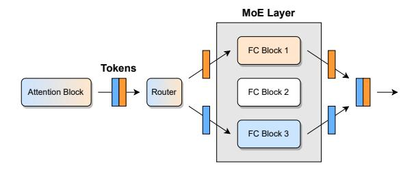

# 2 BACKGROUND

#### 2.1 Mixture of Expert Models (MoEs)

The core idea behind Mixture of Expert models (MoEs) is to increase the number of parameters, and thus the network's modelling power, while at the same time keeping compute costs near-constant, relative to a standard feedforward architecture. This is typically achieved by creating

many copies of certain model components, each of which is responsible for processing only a subset of all input tokens. The corresponding input-to-component assignments are generally decided by a "router" layer. Probably the most common MoE design [\(Fedus et al.,](#page-10-0) [2022;](#page-10-0) [Artetxe et al.,](#page-10-0) [2022\)](#page-10-0), which we also focus on in this paper, is to replicate the fully-connected module of a Transformer and route tokens to the replica, referred to as an *expert*, with the highest assignment score predicted by a linear routing layer; see Figure 1 for an illustration. This design enables efficient training and inference of extremely large models, using 100s or even 1000s of experts, since each token is processed only by a small subset of the massive overall network.

Figure 1. Example of an MoE Transformer block. Each token is routed to a different fully-connected (FC) block.

## 2.2 Data-Dependent Quantization

The currently most effective strategy for reducing model size and corresponding memory costs is *quantization*, i.e., converting model weights to lower numerical precision. While simple rounding can suffice for compression to 8 or even 4 bits, accurately quantizing models to extremely low precision (e.g., lower than 3 bits per parameter) typically requires more sophisticated *data-dependent* methods [\(Nagel et al.,](#page-11-0) [2020;](#page-11-0) [Wang et al.,](#page-11-0) [2020;](#page-11-0) [Hubara et al.,](#page-10-0) [2021\)](#page-10-0).

Such data-dependent quantization methods use a small set of calibration data, which is passed through the model. As this happens, for each linear layer ℓ with weights Wℓ, quantized weights Qℓ are determined one-by-one. Specifically, one approach to do this is by solving a layer-wise quantization problem, stated with respect to Wℓ and the observed calibration data inputs Xℓ at the current layer:

$$\operatorname{argmin}_{Q_{\ell}} ||Q_{\ell}X_{\ell} - W_{\ell}X_{\ell}||. \tag{1}$$

Various solvers for Equation (1) have been proposed, with some optimized, in terms of speed and accuracy, particularly for extremely large models, like GPTQ [\(Frantar et al.,](#page-10-0) [2022\)](#page-10-0) or ZeroQuant [\(Yao et al.,](#page-12-0) [2022;](#page-12-0) [Wu et al.,](#page-12-0) [2023\)](#page-12-0). The former performs quantization using second-order information in the layer-wise Hessian matrix XℓX⊤ ℓ , while the latter applies SGD-optimization with straight-through gradient estimation [\(Bengio et al.,](#page-10-0) [2013\)](#page-10-0).

Another noteworthy characteristic of many such methods is that per-layer quantization can be performed *sequentially*, using the input from the already partially quantized model up to layer ℓ − 1, when quantizing layer ℓ, serving to reduce error accumulation. Concretely, this can be efficiently implemented by using Xℓ to find Qℓ before passing on Xℓ+1 = QℓXℓ to the next layer.

## 2.3 MoE Quantization

There are several aspects which make very-low-bit, e.g. ternary (3 values) quantization promising for MoE models:

- In many architectures, almost all parameters are located in the experts, as they are 1000s of them. This means that, for size reduction, it suffices to focus on compressing just those experts and leave other layers in standard precision. This reduces error accumulation since only a subset of modules involved in a forward pass are actually quantized.
- Previous work has observed that extremely large dense models are more resistant to quantization noise than smaller ones [\(Frantar et al.,](#page-10-0) [2022;](#page-10-0) [Chee et al.,](#page-10-0) [2023\)](#page-10-0). Large MoEs can be much larger than some of these massive dense models, and are thus a prime target for accurate quantization.
- MoE training involves additional stochasticity through routing instabilities and strategies like token dropping [\(Lepikhin et al.,](#page-11-0) [2020\)](#page-11-0), which may inherently encourage high resistance to noise. Finetuning is also often performed with high dropout [\(Fedus et al.,](#page-10-0) [2022\)](#page-10-0).

Our experiments in Section [5.2](#page-7-0) confirm that MoEs are indeed highly robust to extreme levels of quantization.

