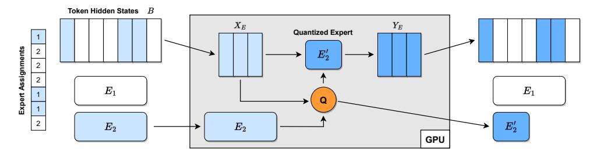

# 3 SCALING UP DATA-DEPENDENT QUANTIZATION TO MOES

#### 3.1 Challenges

While data-dependent quantization techniques have already been used to successfully compress large dense models up to 176 billion parameters [\(Frantar et al.,](#page-10-0) [2022;](#page-10-0) [Wu et al.,](#page-12-0) [2023\)](#page-12-0), applying them to *sparse mixture-of-expert models another order of magnitude larger* brings several new challenges.

Memory Costs. The first major problem we encounter is a large increase in the memory required to apply such techniques. Not only are the original model weights nearly 10× larger, but the quantization process itself also needs > 100× more data. The latter constraint is because accurate datadependent quantization methods require a sufficient number of input samples for each layer that is being compressed. For very large dense models, a few hundreds of thousands of "calibration tokens" typically suffice [\(Frantar et al.,](#page-10-0) [2022;](#page-10-0) [Yao et al.,](#page-12-0) [2022\)](#page-12-0). However, in MoEs with thousands of layers, a single expert processes only a small subset of all inputs, hence we need much more tokens overall to achieve

good coverage of all experts. Further, in encoder-decoder architecture models, like SwitchTransformers, each token is processed only by half of the model, again increasing data requirements. For *fast* compression, we must maintain intermediate results for the full calibration dataset, which requires 100s of GBs of memory for the largest models.

GPU Utilization. The next significant challenge is that existing large-scale quantization implementations, in particular for GPTQ and related methods [\(Frantar et al.,](#page-10-0) [2022;](#page-10-0) [Chee et al.,](#page-10-0) [2023\)](#page-10-0), are designed to be fast and memory efficient for the massive individual layers occurring in dense models. Meanwhile, MoEs typically have smaller layers, but 100× to 1000× more of them. Current implementations have poor GPU utilization in this case, and consequently bad performance. A similar issue occurs if activations and weights have to be transferred between CPU and GPU with high frequency, which may be required to cope with the massive memory requirements discussed previously.

Reliability Requirements. Finally, another issue when compressing models with tens of thousands of layers is that running into rare edge cases, which may break the process, is highly likely. This is includes numerical problems like noninvertible layer-wise Hessians, as well as model-specific ones, e.g., extreme routing patterns on particular layers.

#### 3.2 System Design & Optimizations

In this section, we describe system-level design and optimizations to address the challenges in Section 3.1. This allows us to apply data-dependent compression to massive MoEs, while preserving the key feature of post-training compression techniques: the ability to perform effective compression using only modest computational resources, e.g., a single NVIDIA A6000 GPU and less than one day of compute. Although we focus on scaling the popular GPTQ method, most techniques described below will generalize to other approaches, like ZeroQuant [\(Yao et al.,](#page-12-0) [2022\)](#page-12-0), as well.

Optimized Activation Offloading. As discussed before, a key challenge in compressing MoEs is that we need to maintain massive activation sets. Yet, it is possible to carefully orchestrate model execution in such a way that we only ever need to perform computation on a small subset of the intermediate data. This allows us to offload main storage from GPU, to much less expensive and plentiful CPU memory.

Concretely, we maintain a single large buffer B which we update as follows, for the dense part of a Transformer block:

- 1. Fetch one "sample" X, containing a few hundreds of tokens, from CPU to GPU.
- 2. Pass it through the corresponding dense layers to obtain the result Y .

Figure 2. Illustration of the offloading execution for the sparse part of a Transformer block. An expert  $E_2$  and its corresponding input tokens  $X_E$  are fetched to GPU memory to produce  $E'_2$ , which together with the corresponding outputs  $Y_E$  are written back to CPU again.

- 3. Calculate and store expert assignment for tokens in Y.
- 4. Send Y back to CPU and overwrite X in B.

and respectively for the sparse part, looping over experts:

- 1. Fetch all individual tokens in B that have been assigned to expert E, denoted by  $X_E$ , from CPU to GPU.
- 2. Use them to produce compressed expert E' (for example, with GPTQ).
- 3. Run  $X_E$  through E' to get  $Y_{E'}$ .
- 4. Send  $Y_{E'}$  back to CPU and overwrite  $X_E$  in B.

This process, which is visualized in Figure 2, minimizes both memory consumption and transfer cost: we need only a single copy of B and each token is only read and written twice per Transformer block.

**List Buffer.** To efficiently support per-sample access for evaluating dense model components, as well as fully-vectorized querying of expert tokens, we store B as a *list buffer* data structure. This can be seen as a huge contiguous buffer of all token hidden states, together with delimiter indices denoting boundaries between individual samples. Figure 3 illustrates this storage format. This datastructure is crucial for efficiency; naively iterating over samples and fetching relevant tokens via masking is unusably slow for large sample counts.

Figure 3. List buffer example with 3 samples, indicated by hue.

**Lazy Weight Fetching.** Since the weights of the 1.6 trillion parameter model consume 3.2 TB of storage, they cannot even be stored in CPU RAM. Thus, we lazily fetch them directly from disk storage as they are required. If we follow the inference procedure outlined previously, this would be exactly once. Afterwards, their memory is released again.

**Expert Grouping.** Additionally, in order to avoid GPU underutilization (see Section 3.1), we group multiple experts together and apply a joint *batched variant* of the GPTQ algorithm. Concretely, we extract the inputs  $X_E$  corresponding to all experts  $E \in \mathcal{E}$  in group  $\mathcal{E}$  (the  $X_E$  will generally have different sizes) and compute Hessians  $H_E$ . These matrices, together with the weight matrices  $W_E$ , are then stacked to 3-dimensional tensors, on which our modified GPTQ algorithm operates, compressing all experts simultaneously. We can also compute  $H_E = X_E X_E^{\top}$  directly with a single matmul as the  $X_E$  are generally small enough, avoiding the slow per-sample accumulation employed by prior implementations. Our default expert groupsize  $|\mathcal{E}|$  is 16, which we find to bring a good trade-off between GPU memory consumption and utilization.

Table 1 demonstrates the impact of expert grouping via GPTQ batching, when compressing a sparse encoder layer of switch-base-128 using 10k samples;  $|\mathcal{E}|=16$  yields about  $\approx 6\times$  speedup over standard per-expert computation.

| $ \mathcal{E}  = 1$ | $ \mathcal{E}  = 4$ | $ \mathcal{E}  = 16$ |
|---------------------|---------------------|----------------------|
| 174.1s              | 54.4s               | 28.8s                |

*Table 1.* Sparse layer compression time for different  $|\mathcal{E}|$ .

**Robustness Modifications.** To achieve sufficiently high robustness for successfully quantizing trillion parameter models with tens of thousands of layers, we need to employ various numerical and memory adjustments. The most important are listed below:

- We use  $10 \times$  higher relative Hessian dampening  $\delta = 0.1$ , avoiding breakdowns with inf-values.
- Very few layer Hessians are not invertible even after high dampening; we skip GPTQ for those and simply perform vanilla rounding.
- Sometimes an expert receives a number of tokens that is much larger than average, leading to out-of-memory situations when these are fetched to GPU. We avoid this by capping the maximum number of tokens used for compression at  $4\times$  the mean and use multiple iterations for computing and updating  $Y_E$  in such cases.

### 3.3 Accuracy Improvements

In addition to implementing a highly efficient compression system, we also make new discoveries about applying GPTQ in our particular context, i.e., for models trained for maskedlanguage-modelling, MoEs and ternary quantization.

Premasking Special Tokens. First, we find that results can be improved if the various special separator tokens inserted by the masked-language-modelling task [\(Raffel](#page-11-0) [et al.,](#page-11-0) [2020b\)](#page-11-0) are excluded from the calibration data used for compression. Concretely, in the encoder, we mask out those "mask-tokens" during the Hessian computation. Meanwhile, in the decoder, we skip the token directly *before* such a special token as this is the one used to predict the latter.

As shown in Table 2 for switch-base-128 with 10k samples, this brings noticeably lower loss at no additional compute cost. We think that because those tokens are very common during training, the model is so robust in their prediction that any error compensation on them during quantization is unnecessary, while worsening correction for other tokens.

| mask | BF16 | 2bit | tern |
|------|------|------|------|
| no   | 1.73 | 1.86 | 2.16 |
| yes  | 1.73 | 1.76 | 1.99 |

Table 2. Impact of special token masking; validation loss.

