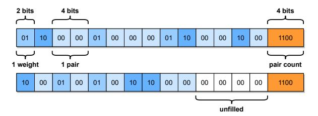

# 4 REALIZING SUB-1-BIT COMPRESSION

Using our system discussed in Section [3,](#page-2-0) we can accurately quantize extremely large SwitchTransformers to very low bit-widths: 2-bit and even ternary (3 possible values). Yet, in practice, this falls still short of our compression goal of less than 1 bit per parameter. We find that compression rates can be pushed significantly further by taking advantage of the *low entropy in the quantized weights*. Next, we co-design an encoding scheme and a CUDA kernel which realize sub-1-bit per weight compression in practice, at minimal cost in terms of GPU execution overhead for inference.

## 4.1 Natural Sparsity

We pick quantization grids in standard fashion: row-wise around the min and max weights values [\(Dettmers et al.,](#page-10-0) [2022;](#page-10-0) [Frantar et al.,](#page-10-0) [2022\)](#page-10-0), e.g., for ternary: {wmin, 0, wmax}. These rather wide grids combined with the fact that weights are typically close to normally distributed, *naturally* lead to high sparsity after quantization, i.e., a large number of zeros. We demonstrate this in Table 3, averaged over all layers. For ternary weights, the largest model achieves close to *90% natural sparsity*; the standard deviation is also quite low, at < 5%. Seen another way, the quantized weights have low entropy, meaning that, on average, significantly less bits per weight should be required for lossless storage.

| model    | 2-bit | ternary |
|----------|-------|---------|
| base128  | 72.2% | 85.7%   |
| large128 | 73.1% | 86.4%   |
| c2048    | 76.5% | 88.6%   |

Table 3. Natural sparsity for different compressed models.

## 4.2 From Sparsity to Entropy

The direct way of utilizing these high zero proportions would be in form of a joint sparse & quantized representation [\(Kurtic et al.,](#page-11-0) [2022;](#page-11-0) [Yu et al.,](#page-12-0) [2023\)](#page-12-0): storing only the quantized values of non-zero weights, together with necessary position metadata. However, as our base quantization levels are already very low, standard sparsity metadata formats [\(Elsen et al.,](#page-10-0) [2020;](#page-10-0) [Lin et al.,](#page-11-0) [2023\)](#page-11-0) would only allow limited additional compression. A bitmask indicating non-zero locations requires 1 bit per weight, while 10-13 bit (depending on layer size) column indices are even less memory efficient at the sparsity levels we encounter. Therefore, we take a different approach: we do not utilize sparsity directly but rather the *low entropy*, which is implied by the fact that a single value (0) occurs very frequently.

#### *4.2.1 Fast GPU Decoding Challenges*

In principle, we could group multiple consecutive ternary weights into super-symbols and then apply a code which assigns *variable length codewords* to those super-symbols, based on their probability of occurrence, for example, via a Huffman approach [\(Huffman,](#page-10-0) [1952\)](#page-10-0). If the quantized weight values were close to independent, this would achieve strong compression rates; in fact, for actual independence, they would be essentially Shannon-optimal [\(MacKay,](#page-11-0) [2003\)](#page-11-0).

At the same time, our primary goal is to use compressed models for *fast and space-efficient inference*. Thus, it is critical not only that our encoding scheme achieves good compression, but also that it can be decoded fast on GPU hardware. This is challenging for a number of reasons:

Challenge 1: Entropy-based codes generally possess sequential decoding dependencies: symbol i can only be determined if the length, which is variable, of all (i − 1) prior symbols is known. Hence, processing consecutive symbols simultaneously leads to high synchronization overhead.

Challenge 2: Binary words in storage (e.g., INT32 blobs) may contain different numbers of decoded symbols. Consequently, even if rows/blocks are encoded independently, parallel decoding will happen non-uniformly, while all threads in a GPU-warp must always execute the same instruction. This would result in many wasted operations.

Challenge 3: Variable-length low-bit decoding involves a large number of binary operations like shifts, which are not particularly efficient on GPUs.

<span id="page-5-0"></span>Challenge 4: Individual matrices of MoEs are typically not very large, making it difficult to split them into enough separately decoded segments to achieve good GPU utilization without having to store additional data to break sequential dependencies, which would harm compression rates.

In contrast, uncompressed half-precision matrix-vector products, which are the primary operation underlying generative inference, easily achieve close to ideal memory-bandwidth utilization and thus present a very strong baseline.

## 4.3 Compression Scheme & Kernel Co-design

To achieve our goal, we need to design a compression scheme and its GPU decoding kernel *jointly*, and potentially trade off compression for faster decoding. We begin with an overview of the main ideas behind our approach, followed by an in-depth discussion of key details.

#### *4.3.1 Overview*

Instead of a code with variable length codewords (see Section [4.2.1\)](#page-4-0) mapping to fixed length data, we will use a *dictionary-based* code with fixed length codewords mapping to a variable number of symbols. Such LZW-based schemes [\(Welch,](#page-11-0) [1984\)](#page-11-0) are popular for general purpose compression like ZIP, as they are particularly effective for text data with long repeated segments. While a dictionary code is not ideal in terms of compression rate for the case of almost-random data in our application, it will be key for fast GPU decoding.

First, our kernel design uses one warp, that is 32 consecutive threads, to handle a row of a weight matrix, each of which is encoded independently. This addresses Challenge 4 in Section [4.2.1,](#page-4-0) yielding reasonable GPU utilization for relevant matrix sizes, with negligible metadata overhead. Further, we use a fixed-to-variable code with a large dictionary. This allows us to use a full warp to process one codeword at-atime, extracting all data, while maintaining good efficiency, thus working around Challenges 1 and 2. This way, slow bit and base-3 operations (for ternary) can also be kept at a minimum, resolving Challenge 3.

#### *4.3.2 Dictionary Design and Implementation*

In general, assume that the values of a ternary weight matrix (denoted by 0, 1, 2) are distributed close to independently according to the distribution:

$$P(0) = p_0, \quad P(1) = P(2) = \frac{1 - p_0}{2},$$
 (2)

where p<sup>0</sup> denotes the probability of sampling 0, e.g., 0.885 as per Table [3.](#page-4-0) As we plan to use a rather large dictionary, it should be shared between many weight matrices to not cause substantial storage overheads. We find that such a static dictionary works well enough, while simplifying memory efficient compression (see Section [3.2\)](#page-2-0) as we do not have to collect statistics over many yet uncompressed experts.

Next, we consider pairs of ternary values t = (t1, t2), whose corresponding probability is P(t) = P(t1)P(t2). We generate the 2 <sup>16</sup> highest probability sequences containing at most 14 such pairs. This dictionary can be generated using a max-priority queue on probability, as shown by Algorithm 1.

#### Algorithm 1 Generate decoding dictionary sequences.

```
Q ← max priority queue containing (1.0,())
while |D| < 2
              16 do
  p, s ← pop(Q)
  append s to dictionary if 0 < |s| < 28
  for t ∈ {(t1, t2)|t1, t2 ∈ {0, 1, 2}} do
     push((p · P(t), cat(s, t)), Q)
  end for
end while
```

To briefly understand the procedure, notice that upon the first iteration, it will push all individual pairs t = (t1, t2) to the priority queue, sorting them by decreasing probability, after which they will be expanded in this order.

We have exactly 2 <sup>16</sup> codewords as this allows us to store them in the native UINT16 datatype, avoiding any slow bitextractions at this decoding level. Each of those codewords maps to two consecutive UINT32 values containing up to 7 pairs each, stored using 2 bits per ternary value, followed by the total number of pairs in the sequence; see also Figure 4. This format dictates our maximum chosen pair count of 14. Further, we consider pairs, rather than individual weights, to fit the maximum count into 4 bits. The 2-bit-per-weight format is used as there is enough space, while a more compact ternary encoding would involve slow modulo and division operations for extraction. We store the pair-count twice so that each thread can work with only half of the data, stored in a fast INT32 type.



Figure 4. Data format of a dictionary entry; here of 24 weights.

Overall, mapping 16-bit codewords to 64-bit data blobs strikes a good balance between several goals: (a) Having codewords map to, on average, more uncompressed values than their bitwidth, a necessary condition for achieving < 1 bit compression. (b) Minimizing the overall storage cost of the dictionary to fit into the L2-cache of the GPU, which is critical for good decoding performance. (c) Utilizing as many threads in a warp as possible for simultaneously extracting plain weights from the decoded data; usually, > 16 will do useful work and only 4 out of 32 threads are

<span id="page-6-0"></span>never active in this step. (d) Avoiding as many conditionals and extra operations necessary for dealing with non-uniform data storage as possible, which slow down parallelization.

Finally, we note that while dictionary lookups are in principle random access, keeping it sorted from highest to lowest probability ensures very favorable caching behavior. Since each lookup also automatically prefetches several subsequent elements, and most lookups are for frequently occurring codewords, there are many fast L1-cache hits.

**Validation.** To assess the effectiveness of our scheme, we compute achieved compression rates, both on a real ternary quantized c2048 model as well as on weight matrices sampled directly from distribution (2), yielding  $20.07 \times$  and  $21.11 \times$ , respectively. This gap of only  $\approx 5\%$  suggests that our simplifying independence assumption is indeed quite close for large models. We also note that our rates are only  $\approx 20\%$  away from the distribution's (with p=0.885) theoretical compression limit of  $25.40 \times$ , which we consider a reasonable trade-off for enabling fast GPU decoding.

#### 4.3.3 GPU Kernel

Having defined the dictionary format, we now discuss the design of the actual decoding kernel. We focus on the most important operation for inference, decompression fused with a matrix-vector-product. However, our techniques can easily be adapted to other use-cases, e.g., pure decompression.

Listing 1 provides CUDA-like pseudocode for our kernel, computing the matrix-vector-product of compressed matrix w\_comp (with metadata row\_off and ter\_minmax, using dictionary dec) and BF16 vector x, into output buffer y. The handling of various edge cases and some index calculations have been removed for readability. Please see our source code for the fully functional implementation.

```
template <int num_warps, int w_width>
    __global__ void Sub1MatVec(
      int* dec,
      ushort* w_comp, int* row_off,
                                              _nv_bfloat162* ter_minmax,
        _nv_bfloat16* x, __nv_bfloat16* y
         _shared__ float x_shared[w_width];
      for (int i = thread; i < w_width; i += 32 * num_warps)</pre>
         x shared[i] = bfloat162float(x[i]);
        _shared__ float deg[3][32 * num_warps];
      \frac{-}{\text{deq}[0][\text{thread}]} = 0;
      deq[0][thread] = __bfloat162float(ter_minmax[row].x);
deq[2][thread] = __bfloat162float(ter_minmax[row].y);
15
      __syncthreads();
      __shared__ w_comp_block[32][num_warps];
19
20
21
      int idx = 0;
22
23
24
25
26
27
28
      for (int i = 0; i < row off[row + 1] - row off[row]; i += 32) {
         w_comp_block[warp][lane] = w_comp[i + lane];
         if (lane < 28) {
           for (int j = 0; j < 32; j++) {
  int enc = w_comp_block[warp][j];</pre>
              int wx14 = dec[2 * enc + (lane / 14)];
int ter = (wx14 >> (4 + 2 * (lane % 14))) & 0x3;
              float w = deq[ter][thread];
31
32
              res += w * x_shared[idx + lane];\nidx += 2 * (wx14 & 0xf);
```

```
33
```

Listing 1. Simplified kernel pseudocode for a fused decompress + matrix-vector-product operation.

Parallelization. Overall, each threadblock will handle multiple consecutive rows, each of which is processed by a single warp. We use exactly one threadblock per GPU Streaming Multiprocessor (SM) with min(#rows\_in\_block, 32) warps; if there are more than 32 rows in a block, (some) warps sequentially process multiple rows (note that this part is omitted in Listing 1 for simplicity). This avoids any bad wave quantization effects. We find this strategy to be an effective heuristic that yields good performance for all matrix shapes we consider.

**Execution.** Our kernel starts by loading the entire input vector to shared memory (x\_shared, lines 7-9), using all warps in a threadblock. This enables fast element access in the subsequent per-row product-sum accumulations.

Next, each warp processes its corresponding row by first fetching (up to) 32 codewords into shared memory (w\_comp\_block, line 23) using a single coalesced transaction. It then loops over those symbols, processing one-ata-time (lines 26-33). First, using 28 of its 32 threads (line 25), it fetches the corresponding decoding data from the dictionary where the first UINT32 is assigned to threads 0-13 and the second to threads 14-27 (wx14, line 27). Then, each thread extracts its corresponding ternary weight (lines 29-30) and adds the corresponding input product into its own partial result accumulator (res, line 31). We note that the input reads from shared memory are contiguous and do not cause bank conflicts. Afterwards, each thread advances the offset index (idx, line 32) into the input vector by the total number of weights encoded in the current symbol.

Finally, after the full row has been scanned, a warp-reduction (lines 37-38) over the partial results of each thread yields the output (y, lines 39-40).

**Ternary Decoding.** Another relevant detail is that ternary weights are stored as 0, 1, 2 (line 29) but need to be dequantized to  $0, w_{\min}, w_{\max}$  for multiplication with inputs. We found that the most efficient way of performing this conversion is via a shared memory lookup table (lines 11-14). Crucially, this table needs to be replicated 32 times across the column-dimension to avoid very frequent bank conflicts, which would otherwise occur every time not all 28 threads dequantize the same value (line 30). Fortunately, there are only 3 input values and so its overall size is tolerable.

