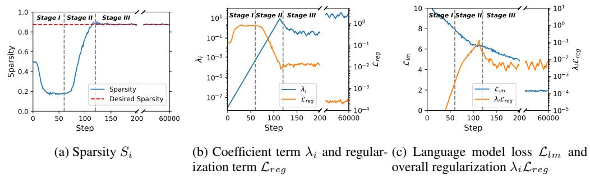
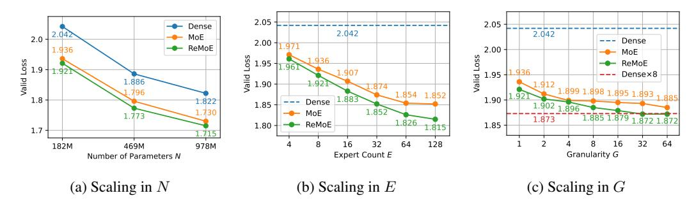
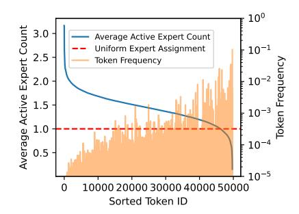
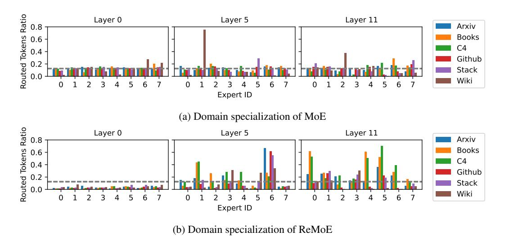

# 1 INTRODUCTION

Transformer models [\(Vaswani, 2017\)](#page-13-0) consistently improve performance as the number of parameters increases [\(Kaplan et al., 2020\)](#page-11-0). However, scaling these models is constrained by computation resources. Sparsely activated Mixture-of-Experts (MoE) [\(Shazeer et al., 2017\)](#page-12-0) mitigates this challenge by employing a sparse architecture that selectively activates a subset of parameters during both training and inference. This conditional computation allows MoE models to expand model capacity without increasing computational costs, offering a more efficient alternative to dense models.

The key component in MoE is the routing network, which selects the experts to activate for each token. Various routing methods [\(Shazeer et al., 2017;](#page-12-0) [Lewis et al., 2021;](#page-11-1) [Roller et al., 2021;](#page-12-1) [Zhou](#page-13-1) [et al., 2022\)](#page-13-1) have been proposed, with TopK routing [\(Shazeer et al., 2017\)](#page-12-0) being the most commonly adopted. However, the vanilla TopK router introduces a discrete and non-differentiable training objective [\(Shazeer et al., 2017;](#page-12-0) [Zoph et al., 2022\)](#page-13-2), limiting the performance and scalability.

Recent works on fully-differentiable MoE aim to overcome this limitation. Soft MoE [\(Puigcerver](#page-12-2) [et al., 2023\)](#page-12-2) introduces token merging, while SMEAR [\(Muqeeth et al., 2023\)](#page-12-3) proposes expert merging. However, both approaches break token causality, making them unsuitable for autoregressive models. Lory [\(Zhong et al., 2024\)](#page-13-3) improves upon SMEAR and is applicable to autoregressive models. But it underperforms vanilla MoE with TopK routing.

In this work, we address the discontinuities by introducing ReMoE, an MoE architecture that incorporates ReLU routing as a simple yet effective drop-in replacement for TopK routing. Unlike TopK routing, which computes a softmax distribution over the experts and calculates a weighted sum of the largest K experts, ReLU routing directly controls the active state of each expert through a ReLU gate. The number of active experts is determined by the sparsity of the ReLU function. To maintain the desired sparsity, we propose adding a load-balancing refined L1 regularization to the router outputs, with an adaptively tuned coefficient. This approach ensures that ReMoE maintains the same computational costs as TopK-routed MoE.

∗Corresponding author

Figure 1: Compute flows of vanilla MoE with TopK routing and ReMoE with ReLU routing. Positive values are shown in orange, and negative values in blue, with deeper colors representing larger absolute values. Zeros, indicating sparsity and computation savings, are shown in white. The red dash arrows in TopK routing indicate discontinuous operations. Compared with TopK routing MoE, ReMoE uses ReLU to make the compute flow fully differentiable.

Compared to TopK routing, ReLU routing is continuous and fully differentiable, as the ReLU function can smoothly transition between zero and non-zero values, indicating inactive and active. Besides, ReLU routing manages the "on/off" state of each expert independently, offering greater flexibility. Moreover, the number of activated experts can vary across tokens and layers, enabling a more efficient allocation of computational resources. Further analysis reveals that ReMoE effectively learns to allocate experts based on token frequency and exhibits stronger domain specialization.

Our experiments on mainstream LLaMA (Touvron et al., 2023) architecture demonstrate that ReLU routing outperforms existing routing methods including TopK routing and fully-differentiable Lory. Through an extensive investigation across model structures, we find that ReMoE consistently outperforms TopK-routed MoE across a broad range of active model sizes (182M to 978M), expert counts (4 to 128), and levels of granularity (1 to 64) (Krajewski et al., 2024). Notably, in terms of scaling behavior, we observe that ReMoE exhibits a steeper performance improvement as the number of experts scales up, surpassing traditional MoE models.

#### 2 PRELIMINARIES

#### 2.1 MoE for Decoder-Only Transformer

A typical decoder-only Transformer model consists of L layers, each containing a Self-Attention module and a Feed-Forward Network (FFN) module. MoE modifies this structure by replacing each FFN module with an MoE module, which comprises a small router and several experts  $\text{FFN}_1,\ldots,\text{FFN}_E$ , where each expert is equivalent to the original FFN and E denotes the number of experts. Given the input  $\boldsymbol{x}^l = (\boldsymbol{x}_t^l)_{t=1}^T \in \mathbb{R}^{T \times d}$  of the layer l, where T is the number of tokens in a batch and l is the hidden size, the output  $\boldsymbol{y}^l = (\boldsymbol{y}_t^l)_{t=1}^T$  is computed as:

$$\boldsymbol{y}_t^l = \sum_{e=1}^{E} R(\boldsymbol{x}_t^l)_e \text{FFN}_e(\boldsymbol{x}_t^l; d_{ffn})$$
 (1)

Here,  $R(\cdot)$  represents the routing function, and  $d_{ffn}$  is the intermediate size of the FFN, typically set to  $d_{ffn}=4d$ .

#### 2.2 TOPK ROUTING

TopK routing (Shazeer et al., 2017; Lepikhin et al., 2020; Fedus et al., 2022) is the most commonly used method for defining the routing function  $R(\cdot)$ . It introduces sparsity in the MoE computation

by forcibly zeroing out smaller elements:

$$R(\boldsymbol{x}_{t}^{l}) = \text{TopK}(\text{Softmax}(\boldsymbol{x}_{t}^{l}\boldsymbol{W}_{l}), k)$$
(2)

where  $W_l \in \mathbb{R}^{d \times E}$  is the router's weight matrix, and  $\text{TopK}(\cdot, k)$  retains the top k largest values while setting the rest to zero. This mechanism allows for skipping the computation of the FFNe functions corresponding to the zeroed-out  $R(\boldsymbol{x}_t^l)_e$  values in both the forward and backward passes.

#### 3 Our Method: ReMoE

#### 3.1 MOTIVATION: FROM TOPK TO RELU

For a given token  $x = (x_e)_{e=1}^E$  after Softmax, TopK introduces a jump discontinuity at the k-th largest value, denoted as  $x_{[k]}$ , by zeroing out the values smaller than  $x_{[k]}$ . This can be expressed as:

$$TopK(\boldsymbol{x}, k)_e = x_e \cdot \mathbf{1}\{x_e \ge t(\boldsymbol{x}, k)\}, \quad t(\boldsymbol{x}, k) = x_{[k]}$$
(3)

where  $\mathbf{1}\{\cdot\}$  is the indicator function, returning 1 if the condition is met and 0 otherwise.

As shown in Figure 2, the jump discontinuity can be eliminated by setting the breakpoint  $t(\boldsymbol{x},k)\equiv 0$ , which actually corresponds to the ReLU function:

$$ReLU(\boldsymbol{x})_e = x_e \cdot \mathbf{1}\{x_e \ge 0\} \tag{4}$$

Figure 2: Comparison between TopK and ReLU.

At a high level, ReLU improves upon TopK by

aligning the breakpoints of all inputs and setting them to 0. This ensures that the output is continuous at 0, where the experts transition between active and inactive. As a result, the training pipeline becomes fully differentiable.

#### 3.2 DIFFERENTIABLE RELU ROUTING

We define the ReLU routing function as follows:

$$R(\boldsymbol{x}_t^l) = \text{ReLU}(\boldsymbol{x}_t^l \boldsymbol{W}_l) \tag{5}$$

with  $(1 - \frac{k}{E})$  being the desired sparsity of ReLU, where k is the number of active experts and E is the total number of experts. This ensures that the computational cost remains equivalent to that of TopK routing.

In vanilla TopK routers, the Softmax outputs sum to 1, representing the probabilities of selecting each expert, after which TopK eliminates those with lower probabilities. In contrast, ReLU routers discard the Softmax function, relying on ReLU's naturally non-negative outputs. The outputs of ReLU routers represent the weights assigned to each expert, which can include 0. Instead of hard-coding expert selection with a discontinuous TopK function, ReLU allows the router to learn which experts to activate (i.e., when to produce 0s) in a fully differentiable manner.

Another key difference is that in TopK routing, each token is routed to exactly k experts, whereas in ReLU routing ReMoE, the routing decisions are independent, allowing tokens to be routed to a variable number of experts. This flexibility is advantageous, as not all tokens have the same level of difficulty. ReMoE can allocate more computational resources to more challenging tokens, a dynamic allocation strategy that we explore further in Section 5.1.

TopK routing introduces a discrete loss function when the set of activated experts changes, whereas ReLU routing remains continuous and fully differentiable. For instance, in a two-expert Top1-routing model, a small weight update that alters the softmax result from  $x_1 = (0.51, 0.49)$  to  $x_2 = (0.49, 0.51)$  shifts the TopK output from (0.51, 0) to (0, 0.51), creating a discontinuity. In contrast, ReLU routing only changes the activated experts when the routing output is near zero. For example, an output shift from (0.01, 0) to (0, 0.01) remains continuous. Further details on the stability analysis of these two routers can be found in Appendix A.

A comparison of the compute flow between ReMoE and MoE is shown in Figure 1.

#### 3.3 Controlling Sparsity via Adaptive $L_1$ Regularization

ReMoE controls computational costs by managing the sparsity of the ReLU output, targeting a sparsity level of  $(1-\frac{k}{E})$ . However, directly training the ReLU router often results in lower sparsity, as the model tends to activate more experts to increase capacity. To meet the desired budget, we need to enforce higher sparsity in the ReLU output.

We achieve this by introducing a regularization loss,  $\mathcal{L}_{reg}$ , to the loss of language model,  $\mathcal{L}_{lm}$ :

$$\mathcal{L} = \mathcal{L}_{lm} + \lambda_i \mathcal{L}_{req},\tag{6}$$

where  $\lambda_i$  is an adaptive coefficient based on the current training step *i*. Initially, we set  $\lambda_0$  to a small value and employ a simple zeroth-order algorithm to update it:

$$\lambda_{i+1} = \lambda_i \cdot \alpha^{\operatorname{sign}((1 - \frac{k}{E}) - S_i)} \tag{7}$$

Here,  $\alpha > 1$  is a preset update multiplier, and  $S_i$  denotes the average sparsity of all router outputs at the step i:

$$S_i = 1 - \frac{1}{LTE} \sum_{l=1}^{L} \sum_{t=1}^{T} \sum_{e=1}^{E} \mathbf{1} \{ R(\boldsymbol{x}_t^l)_e > 0 \}$$
 (8)

The idea behind Equation 7 is that when the average sparsity  $S_i$  falls below the target sparsity  $(1-\frac{k}{E})$ , we increase  $\lambda_i$  by a factor of  $\alpha$ , strengthening the regularization and encouraging higher sparsity. Conversely, if the sparsity exceeds the target,  $\lambda_i$  is reduced. We heuristically set  $\lambda_0 = 1e^{-8}$  and  $\alpha = 1.2$  in all our experiments, and demonstrate the robustness of these hyperparameters in Appendix B.

The regularization term  $\mathcal{L}_{reg}$  uses the  $L_1$ -norm, following prior work (Li et al., 2022; Song et al., 2024), to effectively encourage sparsity:

$$\mathcal{L}_{reg} = \frac{1}{LT} \sum_{l=1}^{L} \sum_{t=1}^{T} \|R(\boldsymbol{x}_{t}^{l})\|_{1} = \frac{1}{LT} \sum_{l=1}^{L} \sum_{t=1}^{T} \sum_{e=1}^{E} R(\boldsymbol{x}_{t}^{l})_{e}$$
(9)

The second equation holds because the output of the ReLU function is non-negative.

The term  $\mathcal{L}_{reg}$  represents the average value of all router outputs, including zeros. By taking the derivative of  $\lambda_i \mathcal{L}_{reg}$ , we observe that the regularization effect adds  $\frac{\lambda_i}{LT}$  to the gradient of each non-zero router output, effectively driving the outputs toward zero and enhancing sparsity.

With this  $L_1$  regularization, we can control the sparsity around the desired level of  $(1-\frac{k}{E})$  with only minor fluctuations, as shown in Figure 3. Consequently, ReMoE ensures that, on average, tokens are routed to k experts across different layers and tokens, maintaining the same FLOPs as vanilla TopK-routed MoE from a statistical perspective. Our benchmarking results in Appendix D demonstrate that ReMoE can achieve nearly identical training and inference throughputs as conventional MoE, providing an efficient alternative without compromising speed.

Figure 3: The sparsity of ReMoE with E=8, k=1 is effectively maintained around the desired target. Sparsity values for all steps are plotted without averaging or sampling. The mean and standard deviation are calculated excluding the first 100 warm-up steps.

### 3.4 Integrate Load Balancing into $L_1$ Regularization

Load imbalance is a significant issue in MoE design, potentially leading to routing collapse (Shazeer et al., 2017; Muennighoff et al., 2024) and uneven computational distribution across multiple devices. The  $L_1$  regularization in Equation 9 treats the router output for each expert e and each layer l equally, which can contribute to load balancing problems.

Figure 4: Natural Three Stage Training in ReMoE.

To address this, we introduce a load-balancing refinement to the  $L_1$  regularization:

$$\mathcal{L}_{reg,lb} = \frac{1}{LT} \sum_{l=1}^{L} \sum_{t=1}^{T} \sum_{e=1}^{E} f_{l,e} R(\mathbf{x}_{t}^{l})_{e}$$
(10)

$$f_{l,e} = \frac{E}{kT} \sum_{t=1}^{T} \mathbf{1} \{ R(\boldsymbol{x}_t^l)_e > 0 \}$$
 (11)

Here,  $f_{l,e}$  is non-differentiable and represents the average activation ratio of expert e in layer l, relative to the desired ratio  $\frac{k}{E}$ . This serves as a weight for the corresponding router output, modifying the added gradient of non-zero router outputs to  $\frac{f_{l,e}\lambda_i}{LT}$ . This mechanism penalizes experts receiving more tokens by driving their router outputs toward zero more rapidly.

Although derived from regularization, this formulation is *identical* to the load-balancing loss in vanilla TopK routing (Fedus et al., 2022). In TopK routing, the outputs of Softmax sum to 1, giving the loss a lower bound of 1. In contrast, ReLU routing outputs can be arbitrarily small, making  $\mathcal{L}_{reg,lb}$  trivially bounded at 0. Therefore, unlike in MoE, we cannot fix the coefficient  $\lambda_i$  in ReMoE, as this would lead to routing collapse toward 0. Thanks to the adaptive update of  $\lambda_i$ , we can balance sparsity control and load balancing within a single formulation, as given in Equation 10.

Further discussion on load balancing in ReMoE can be found in Section 5.2, and we adopt this load-balancing refined  $L_1$  regularization in our later experiments.

#### 3.5 NATURAL THREE-STAGE TRAINING IN REMOE

With the regularization scheme described above, we observe a clear and naturally occurring three-stage separation during the training of ReMoE as is depicted in Figure 4.

The first stage is the warm-up stage, or the dense stage. During this stage,  $\lambda_i$  is small, while  $\mathcal{L}_{lm}$  is large and decreases rapidly. Training ReMoE at this stage is nearly equivalent to training its dense counterpart with the same total number of parameters. Each expert processes more than half of the tokens, allowing the experts to diversify from their random initializations.

The second stage is the sparsifying stage, or the dense to sparse stage. At this point, the sparse regularization term  $\lambda_i \mathcal{L}_{reg}$  becomes significant, causing the ReLU routers to activate fewer experts. This forces the experts to become more diverse without causing an increase in  $\mathcal{L}_{lm}$ .

The third stage is the stable stage, or the sparse stage. In this phase, the sparsity  $S_i$  stabilizes at the preset target. During this stage,  $\mathcal{L}_{lm}$  is optimized while being softly guided along the sparse subspace by  $\mathcal{L}_{reg}$ . Both  $\mathcal{L}_{reg}$  and  $\lambda_i$  change very slowly, with  $\mathcal{L}_{reg}$  gradually decreasing and  $\lambda_i$  gradually increasing. However, the overall regularization term,  $\lambda_i \mathcal{L}_{reg}$ , remains relatively constant.

It should be noted that Stages I and II introduce additional computational cost and memory consumption since more experts are activated. However, the time overhead is negligible since they generally require only  $\sim 100$  iterations ( $\sim 0.17\%$  of the total steps in our setting, benchmarking results are detailed in Appendix D). The memory overhead can be minimized by temporarily reducing the micro-batch size or by employing the activation checkpointing technique that avoids storing intermediate results of activated experts by recomputing them on-the-fly during the backward pass.

| Model          | ARC-c | ARC-e | BoolQ | HellaSwag | LAMBADA | PIQA  | RACE  | Avg.  |
|----------------|-------|-------|-------|-----------|---------|-------|-------|-------|
| Dense          | 19.45 | 43.35 | 54.40 | 28.61     | 31.09   | 61.97 | 28.52 | 38.20 |
| Hash           | 19.28 | 45.45 | 54.95 | 29.68     | 31.44   | 63.06 | 27.66 | 38.79 |
| Lory           | 20.31 | 42.97 | 49.54 | 28.75     | 32.35   | 62.24 | 27.75 | 37.70 |
| SparseMixer-v2 | 19.80 | 46.72 | 45.96 | 30.24     | 34.12   | 62.89 | 29.00 | 38.39 |
| EC             | 18.86 | 42.97 | 60.21 | 29.14     | 29.26   | 61.92 | 27.37 | 38.53 |
| dMoE           | 20.05 | 45.16 | 57.83 | 29.83     | 32.97   | 63.55 | 28.33 | 39.67 |
| ReMoE          | 20.22 | 46.68 | 54.16 | 30.26     | 35.94   | 63.55 | 29.38 | 40.03 |

ferent routing methods.

Figure 5: Training curves of dif- Table 2: Zero-shot accuracy of different routing methods on downstream tasks.

#### **EXPERIMENTS**

#### 4.1 Setup

**Infrastructure** We leverage Megatron-LM (Shoeybi et al., 2019) as our code base and implement ReLU routing as a drop-in replacement for the original TopK routing, supporting all forms of model parallelism: Data, Tensor, Pipeline, and Expert Parallelism (Shoeybi et al., 2019; Narayanan et al., 2021; Korthikanti et al., 2023).

**Model Architecture.** We experiment with the mainstream LLaMA (Touvron et al., 2023) architecture, featuring grouped query attention (GQA) (Ainslie et al., 2023), SwiGLU (Shazeer, 2020) activation function, RoPE (Su et al., 2024) position embedding, and RMSNorm (Zhang & Sennrich, 2019). The context length is set to 1024, and the batch size is 512. We experiment with three different dense backbone sizes as shown in Table 1. For vanilla MoE we adopt a load balancing loss of weight 0.01 following Fedus et al. (2022). For ReMoE we use the adaptive load balancing  $L_1$ regularization in Equation 10.

**Training Settings.** We train the models on The Pile (Gao et al., 2020), an 800 GB diverse corpus. All models are trained for 60k steps ( $\sim 30B$  tokens), which exceeds the compute-optimal dataset size predicted by Krajewski et al. (2024) and is enough to converge. The byte pair encoding (BPE) tokenizer (Sennrich, 2015) is used. We adopt AdamW (Loshchilov, 2017) as the optimizer with  $\beta_1 = 0.9, \beta_2 = 0.999$  with ZeRO optimization (Rajbhandari et al., 2020). The learning rate is set to be  $5e^{-4}$  with a cosine scheduler. All models are trained with 8 NVIDIA A100 GPUs.

| Size   | #Parameters | hidden_size | num_layers | num_heads | num_groups | GFLOPs |
|--------|-------------|-------------|------------|-----------|------------|--------|
| Small  | 182M        | 768         | 12         | 12        | 4          | 995    |
| Medium | 469M        | 1024        | 24         | 16        | 4          | 2873   |
| Large  | 978M        | 1536        | 24         | 16        | 4          | 5991   |

Table 1: Configurations for the dense backbones. FLOPs are calculated with a single sequence according to Narayanan et al. (2021).

#### 4.2 Comparison with Other Routing Methods

We compare ReMoE against the following methods: (i) Token-choice dropless TopK routing (dMoE) (Gale et al., 2023) (ii) Expert-choice TopK routing (EC) (Zhou et al., 2022) (iii) Deterministic hash routing (Hash) (Roller et al., 2021) (iv) Fully-differentiable expert-merging routing (Lory) (Zhong et al., 2024) (v) TopK routing with improved gradient estimate (SparseMixer-v2) (Liu et al., 2024b).

The performance of these methods is evaluated with active parameters  $N=182\mathrm{M}$  and the expert count E=8. We fix the active expert count to k=1 for straightforward comparison with the dense counterpart. For the Hash method, we use  $\mod E$  hashing function. And for Lory, the segment length is set to 256, following the original paper.

Figure 6: Scalability of ReMoE with respect to the number of active parameters (N), expert count (E), and granularity (G). Default config is  $N=182\mathrm{M}, E=8, G=1, k=1$ . The Y-axis represents the validation loss of each model after training on 30B tokens. ReMoE consistently outperforms MoE across all configurations.

These models are trained on 30B tokens, with the training curves shown in Figure 5, We evaluate the zero-shot performance of the trained models on the following downstream tasks: ARC (Clark et al., 2018); BoolQ (Clark et al., 2019); HellaSwag (Zellers et al., 2019); LAMBADA (Paperno et al., 2016); PIQA (Bisk et al., 2020); RACE (Lai et al., 2017).

The downstream accuracy results are summarized in Table 2.

Our results show that all MoE models outperform the dense model. Deterministic hash routing performs worse than the learned routing methods. Among the Top-K approaches, token-choice dMoE outperforms expert-choice MoE and SparseMixer-v2 in evaluation. The differentiable routing method Lory surpasses Hash routing in training but underperforms in downstream tasks, with both methods falling short of the standard Top-K routing. Notably, ReMoE outperforms all methods, including the mainstream Top-K routing, while benefiting from differentiability.

#### 4.3 SCALABILITY OF REMOE

In this section, we compare ReMoE with state-of-the-art dMoE (hereinafter referred to simply as MoE) across varying model parameters N, expert counts E, and granularity levels G to demonstrate its scalability and universal superiority. Since ReMoE demands more computation in both Stage I and Stage II, we increase the number of training steps for the MoE baseline to match the total computation in each setting, ensuring a more equitable comparison. We present the final validation losses in Figure 6, with comprehensive downstream evaluation results available in Appendix E.

Scaling in active parameters N. To assess scalability with respect to the number of parameters N, we fix E=8 and k=1, while varying active parameters N from 182M to 975M, corresponding to the dense counterpart configurations in Table 1. The total parameters are 777M, 2.58B, 5.73B respectively. The results, shown in Figure 6a, indicate that ReMoE consistently outperforms MoE across all model sizes. The performance gap does not diminish as the model size increases, suggesting that ReMoE maintains its advantage at larger scales.

Scaling in expert count E. In this experiment, we fix the number of parameters at  $N=182\mathrm{M}$  and set the number of active experts k=1, while varying the total number of experts E from 4 to 128. The scaling curve in Figure 6b reveals that ReMoE consistently outperforms the standard MoE across all configurations of E.

Moreover, a key observation is the steeper slope in ReMoE's performance as E increases, compared to MoE. This suggests that ReMoE scales more effectively with the number of experts and derives greater benefits from larger expert pools. ReMoE's differentiable routing strategy appears better suited for leveraging large expert groups, leading to significant improvements in model expressivity and generalization.

Scaling in granularity G. We also evaluate ReMoE and MoE in fine-grained settings. Fine-grained MoE (Dai et al., 2024; Krajewski et al., 2024) with granularity G is constructed by dividing

each expert into G smaller experts, as formulated below:

$$\boldsymbol{y}_{t}^{l} = \sum_{e=1}^{EG} R(\boldsymbol{x}_{t}^{l})_{e} \text{FFN}_{e}(\boldsymbol{x}_{t}^{l}; d_{ffn}/G)$$
(12)

$$R(\boldsymbol{x}_{t}^{l}) = \text{TopK}(\text{Softmax}(\boldsymbol{x}_{t}^{l}\boldsymbol{W}_{l}), kG)$$
(13)

Fine-grained MoE outperforms vanilla MoE from a scaling law perspective (Krajewski et al., 2024) and has been adopted in subsequent works (Dai et al., 2024; Tan et al., 2024; Muennighoff et al., 2024). For fine-grained ReMoE, the routing function remains identical to Equation 5, and the target sparsity is still  $(1 - \frac{k}{E})$ . The only distinction lies in the shape of the weight matrix, with  $W_l \in \mathbb{R}^{d \times EG}$ 

We conduct experiments with  $N=182\mathrm{M}$  and E=8, varying G from 1 to 64 for both fine-grained MoE and fine-grained ReMoE. In addition to comparing these models against the dense baseline with the same number of active parameters, we also evaluate their dense counterpart with the same total number of parameters. This is achieved by expanding the intermediate size of the FFN by a factor of E, which we denote as  $Dense \times 8$ . This configuration represents the strict upper bound for MoE and ReMoE, as it is equivalent to a Mixture-of-Experts with all experts activated (Dai et al., 2024).

As illustrated in Figure 6c, fine-grained ReMoE consistently outperforms fine-grained MoE. More-over, fine-grained ReMoE of G=32 and G=64 reach the performance of the theoretical upper bound,  $Dense \times 8$ , while requiring significantly fewer FLOPs during both training and inference. In contrast, fine-grained MoE is unable to match in all settings, making ReMoE a more efficient and effective choice.

#### 5 DISCUSSION

#### 5.1 DYNAMIC EXPERT ALLOCATION IN REMOE

In ReMoE, each token dynamically activates a subset of experts, allowing the model to adaptively allocate resources. We evaluate the performance of the  $N=182\mathrm{M}, E=8, k=1$  ReMoE model and analyze the relationship between token frequency and the average number of active experts. As illustrated in Figure 7, the model tends to assign a higher number of experts to rarer tokens, such as '©', 'OTAL', and 'G#', while reducing the number of active experts for more frequent tokens like '','\n', and 'the'.

This adaptive behavior mirrors the principles of a Huffman tree Huffman (1952), where more frequent symbols are assigned shorter codes, and rarer symbols are assigned longer codes. Similarly, ReMoE tends to "cluster on" common tokens by activating fewer experts, effectively compressing the "representation" of these frequent tokens. In contrast, for rarer tokens, ReMoE activates a more diverse set of experts, "encoding" them as a richer linear combination at the expert level. This suggests that

Figure 7: Correlation between expert allocation and token frequency in Re-MoE. X-axis is sorted by average active expert count and token frequency is in log-scale.

ReMoE learns to dynamically allocate computational resources, achieving an efficient balance between resource usage and the model's capacity, optimizing performance under a constrained expert budget. Dynamic expert allocation is also evident at the domain level, as detailed in Appendix G.

#### 5.2 THE ROLE OF LOAD BALANCING IN REMOE

Load imbalance can lead to routing collapse in the vanilla TopK-routed MoE, where the router tends to assign the same expert to all inputs, in which scenario the training objective becomes continuous and fully differentiable. As is shown in Figure 8a, there is a significant performance gap between MoE models with and without load balancing (LB).

(a) Training curves of MoE and (b) Average routed to- (c) Average routed to- (d) Sparsity across different ReMoE with and without load kens ratio of ReMoE kens ratio of ReMoE layers in ReMoE balancing w.o. LB w. LB

Figure 8: Observations on the role of load balancing in MoE and ReMoE. White squares in (b) represent inactive experts with fewer than 1/64 tokens routed to them.

While in ReLU routing, thanks to its differentiablity, even applying the  $L_1$  regularization from Equation 9 without load balancing yields comparable results with a well-tuned MoE with LB. However, some experts in ReMoE without LB remain inactive, illustrated as white squares in Figure 8b which shows the heat map of the *average routed tokens ratio* (i.e., the fraction of tokens routed to the e-th expert in the l-th layer) over 50M tokens in test set. This inactivity can limit the model's capacity.

When load balancing is incorporated into the refined  $L_1$  regularization (Equation 10), the experiments show a more even distribution of token assignments across experts, with all experts being utilized, as shown in Figure 8c. The final loss in ReMoE decreases after introducing load balancing.

Besides, we observe ReMoE with LB can produce a smoother sparsity distribution across layers as depicted in Figure 8d. This is because  $f_{l,e}$  is computed based on the absolute number of routed tokens, meaning denser layers receive stronger penalties.

Note that even ReMoE with load balancing (LB) does not yield a perfectly even distribution. However, the trade-off between load balancing and performance can be easily adjusted by modifying the  $L_1$  regularization in Equation 10. For instance, changing  $f_{l,e}$  to  $f_{l,e}^2$  would make the model more sensitive to load imbalance. Additionally, device-level load balancing techniques, as proposed in Dai et al. (2024), could also be employed. Since load imbalance in ReMoE does not lead to severe routing collapse, it primarily becomes a hardware utilization issue. As such, we leave the exploration of these variants for future work.

Figure 9: Average routed tokens ratio for MoE and ReMoE across 12 layers and 8 experts in different domains. The gray dashed lines indicate uniform distribution. ReMoE shows stronger domain specialization.

#### 5.3 DOMAIN SPECIALIZATION IN REMOE

The differentiability and dynamic allocation strategy of ReMoE facilitates the development of diverse experts that specialize in different domains. This allows the router to effectively perform ensemble learning by leveraging the expertise of various experts, as demonstrated in our experiments.

In Figure [9,](#page-8-1) we plot the average routed tokens ratio across different experts, layers, and domains—namely Arxiv, Books, C4, Github, Stackexchange, and Wikipedia—for MoE and ReMoE models with N = 182M, E = 8. We focus on the first, middle, and last layers (with IDs 0, 5, and 11). The results for most experts in MoE (Figure [9a\)](#page-8-1) show a roughly uniform distribution across all domains. In contrast, experts in ReMoE (Figure [9b\)](#page-8-1) exhibit clear domain specialization, being activated with varying frequencies across different domains. For example, more than half of the tokens from Arxiv, Github, and StackExchange—domains that emphasize structured, non-natural languages like LaTeX and Python—are routed to Expert 6 in Layer 5, significantly more than in other domains. A more detailed result of domain specialization can be found in Appendix [F.](#page-17-0)

