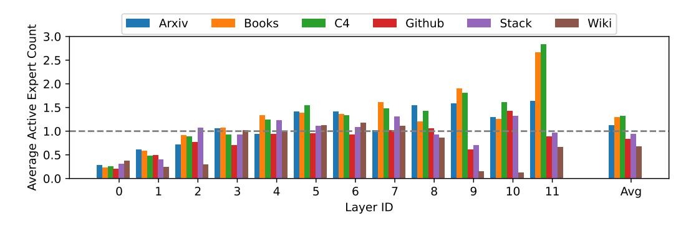

# G DOMAIN-LEVEL DYNAMIC EXPERT ALLOCATION IN REMOE

We measure the average active expert count across different domains, as shown in Figure [12,](#page-19-2) and find that the computation allocation in ReMoE also varies at the domain level. Furthermore, this variation increases in deeper layers closer to the output. This is reasonable because deeper layers tend to capture more abstract and domain-specific features, leading to more pronounced specialization in expert activation.

Figure 12: Domain-level dynamic expert allocation

