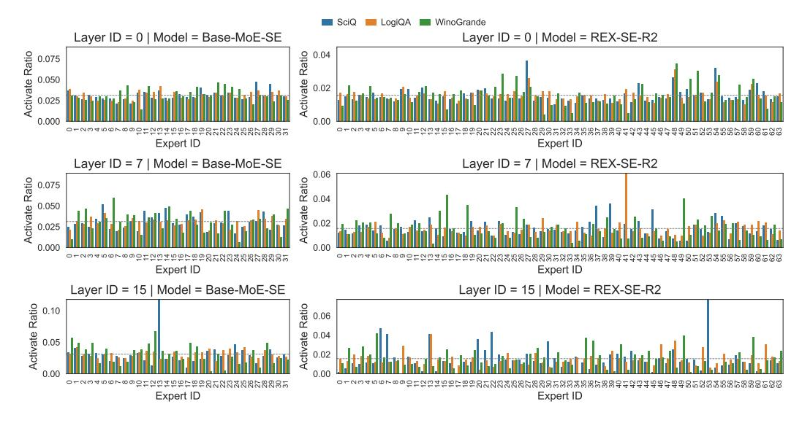

# 4.3.1 EFFECT OF EACH COMPONENT IN REXMOE

To demonstrate the effectiveness of each component in REXMOE, we provide comparative evaluations in Table 4. We utilize the MoE-2.3BA0.3B model as our baseline and set the expert reuse frequency across layers as 4. In addition to using the same average accuracy over the benchmarks reported in Table 2, we evaluate the validation perplexity (PPL) on WikiText (Merity et al., 2016). We find that the simple expansion of the experts' pool results in only a

Table 4: Average accuracy on benchmarks and PPL on WikiText.

| Model              | Avg. Acc. ↑ | PPL↓  |
|--------------------|-------------|-------|
| MoE-2.3BA0.3B      | 49.15       | 21.19 |
| + Expert Reuse (4) | 49.28       | 21.12 |
| + PSR              | 50.23       | 20.73 |

marginal improvement. Specifically, a 0.13% increase in averaged accuracy on downstream tasks and 0.07 in PPL. Furthermore, the incorporation of the PSR strategy yields a significant improvement in model performance by 1.05% in the average accuracy and a drop in PPL of 0.46. Comprehensive benchmarks results of each task can be found in Table 6. These results demonstrate the effectiveness of the expert reuse and PSR strategy.

#### 4.3.2 EFFECT OF SCALING EXPERT REUSE GROUP SIZE

We investigate the impact of scaling the expert reuse group size in the 2.3B variant of REXMOE, where the reuse frequency ranges from 2 to 32 layers. As presented in Figure 3(a), we illustrate the performance trends on downstream tasks during training for different configurations. In the early training phase, both REX-R2 and REX-R4 underperform the baseline MoE model; however, they eventually surpass it as training progresses, with larger reuse group sizes generally leading

Figure 3: Average accuracy during training, distribution of load balance violations (degree of expert load imbalance), and distribution of under-utilized experts ratios (larger values indicate more inactive experts) under different cross-layer expert reuse sizes.

to better performance. In contrast, REX-R16 and REX-R32 initially match or even exceed the baseline but later fall behind in the later stages of training. More detailed evaluation results can be found in Table 7 in the appendix. These results suggest that maintaining an appropriate balance in the number of reused layers is critical for sustaining high performance throughout training.

To investigate the cause of the performance decline as the number of reused layers increases, we reserve a validation set from the C4 corpus2 to evaluate load balance. Following the MaxVio metric in (Wang et al., 2024), we adopt the Load Balance Violation (LBV) metric to quantify the degree of load imbalance in the MoE block. Specifically, the LBV of expert i is computed as:

$$LBV_{i} = \frac{Load_{i} - \overline{Load_{i}}}{\overline{Load_{i}}}$$
 (7)

where  $Load_i$  denotes the number of tokens assigned to expert i, and  $\overline{Load_i}$  is the average expert load. Under perfect balance, LBVi equals 0. As shown in Figure 3(b), larger r values lead to more significant deviations among outliers in the distribution of  $LBV_i$ , indicating that the model tends to activate only a few experts and suffers from a collapse phenomenon during training. In addition, we present the distribution of under-activated experts in Figure 3(c). We observe that as the candidate pool further expands, more experts remain barely activated throughout training. This imbalance in expert utilization explains why the performance of REX-R16 and REX-R32 is lower than baselines.

#### 4.3.3 EFFECT OF PROGRESSIVE SCALING ROUTING

We investigate an alternative Progressive Scaling Routing (PSR) strategy to validate the optimal configuration adopted in our main experiments. Specifically, we introduce PSR-Stepwise, which keeps the number of candidate experts fixed over certain training intervals. In contrast, the strategy described in subsection 3.3 is referred to as PSR-Linear, as it provides a smoother and continuous expansion of the candidate expert pool. We use MoE-2.3BA0.3B as the baseline model and apply different PSR strategies to REX-R4. The corresponding training curves are shown in Figure 3. For both PSR-Stepwise and PSR-Linear, train-

Figure 4: Loss curves for different strategies.

ing starts with 64 candidate experts, and scaling begins at step 10k. In PSR-Linear, the candidate pool is gradually increased to 256 by step 30k. In PSR-Stepwise, the candidate pool is set to 128, 192, and 256 at steps 10k, 20k, and 30k, respectively.

We present the training loss curves of these models in Figure 4. As shown in the figure, the loss curves of Base MoE and REX-R4, where PSR is not enabled, remain almost identical. When

&lt;sup>2https://huggingface.co/datasets/allenai/c4

different PSR strategies are applied, model convergence is initially slowed. However, once the candidate pool begins to expand, the models achieve lower loss than those trained without progressive scaling. Notably, PSR-Stepwise accelerates loss reduction during the mid-training phase.

As summarized in Table 5, both PSR strategies deliver clear performance improvements at final convergence, with detailed results provided in Table 6 in the appendix. Nevertheless, the final loss is comparable between the two strategies, while PSR-Linear achieves stronger overall performance on downstream tasks. Therefore, we adopt PSR-Linear to train all models.

Table 5: Average accuracy on benchmarks and PPL on WikiText.

| Model               | Avg. Acc.↑ | PPL↓  |
|---------------------|------------|-------|
| REX w/o PSR         | 49.28      | 21.12 |
| REX w/ PSR-Stepwise | 49.59      | 20.76 |
| REX w/ PSR-Linear   | 50.23      | 20.73 |

#### 4.4 QUALITATIVE ANALYSIS

Figure 5: Activate ratio of MoE-SE and REX-SE-R4 across layers in different tasks. The gray dashed lines indicate uniform distribution. REXMOE shows stronger ability in task specialization.

In Figure 5, we present the expert activation ra-

tios of Base-MoE-SE and REX-SE-R2 across layers 0, 7, and 15 on the SciQ, LogiQA, and Wino-Grande tasks. For Base-MoE-SE, the distribution of activated experts remains relatively uniform, with only minor variation across tasks. In contrast, REX-SE-R2 exhibits clear task-specific specialization. For instance, certain experts (e.g., Experts 25 and 49) are activated far more frequently for WinoGrande than for the other tasks, especially in Layers 7 and 15. Similar trends are observed on other tasks, as shown in Figure 8 and Figure 9 in the appendix. These results suggest that the expanded expert pool of REX-SE-R2 allows for more effective task-specific allocation, encouraging the emergence of specialized experts and producing an ensemble-like effect in multi-task scenarios.

#### 5 Conclusion

In this work, we present REXMOE, a novel MoE design paradigm that overcomes the limitation of *layer-local* routing. By allowing routers to reuse experts across grouped adjacent layers, REXMOE decouples expert dimensionality from per-layer budgets and substantially enlarges the candidate expert pool with only negligible router overhead. Combined with the Progressive Scaling Routing strategy, it further enhances training stability and performance. Extensive experiments across diverse architectures and model scales show that REXMOE consistently improves language modeling perplexity, downstream task accuracy, and the ability to learn task-specialized experts. Overall, these results establish REXMOE as a parameter-efficient and practically scalable paradigm for designing MoE-based LLMs.

