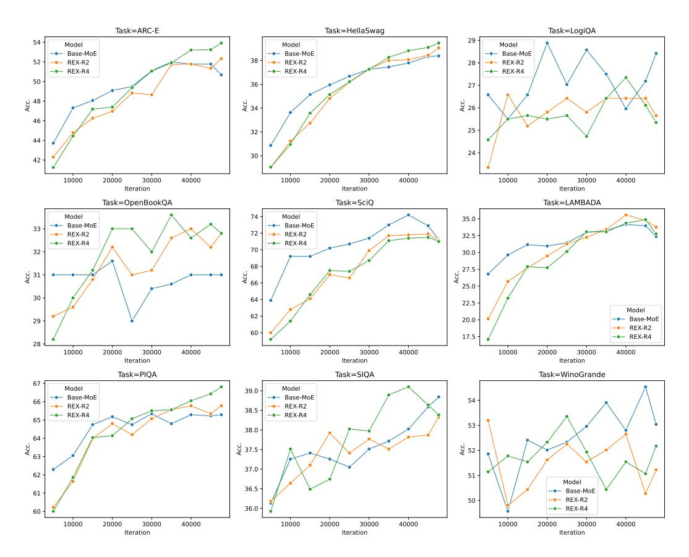
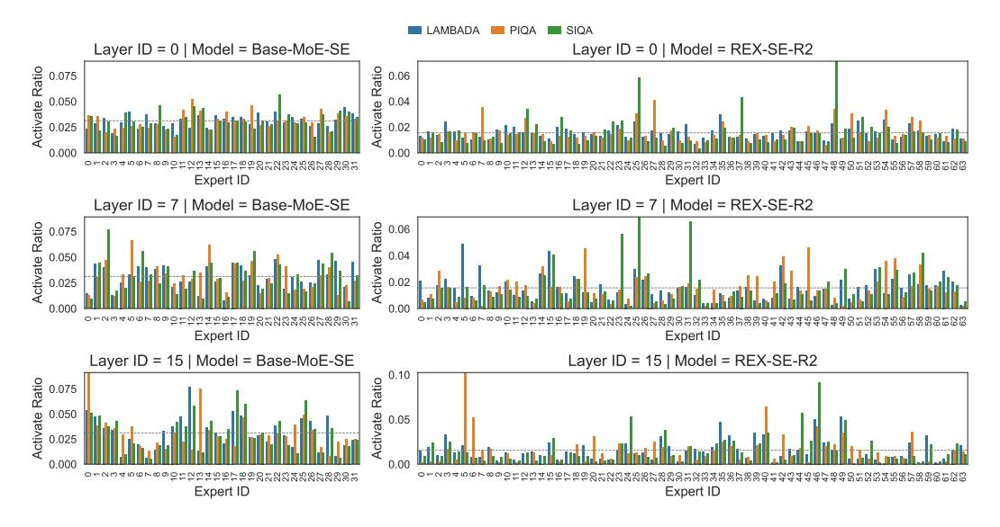

# A THE USE OF LARGE LANGUAGE MODELS (LLMS)

We acknowledge the use of Large Language Models (LLMs) to assist in writing and polishing this paper. Their role was limited to improving the clarity and readability of the manuscript; they were not involved in the design of the methodology or in the scientific analysis.

#### B ADDITIONAL EXPERIMENTS DETAILS

#### B.1 DATA PROCESSING

We use the sample-100BT partition3 of fineweb-edu (Lozhkov et al., 2024) for our main experiments. Each sample in the dataset is tokenized independently and then randomly concatenated into sequences of 4,096 tokens, which are used for training.

#### B.2 Hyper-parameters and Parallelism Configurations

We use the same hyper-parameters for all model training runs. The training sequence length is set to 4,096, and the global batch size is 512, resulting in a training batch size of 2M tokens. The base frequency for Rotary Positional Embedding (ROPE) (Su et al., 2024) is 10,000. For optimization, we use AdamW (Loshchilov & Hutter, 2017) with  $\beta_1 = 0.9$ ,  $\beta_2 = 0.95$ , and a weight decay of 0.1, gradient clip ratio is 1.0. We adopt a warmup–cosine-decay learning rate scheduler, with an initial learning rate of  $3 \times 10^{-4}$  that decays to  $3 \times 10^{-5}$  by the end of training. The number of warmup steps is fixed at 100 for all experiments. When the number of routed experts exceeds 8, we enable Expert Parallelism (EP) with a parallelism size of 8 to accelerate training. No other parallelism strategies, such as Tensor Parallelism (TP) or Pipeline Parallelism (PP), are used in these runs. We globally fix the random seed to 42.

#### C ADDITIONAL EXPERIMENTAL RESULTS

#### C.1 FULL EVALUATION RESULTS FOR DIFFERENT PSR VARIANTS

Table 6: Comparisons between base MoE and variants of REXMOE.

| Model                  | ARC-E | Hella. | LAMB. | Lg.QA | Op.QA | PIQA  | SciQ  | SIQA  | Wino.   Avg.↑      |
|------------------------|-------|--------|-------|-------|-------|-------|-------|-------|--------------------|
| Base MoE               | 58.42 | 47.14  | 37.55 | 27.19 | 34.80 | 69.21 | 75.80 | 38.69 | 53.51   49.15      |
| REX-R4 w/o PSR         | 58.16 | 46.94  | 38.52 | 25.96 | 36.40 | 70.67 | 74.50 | 39.46 | 52.88 49.28        |
| REX-R4 w/ PSR-Stepwise |       |        |       |       |       |       |       |       | <b>53.75</b> 49.59 |
| REX-R4 w/ PSR-Linear   | 60.94 | 47.96  | 38.75 | 28.42 | 37.00 | 70.18 | 76.30 | 39.36 | 53.12 <b>50.23</b> |

Complete evaluation results for different PSR variants are provided in Table 6, with the base model being MoE-2.3B-A0.3B.

#### C.2 FULL EVALUATION RESULTS FOR DIFFERENT REUSE SIZES

Table 7: Comparisons between base MoE and REXMOE with different reuse sizes.

| Model                        | ARC-E | Hella. | LAMB. | Lg.QA | Op.QA | PIQA  | SciQ  | SIQA  | Wino. | Avg.↑ |
|------------------------------|-------|--------|-------|-------|-------|-------|-------|-------|-------|-------|
| REX-R8                       | 58.75 | 46.80  | 37.07 | 26.27 | 35.00 | 69.97 | 72.50 | 37.97 | 52.64 | 48.55 |
| REX-R16                      | 58.59 | 46.79  | 38.48 | 27.80 | 35.40 | 70.02 | 72.20 | 39.36 | 53.83 | 49.16 |
| REX-R8 REX-R16 REX-R32 | 58.21 | 46.28  | 35.26 | 27.04 | 35.60 | 70.35 | 72.80 | 39.15 | 50.91 | 48.40 |

Complete evaluation results for different reuse sizes are provided in Table 7, with the base model being MoE-2.3B-A0.3B.

Table 8: Architecture of Top2 MoE model used in the additional experiments.

| Model Hidden Size |     | Intermediate Size | #Layers | Heads (Q / KV) | #Experts (Shared + Routed / Total) |
|-------------------|-----|-------------------|---------|-------------------|---------------------------------------|
| MoE-0.5BA0.13B    | 768 | 1536              | 16      | 16/2              | 2/8                                   |

Table 9: Comparisons between base MoE and REXMOE with different reuse sizes.

| Model                                  | ARC-E | Hella. | LAMB. | Lg.QA | Op.QA | PIQA  | SciQ  | SIQA  | Wino.   Avg.↑ |
|----------------------------------------|-------|--------|-------|-------|-------|-------|-------|-------|---------------|
| MoE-0.5BA0.13B                         |       |        |       |       |       |       |       |       |               |
| REX-0.5BA0.13B-R2                      | 52.82 | 39.26  | 33.18 | 27.96 | 32.00 | 66.05 | 70.60 | 38.08 | 52.80   45.86 |
| REX-0.5BA0.13B-R2 REX-0.5BA0.13B-R4 | 51.94 | 39.34  | 32.25 | 27.04 | 32.80 | 65.56 | 70.60 | 38.69 | 50.51   45.41 |

#### C.3 EVALUATION ON TOP2 MOE

We further apply REX to a Top2 MoE, with its architecture detailed in Table 8. The corresponding evaluation results are reported in Table 9.

#### C.4 TASK-WISE ACCURACY

Figure 6: **Task-wise accuracy change as training progresses.** Base-MoE is MoE-2.3BA0.3B.

&lt;sup>3https://huggingface.co/datasets/HuggingFaceFW/fineweb-edu/viewer/sample-100BT

Figure 7: Task-wise accuracy change as training progresses. Base-MoE is MoE-0.5BA0.1B.

### C.5 TASK-WISE EXPERTS SELECTION VISUALIZATION

Figure 8: Activate ratio of MoE-SE and REX-SE-R4 across layers in different tasks. The gray dashed lines indicate uniform distribution.

Figure 9: Activate ratio of MoE-SE and REX-SE-R4 across layers in different tasks. The gray dashed lines indicate uniform distribution.