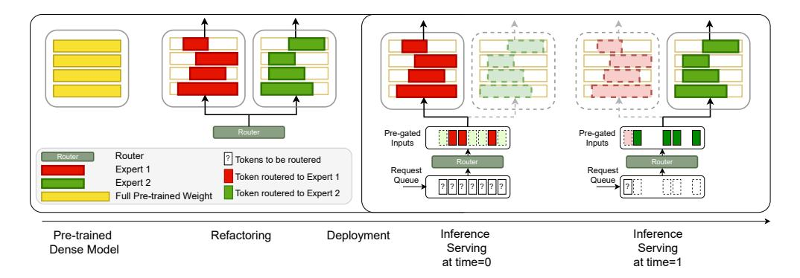

# 1 Introduction

The success of Mixture-of-Experts (MoE) [\[1,](#page-10-0) [2\]](#page-10-1) - such as recently exemplified by the Mixtral model [\[3\]](#page-10-2) in the era of large language models (LLMs) - lies in its remarkable ability to leverage the collective expertise of specialized sub-networks, or "experts," each proficient in handling specific subsets or aspects of the data. By dynamically routing data through these experts, MoE models effectively capture complex patterns, adapt to diverse data distributions, and offer superior predictive accuracy compared to traditional single-model approaches. In addition to performance promise, MoEs also have a natural appeal for resource-limited devices due to their high sparsity, and therefore reduced activated parameters per token, which can potentially save inference costs [\[4,](#page-10-3) [5,](#page-10-4) [6,](#page-10-5) [7\]](#page-10-6).

However, MoE inference presents significant challenges for key system-level objectives:

• Memory Management: Although MoEs activate only a subnetwork during inference, expert selection is determined on the fly by a layerwise router, complicating efficient prefetching. This often forces reliance on naive prefetching algorithms. For example, prior work has

\*Equal contribution: authors are listed alphabetically. A. Akella and Z. Wang also advised this work equally.

Figure 1: Overview of *Read-ME*. This figure shows the refactoring of a pre-trained dense model (in yellow) into two experts (in red and green). After refactoring, the model is deployed, and the serving timeline is depicted. At time t = 0, multiple inference requests (each a sequence of tokens) are queued, with expert assignment for each token undecided ("?") until processed by the router. Our router pre-gates tokens before inference, enabling expert-aware batching. Tokens are routed to their respective experts and batched accordingly: at t = 0 for Expert 1 (red) and at t = 1 for Expert 2 (green). New tokens enter the queue at each time step, with routing computed only for incoming tokens marked "?".

predicted the next expert using hidden states from the previous layer and applied an LRU cache replacement for recently used experts [\[8\]](#page-10-7). While effective under certain conditions, such strategies depend on assumptions about expert locality and token predictability, which can become sub-optimal if those assumptions are violated (as shown in Table [4\)](#page-9-0).

• Token Batching: Token batching techniques critical for efficient inference (e.g., [\[9\]](#page-10-8)) are poorly suited to MoE architectures, where each batch contains tokens invoking different experts across layers, rendering batching strategies ineffective (§ [4.2\)](#page-5-0).

Moreover, traditional MoEs are typically trained from scratch, which becomes prohibitively expensive as model scales increase. To mitigate this, some approaches, such as "upcycling" [\[10\]](#page-10-9), reuse pretrained dense LLMs to initialize experts in an MoE. While that efficiently scales MoEs by leveraging smaller, pre-trained models, it does not address the inference-related challenges mentioned earlier.

In this work, we tackle the opposite challenge: *how to create a smaller MoE model from larger pre-trained models that enables resource-efficient inference while minimizing training costs?* Despite existing efforts [\[11,](#page-10-10) [12,](#page-10-11) [13,](#page-10-12) [14\]](#page-10-13), this problem remains underexplored. Approaches like [\[11,](#page-10-10) [12,](#page-10-11) [13\]](#page-10-12) attempt MoE refactorization but still adopt systems-unfriendly layer-wise structures for inference. Similarly, [\[14\]](#page-10-13) focuses on dynamically selecting "important" neurons during pre-filling and pruning others during generation, but this is limited to long-content generation and requires neuron importance identification for each sequence.

To address both training and inference challenges, we introduce a holistic MoE framework dubbed *Read-ME*. To minimize training costs, we "refactorize" a pre-trained dense LLM into specialized experts through activation sparsity and optimize the routing policy (§ [3\)](#page-3-0). For efficient inference, we examine the redundancy of layer-wise routers (§ [2.1,](#page-2-0) § [2.2\)](#page-2-1) and propose decoupling the router from the MoE backbone (§ [2.3\)](#page-3-1). This allows us to *pre-gate all requests (token sequences) before inference* and apply lookahead scheduling based on the experts to which tokens will be dispatched. Consequently, we propose an expert-aware batching algorithm (§ [4.2\)](#page-5-0) and an optimal expert caching strategy inspired by Belady's offline caching algorithm [\[15\]](#page-10-14) (§ [4.1\)](#page-4-0).

Figure [1](#page-1-0) illustrates our framework. Our key contributions are:

- We transform large pre-trained LLMs into Mixture-of-Experts (MoE) models with fewer activated parameters and small additional training cost (1 billion tokens). Our approach outperforms popular open-source models and compression techniques of similar scale on downstream tasks like MMLU [\[16\]](#page-10-15).
- We analyze the widely adopted layer-wise routers in existing MoEs and reveal design redundancies. Current caching policies and batching algorithms are poorly suited to layerwise MoEs. We propose a novel pre-gating router, decoupled from the MoE backbone, enabling better system-level optimization.

• Our system achieves a 6.1% reduction in mean latency and a 10% improvement in tail latency compared to state-of-the-art systems. Our caching algorithm is both provably and empirically optimal, thanks to our algorithm-system co-design.

