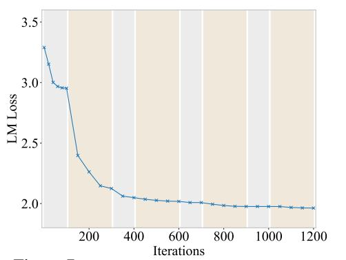

# A More Experimental Results

#### A.1 Training Dynamics

As detailed in § [5.1,](#page-6-3) we iteratively tune the router and experts for 8 rounds. We visualize the validation loss during the first 4 rounds out of the total 8 rounds of training. In Fig. [7,](#page-14-3) the router tuning stages are marked in gray, while the expert tuning stages are marked in orange. Two observations can be drawn from Figure [7:](#page-14-3) (1) The validation loss decreases during both router tuning and expert tuning stages. (2) The validation loss reduction from router tuning saturates after two rounds, while the validation loss continues to decrease during expert tuning.

Figure 7: Visualization on training dynamics.

