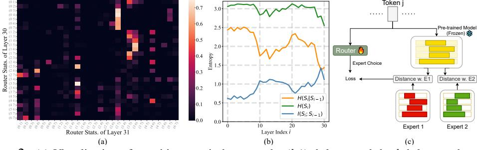

# 2 Pre-gating Sparse Mixture of Experts

In this section, we introduce our motivation and design of pre-gating MoE which enables system-level acceleration by sharing and precomputing expert selection for each layer.

#### 2.1 System Drawbacks of Conventional Sparse MoE Design

An Mixture-of-Expert (MoE) [1, 2, 17, 3] layer consists of a routing network G and a set of N expert networks  $\{F_1, ..., F_N\}$ . In the forward pass, the routing network will first process input sequences and generate the gating weights. Then a size-K subset of experts will be dynamically activated and their outputs will be combined as final outputs according to the gating weights. In LLMs, MoE is typically adopted in the Feed-Forward Networks (FFN) within each transformer block [1, 2, 3]. Suppose an LLM has L layers, the output of the l-th layer can be formulated as:

$$y = \sum_{i=1}^{N} \mathbb{I}(|\{j \in [N] : G^{(l)}(x)_j \ge G^{(l)}(x)_i\}| \le K)G^{(l)}(x)_i F_i^{(l)}(x), \tag{1}$$

where the superscripts indicate the layer indices,  $G^{(l)}, F^{(l)}$  are point-wise functions operating on tokens individually, and  $\mathbb{I}(\cdot)$  is the indicator function which filters experts with top-K gating weights. For shorthand, we denote  $\mathbb{I}_i^{(l)} = \mathbb{I}(|\{j \in [N] : G^{(l)}(\boldsymbol{x})_i \geq G^{(l)}(\boldsymbol{x})_i\}| \leq K)$ .

As shown in Eq. 1, conventional MoEs assign a separate router to each layer. While this is commonly used by open-source MoEs like Mixtral [3] and OpenMoE [18], we highlight its system inefficiency. Layer-wise gating makes it difficult to predict which expert to load until runtime (§ 4.1), and complicating request batching (§ 4.2). Specifically, layer-wise routers select the l-th layer expert  $i:\mathbb{I}_i^{(l)}=1$  based on the (l-1)-th layer outputs, which prevents pre-scheduling and pre-loading of data or model weights. This issue is especially problematic for billion-level parameter MoEs, where experts are usually distributed across devices (GPUs and CPUs in a machine) or even machines; in such situations, layer-wise selection accentuates high overheads of data I/O and communication among servers in the critical path of inference.

#### 2.2 Redundancy of Layer-wise Router

In this section, we demonstrate that layer-wise gating patterns are redundant in an MoE. In particular, we empirically find that expert selections between two adjacent layers are highly correlated.

Figure 2: (a) Visualization of transition matrix between the (l-1)-th layer and the l-th layer, where each coordinate  $[\{s,t\},\{i,j\}]$  represents  $P(\mathcal{S}^{(l)}=\{i,j\}|\mathcal{S}^{(l-1)}=\{s,t\})$ . The row-wise sparse pattern suggests that the router decision becomes almost deterministic given the previous layer's decision. (b) Mutual information  $I(\mathcal{S}^{(l)};\mathcal{S}^{(l-1)})$ , which indicates the learned knowledge shared by two neighboring layers is high. (c) Overview figure of router tuning and router distillation loss.

We use Mixtral-8×7B (N=8,K=2) [3] as a study case and analyze router decisions among its layers. Define the random variable  $\mathcal{S}^{(l)}=\{i\in[N]:\mathbb{I}_i^{(l)}=1\}$  as the pair of experts selected

for each layer ( $|\mathcal{S}^{(l)}|=2$ ). We are interested in the conditional probability of  $\mathcal{S}^{(l)}$  between two consecutive layers:  $P(\mathcal{S}^{(l)}=\{i,j\}|\mathcal{S}^{(l-1)}=\{s,t\})$ . The transition matrix of the last two layers from Mixtral-8×7B is depicted in Figure 2 (a). The row-wise sparse pattern implies that the expert selection is almost deterministic given the previous layer' choices. For example, for tokens choosing expert-3 and expert-5 in the 30th layer, over 70% will select expert-1 and expert-5 at the 31st layer.

To further validate this observation, we plot the mutual information between expert choices of every two neighboring layers:  $I(\mathcal{S}^{(l)}; \mathcal{S}^{(l-1)})$ . As reflected in the right sub-figure of Figure 2, knowing expert pairs used in the last layer significantly reduces the uncertainty of the next layer. Thus, the implicit knowledge learned by each router is extensively shared across layers.

#### 2.3 Pre-Computed Routing Policy

The above observations suggest that among the many  $\binom{N}{K}^L$  routing paths, only a few are used during the inference. Therefore, layer-wise routing decisions are unnecessary for MoEs. Instead, we can separate the routerfrom the MoE backbone and pre-compute the routing path all at once.

First of all, we assume the indices of experts handling one domain of tokens are aligned, i.e.  $\{F_i^{(1)},\cdots,F_i^{(l)}\}$  always forms a routing path. We defer our approach to the construction of aligned experts to §3. Next, we let a singleton network G generate gating weights for all layers. In particular, we adopt one transformer block with causal attention as the model architecture of G. Gating weights computed in this way not only leverage the states of the current token but also take the information from the past tokens into consideration. Thus, tokens will have expert selections similar to the recent tokens, which ensures cache-friendly inference (see more details in § 5.3).

Suppose the input sequence is  $(x_t)_{t=1,\dots,T}$ , the output for the t-th token at the l-th layer is:

$$y_t = \sum_{i=1}^{N} \mathbb{I}(|\{j \in [N] : G(\mathbf{x}_{\leq t})_j \geq G(\mathbf{x}_{\leq t})_i\}| \leq K)G(\mathbf{x}_{\leq t})_i F_i^{(l)}(\mathbf{x}_t), \tag{2}$$

where  $x_{\leq t} = (x_1, \cdots, x_t)$  represents all the tokens before the t-th token. We note that G is independent of layer index l. Despite a subtle change, it brings profound benefits to enable system-level optimization. In brief, by separating the gating network from the transformer layers, expert selection can be determined at the outset and used to schedule the data-loading procedure for each layer. We defer more details on system co-design to §4.

## 3 Re-factoring Language Model with Pre-Gating MoE

In this section, we introduce the main technique to re-use a dense pre-trained model to construct our pre-gating MoE proposed in §2. In short, our approach first initializes each expert by structured pruning of a dense model on the corresponding data domains. Afterward, we instantiate a gating network shared across layers and continue joint training of the router and experts.

**Domain-Aware Expert Construction.** We construct a set of small experts by pruning the dense model with different data domains. To begin with, we point out that public language corpora often contain metadata indicating the domain of each subset. For example, the training dataset of LLaMA family [19] can be split into scientific articles [20], novels [21], and QAs [22], etc. We utilize this metadata to group data entries in the training corpus into N sub-domains  $\{\mathcal{D}_1,\cdots,\mathcal{D}_N\}$ . Observing that feature channels on each subset are sparsely activated [23], we compute the average magnitude of a channel on each subset and keep top activated neurons to form the domain expert. Formally, let the number of experts equal to the number of sub-domains, and assume the dense model is a two-layer FFN with hidden size  $D: F_0(x) = W_2 \sigma(W_1 x)$ , then the i-th experts with hidden size d are initialized as:  $F_i(x) = W_2 M_i^{\top} \sigma(M_i W_1 x), \forall i \in [N]$ , in which  $M_i$  is obtained by:

$$\underset{\boldsymbol{M} \in \{0,1\}^{d \times D}}{\operatorname{arg} \max} \mathbb{E}_{\boldsymbol{x} \sim \mathcal{D}_i} \|\boldsymbol{M} \boldsymbol{W}_1 \boldsymbol{x}\|_1 \quad \text{s.t.} \quad \boldsymbol{M} \boldsymbol{1}_D = \boldsymbol{1}, \boldsymbol{M}^\top \boldsymbol{1}_d \leq \boldsymbol{1}, \tag{3}$$

where M is constrained to be a selection matrix without replacement. The mask for each layer is jointly optimized so that the resultant experts are aligned layerwise and dedicated to the same data distribution. In our experiments, we set  $d \approx D/2$ . In addition, we observe that a certain

subset of channels is essential for all data, potentially due to the system prompt and the presence of commonsense knowledge. Therefore, we isolate the corresponding neurons as the *permanent expert*, which will be activated for all tokens, similar to previous designs [18, 24].

**Continual Training Objective.** After initializing experts via structured pruning, we perform joint training of randomly initialized gating networks and expert subnetworks via causal language modeling. In addition, we propose *routing distillation loss* to enhance the alignment between expert choice in pre-gating MoE and the activation sparsity in the original dense model.

We illustrate the training of our router in Fig. 2 (c). Suppose the predicted token has embedding  $x_{t+1}$ . We feed  $x_{t+1}$  into the original dense model  $F_0$  and get a sparse selection matrix  $M_0$  that indicates neurons with top 50% magnitude similar to Eq. 3. Then we penalize this loss function:

$$\mathcal{L}_{RD} = \mathcal{D}_{KL} \left( \text{softmax}(G(\boldsymbol{x}_{\leq t+1})) \| \text{softmax}([\|\boldsymbol{M}_0 \boldsymbol{M}_1^\top\|_F^2, \cdots, \|\boldsymbol{M}_0 \boldsymbol{M}_N^\top\|_F^2]) \right).$$
(4)

Here,  $\mathcal{D}_{KL}(\cdot\|\cdot)$  represents Kullback–Leibler divergence.  $\|(\boldsymbol{M}_0\boldsymbol{M}_j^\top\|_F^2 = \mathbf{1}_d^\top\boldsymbol{M}_0\boldsymbol{M}_j^\top\mathbf{1}_d$  computes the Hamming distance between two masks induced by  $\boldsymbol{M}_0, \boldsymbol{M}_j$ . We apply softmax to normalize these scores as the estimated selection probability of each expert for predicted token  $\boldsymbol{x}_{t+1}$ .

