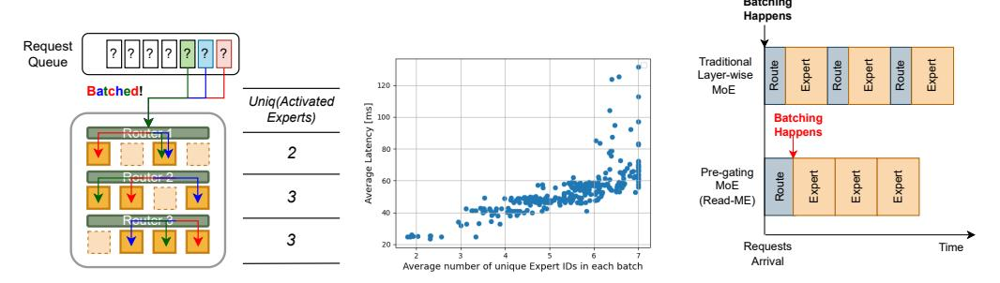
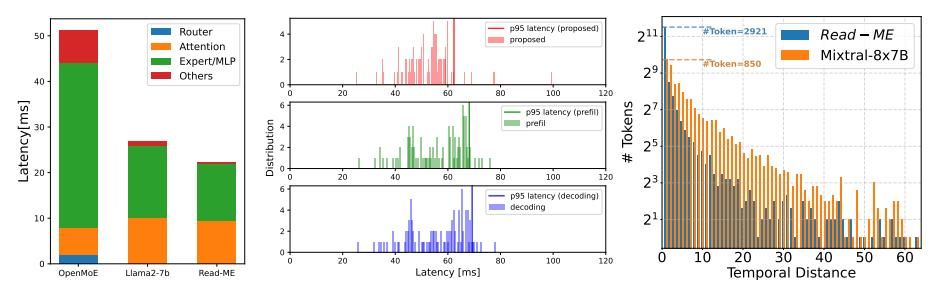
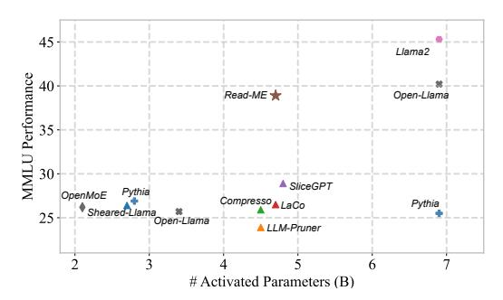
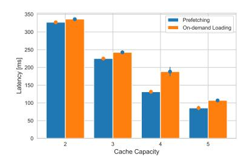

# <span id="page-4-1"></span>4 Expert-aware Inference System

We demonstrate how our refactoring and pregating concepts enable a novel, high-performance, and efficient MoE inference method. We address two key challenges in existing MoE models' inference: inadequate memory management and limited support for batched inference. Our problem setting is broad, aiming to serve multiple requests using an MoE model, each comprising a sequence of tokens. This differs from previous systems, which focused on optimizing performance for individual requests.

#### <span id="page-4-0"></span>4.1 Pre-gating Optimized Expert Prefetching and Caching

MoE models promise reduced memory usage during inference by loading only the parameters of required experts, skipping the rest. However, traditional layer-wise gating imposes significant loading costs. Previous approaches, such as on-demand loading [25], prefetching [26], and expert caching [8, 27], attempt to address this. However, on-demand loading adds overhead to the critical inference path, and prefetching often loads unnecessary experts due to incomplete routing information, leading to suboptimal memory usage and performance [28]. Additionally, caching strategies, based on request characteristics like temporal locality or activation sparsity, have mostly been evaluated in isolated single-request scenarios. In practice, expert caches are shared across multiple requests, making cache policies relying on per-request traits suboptimal. A global view across all requests is necessary for effective caching (see Table 4). Our work leverages pre-gating to develop more informed prefetching and caching strategies, resulting in significant system-level improvements.

**Fine-grained Prefetching.** By design, our pre-gating MoE architecture enables us to prefetch the exact expert layers needed for a token or a request, avoiding guesswork. To further hide the latency in prefetching, we pipeline and thus overlap loading of experts and experts' computation at layer-wise granularity: specifically, while computing the ith layer's forward path in the compute stream, we load the i+1st layer's experts in a separate loading stream.

**Belady-inspired Caching.** Prefetching can hide the loading latency of all but the first layer, which incurs significant cost. To mitigate this, we need a cache that stores relevant initial layers, and we argue that pre-gating enables an optimal caching strategy.

The classical Belady algorithm is known to be the *optimal offline cache replacement algorithm*, replacing the object that will be accessed farthest in the future. While impractical in real-world systems (due to unknown future accesses), our pre-gating architecture allows us to approximate it. By decoupling the router from the backbone MoE, we can compute future expert references across requests in advance, enabling near-optimal cache replacement.

Suppose that the cache at time step t-1 is as follows:  $C(t-1)=\{e_1,e_2,...,e_k\}$ , where the cache is of size k and is filled with k experts  $e_{1...k}$ . F(e,t) represents the next time after t when expert e will be requested. Then, our policy chooses the expert  $e_{evict}=argmax_{e\in C(t-1)}F(e,t)$  for eviction.

<span id="page-5-1"></span>

Figure 3: Challenges of MoE serving in current serving systems and *Read-ME*'s batching pipeline.

#### <span id="page-5-0"></span>4.2 Expert-aware Batching

Current serving systems heavily rely on batching to improve inference efficiency, but effective batching for MoE models remains challenging. As shown in Figure 3 (a), each token in MoE models may invoke a different set of experts per layer, leading to multiple expert activations for a batch of requests. For example, in a toy model with 4 experts per layer and a batch of 3 tokens (one per request), 2/3/3 experts would be activated across the layers. In the Mixtral8x7B model [3] applied to the chatbot arena dataset [29], we observed an average activation of **7.63 out of 8 experts**, even with a modest batch size of 56.8.

The core challenge is that while each token requires computation from only one expert per layer, it must wait for all other tokens in the batch to complete their expert computations in the same layer [30]. This bottleneck repeats at each layer, reducing the efficiency of batching. Ideally, a single loaded expert would serve multiple tokens in a batch, but this is rarely achieved, affecting both performance and efficiency. For example, we observe a linear increase in average per-token processing latency as the number of unique experts per batch grows (see Figure 3 (b)).

In contrast, pre-gating enhances inference performance by enabling the *delayed creation of an optimal batch based on required experts*. For a given set of tokens, we pre-gate each one and select a subset for batching, depending on their identified expert requirements. The goal is to minimize the number of unique experts across all layers while maximizing the number of tokens in the batch. Moreover, as discussed in § 2.3, our expert selection remains consistent across layers—if a token is assigned to Expert 1, it will be routed to Expert 1 in every layer. This approach, combined with our batching strategy, ensures optimal efficiency. Algorithm 1 provides our batching pseudocode.

We note that in other MoEs, such batching isn't feasible because, as shown in Figure 3, their expert selection at each layer remains unknown until the request reaches the router. In *Read-ME*, experts are determined first, which allows batches to be created and submitted to MoE layers efficiently.

#### 5 Evaluation

In this section, we start by describing the experimental details in § 5.1. Then we validate the refactorization effectiveness on downstream tasks in § 5.2. In § 5.3, we evaluate the effectiveness of pre-gating and batching. § 5.4 analyzes memory optimization techniques. In addition, we provide experimental details in § 5.1, and more experimental results in §. A.

#### <span id="page-5-2"></span>5.1 Experimental Details

**Model and Dataset** We perform the MoE refactorization based on Llama2-7B-chat [19] model, a popular open-source model pre-trained on 2 trillion tokens. The training corpus [35] involves the data collected from 7 different resources: Arxiv [20], Books [21], Common Crawl, C4 [36], Github,

<span id="page-5-3"></span>Table 1: Details of router design. Following the standard Transformer architecture [31], the inserted router adds only 18 million additional parameters.

| 1            |
|--------------|
| 4            |
| 32000        |
| 512          |
| 512          |
| 512          |
| SwiGLU [32]  |
| RoPE [33]    |
| RMSNorm [34] |
| 18.0 M       |
|              |

Wikipedia [37], and StackExchange [22]. To generate experts, we collect 16 samples from each data domain, with each sample consisting of 4096 consecutive tokens. During router tuning, we use the subset of RedPajama dataet [35], with the same curation strategy. We present our detailed router design in Table 1. We use the standard Transformer [31] architecture with a 1-layer, 4-head

#### <span id="page-6-0"></span>Algorithm 1 Read-ME Expert-aware Batching Algorithm (pseudocode)

```
Input NumExperts, ReqQueueByExpert, MaxTokenLen
    Output ScheduledReq
 1: for k \leftarrow 0 to NumExperts - 1 do
       len\ regs\ per\ experts[k] \leftarrow len(RegQueByExpert[k])
3: end for
4: while true do
       E \leftarrow argmax(len\_reqs\_per\_experts)
5:
       if len regs per experts[E] < (MaxTokenLen - len(ScheduledReg)) then
6:
           ScheduledReg \leftarrow ScheduledReg \cup RegQueueByExpert[k]
7:
8:
           RegQueueByExpert[E] \leftarrow []
9:
           len\_regs\_per\_experts[E] \leftarrow 0
       else if MaxTokenLen - len(ScheduledReg) \ge 0 then
10:
           n \ available \leftarrow MaxTokenLen - len(ScheduledReg)
11.
12:
           ScheduledReq \leftarrow ScheduledReq \cup ReqQueueByExpert[k][: n\_available]
13:
           RegQueueByExpert[E] \leftarrow RegQueueByExpert[k][n\_available:]
14:
           len\_reqs\_per\_experts[E] \leftarrow len(ReqQueueByExpert[E])
15:
16:
       else
17:
           break
18:
       end if
19: end while
```

design. The router is lightweight, consisting of 18 million additional parameters, and incurs negligible computational overhead. We use 8 A100 GPUs with 80GB of memory for all tuning experiments.

<span id="page-6-3"></span>Continual-Tuning Details To co-optimize the router and expert networks, we iteratively tune each model component. Specifically, we first optimized the router by  $\mathcal{L}_{RD}$ , as detailed in § 3, for 100 steps. We use the batch size of 64 in this router tuning stage. During this router tuning stage, we freeze the expert weights and solely tune the router weights. Then, during the expert tuning stage, we fix the router weights and modify the expert weights via language modeling loss, for 200 steps, with a batch size of 128. We set sequence length to 4096 for all stages, following the choice in the pre-training stage of

Table 2: Hyper-parameter choice during the training.

| Stage                       | Router Tuning | Expert Tuning |
|-----------------------------|---------------|---------------|
| # Iteration per Round       | 100           | 200           |
| # Rounds                    | 8             | 8             |
| Initial LR at Round 0       | $5e^{-4}$     | $5e^{-5}$     |
| LR Decay within Round       | Cosine        | Cosine        |
| LR Decay type across Rounds | Exponential   | Exponential   |
| LR Decay rate across Rounds | 0.8           | 0.8           |
| Weight Decay                | 0.01          | 0.01          |
| Batch Size                  | 64            | 128           |
| Sequence Length             | 4096          | 4096          |
| # Tokens per Round          | 26 M          | 105 M         |
| # Tokens in Total           |               | 1.04 B        |

Llama2 model [19]. This iterative training schedule is conducted 8 times. Detailed visualizations of the training dynamics are provided in Section A.1. For each round, the router tuning and expert tuning stages will cost 26 million and 105 million tokens, respectively. The whole continual-tuning process merely uses 1.04 billion tokens, negligible compared to the pre-training cost (2 trillion tokens). During each round of tuning, we use the cosine learning rate decay. At round 0, the initial learning rates are  $5e^{-4}$  for router tuning and  $5e^{-5}$  for expert tuning. The initial learning rate decays exponentially with a decay rate of 0.8 as the number of rounds increases.

<span id="page-6-2"></span>**Inference System Evaluation** For our workload, we utilize the Chatbot Arena Conversation Dataset [29] to generate inference requests and replay conversation traces. Our setup employs a single A100 GPU with 80GB of memory. The implementation is built on top of DeepSpeed inference engine [38]. We use normalized latency as our primary metric, defined as the end-to-end latency divided by the generated token length, in line with previous works [9, 39, 38].

## <span id="page-6-1"></span>5.2 Downstream Task Evaluations

We first validate the refactorization effectiveness on downstream tasks, as shown in Table 3, comparing it to other models of similar scales, including the open-source models that trained from scratch, and

<span id="page-7-3"></span>

Figure 5: Latency evaluation and Temporal locality analysis. (Left) Single inference latency measured on a 124 token generation task. (Center) Latency distribution measured on synthetic workload replaying Chatbot Arena Dataset [29] (§ 5.1). (Right) Temporal distance measured on Arxiv dataset [20], and a subset of Redpajama [35].

the dense models pruned from larger pre-trained LLMs. We achieve the best average performance, outperforming all model variants from the Pythia [40] and Open-Llama-v2 [41] families, as well as Sheared-Llama [42]. We use just 1 billion training tokens, considerably less than other models.

<span id="page-7-1"></span>Table 3: Downstream task evaluation of our proposed method (*Read-ME*) compared to open-source models, including dense models Pythia and Open-Llama-v2, the MoE model OpenMoE, and the compression method Sheared-Llama. The evaluation includes zero-shot performance on WinoGrande, ARC-Easy, LogiQA, CoQA; 5-shot performance on MMLU; 10-shot on Hellaswag; and 25-shot on ARC-Challenge. The "#Param" column presents in the form of (# Activated-Parameters - # Total-Parameters). Training cost is measured by the number of tokens used. For compression methods like ours and Sheared-Llama, only tokens used for conversion are counted, excluding Llama-2 pre-training costs.

| Method        | #Param   | Cost | MMLU          | Hell.                                 | Wino.         | ARC-E | ARC-C         | LogiQA        | CoQA          | avg.  |
|---------------|----------|------|---------------|---------------------------------------|---------------|-------|---------------|---------------|---------------|-------|
| Sheared-Llama | 2.7B     | 50B  | 26.4%         | <b>70.8</b> % 60.8% 67.6% 45.5% 68.5% | 67.0%         | 67.0% | 41.2%         | 28.3%         | 71.7%         | 53.2% |
| Pythia        | 2.8B     | 300B | 26.9%         |                                       | 59.7%         | 64.4% | 36.4%         | 27.7%         | 61.9%         | 48.3% |
| Open-Llama-v2 | 3.4B     | 1T   | 25.7%         |                                       | 63.5%         | 66.5% | 39.0%         | 28.1%         | 54.4%         | 49.3% |
| OpenMoE       | 2.1B-8B  | 1.1T | 26.2%         |                                       | 60.3%         | 64.1% | 30.3%         | -             | -             | -     |
| Read-ME       | 4.7B-17B | 1B   | <b>38.9</b> % |                                       | <b>67.7</b> % | 66.6% | <b>42.3</b> % | <b>29.7</b> % | <b>74.8</b> % | 55.5% |
| Pythia        | 6.9B     | 300B | 25.5%         | 67.1%                                 | 64.1%         | 67.3% | 31.3%         | 25.3%         | 63.6%         | 49.2% |
| Open-Llama-v2 | 6.9B     | 1T   | 40.2%         | 66.7%                                 | 66.0%         | 63.0% | 36.0%         | 27.6%         | 64.5%         | 52.0% |
| Llama-2       | 6.9B     | 2T   | 45.3%         | 78.6%                                 | 69.3%         | 76.4% | 53.0%         | 31.0%         | 75.9%         | 61.4% |

In Fig. 4, we further provide a direct comparison with other compression methods, which converts a large LLM to a small dense variant, on MMLU [16] benchmarks. Besides open-source models and Sheared-Llama [42] which are mentioned in the previous table, we additionally include recent compression techniques, including LLM-Pruner [43], SliceGPT [44], LaCo [45], and Compresso [46], as our baselines. *Read-ME*achieves the best performance among the models with the number of activation parameters less than 5 billion, and shows comparable performance with Open-Llama-v2-7B [41]. More analysis is included in § A.2.

<span id="page-7-2"></span>

Figure 4: Evaluation of *Read-ME* on MMLU [16] benchmark, compared to other open-source models and compression techniques (performance numbers are collected from their respective papers.

#### <span id="page-7-0"></span>5.3 Pre-gating and Expert-aware Batching

**Inference Latency Breakdown.** We evaluate the impact of the auto-regressive router introduced by our refactoring of the dense MoE on per-request inference latency. Unlike conventional layer-wise routers, usually linear layers, our auto-regressive router comprises a multi-head attention layer and an MLP layer (see § 2.3), potentially raising its computational cost.

Fig. 5 (left) illustrates the average per-token latency breakdown of a single isolated inference request measured in OpenMoE [18] with conventional layerwise routers, our refactored model with pregating router, and the original dense Llama2-7b model [19] we refactored. We find that the computational

overhead of our auto-regressive router is minimal – its contribution of 0.4% is much less compared to the router's net contribution in other MoE models (3.95%). This is because we use a single router unlike other models with gating for each MoE layer; also, our router design is compact with only 18M parameters (Table 1). Compared to the dense model, we achieve a net 19% reduction in latency via refactoring the MLP to MoE.

**Batched Inference.** We now evaluate the efficacy of our expert-aware batching. Fig 5 (center) shows the latency distribution and the 95-th percentile latency (p95) during batched inference. We compare with two widely used techniques – Decoding-prioritized batching [38], and Prefill-prioritized batching [39, 47]. These methods utilize distinct queues for decoding requests and prefill requests, prioritizing batching of tokens from decoding and prefill requests, respectively.

Prioritizing either decoding or prefill requests yields comparable performance. In contrast, our method of constructing batches based on activated experts enhances the mean latency by 5.0-6.1% and reduces the p95 latency by 9.5-10.0% compared to these approaches.

The primary reason for this improvement is that our batching approach directly reduces the average number of unique experts invoked per batch by leveraging pre-gated information. Specifically, for decoding-prioritized and prefill-prioritized batching, the average number of unique experts per batch was 5.08 and 5.21, respectively, whereas our method reduces this to 3.51.

We observed a significant performance impact as prefill requests invoke more experts per batch compared to decoding requests. Prefill requests require tokens to be dispatched to different experts, making it impractical to batch tokens by shared experts due to attention operations. As a result, a substantial number of experts are invoked for each batch, negatively affecting performance. Fortunately, our auto-regressive router design improves temporal locality in prefill requests, often allowing tokens within the same request to select the same or a small number of experts. We explore this locality in greater detail in the following section.

High Temporal Locality. To analyze the locality, we measure the temporal distance of the tokens in a sequence (Fig. 5 (c)). We define temporal distance as the distance between two tokens selecting the same expert within a sequence [48]. Our result shows that our router leads to a smaller distance, indicating a high degree of temporal locality. Specifically, out of 4096 tokens, 2921 tokens follow the choice of the last token, compared to 850 tokens in Mixtral-8×7B. The locality is attributed to the auto-regressive design of our router, where the router's decision is based on the current and all previous tokens. As a result, a given token is likely to have similar expert selections with its recent predecessor tokens. However, note that this temporal locality appears only within the token sequence of a single request and does not appear across different requests.

#### <span id="page-8-0"></span>5.4 Memory-Efficient Inference

We evaluate how well our approach can ensure good performance while improving memory efficiency. In particular, we constrain the expert cache capacity to k (that is, up to k experts can reside in accelerator memory). In this setup, if a requested expert is not in memory, it must be loaded from host memory, potentially increasing loading latency. As explained in § 4.1, this loading overhead can be mitigated with prefetching, provided that we know which expert will be needed in Read-ME. We compare the end-to-end latency of requests from the prefetching our approach enables (Prefetching) versus not leveraging prefetching (On-demand Loading) [25]. Figure 6 shows that for varying cache capacities, we consistently outperform On-demand Loading, with up to 30% better latency.

<span id="page-8-1"></span>

Figure 6: Latency impact of prefetching: We measured end-to-end latency on a synthetic workload generated by replaying Chatbot Arena Dataset [29]. (Appendix 5.1)

In addition to proactively loading experts into memory, our approach also retains experts in a cache to further use memory optimally. Table 4 compares three representative caching policies' hit ratios across varying cache capacities, including the Belady-inspired approach that our architecture enables. As noted earlier, our approach accommodates multiple requests where each request has a token sequence, in contrast with prior works focusing on a single request/token-sequence [8, 27].

When multiple requests share the expert cache, temporal locality within a single request cannot be leveraged across requests, limiting its effectiveness. This explains why LRU, which works well in single-request scenarios, underperforms in our setup. In contrast, our Belady-based algorithm excels at all cache capacities by utilizing future expert information across requests, thanks to the pre-gating router. When cache capacity is constrained by system memory, latency can be significantly reduced with an optimized cache policy. Our Belady approach notably improves latency, particularly under limited cache sizes, though we omit detailed results for brevity.

<span id="page-9-0"></span>

|                   | C      | ache Polic | у      |
|-------------------|--------|------------|--------|
| Cache<br>Capacity | Random | LRU        | Belady |
| 2                 | 34.19% | 33.90%     | 44.16% |
| 3                 | 50.14% | 52.42%     | 61.82% |
| 4                 | 67.52% | 66.95%     | 77.21% |
| 5                 | 82.91% | 83.48%     | 88.03% |

Table 4: Cache hit ratio measured in batched inference setup.

## 6 Related Work

**MoE Refactorization.** Recent "MoE-fication" methods [11, 12, 13, 49] optimize or group channels using graph-based techniques but still rely on system-inefficient layer-wise routers. In contrast, we are the first to identify the redundancy in layer-wise routers and propose a pre-gating router that enables expert pre-fetching. Similar to [50, 14, 51], we leverage activation sparsity [23] to construct experts, adaptively identifying important neurons and evicting less-important ones during inference.

**Efficient Inference Serving.** To deal with the limited memory in resource-constrained settings, prior LLM inference works focused on optimizations such as offloading parameters to host memory [52, 53, 25], quantization [54, 55, 56], sparsity [57, 58] and MoE architectures [4, 59, 26]. However, while token batching [9] has garnered significant attention for dense models [39, 47, 38, 60], it remains problematic and underexplored in the context of MoE models.

Pre-gated MoE [28] is related to Read-ME as they too fine-tune a router to pre-gate using the ith layer's hidden states to compute the i+1th layer's routing; but they still maintain a layer-wise architecture which constrains batching. SiDA-MoE [61] separates the router from the inference path. However, tokens cannot be batched together because they do not share routing decisions across all layers. In addition, the offline routing function of SiDA is an approximation that may incorrectly guess expert selection, especially when the model scales. In contrast, Read-ME has exact routing, ensuring no performance drop during inference.

Mixtral-offloading [8] introduces speculation to "guess" routing decisions, resorting to costly ondemand loading if speculation fails. Caching is commonly used [62, 52, 63, 53, 64], including in MoE systems [8, 27], which typically focus on single requests. Prior caching methods are limited by layer-wise routing and lack of foresight into future requests.

#### 7 Conclusions and Limitations

We address the under-explored challenge of reusing a pre-trained LLM to create a smaller MoE model that enables efficient inference with minimal training cost. By leveraging activation sparsity, we construct specialized experts and integrate them via a router. Upon analyzing the layer-wise router design used in all open-source MoEs, we identify its inefficiency and redundancy. To overcome this, we propose a pre-gating router, decoupled from the MoE backbone, enabling system-level optimizations that were previously unattainable.

**Limitations.** Our serving system is designed for a single accelerator, and extending it to distributed serving remains a non-trivial task for future work. Our method has no negative societal impact, as it uses publicly released data and model checkpoints. This work is foundational research and is not tied to specific applications.

#### Acknowledgements

The work of Z. Wang is in part supported by the US Army Research Office Young Investigator Award (W911NF2010240) and a Research Gift from Qualcomm. Ro and Akella are supported by NSF grants CNS-2105890 and CNS-2232135 and by Cisco Research and Meta.

