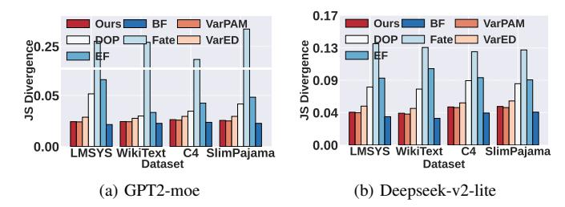

# B. Prediction Accuracy

To evaluate the prediction performance of *Remoe*, we compare it with the following baselines: 1) **VarPAM.** Replace our customized k-medoids clustering with Partitioning Around Medoids algorithm [30]. 2) **VarED.** Replace our distance metric during clustering, which is semantic similarity, with Euclidean distance between expert activation distribution matrices. 3) **Distribution-Only Prediction (DOP)** [31]. Directly use the historical activation as prediction for new prompts. 4) **Fate** [32]. Predict expert activation per token using previous layer inputs. We adjust it by using the initial prompt embedding to predict activation across all layers for promptlevel prediction. 5) **Equal Frequency (EF).** Assume that the activation frequencies of all experts are equal to each other. 6) **Brute Force (BF).** Use brute-force searching to get top- $\alpha$  semantically similar historical prompts for the new one.

We randomly extract 5000 training and 500 test samples from each aforementioned dataset. Setting  $\alpha=15$  and  $\beta=150$ , Fig. 8 shows our method achieves the lowest average

JS Divergence (after VarPAM and BF) between predicted and true expert activation distributions. Partial truncation is applied to the y-axis in Fig. 8a. Crucially, VarPAM requires hours to build its clustering tree (versus ≤ 0.5 seconds for ours), and our semantically similar prompts searching method is more than 10 times faster than BF. DOP is only effective when new prompt's expert activation is similar to historical ones, and Fate uses inappropriate inputs for prediction of various layers' expert activation. While expert activation and semantic similarity generally correlate, using expert activation distribution directly for clustering (VarED) introduces noise, explaining our superior performance.

Fig. 8: JS Divergence under different datasets

