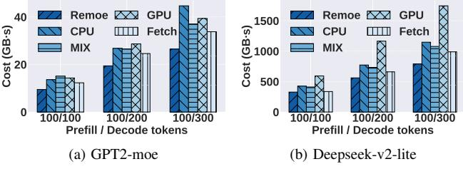

# D. Cost under Different Prefilling/Decoding Ratios

In real-world scenarios, the number of tokens in the decoding phase often exceeds that in the prefilling phase. Therefore, we study the trend of inference cost under different ratios of

Fig. 9: Overall performance under 50 requests

prefilling to decoding tokens, as shown in Fig. 11. Across various ratios, *Remoe* maintains stable performance. For GPT2-moe, as the number of decoding tokens increases, CPU's cost gradually surpasses that of other methods. Although deploying the model on CPU saves memory overhead, the longer inference time clearly negates this advantage. In contrast, for Deepseek-v2-lite, GPU's cost is significantly higher than other methods in all cases. This is because larger MoE models lead to more memory waste on low-frequency experts, especially for GPUs with higher pricing.

Fig. 10: Cost under different prefilling/decoding ratios

