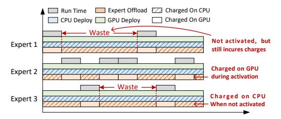

# II. MOTIVATION

Partial expert activation. In a serverless context, billing is based on the amount of allocated resources and the execution time. This means that even if most of the experts are not activated, they still occupy memory and incur costs for the entire duration. An example is shown in Fig. [1.](#page-1-0) It is clear that whether an MoE model is deployed on a GPU or CPU, all of its experts incur charges for the entire runtime, even if Expert 1 and 3 are each activated just twice. Although expert offloading methods move most of the unused experts to CPUs, all experts still continuously consume memory. A lot of work [\[7\]](#page-9-6)–[\[10\]](#page-9-7) has shown that the activation frequencies of experts in MoE models differ markedly. To reduce MoE inference cost in a serverless setting, the key is to reduce the memory waste of these low-frequency experts.

Fig. 1: The runtime and charged duration of different deployment methods, and *expert offload* represents all expert offloading methods [\[7\]](#page-9-6)–[\[10\]](#page-9-7) which exchange experts to GPU during activation and offload the remaining experts to CPU.

Communication overhead between layers. One bottleneck of Serverless is the limit on the amount of data that can be communicated between functions, also known as the payload size. For example, AWS Lambda has a payload size limit of 6MB for data transmission. To transfer large amounts of data, an intermediary storage service like AWS S3 must be used, which introduces significant latency. For LLM inference, the data transferred between different layers are tokens and their data size is shown in Table [I.](#page-1-1)

TABLE I: Token Size for different MoE models (Bfloat16)

| Model Name     | Parameters | Hidden Size | Token Size |
|----------------|------------|-------------|------------|
| Mixtral-8x7B   | 47B        | 4096        | 8 KB       |
| Mixtral-8x22B  | 141B       | 6144        | 12 KB      |
| Qwen2-57B-A14B | 57B        | 3584        | 7 KB       |
| DeepSeek-V2    | 236B       | 5120        | 10 KB      |
| DeepSeek-V3    | 671B       | 7168        | 14 KB      |
| Phi-4          | 14.7B      | 5120        | 10 KB      |

As we can see, the token size is much smaller than the payload size limit. According to previous work [\[10\]](#page-9-7), [\[16\]](#page-9-14), in lowoverhead environments (such as edge computing), requests are often single-batch. Therefore, only a few tokens are transferred between layers during the decoding, which fully meets the payload size limit. This observation makes it feasible to offload low-frequency MoE experts to separate serverless functions (model partitioning) without incurring latency overhead from intermediate storage.

Expert inference on the CPU. While deploying an entire MoE model on a CPU significantly increases inference latency, its components have varying computational demands. The attention layers are computationally intensive and benefit from GPU acceleration. In contrast, the expert modules are simpler, and since only a few are activated per token, they have lower computational needs. Numerous studies [\[17\]](#page-9-15), [\[18\]](#page-9-16) have already validated the feasibility of deploying these experts on CPUs. In a serverless environment where GPUs are much more expensive than CPUs, this enables a cost-saving heterogeneous strategy: run the computationally heavy modules on the GPU and offload the less demanding expert modules to the CPU. Therefore, combining CPU-GPU inference with model partitioning can theoretically reduce the inference cost of MoE models on serverless platforms.

#### III. SYSTEM MODEL

#### A. System Overview

In this section, we first consider a general Mixture of Experts (MoE) model. The model is composed of a preprocessing layer p, a set of intermediate layers  $\mathcal{H} = \{h_1, h_2, \ldots, h_L\}$  with length L, and a post-processing layer b. Each intermediate layer  $h_l = (\mathcal{F}_l, \mathcal{E}_l)$  consists of a non-expert module  $\mathcal{F}_l$  and an expert module  $\mathcal{E}_l$ . The non-expert module  $\mathcal{F}_l$  is typically composed of transformers and the gate. The expert module is represented as a list  $\mathcal{E}_l = \{e_{l,1}, e_{l,2}, \ldots, e_{l,K_l}\}$ , where  $e_{l,k}$  is the k-th expert in the l-th layer, and  $K_l$  is the total number of experts. For certain MoE architectures that share experts, such as DeepseekMoE [13], these shared experts are considered part of  $\mathcal{F}_l$  since they process all tokens.

For a request, the inference process of a MoE model can be divided into four stages: 1) **Pre-processing**: The raw natural language is tokenized and encoded by p and the resulting tokens are then passed to  $\mathcal{H}$ . 2) **Prefilling**: In each layer, all input tokens are processed by  $\mathcal{F}_l$  and  $\mathcal{E}_l$ . The gate routes each token to the most appropriate experts. Finally, the model outputs the most probable token, known as the *first token*. 3) **Decoding**: The *first token* is fed as input to  $\mathcal{H}$ , and the same computational process is repeated to produce the next token, continuing until all tokens are generated. 4) **Post-processing**: All generated tokens are sent to b, converted back into natural language, and then output.

To minimize the inference cost, we design a heterogeneous architecture for *Remoe*. The system overview is shown in Fig. 2. First, we pack all intermediate layers  $\mathcal{H}$  as an individual serverless function for inference (main model). The expert module  $\mathcal{E}_l$  runs on the CPU; other modules use the GPU. According to the activation frequency, we move some lowfrequency experts from the main model to extra serverless functions. For intermediate layer  $h_l$ , the low-frequency experts in  $\mathcal{E}_l$  will be allocated to the same extra function on CPU, and we call them "remote experts". The remote expert set of  $h_l$  is denoted as  $\mathcal{R}_l$ . In contrast, those high-frequency experts still remain in the main model, and we call them "local experts". This architecture significantly reduces the memory (GPU/CPU) overhead of the runtime container. Meanwhile, the local and remote experts can be computed in parallel, accelerating expert inference.

**Decision variables.** We introduce four decision variables: 1) Remote expert decision  $x_{l,k}$ .  $x_{l,k} = 1$  indicates that the expert  $e_{l,k}$  is designated as a remote expert. 2) Remote expert memory  $y_{l,v}$ . The set of all available memory specifications is denoted by  $\mathcal{M} = \{m_1, m_2, \ldots, m_V\}$ , where V is the total number of specifications.  $y_{l,v} = 1$  indicates that the memory specification v is allocated to the function holding the remote expert set  $\mathcal{R}_l$ . 3) Remote expert replicas  $z_l$ . Benefiting from the elastic scaling capabilities of serverless computing, multiple replicas can be instantiated to accelerate the expert inference

Fig. 2: System Overview

process.  $z_l$  is the replicas number of the functions for  $\mathcal{R}_l$ . 4) Main model memory  $w_v$ ,  $w_v=1$  indicates that the memory specification v is allocated to the main model. On common serverless platforms like AWS Lambda, users only need to set the memory allocation, and the platform automatically assigns corresponding vCPU resources. In this paper, we assume that 1 GB of memory corresponds to 1 vCPU.

