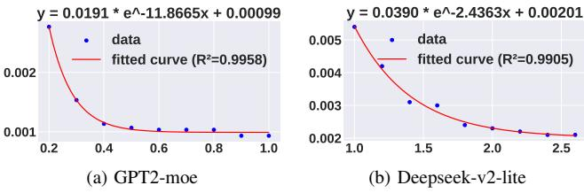
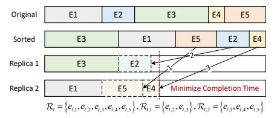

# <span id="page-5-3"></span>**Algorithm 2** Main Model Pre-allocation (MMP)

```
1: Initialize M^{min} = \sum_{l=1}^L \sum_{k=1}^{K_l} (1-x_{l,k}) \mu(e_{l,k}) + N^{max} D, 2: Initialize remote expert ratio b \leftarrow 1, M^{cal} \leftarrow m_{V^e}
 3: repeat
 4:
        for l=1 to L do
            Calculate the remote time based on Corollary 1 and b
 5:
 6:
        Calculate the memory of local experts M^e with \boldsymbol{b}
 7:
        Set the main model memory M \leftarrow \max(M^{min} + M^e, M^{cal})
 8.
 9:
        Calculate the TTFT and TPOT with M and b.
10:
        b \leftarrow b - \epsilon
11: until TTFT and TPOT limits are met
12: Select the minimum specification w_v that satisfies m_{w_v} \ge M
13: return w_v
```

First, MMP initializes the minimum memory  $M^{min}$  for non-expert modules caching. It also sets remote expert ratio b and  $M^{cal}$ , the minimum memory required to ensure local experts execute faster than remote ones (Lines 1-2). With

specific b, MMP first calculates the remote processing time of each layer based on Corollary 1 and b (Lines 4-6). This allows for the calculation of the worst-case remote inference latency. Then, MMP calculates the memory required to cache local experts for a given ratio b (Line 7). According to it, the main model memory is confirmed and  $M^{min} + M^e$  is the minimum memory to hold the parameters (Line 8). This process is repeated with decreasing values of b until both TTFT and TPOT are met (Lines 9-11). Finally, MMP returns the minimum specification  $w_v$ , such that  $m_{w_v} \ge M$  (Lines 12-13).

#### D. Remote Experts Selection

0.14

0.10

0.02

Given the expert activation matrix  $\tilde{S}$  and ratio b, we first calculate the expected number of tokens for each  $e_{l,k}$ . For the prefilling, this is  $E[N_{l,k}^{pre}] = N^{in} \tilde{s}_{l,k}$ , and for the decoding, it is  $E[N_{l,k}^{dec}] = N^{out} N^{topk} \tilde{s}_{l,k}$ . Our objective is to minimize latency for a given remote expert ratio, b, which is obtained in Sec. IV-C. To achieve this, we define a utility score  $u_{l,k} = E[N_{l,k}^{pre}] + E[N_{l,k}^{dec}]$  and choose the experts with the lowest utility scores to be remote. This selection is formally defined as choosing the set of remote experts,  $R_l$ , such that:  $\mathcal{R}_l = \arg\min_{\mathcal{R}_l} \sum_{e_{l,k} \in \mathcal{R}_l} u_{l,k}, |\mathcal{R}_l| = bK_l, \forall l$ . All  $x_{l,k}$  are set according to  $\mathcal{R}_l$ .

#### E. Remote Experts Memory Optimization

With  $w_v$  and  $X_l$ , the original problem transforms into an optimization problem of variables  $y_{l,v}$  and  $z_l$ .

We observe that: 1) Looser TTFT constraint: The expert replica decision variable  $z_l$  only exists in the prefilling stage. Due to the cold start time  $T^{cold}$ , the TTFT constraint is often looser than the TPOT constraint. 2) Longer decoding time: During the prefilling, each expert layer undergoes batch processing only once. Therefore, this stage is much shorter than decoding with multiple iterations [25]. Fig. 5 shows the prefilling/decoding times for different numbers of tokens.

**Problem Reformulation**. Based on these observations, the contribution of variable  $y_{l,v}$  to the optimization objective is considered to be concentrated in the decoding stage. Therefore, we can fix the prefilling time as a ratio of the decoding time to serve as an upper bound  $(PT \leq \eta GT)$ , and usually  $\eta \leq 0.1$  according to Fig. 5. After removing all constant values unrelated to y, the optimization objective for the memory allocation of remote experts can be expressed as:

$$\min_{y} P_{1} = (1+\eta) \sum_{l=1}^{L} \sum_{v=1}^{\tilde{V}^{e}} y_{l,v} (\tilde{s}_{l} T_{l,v}^{rem} + t_{l}^{rem}) (H^{w} + c^{c} m_{v})$$
 (12)

The remaining constraints are similar to those in Eq. (10) and are omitted here due to space limit. Here, the constant  $H^w = c^g M^g + c^c \sum_{v'=1}^V w_{v'} m_{v'}$  is the overhead per unit time of the main model.  $T_{l,v}^{rem} = N^{topk} t_{l,v}^c$  is the computation time for remote experts to decode all tokens (number here is  $N^{topk}$ ).  $\tilde{s}_l = \sum_{k=1}^{K_l} x_{l,k} \tilde{s}_{l,k}$  is the total probability of each token transferred to those remote experts.

**Function Construction and Fitting.** For this problem, the search space for memory size is large, and the solution complexity remains high. Therefore, we linearize the discrete

term  $\sum_{v=1}^{V^e} y_{l,v} m_v$  into a continuous variable  $\tilde{y}_l$ , where  $m_1 \leq$  $\tilde{y}_l \leqslant m_{V^e}$ . We consider that the inference time of remote experts gradually decreases as the allocated memory increases, eventually converging to a constant. To model this characteristic, we construct the formula  $\tilde{T}_l^{rem} = \theta_1 \exp(-\theta_2 \tilde{y}_l) + \theta_3$  $(\theta_1, \theta_2, \theta_3 > 0)$ . The parameters herein can be obtained by fitting data from model profiling, as illustrated by the fitted curve in Fig. 6 and the objective can be transformed into  $P_2$ :

$$\min_{y} P_{2} = (1+\eta) \sum_{l=1}^{L} \tilde{s}_{l} \left( \tilde{T}_{l}^{rem} + \frac{t_{l}^{rem}}{\tilde{s}_{l}} \right) \left( H^{w} + c^{c} \tilde{y}_{l} \right)$$
(13)

Although all integer terms have been relaxed into continuous ones, the objective function introduces non-linear terms such as  $H^w \tilde{T}_l^{rem}$  and  $c^c \tilde{y}_l \tilde{T}_l^{rem}$ , making it unsolvable by linear programming.

<span id="page-6-0"></span>

Fig. 6: Fitted Curves of CPU Resources vs. Inference Time

**Convexity Analysis.** To enable the subsequent optimization, we first perform the convexity analysis on the constructed functions and objective function.

<span id="page-6-1"></span>**Theorem 2.** Let  $g(\tilde{y}_l) = \left(\tilde{T}_l^{rem} + \frac{t_l^{rem}}{\tilde{s}_l}\right) (H^w + c^c \tilde{y}_l)$ . For  $\tilde{y}_l \in \left[\frac{2}{\theta_2} - \frac{H^w}{c^c}, \infty\right)$ , the function  $g(\tilde{y}_l)$  is strictly convex and continuously differentiable. And when  $\theta_2 \geqslant \frac{2c^c}{H^w}$ , the function  $g(\tilde{y}_l)$  is strictly convex on  $(0, \infty)$ .

For Theorem 2, we need to analyze whether different models satisfy this characteristic. As shown in Fig. 6, the values of  $\theta_2$  for GPT2-moe and Deepseek-v2-lite are 11.8665 and 2.4363, respectively. On commercial serverless platforms that support GPU resource allocation (e.g., Alibaba Cloud, Tencent Cloud), the overall cost standard for GPU is generally 3 times or more than that of CPU, i.e.,  $\frac{c^g}{c^c} \geqslant 3$ . Therefore, we have:  $\frac{2c^c}{H^w} = \frac{2}{c^g M^g/c^c + \sum_{v'=1}^V w_{v'} m_{v'}} \leqslant \frac{2}{3M^g + \sum_{v'=1}^V w_{v'} m_{v'}}$ . Here,  $M^g$  is the GPU memory overhead of the non-expert layers, and  $\sum_{v'=1}^V w_{v'} m_{v'}$  is the CPU memory overhead of the main model. For Deepseek-v2-lite, its non-expert layers have approximately 0.5B parameters, even if only 3GB of memory is allocated to the main model, we have  $\frac{2c^c}{H^w} \approx 0.25 \ll 2.4363$ . Under a similar analysis, when the main model retains only 12.5% of the experts as local, the value for GPT2-moe is  $\frac{2c^{\circ}}{H^{w}} \approx 2.72 \ll 11.8665$ . It can be seen that most MoE models conform to the aforementioned characteristic.

**Lagrangian Solving.** After analyzing the convexity of problem  $P_2$ , we give the dual problem of the primal problem

$$\begin{array}{ll} P_{2}, \text{ denoted as } P_{2}^{D} \colon \\ \max_{\lambda} & P_{2}^{D} = (1+\eta) \sum_{l=1}^{L} \tilde{s}_{l} g(\tilde{y}_{l}) + \sum_{j=1}^{4} \sum_{l=1}^{L} \lambda_{l,j} q_{l,j}^{c}(\tilde{y}_{l}) \\ \text{s.t.} & \lambda_{l,1}, \lambda_{l,2}, \lambda_{l,3}, \lambda_{l,4} \geqslant 0, \forall l \end{array} \tag{14a}$$

s.t. 
$$\lambda_{l,1}, \lambda_{l,2}, \lambda_{l,3}, \lambda_{l,4} \ge 0, \forall l$$
 (14b)

where  $q_{l,i}^c(\tilde{y}_l)$  represents the j-th constraint function in problem  $P_2$ , and  $\lambda_{l,j}$  is the corresponding dual variable. Thereinto,  $q_{l,1}^c(\tilde{y}_l)$  is the TPOT constraint and the rest are linear constraints on the range of  $\tilde{y}_l$ .

<span id="page-6-5"></span>**Lemma 1** (Slater's Condition). All constraints  $q_{l,j}^c(\tilde{y}_l)$  are convex, and when  $g(\tilde{y}_l)$  is strictly convex on  $(0, \infty)$ , problem  $P_2$  is a convex optimization problem and strong duality holds.

<span id="page-6-2"></span>**Theorem 3.** Let  $\tilde{y}^*$ ;  $\lambda^*$  be the solution to the dual problem  $P_2^D$  that satisfies the KKT conditions. Then  $\tilde{y}^*$  is also the optimal solution to the primal problem  $P_2$ .

According to Theorem 3, the problem  $P_2$  can be solved using the Lagrangian duality method, and the resulting remote expert memory  $y_{l,v}$  is the optimal solution for this problem.

## F. Remote Experts Multi-replicas Inference

1) Remote Expert Subsets Partitioning: In Eq. (3), we discussed partitioning the set  $\mathcal{R}_l$  into  $\mathcal{R}_{l,1}, \dots, \mathcal{R}_{l,z_l}$ . To minimize  $\max_{i} \{ZT_{l,i}\}\$ , we model the optimal partition as a Multiway Number Partitioning problem. An example is in Fig. 7.

<span id="page-6-3"></span>

Fig. 7: Multiway Number Partitioning problem and LPT Our objective is to assign tasks to different replicas, minimizing the completion time of all replicas. The subset  $\mathcal{R}_{l,1}$ correspond to remote expert tasks handled by replica 1. We use LPT algorithm to solve it. In simple terms, LPT sorts the tasks, and always selects the replica with the minimum load to assign tasks sequentially. The complexity of LPT is  $O(n \log n)$ , with an approximation ratio [26] of  $ZT^{max}$  $\left(\frac{4}{3} - \frac{1}{3z_l}\right)ZT^{OPT}$ . Furthermore, we can also prove an upper bound for  $\max_{j \leqslant z_l} \{ZT_{l,j}\}$ , as shown in Theorem 4.

<span id="page-6-4"></span>**Theorem 4.** Let  $T_{l,v}^{rem} = \sum_{k=1}^{K_l} \left( PT_{l,k}^{rem} + \frac{2D}{B} N_{l,k}^{pre} \right)$ , and  $N^{up}=\frac{\sqrt{3N^{in}}}{2}+\frac{N^{in}}{K_l}.$  Given  $z_l$  replicas, With a high probability (95%),  $\max_{j \leq z_l} \{ ZT_{l,j} \} \leq \frac{z_l - 1}{z_l} \left[ \sum_{v=1}^{V^e} y_{l,v} \tau_{l,v}^c(N^{up}) + \frac{2D}{B} N^{up} \right] + \frac{T_l^{rem}}{z_l} + t_l^{rem}$ 

2) Remote Expert Replicas Decision: Theorem 4 provides the worst-case prefilling time  $\max_{j \leq z_l} \{ZT_{l,j}\}$ , which enables us to optimize the replicas,  $z_l$ , to meet the TTFT constraint.

First, we initialize  $Z = (z_1, ..., z_L)$  to ensure each  $z_l$  meets the payload size. Then, for each layer, we calculate the current replica potential:

 $\overline{\omega}(l,Z) = \{C^{loc} + C^{rem}\}_{Z,z'_l = z_l} - \{C^{loc} + C^{rem}\}_{Z,z'_l = z_l + 1}$ (15)  $\{C^{loc} + C^{rem}\}_{Z,z'_l=z_l+1}$  represents the overall cost after  $z_l$ increases by 1. For the layer with the greatest replica potential,  $l^{max}$ , we let the replicas of layer add one and update Z. This process is repeated until the worst-case TPOT is satisfied. Finally, if  $\varpi(l, Z) > 0$  for some l, we continue to add replicas to reduce the overall cost until either  $\varpi(l, Z) \leq 0$  or  $z_l = z^{\max}$ for all l.

#### V. EVALUATION

#### <span id="page-7-0"></span>A. Settings

**Testbed.** We implemented a prototype of *Remoe* based on Kubernetes. It includes several key components: 1) To fit our inference framework, we modified all MoE models used in our experiments to support parallel inference with both local and remote experts. 2) We use the C++ LibTorch library and gRPC to provide efficient serverless inference services, minimizing data transfer overhead and response time. 3) Our Pod scheduler is NUMA-aware. The experimental platform is a server featuring a dual-socket configuration with two Intel Xeon Gold 6348 CPUs (totaling 56 cores, 112 threads). Furthermore, the server is equipped with two NVIDIA A100 GPUs, each providing 80 GB of VRAM.

**Dataset**. To ensure a comprehensive evaluation, our experiments are conducted on four widely-used datasets. These include: **LMSYS-Chat-1M** [22]: A dataset with 1M real-world conversations for evaluating chat and instruction-following abilities. **WikiText-2** [27]: A high-quality language modeling benchmark derived from Wikipedia articles. **C4** [28]: A massive, cleaned web-text corpus from Common Crawl, used for testing model generalization. **SlimPajama** [29]: A large-scale and high-quality dataset designed for model pre-training.

Models. We use two MoE models at different scales: 1) GPT2-moe: The original GPT2 model has 12 hidden layers and 124 million parameters. The FFN of each layer is converted into 8 experts and a gating network. Each token is routed to 2 experts per layer for inference (remote expert memory specifications: [200, 2000] MB; main model: [200, 5000] MB). 2) Deepseek-v2-lite: It has 27 hidden layers and 16 billion parameters. Each layer has 64 experts and 2 shared experts except the first dense layer. Each token is routed to 6 experts and 2 shared experts per layer (remote experts: [1000, 5000] MB; main model: [1000, 40000] MB). The step size for memory specifications is 100 MB.

