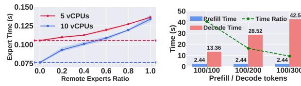

# C. Resource Pre-allocation for Main Model

To handle a cold start, *Remoe* pre-allocates memory for the main model as soon as a request arrives. This mechanism is separate from activation prediction (Sec. IV-B). This parallel approach is effective because the main model's pre-allocation can overlap with the pre-processing layer's cold start, which must complete before activation prediction can begin.

**Decoding Time Analysis.** We simplify Eq. (5) by removing the max function, assuming the remote expert path is always the performance bottleneck. This assumption is supported by two key observations. First, as shown in Fig. 4, the expert inference time increases nearly linearly with the ratio of remote experts. This indicates that, with the same vCPUs, remote experts dominate the inference time in Eq. (5). Second, in practical scenarios, the main model is typically allocated more vCPUs, ensuring faster computation for local experts.

Fig. 4: Expert inference time Fig. 5: Prefilling Time vs. Dewith 5 and 10 cores coding Time

**Theorem 1.** When n tokens pass through layer l, the number of tokens processed by the k-th expert will not exceed  $\frac{\sqrt{3n}}{2} + \frac{n}{K_l}$  with a high probability (95%).

**Corollary 1.** For n tokens and m experts, processed tokens will not exceed  $\frac{\sqrt{3n}}{2} + \frac{mn}{K_1}$  with a high probability (95%).

**Main Model Pre-allocation**. For the main model, we must pre-allocate a minimum memory specification that guarantees SLOs are met even in the worst-case scenario. Theorem 1 and Corollary 1 provide an upper bound in such a scenario. To this end, we design the Main Model Pre-allocation (*MMP*) algorithm detailed in Algorithm 2.

