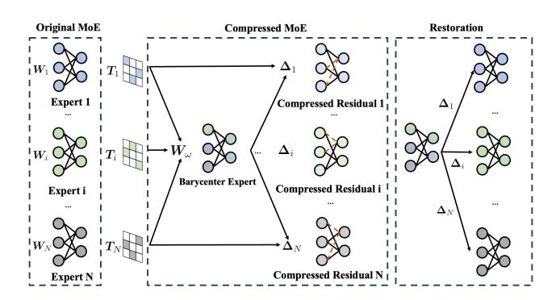
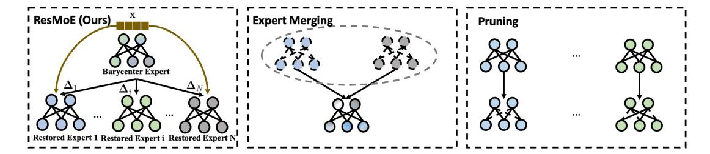
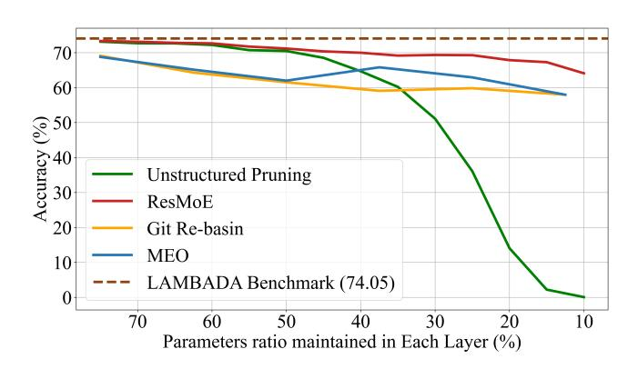

# 3.2 Optimal Transport and Wasserstein Barycenter

Optimal transport (OT) theory has achieved great success in depicting the underlying geometry of distributions [47]. We consider two distributions  $\mu = \sum_{i=1}^n \alpha_i \delta_{x_i}$  and  $\nu = \sum_{j=1}^m \beta_j \delta_{y_j}$  with  $\alpha_i, \beta_j$  as masses respectively assigned to points  $x_i, y_j$ , and  $\delta_x$  being the Dirac unit mass located on x. (In this paper,  $\mu$ ,  $\nu$  will always be the discrete distributions.) OT reflects a process of transporting the mass from positions  $x_i$ 's to  $y_j$ 's (transforming the source distribution  $\mu$  to the target distribution  $\nu$ ) with the minimal overall cost, in which the cost of transporting a unit mass from  $x_i$  to  $y_j$  is given by the cost function  $D(x_i, y_j)$ .

A transport plan can be specified by a matrix  $\mathbf{M} \in \mathbb{R}^{n \times m}$ , where  $\mathbf{M}_{i,j}$  indicates the mass to be transported from  $x_i$  to  $y_j$ . We note that the column and row sums of  $\mathbf{M}$  respectively equal to  $\boldsymbol{\alpha}$  and  $\boldsymbol{\beta}$ , implying all the masses in  $\boldsymbol{\mu}$  are transported to the desired points in  $\boldsymbol{\nu}$ , i.e.,  $\mathbf{M} \in \Pi(\boldsymbol{\alpha}, \boldsymbol{\beta}) \coloneqq \{\mathbf{M} \in \mathbb{R}^{n \times m} | \sum_{j=1}^m \mathbf{M}_{i,j} = \boldsymbol{\alpha}_i, \sum_{i=1}^n \mathbf{M}_{i,j} = \boldsymbol{\beta}_j \}$ . OT seeks the optimal plan to transport  $\boldsymbol{\mu}$  to  $\boldsymbol{\nu}$  w.r.t the overall transportation cost, formulated as [47]:

$$\mathrm{OT}(\mu,\nu) := \underset{\mathbf{M} \in \Pi(\boldsymbol{\alpha},\boldsymbol{\beta})}{\mathrm{arg\,min}} \sum_{i,j} \mathbf{M}_{i,j} C_{i,j} = \underset{\mathbf{M} \in \Pi(\boldsymbol{\alpha},\boldsymbol{\beta})}{\mathrm{arg\,min}} \langle \mathbf{M}, \mathbf{C} \rangle,$$

where  $C := [D(x_i, y_j)]_{ij} \in \mathbb{R}^{n \times m}$  is the cost matrix.

Setting the cost function as  $D(x_i, y_j) = ||x_i - y_j||^2$ , we can obtain 2-Wasserstein distance [47] as:

<span id="page-2-2"></span>
$$W_2^2(\mu, \nu) := \min_{\mathbf{M} \in \Pi(\boldsymbol{\alpha}, \boldsymbol{\beta})} \langle \mathbf{M}, \mathbf{C} \rangle.$$

In this paper, we specifically focus on the free-support Wasserstein barycenter problem induced by 2-Wasserstein distance. Given a set of distributions  $\mu_1, \ldots, \mu_N$ , the Wasserstein barycenter  $\bar{\mu}$  is the "average" distribution in terms of the Wasserstein distance. To regulate the form of  $\bar{\mu}$  in numerical computation, we specify  $\bar{\mu}$  as a uniform distribution on n points, and optimize it through:

$$\bar{\mu} = \underset{\{x_i\}_{i=1}^n}{\arg\min} \frac{1}{N} \sum_{k=1}^N W_2^2 \left( \mu_k, \sum_{i=1}^n \frac{1}{n} \delta_{x_i} \right). \tag{1}$$

We comment Cuturi and Doucet [9] have provided efficient numerical algorithms for the free-support Wasserstein barycenter problem above, which will be heavily utilized in our implementations. In a nutshell, we conclude Wasserstein barycenter captures the underlying advection in the distribution space, offering a powerful tool for aggregating distributions in a geometrically meaningful way.

<span id="page-2-1"></span>

Figure 2: The overall framework of ResMoE. We introduce permutation matrices T to obtain the barycenter expert  $W_\omega$  from a distributional view. Instead of compressing the original experts directly, we opt to compress the residual matrices ( $\Delta$ , illustrated with lighter colors) between each expert and the barycenter expert, with the capability to dynamically and efficiently restore the original matrices during inference. We illustrate the concept using unstructured pruning as an example, with dashed orange lines indicating the pruned connections within the network.

## 4 Proposed Methodology

In this section, we first analyze the limitations of existing fusion strategies, and then give a detailed introduction to ResMoE, along with its visualization provided in Figure 2 and pseudocode in Appendix A.9. For a comprehensive visual comparison between ResMoE and previous baseline methods, please refer to Figure 3.

#### <span id="page-2-0"></span>4.1 Limitations of Existing Fusion Strategies

In advance of our proposal in Section 4.2, we first review the limitations of existing fusion/merge strategies, which mainly serves as the motivation for developing the ResMoE framework.

Alignment-based model fusion [2, 54] is proposed to fuse multiple models, that can be adapted in the MoE structure to fuse MLPs (which may have more than two layers) and relates to OT. In OT Fusion [54], for a two-layer MLP, their algorithm starts from aligning the first layer of each expert and then pre-aligns the second layer with the permutation matrix obtained from the first layer, repeating the procedure to align the second layer further. Similarly, in Git Re-Basin [2], they propose to align the weights through a greedy loop for each layer, which demonstrates zero-barrier linear mode connectivity [20] between independently trained models on the same dataset. We note the alignment-based model fusion technique implies a layer-by-layer strategy to formulate MoE layers as distributions and to merge experts. Moreover, expert merging [28, 35, 69] has been recently introduced to reduce the number of experts in MoE modules. This approach merges experts using task-specific information, such as router gating score distribution or router activation frequency.

Both the model fusion and expert merging reduce the number of experts to compress the model, while we remark that the direct reduction in the number of experts may lead to a huge deviation from the original module output, especially in the zero-shot setting.

To better understand this, we first revisit the MoE layer from an all-experts matrix perspective. We define the router matrix  ${\bf R}$  as:

$$\mathbf{R} \coloneqq \mathrm{diag}(G(\mathbf{x})) \otimes \mathbf{I}_{p_{\mathrm{I}}} = \begin{bmatrix} [G(\mathbf{x})]_{1}\mathbf{I} & & & \\ & \dots & & \\ & & [G(\mathbf{x})]_{N}\mathbf{I} & \end{bmatrix}_{N \cdot p_{\mathrm{I}} \times N \cdot p_{\mathrm{I}}},$$

where  $\otimes$  is the Kronecker product, I is the identity matrix, and  $G(\mathbf{x})$  is a sparse score vector. The weight matrices in the MoE layer are overall denoted as:

$$\begin{split} \mathbf{W}^{(1)} &= \left( \begin{array}{c} \mathbf{W}_1^{(1)} \cdots \mathbf{W}_N^{(1)} \end{array} \right)_{N \cdot p_1 \times p}^{\mathrm{T}}, \\ \mathbf{W}^{(2)} &= \left( \begin{array}{c} \mathbf{W}_1^{(2)} \cdots \mathbf{W}_N^{(2)} \end{array} \right)_{p \times N \cdot p_1}. \end{split}$$

The output of the MoE layer can accordingly be expressed as (omitting the bias term for simplicity):

$$\mathbf{y} = \mathbf{W}^{(2)} \mathbf{R} \sigma \left( \mathbf{W}^{(1)} \mathbf{x} \right), \tag{2}$$

in which R encapsulates crucial expert knowledge and exhibits high sparsity, as typically only a selected number of experts are activated within each MoE layer.

To analyze the difficulty of compressing the space-occupying  $N \cdot p_{\rm I} \times p$  matrices  $\mathbf{W}^{(1)}, (\mathbf{W}^{(2)})^{\rm T}$ , we turn to a theoretical framework *oblivious subspace embedding* [8, OSE] which can preserve any p-dimensional subspace of  $\mathbb{R}^{N \cdot p_{\rm I}}$  (here, we focus on the subspaces spanned by  $\mathbf{W}^{(1)}$  and  $(\mathbf{W}^{(2)})^{\rm T}$ ) through a  $d \times N \cdot p_{\rm I}$  random projection matrix  $\Pi$ , with d being the projection dimension. The projection  $\Pi \mathbf{W}^{(1)}$  and  $\Pi (\mathbf{W}^{(2)})^{\rm T}$  can be considered as a sketch of the expert merging strategy.

We then recognize the limitation of expert merging via the lens of OSE. As per Cohen [8], d should be at least  $O(p \log p/\epsilon^2)$ , where  $\epsilon$  is the error tolerance level; in compressing MoE (N will NOT go to infinity), however, the scale of  $p \log p/\epsilon^2$  will be even larger than  $N \cdot p_{\rm I}$  by simply setting  $\epsilon = 0.05$ . The space gain from expert merging is thus usually marginal in this very practical case. In this regard, reducing the number of experts per MLP layer might not be that practical. Instead, we propose each expert should be kept during compression.

To alleviate the deficiency of OSE above, MC-SMoE [35] leverages the information from training data to reduce the scale of d, rendering the merging no longer data-"oblivious". However, due to the requirement to first do fine-tuning and the restriction that during inference the test data have to be i.i.d. as the training data, this therapy will be less valid in the zero-shot setting we mainly consider. We also empirically verify the above observations on the expert merging strategies in Section 5.4.

## <span id="page-3-0"></span>4.2 An Extraction Strategy Specific to the MoE Structure

Following our speculation that each expert in the MLP layer should be kept, we propose ResMoE, a framework to compress the representation of those experts through a Wasserstein barycenter expert and the residual matrices between each expert and the barycenter expert. Specifically, we extract an expert  $E_{\omega}$  with the

common pattern from all the experts, and then model the difference between  $E_{\omega}$  and  $E_k$  by fewer parameters (we will introduce the difference modeling in Section 4.3). We first revisit a viewpoint that an MLP can be taken as the ensemble of multiple bottleneck-1 sub-MLPs [62, 66, 70]. We rewrite the MLP output as follows:

<span id="page-3-1"></span>
$$E_k(\mathbf{x}) = \sum_{i=1}^{p_{\text{I}}} \left[ \mathbf{W}_{k,\cdot,i}^{(2)} \cdot \sigma \left( \left\langle \mathbf{W}_{k,i,\cdot}^{(1)}, \mathbf{x} \right\rangle + \mathbf{b}_{k,i}^{(1)} \right) \right] + \mathbf{b}_k^{(2)}, \tag{3}$$

where by convention we represent the *i*-th row (resp. column) in the weight matrix  $\mathbf{W}_k^{(1)}$  (resp.  $\mathbf{W}_k^{(2)}$ ) as  $\mathbf{W}_{k,i,\cdot}^{(1)}$  (resp.  $\mathbf{W}_{k,\cdot,i}^{(2)}$ ), and  $\sigma(\cdot)$  is the activation function. The summation implies that an MLP is the ensemble of a few bottleneck-1 sub-MLPs (the sum on the right-hand-side above), which allows a distributional perspective of MLP since the order of the sum does not matter.

Note that various expert network architectures can all be expressed using the structure of multiple bottleneck-1 sub-MLPs. The FFN in both Mixtral and DeepSeekMoE models uses a gated network following Llama [60], whose detailed form can be found in Appendix B.3.

Since  $\mathbf{b}_i^{(2)}$  is not involved in the summation in Equation (3), we accordingly quantify the extraction as, after proper permutation, minimizing the squared Frobenius norm of differences between the original weight matrices in each expert and the weight matrices in the barycenter expert:

<span id="page-3-2"></span>
$$\min_{\substack{\mathbf{W}_{\omega}^{(1)}, \mathbf{b}_{\omega}^{(1)}, \mathbf{W}_{\omega}^{(2)} \\ \mathbf{T}_{k} \in \mathcal{P}, k \in [N]}} \frac{1}{N} \sum_{k=1}^{N} \left[ \left\| \mathbf{T}_{k} \left[ \mathbf{W}_{k}^{(1)}, \mathbf{b}_{k}^{(1)} \right] - \left[ \mathbf{W}_{\omega}^{(1)}, \mathbf{b}_{\omega}^{(1)} \right] \right\|_{F}^{2} \right. (4)$$

$$+ \left\| \mathbf{W}_{k}^{(2)} \mathbf{T}_{k}^{\mathsf{T}} - \mathbf{W}_{\omega}^{(2)} \right\|_{F}^{2} \right],$$

where  $\mathcal{P}$  is the class of  $p_I$ -by- $p_I$  permutation matrices and  $\mathbf{W}_{\omega}^{(1)} \in \mathbb{R}^{p_I \times p}, \mathbf{b}_{\omega}^{(1)} \in \mathbb{R}^{p_I}, \mathbf{W}_{\omega}^{(2)} \in \mathbb{R}^{p \times p_I}$  are the weight matrices in the barycenter expert  $E_{\omega}$ . The introduction of the permutation matrices  $\mathbf{T}_k$ 's aligns with the distributional perspective of MLPs, that an MLP  $E_k$  is equivariant to the row permutation of its design matrix  $\mathbf{W}_k = \left[\mathbf{W}_k^{(1)}, \mathbf{b}_k^{(1)}, (\mathbf{W}_k^{(2)})^{\mathrm{T}}\right] \in \mathbb{R}^{p_I \times (2p+1)}$  as the sum's order in Equation (3) is inconsequential. It is worth noting that simultaneously permuting  $\mathbf{W}_k^{(1)}$  and  $\mathbf{W}_k^{(2)}$  does not affect the expert's output since the permutation matrix is orthogonal.

To solve problem (4), we propose to address the distribution of sub-MLPs within each expert, rather than layer-by-layer. The summation in Equation (3) clearly shows the correspondence between the *i*-th row  $\mathbf{W}_{k,i}^{(1)}$  of  $\mathbf{W}_{k}^{(1)}$  and the *i*-th column  $\mathbf{W}_{k,\cdot,i}^{(2)}$  of  $\mathbf{W}_{k}^{(2)}$ ; to obtain the "embedding" of the sub-MLPs for the distributional formulation, we consider the original MLP  $E_k$  as a design matrix  $\mathbf{W}_k$ . We then run the algorithm for free-support Wasserstein barycenter [9] to obtain the weight matrix  $\mathbf{W}_{\omega} = \left[\mathbf{W}_{\omega}^{(1)}, \mathbf{b}_{\omega}^{(1)}, (\mathbf{W}_{\omega}^{(2)})^{\mathrm{T}}\right]$  for the barycenter expert, with  $\mathbf{W}_{\omega}$  being exactly the solution to the minimization problem (4).

To present the result, we respectively define  $\mu_k$ 's as the uniform distributions defined on the rows of the given  $\mathbf{W}_k \in \mathbb{R}^{p_1 \times (2p+1)}$ , for all  $k=1,2,\cdots,N$ , i.e.,  $\mu_k = \sum_{i=1}^{p_1} 1/p_1 \cdot \delta_{\mathbf{W}_{k,i,\cdot}}$ . Similarly  $\mu_{\omega}$  is uniformly distributed over the rows of  $\mathbf{W}_{\omega} \in \mathbb{R}^{p_1 \times (2p+1)}$ , and the

notation  $\mu_{\omega}$  is interchangeable with  $\mu_{\omega}(\mathbf{W}_{\omega})$ , which highlights the dependence on  $\mathbf{W}_{\omega}$ . We further denote the optimal transport matrix (w.r.t.  $W_2$  distance) from  $\mu_k$  to  $\mu_{\omega}$  as  $\mathrm{OT}(\mu_k, \mu_{\omega})$  as the solution of Equation (1). We can then give the following proposition (the proof is deferred to Appendix C).

**Proposition 4.1.** Consider the solution  $\mathbf{W}_{\omega}$  to the following free-support WB problem

$$\min_{\mathbf{W}_{\omega}} \frac{1}{N} \sum_{k=1}^{N} W_2^2(\mu_k, \mu_{\omega}(\mathbf{W}_{\omega})).$$
 (5)

Then  $\mathbf{W}_{\omega}$ , along with  $\mathbf{T}_k = p_{\mathbf{I}} \cdot \text{OT}(\mu_k, \mu_{\omega}(\mathbf{W}_{\omega}))$ , is the solution to the optimization problem (4).

**Remark**. We note that all the experts  $E_k$  and the barycenter expert  $E_\omega$  share the same size, i.e.,  $\mathbf{W}_k$ ,  $\mathbf{W}_\omega \in \mathbb{R}^{p_1 \times (2p+1)}$ . Therefore, the supports for distributions  $\mu_k$ ,  $\mu_\omega$  are of the same size  $p_{\mathrm{I}}$ . In discrete optimal transport, there is a special property that for two discrete uniform distributions with support of the same size, the optimal transport matrix between the two distributions will be re-scaled as a permutation matrix [47]. The conclusion simplifies the computation since the permutation matrix is orthogonal  $(\mathbf{T}_k \ (\mathbf{T}_k)^{\mathrm{T}} = \mathbf{I})$ . The output of the extracted expert  $E_\omega(\mathbf{x}) = \mathbf{W}_\omega^{(2)} \sigma(\mathbf{W}_\omega^{(1)} \mathbf{x} + \mathbf{b}_\omega^{(1)})$  (adding  $\mathbf{b}_\omega^{(2)}$ ) is automatically aligned with any expert  $E_k(\mathbf{x})$ ,  $\forall k \in [N]$  without additional transformations.

## <span id="page-4-0"></span>4.3 Residual Approximation and Expert Restoration

As the last step, we need to recover the selected expert from the barycenter expert. We choose two representative methods: unstructured pruning and SVD to remove the redundant parameters. (For unstructured pruning, we follow Han et al. [24] to zero out the parameters with small magnitude, in order to minimize the loss in problem (4).)

We will store a compressed matrix  $\Delta_k$  to approximate  $\mathbf{T}_k \mathbf{W}_k - \mathbf{W}_\omega$  and then use  $\Delta_k + \mathbf{W}_\omega$  to recover  $\mathbf{T}_k \mathbf{W}_k$ . We provide more implementation tricks for them in Appendix A.7 and the pseudocode of the algorithm in Appendix A.9. We remark that unstructured pruning produces comparable experimental results while SVD leads to more profound memory reduction.

In Figure 3, we visually compare ResMoE with previous baselines. Expert merging techniques consolidate multiple experts into a single entity, while pruning strategies involve the direct removal of connections within individual experts. ResMoE first obtains the common barycenter expert and subsequently compresses the residuals between each expert and the barycenter expert, which can be effectively and efficiently used for restoring in the inference stage.

#### 5 Experimental Results

This section starts with our experimental setup, followed a preliminary evaluation of ResMoE's approximation error against various baselines in Table 1 and its performance in Tables 2 and 3, concluding with an ablation study. All models and methods are implemented in PyTorch. Switch Transformer is fine-tuned on a Tesla V100 32GB GPU, while Mixtral is tested on four such GPUs. Detailed experimental information is available in Appendix A.1.

<span id="page-4-1"></span>Table 1: Approximation error of Switch Transformer and Mixtral. The experts are frozen during the fine-tuning stage hence most of the deterministic methods give zero standard deviation. All the numbers are normalized by a factor  $p_{\rm I}$  for better reference. UP stands for Unstructured Pruning, and SP stands for Structured Pruning.

<span id="page-4-2"></span>

|              | Switch Transformer | Mixtral          |
|--------------|--------------------|------------------|
| UP           | 34.27±0.00         | 10.26±0.00       |
| Wanda        | $22.93 \pm 0.03$   | $13.47 \pm 0.00$ |
| SP           | $87.00 \pm 0.00$   | $27.09 \pm 0.00$ |
| SVD          | $56.44 \pm 0.00$   | $21.70 \pm 0.00$ |
| M-SMoE       | $278.76 \pm 0.00$  | $16.73 \pm 0.00$ |
| MEO          | $63.25 \pm 0.00$   | $15.81 \pm 0.00$ |
| MLP Fusion   | $83.45 \pm 0.02$   | $27.28 \pm 0.01$ |
| ResMoE (UP)  | 22.05±0.02         | 6.60±0.01        |
| ResMoE (SVD) | $48.91 \pm 0.01$   | $14.63 \pm 0.04$ |

## 5.1 Experiment Setup

Model backbones. Our evaluation encompasses two primary architectures: the GPT-style causal decoder-only model and the T5-style encoder-decoder model. Specifically, we utilize Mixtral [30] for the decoder-only model, featuring 8 experts per layer across 32 layers. For the encoder-decoder model, we employ the Switch Transformer [18] with a similar expert-layer configuration (switch-base-8) but with 12 encoder layers followed by 12 decoder layers. We fix the router and the experts during the supervised fine-tuning stage, based on the observation that preserving the original LLM's universal world information can enhance their performance [16, 26, 43]. This observation is empirically supported by our findings, which demonstrate improved model performance. We also provide the efficiency analysis in Appendix A.8.

**Compared methods.** We compare our method with different types of baselines. For pruning, we employ both single-shot unstructured pruning [25, 33, 58] and structured pruning [36]. We also employ Wanda [57] for a more enhanced unstructured pruning method. We employ truncated SVD following Denton et al. [11]. For merging, we employ M-SMoE (the better-performing uncompressed version of MC-SMoE) [35] and MEO [28]. As the experimental results drop is profound in expert pruning [41] (50%), we employ it here only to Mixtral since our compression rate is more extreme (25%). We employ Git Re-Basin [2] for model fusion. Note that Git Re-Basin is not initially designed for MoE models, and we dynamically apply it as a fusion (merging) method according to its applicability to merge multiple models. We also compare our method with MLP Fusion [1], which aims to reduce the intermediate dimension of one expert MLP unit. As our compression rate is set to 25%, we perform different setups to all the methods to make sure they match this setting, detailed in Appendix A.3.

## 5.2 Preliminary Evaluation of Approximation Error

We calculate the approximation error of each method on the top 8 layers of Switch Transformer and the top 24 layers of Mixtral as a

<span id="page-5-0"></span>

Figure 3: Comparisons between ResMoE and baselines. Dash lines denote the connections or neurons are deleted. Expert Merging reduces the number of experts by consolidating several into one, while pruning is applied directly to the experts. In contrast, ResMoE compresses the residual and barycenter experts, with the input x directed to the restored experts.

<span id="page-5-1"></span>Table 2: Evaluation results of Switch Transformer on four GLUE NLU tasks (measured in accuracy). UP stands for Unstructured Pruning, and SP stands for Structured Pruning. We use "concat" and "sep" to denote the concatenated and separate processing of the expert weights. Bold indicates the best score for each metric, while underlined values represent the second-best.

|                    | SST-2            | MRPC             | CoLA             | MNLI             |
|--------------------|------------------|------------------|------------------|------------------|
| Switch Transformer | 93.92±0.18       | 89.54±0.86       | 82.29±0.28       | 87.82±0.15       |
| UP (concat)        | 93.12±0.23       | 87.75±1.12       | 81.40±0.48       | 85.32±0.66       |
| UP (sep)           | $90.21 \pm 0.44$ | 78.92±3.96       | $79.33 \pm 0.80$ | $76.06 \pm 5.47$ |
| Wanda              | $92.39 \pm 0.18$ | 86.74±0.93       | $80.59 \pm 1.01$ | $84.20 \pm 0.19$ |
| SP (concat)        | $90.67 \pm 0.36$ | $88.72 \pm 0.85$ | $79.39 \pm 0.42$ | $85.19 \pm 0.22$ |
| SP (sep)           | 83.60±1.15       | $80.88 \pm 2.12$ | $76.89 \pm 0.93$ | 81.87±1.19       |
| SVD (concat)       | $92.47 \pm 0.04$ | $87.58 \pm 1.02$ | $75.90 \pm 0.03$ | $85.86 \pm 0.07$ |
| SVD (sep)          | $92.59 \pm 0.25$ | $87.25 \pm 0.93$ | $81.62 \pm 0.32$ | $86.04 \pm 0.05$ |
| M-SMoE             | $93.31 \pm 0.53$ | $87.42 \pm 1.06$ | $80.06 \pm 0.68$ | $85.72 \pm 0.27$ |
| Git Re-Basin       | 84.94±0.86       | $85.70 \pm 0.46$ | $61.90 \pm 1.24$ | $83.76 \pm 0.84$ |
| MEO                | 92.73±0.39       | 86.77±0.93       | $79.99 \pm 0.83$ | $85.29 \pm 0.37$ |
| MLP Fusion         | 91.86±0.30       | $88.40 \pm 0.59$ | $79.64 \pm 0.03$ | 85.72±0.19       |
| ResMoE (UP)        | 93.58±0.07       | 89.21±0.49       | 82.13±0.07       | 86.13±0.09       |
| ResMoE (SVD)       | $92.85 \pm 0.05$ | $88.18 \pm 0.48$ | $76.88 \pm 0.08$ | $86.08 \pm 0.03$ |

sanity check. The approximation error is defined as the Frobenius norm difference between the original and compressed weight matrices in the experts. Take Switch Transformer for example, since there is no bias in this model, the approximation error  $\epsilon$  for one layer is defined as:

$$\epsilon = \frac{1}{N} \sum_{k=1}^{N} \left[ \left\| \mathbf{T}_{k} \mathbf{W}_{k}^{(1)} - \hat{\mathbf{W}}_{k}^{(1)} \right\|_{F}^{2} + \left\| \mathbf{W}_{k}^{(2)} \mathbf{T}_{k}^{T} - \hat{\mathbf{W}}_{k}^{(2)} \right\|_{F}^{2} \right],$$

where  $\hat{\mathbf{W}}_k$  denotes the matrix post-application of each method. For ResMoE,  $\hat{\mathbf{W}} = \mathbf{W}_\omega + \Delta_k$ , with  $\Delta_k$  being the compressed residual matrix derived from each layer, and  $\mathbf{W}_\omega$  as the Wasserstein barycenter matrix. For merge methods,  $\hat{\mathbf{W}} = \mathbf{W}_\omega$ , where  $\mathbf{W}_\omega$  is the merged center of each group. For methods not involving permutation operations, we set  $\mathbf{T}_k = \mathbf{I}$ . Specifically for MLP fusion which reduces the MLP's weight matrix size, it still allows approximation error computation, as detailed in Appendix A.5. Notably, as we freeze the experts during fine-tuning, most methods show zero standard deviation. It is worth mentioning that given Wanda is not data-agnostic, it has a standard deviation for different tasks Switch Transformer is fine-tuned on. As for Mixtral, we follow the zero-shot setting of

Sun et al. [57] to use the C4 dataset [49] to perform the algorithm, hence leading to the zero standard deviation of it on Mixtral.

Table 1 shows that ResMoE achieves the lowest Approximation error among all the methods. We use the acronyms UP to represent Unstructured Pruning and SP for Structured Pruning. The results prove that ResMoE manages to retain not only the output of the original model but also the integrity of the internal matrices. Thus, this preliminary experiment successfully validates Proposition 4.1.

#### 5.3 Natural Language Understanding

**Experiment setup.** Switch Transformer is fine-tuned then compressed during the inference stage on four natural language understanding (NLU) GLUE tasks, SST-2 [55], MRPC [15], CoLA [65] and MNLI [67]. All the results are reported with accuracy. Here, all the experiments are conducted using different seeds for three rounds. As not all the layers of Switch Transformer are sparse MoE layers, we perform all the methods at the top 4 encoder's MoE layers and the top 4 decoder's MoE layers.

**Results.** Table 2 provides the results of Switch Transformer. ResMoE (UP) consistently surpasses all baseline methods, while ResMoE (SVD) manages to surpass most of the baseline methods,

<span id="page-6-1"></span>Table 3: Zero-shot results of Mixtral. Most of the methods are deterministic based on the model's weights, resulting in a 0 standard deviation. Bold indicates the best score for each metric, while underlined values represent the second-best. On the WikiText dataset, where perplexity serves as the evaluation metric. The down-arrow notation (↓) indicates that a lower metric represents better performance.

|                | WikiText (PPL)<br>↓ | LAMBADA (ACC) | PIQA (ACC) | WinoGrande (ACC) |
|----------------|---------------------|---------------|------------|------------------|
| Mixtral        | 3.87±0.00           | 74.05±0.00    | 82.37±0.00 | 77.11±0.00       |
| UP             | 13.03±0.00          | 36.10±0.00    | 72.09±0.00 | 68.59±0.00       |
| Wanda          | 34.57±0.00          | 18.73±0.00    | 63.82±0.00 | 59.75±0.00       |
| SP             | 13851.63±0.00       | 0.00±0.00     | 53.05±0.00 | 47.91±0.00       |
| SVD            | 267.94±0.00         | 16.09±0.00    | 59.47±0.00 | 56.99±0.00       |
| M-SMoE         | 10.45±0.00          | 58.57±0.00    | 73.56±0.00 | 69.61±0.00       |
| Git Re-Basin   | 9.96±0.00           | 59.09±0.00    | 74.70±0.00 | 69.22±0.00       |
| MEO            | 8.32±0.00           | 62.93±0.00    | 75.84±0.00 | 70.48±0.00       |
| Expert Pruning | 8.14±0.00           | 59.07±0.00    | 76.82±0.00 | 70.88±0.00       |
| MLP Fusion     | 80.06±5.55          | 5.12±0.49     | 66.67±0.25 | 56.80±0.97       |
| ResMoE (UP)    | 5.38±0.04           | 69.44±0.16    | 80.81±0.19 | 74.45±0.23       |
| ResMoE (SVD)   | 7.26±0.05           | 64.72±0.15    | 78.02±0.14 | 73.16±0.09       |

<span id="page-6-2"></span>Table 4: The comparison of accuracy between vanilla pruning, average expert, Git Re-Basin expert, vanilla SVD, and our method. Here UP means Unstructured Pruning, WB stands for Wasserstein barycenter. Bold results are better scores under each metric.

|                 | SST-2                    | Switch Transformer<br>MRPC | MNLI                     | LAMBADA                  | Mixtral<br>PIQA          | WinoGrande               |
|-----------------|--------------------------|----------------------------|--------------------------|--------------------------|--------------------------|--------------------------|
| UP              | 93.12±0.18               | 87.75±1.12                 | 85.32±0.66               | 36.10±0.00               | 72.09±0.00               | 68.59±0.00               |
| Avg + UP        | 92.81±0.42               | 89.13±0.96                 | 86.00±0.18               | 67.38±0.00               | 78.89±0.00               | 73.95±0.00               |
| Git + UP        | 92.62±0.17               | 88.89±0.56                 | 86.23±0.13               | 46.11±0.00               | 70.95±0.00               | 67.72±0.00               |
| WB + UP         | 93.58±0.07               | 89.21±0.49                 | 86.13±0.09               | 69.44±0.16               | 80.81±0.19               | 74.45±0.23               |
| SVD<br>WB + SVD | 92.47±0.04<br>92.85±0.05 | 87.58±1.02<br>88.18±0.48   | 85.86±0.07<br>86.08±0.03 | 16.09±0.00<br>64.72±0.15 | 59.47±0.00<br>78.02±0.14 | 56.99±0.00<br>73.16±0.09 |

underscoring its efficiency. Unstructured pruning effectively preserves the original performance, whereas structured pruning, applied neuron-wise, exhibits a more pronounced drop. This observation aligns well with our choice of unstructured pruning over structured pruning. We also observe that Wanda performs even worse than vanilla unstructured pruning. This may be due to the fact that Sun et al. [\[57\]](#page-10-15) set the compression ratio to 50%, while our setting retains only 25% of the parameters, leading to a more significant performance drop. We note a significant difference in performance when applying pruning and SVD to experts, depending on whether the weights were concatenated or separate. A possible explanation is that pruning dynamically zeroes out less important weights, retaining crucial ones when expert weights are concatenated, indicating the benefit of preserving expert-level relationships for model performance. In addition, the suboptimal results from Git Re-Basin further support our proposition that previous layer-wise fusion methods are limited in their effectiveness. These methods may fail to adequately capture the complexities of layer interactions, leading to less optimal outcomes when compared to more holistic approaches. Although most methods manage to preserve the model's performance well in these NLU tasks, they result in a

dramatic drop in subsequent zero-shot natural language generation (NLG) tasks.

## <span id="page-6-0"></span>5.4 Zero-shot Natural Language Generation

Experiment setup. Mixtral is tested on WikiText (Language Modelling) [\[42\]](#page-10-27), LAMBADA (Language Modelling) [\[46\]](#page-10-28), PIQA (Question Answering) [\[5\]](#page-9-36) and WinoGrande (Common Sense Reasoning) [\[50\]](#page-10-29). The result of WikiText is given by perplexity, while accuracy metrics are used for the others. As Mixtral's results are tested with zero-shot and fixed weights, this ensures deterministic outcomes for most of the evaluated methods, leading to a standard deviation of 0 for them. However, the Fusion and OT methods, which seek approximate optimization solutions starting from different initial conditions, exhibit variability and therefore have a non-zero standard deviation. Specifically, for Wanda, we follow the zero-shot setting of Sun et al. [\[57\]](#page-10-15) to perform the algorithm on the C4 dataset [\[49\]](#page-10-23). All the methods are performed on the top 24 layers, and reduce the parameter counts of the experts to 25%.

Results. Table [3](#page-6-1) presents the results for Mixtral, where both ResMoE (UP) and ResMoE (SVD) consistently outperform all baseline methods, demonstrating their effectiveness in both NLU and

NLG tasks. Notably, structured pruning results in a substantial performance loss for Mixtral, likely due to its larger hidden dimension (4,096), where neuron-wise weight pruning could lead to significant information loss, a situation reminiscent of the MLP Fusion case. It is important to note that Mixtral's experts are initialized through a copy-and-paste method, as opposed to the random Gaussian initialization in Switch Transformer, leading to more uniform weight distributions in Mixtral. This uniformity might contribute to the enhanced performance observed with merge methods in Mixtral. However, the superior performance of ResMoE over merge methods further supports our hypothesis about the latter's reduced effectiveness in more generalized scenarios.

## 5.5 Ablation Studies

<span id="page-7-0"></span>

Figure 4: Performance of selected baseline methods on Mixtral w.r.t. various compression rates on the LAMBADA dataset. Note that MEO and Git Re-Basin can only merge experts into at least one so they cannot reach the 10% compression rate.

The effectiveness of Wasserstein barycenter. In ResMoE, we choose to compress the residual matrices between the original experts and the barycenter expert. Here, we study the effectiveness of this choice by conducting the vanilla unstructured pruning/SVD without this barycenter expert.

We also conduct the ablation study on the choice of using optimal transport to calculate the barycenter expert. We compare our barycenter with Git Re-Basin [\[2\]](#page-9-8) center and with the average center. Considering the generally better performance of unstructured pruning, we conduct these two ablations under unstructured pruning. The difference between the ablation here and Tables [2](#page-5-1) and [3](#page-6-1) for Git Re-Basin is, during the ablation study, we merge the 8 experts into one expert to obtain the center expert, and follow the framework of ResMoE to prune the residuals. While in Tables [2](#page-5-1) and [3,](#page-6-1) we follow the setting of Ainsworth et al. [\[2\]](#page-9-8), Li et al. [\[35\]](#page-9-11) to merge 8 experts into 2 experts, as our compression ratio is set to 25%. Note that we do not contain OT fusion [\[54\]](#page-10-7) here, since our experiment on calculating the barycenter in their layer-by-layer form takes more than 4 days to complete, empirically supports our state that the layer-by-layer strategy introduces computational overhead to the process. When performing the algorithm, we observe that Git Re-Basin returns the average center for most of the layers for Mixtral,

<span id="page-7-1"></span>Table 5: Evaluation Results of Switch Transformer (switchbase-16), with 16 experts per layer. UP stands for Unstructured Pruning, and SP stands for Structured Pruning. We use 'concat' to denote concatenate and 'sep' to denote separate.

|                    | MRPC       |
|--------------------|------------|
| Switch Transformer | 90.03±0.45 |
| UP (concat)        | 89.47±0.01 |
| UP (sep)           | 88.48±0.75 |
| SP (concat)        | 88.40±0.94 |
| SP (sep)           | 87.34±0.46 |
| SVD (concat)       | 88.48±0.62 |
| SVD (sep)          | 88.48±0.62 |
| M-SMoE             | 88.89±0.59 |
| MEO                | 88.51±0.93 |
| MLP Fusion         | 87.91±0.90 |
| ResMoE (UP)        | 89.62±0.01 |

likely because the dimension of Mixtral reaches a high level (4,096 for the hidden dimension and 14,336 for the inner dimension), and this method is not scalable for such a large model. The outcomes in terms of output performance in Table [4](#page-6-2) clearly demonstrate the beneficial impact of incorporating the barycenter expert.

The impact of compression rate. In the main experiment, we set the compression rate to retain 25% of the parameter counts. Additionally, we explored the impact of adjusting this rate to different levels. Figure [4](#page-7-0) provides the results of Mixtral on the LAM-BADA dataset. Remarkably, with the compression rate set to 10%, ResMoE (UP) manages to achieve results that are not only comparable but even surpass those of baseline methods set at a 30% compression rate.

The scalability of our method. Our main experiments are conducted on Switch Transformer (switch-base-8) and Mixtral, both with 8 experts per layer. To test the scalability of ResMoE, we conduct additional experiments on switch-base-16 and DeepseekMoE (64 experts per layer), to verify its ability to maintain performance with an increased number of experts.

Following the same fine-tuning settings as those used for switchbase-8, detailed in Appendix [A.1,](#page-11-0) we limited our testing of switchbase-16 to the MRPC dataset due to the constraints of time-intensive supervised fine-tuning. Despite this limitation, Table [5](#page-7-1) allows us to draw a similar conclusion as with switch-base-8, that ResMoE consistently demonstrates impressive results, affirming its efficacy in maintaining model accuracy with more experts per layer. Additionally, akin to the observations from switch-base-8, we notice that the choice between pruning or applying SVD to the weights, whether concatenated or separated, significantly influences the outcomes. This consistency across different model scales reinforces the impact of these compression techniques on the model's performance, highlighting the nuanced balance between efficiency and accuracy in model optimization. Due to the page limit, the details of DeepseekMoE can be found in Appendix [A.2.](#page-11-3) Additionally, we provide the adaptability of ResMoE with expert parallelism and tensor parallelism in Appendix [B.1.](#page-14-1)

## 6 Conclusions and Limitations

In this paper, we propose ResMoE, a data-agnostic MoE model approximation framework that reduces the memory usage of MoE LLMs without retraining. Instead of directly compressing the experts, we turn to approximating the residuals between the Wasserstein barycenter and the original experts. We prove the effectiveness of our method through comprehensive experiments on various backbone models, including Switch Transformer (with an encoderdecoder architecture) and the decoder-only Mixtral and DeepSeek-MoE. With ResMoE, we reduce the counts of parameters by up to 75% with both successful preservation of the original weight matrices and minimal performance loss in the downstream tasks. The future direction of this work can be the exploration of adopting different compression rates for each layer or even each expert (as experimented in Sharma et al. [\[51\]](#page-10-30) and MC-SMoE [\[35\]](#page-9-11)), or further combining our method with hardware quantization methods.

Limitations. While we have illustrated the success of ResMoE, it is also crucial to understand the limitations that arise in more complex settings: 1) Although producing impressive results, the space efficiency of storing the sparse matrices obtained from unstructured pruning is limited as detailed in Appendix [A.7.](#page-13-0) 2) ResMoE is currently applied during the model inference stage. The resulting performance of applying it to fine-tuning is an open question that requires further investigation.

## Acknowledgments

This work is supported by National Science Foundation under Award No. IIS-2117902, and Agriculture and Food Research Initiative (AFRI) grant no. 2020-67021-32799/project accession no.1024178 from the USDA National Institute of Food and Agriculture. The views and conclusions are those of the authors and should not be interpreted as representing the official policies of the funding agencies or the government.

#### References

- <span id="page-9-9"></span> Mengting Ai, Tianxin Wei, Yifan Chen, Zeming Guo, and Jingrui He. 2025. MLP Fusion: Towards Efficient Fine-tuning of Dense and Mixture-of-Experts Language Models. arXiv:2307.08941 [cs.LG] https://arxiv.org/abs/2307.08941
- <span id="page-9-8"></span>[2] Samuel Ainsworth, Jonathan Hayase, and Siddhartha Srinivasa. 2023. Git Re-Basin: Merging Models modulo Permutation Symmetries. In The Eleventh International Conference on Learning Representations. https://openreview.net/forum? id=CQsmMYmlP5T
- <span id="page-9-0"></span>[3] Rohan Anil, Andrew M Dai, Orhan Firat, Melvin Johnson, Dmitry Lepikhin, Alexandre Passos, Siamak Shakeri, Emanuel Taropa, Paige Bailey, Zhifeng Chen, et al. 2023. Palm 2 technical report. arXiv preprint arXiv:2305.10403 (2023).
- <span id="page-9-15"></span>[4] Aishwarya Bhandare, Vamsi Sripathi, Deepthi Karkada, Vivek Menon, Sun Choi, Kushal Datta, and Vikram Saletore. 2019. Efficient 8-Bit Quantization of Transformer Neural Machine Language Translation Model. arXiv:1906.00532 [cs.LG]
- <span id="page-9-36"></span>[5] Yonatan Bisk, Rowan Zellers, Jianfeng Gao, Yejin Choi, et al. 2020. PIQA: Reasoning about Physical Commonsense in Natural Language. In Proceedings of the AAAI Conference on Artificial Intelligence, Vol. 34. 7432–7439.
- <span id="page-9-37"></span>[6] Davis Blalock, Jose Javier Gonzalez Ortiz, Jonathan Frankle, and John Guttag. 2020. What is the State of Neural Network Pruning? arXiv:2003.03033 [cs.LG] https://arxiv.org/abs/2003.03033
- <span id="page-9-17"></span>[7] Yankai Chen, Huifeng Guo, Yingxue Zhang, Chen Ma, Ruiming Tang, Jingjie Li, and Irwin King. 2022. Learning Binarized Graph Representations with Multifaceted Quantization Reinforcement for Top-K Recommendation. In Proceedings of the 28th ACM SIGKDD Conference on Knowledge Discovery and Data Mining (Washington DC, USA) (KDD '22). Association for Computing Machinery, New York, NY, USA, 168–178. https://doi.org/10.1145/3534678.3539452
- <span id="page-9-29"></span>[8] Michael B Cohen. 2016. Nearly tight oblivious subspace embeddings by trace inequalities. In Proceedings of the twenty-seventh annual ACM-SIAM symposium on Discrete algorithms. SIAM, 278–287.
- <span id="page-9-27"></span>[9] Marco Cuturi and Arnaud Doucet. 2014. Fast computation of Wasserstein barycenters. In *International conference on machine learning*. PMLR, 685–693.
- <span id="page-9-6"></span>[10] Damai Dai, Chengqi Deng, Chenggang Zhao, R. X. Xu, Huazuo Gao, Deli Chen, Jiashi Li, Wangding Zeng, Xingkai Yu, Y. Wu, Zhenda Xie, Y. K. Li, Panpan Huang, Fuli Luo, Chong Ruan, Zhifang Sui, and Wenfeng Liang. 2024. DeepSeekMoE: Towards Ultimate Expert Specialization in Mixture-of-Experts Language Models. arXiv:2401.06066 [cs.CL]
- <span id="page-9-14"></span>[11] Emily L Denton, Wojciech Zaremba, Joan Bruna, Yann LeCun, and Rob Fergus. 2014. Exploiting Linear Structure Within Convolutional Networks for Efficient Evaluation. In Advances in Neural Information Processing Systems, Z. Ghahramani, M. Welling, C. Cortes, N. Lawrence, and K.Q. Weinberger (Eds.), Vol. 27. Curran Associates, Inc. https://proceedings.neurips.cc/paper\_files/paper/2014/ file/2afe4567e1bf64d32a5527244d104cea-Paper.pdf
- <span id="page-9-23"></span>[12] Emily L Denton, Wojciech Zaremba, Joan Bruna, Yann LeCun, and Rob Fergus. 2014. Exploiting linear structure within convolutional networks for efficient evaluation. Advances in neural information processing systems 27 (2014).
- <span id="page-9-16"></span>[13] Tim Dettmers, Mike Lewis, Younes Belkada, and Luke Zettlemoyer. 2022. LLM.int8(): 8-bit Matrix Multiplication for Transformers at Scale. arXiv:2208.07339 [cs.LG]
- <span id="page-9-1"></span>[14] Jacob Devlin, Ming-Wei Chang, Kenton Lee, and Kristina Toutanova. 2019. BERT: Pre-training of Deep Bidirectional Transformers for Language Understanding. arXiv:1810.04805 [cs.CL]
- <span id="page-9-35"></span>[15] William B. Dolan and Chris Brockett. 2005. Automatically Constructing a Corpus of Sentential Paraphrases. In Proceedings of the Third International Workshop on Paraphrasing (IWP2005). https://aclanthology.org/105-5002
- <span id="page-9-31"></span>[16] Shihan Dou, Enyu Zhou, Yan Liu, Songyang Gao, Jun Zhao, Wei Shen, Yuhao Zhou, Zhiheng Xi, Xiao Wang, Xiaoran Fan, et al. 2023. LORAMOE: REVOLUTIONIZ-ING MIXTURE OF EX-PERTS FOR MAINTAINING WORLD KNOWLEDGE IN LANGUAGE MODEL ALIGNMENT. arXiv preprint arXiv:2312.09979 (2023).
- <span id="page-9-3"></span>[17] Haoqi Fan, Bo Xiong, Karttikeya Mangalam, Yanghao Li, Zhicheng Yan, Jitendra Malik, and Christoph Feichtenhofer. 2021. Multiscale Vision Transformers. In Proceedings of the IEEE/CVF International Conference on Computer Vision (ICCV). 6294. 6292
- <span id="page-9-2"></span>[18] William Fedus, Barret Zoph, and Noam Shazeer. 2022. Switch transformers: Scaling to trillion parameter models with simple and efficient sparsity. The Journal of Machine Learning Research 23, 1 (2022), 5232–5270.
- <span id="page-9-25"></span>[19] Jonathan Frankle and Michael Carbin. 2018. The lottery ticket hypothesis: Finding sparse, trainable neural networks. arXiv preprint arXiv:1803.03635 (2018).
- <span id="page-9-28"></span>[20] Jonathan Frankle, Gintare Karolina Dziugaite, Daniel M. Roy, and Michael Carbin. 2020. Linear mode connectivity and the lottery ticket hypothesis. In Proceedings of the 37th International Conference on Machine Learning (ICML'20). JMLR.org, Article 305, 11 pages.
- <span id="page-9-18"></span>[21] Elias Frantar, Saleh Ashkboos, Torsten Hoefler, and Dan Alistarh. 2023. GPTQ: Accurate Post-Training Quantization for Generative Pre-trained Transformers. arXiv:2210.17323 [cs.LG]
- <span id="page-9-26"></span>[22] Ze-Feng Gao, Peiyu Liu, Wayne Xin Zhao, Zhong-Yi Lu, and Ji-Rong Wen. 2022. Parameter-Efficient Mixture-of-Experts Architecture for Pre-trained Language Models. In Proceedings of the 29th International Conference on Computational

- Linguistics, Nicoletta Calzolari, Chu-Ren Huang, Hansaem Kim, James Pustejovsky, Leo Wanner, Key-Sun Choi, Pum-Mo Ryu, Hsin-Hsi Chen, Lucia Donatelli, Heng Ji, Sadao Kurohashi, Patrizia Paggio, Nianwen Xue, Seokhwan Kim, Younggyun Hahm, Zhong He, Tony Kyungil Lee, Enrico Santus, Francis Bond, and Seung-Hoon Na (Eds.). International Committee on Computational Linguistics, Gyeongju, Republic of Korea, 3263–3273. https://aclanthology.org/2022.coling-1.288
- <span id="page-9-20"></span>[23] Jianping Gou, Baosheng Yu, Stephen J Maybank, and Dacheng Tao. 2021. Knowledge distillation: A survey. International Journal of Computer Vision 129 (2021), 1789–1819.
- <span id="page-9-30"></span>[24] Song Han, Jeff Pool, John Tran, and William Dally. 2015. Learning both weights and connections for efficient neural network. Advances in neural information processing systems 28 (2015).
- <span id="page-9-33"></span>[25] Song Han, Jeff Pool, John Tran, and William Dally. 2015. Learning both Weights and Connections for Efficient Neural Network. In Advances in Neural Information Processing Systems, C. Cortes, N. Lawrence, D. Lee, M. Sugiyama, and R. Garnett (Eds.), Vol. 28. Curran Associates, Inc. https://proceedings.neurips.cc/paper\_ files/paper/2015/file/ae0eb3eed39d2bcef4622b2499a05fe6-Paper.pdf
- <span id="page-9-32"></span>[26] Guande He, Jianfei Chen, and Jun Zhu. 2023. Preserving Pre-trained Features Helps Calibrate Fine-tuned Language Models. In The Eleventh International Conference on Learning Representations. https://openreview.net/forum?id=NI7StoWHIPT
- <span id="page-9-21"></span>[27] Huarui He, Jie Wang, Zhanqiu Zhang, and Feng Wu. 2022. Compressing Deep Graph Neural Networks via Adversarial Knowledge Distillation. In Proceedings of the 28th ACM SIGKDD Conference on Knowledge Discovery and Data Mining (Washington DC, USA) (KDD '22). Association for Computing Machinery, New York, NY, USA, 534–544. https://doi.org/10.1145/3534678.3539315
- <span id="page-9-10"></span>[28] Shwai He, Run-Ze Fan, Liang Ding, Li Shen, Tianyi Zhou, and Dacheng Tao. 2023. Merging Experts into One: Improving Computational Efficiency of Mixture of Experts. In Proceedings of the 2023 Conference on Empirical Methods in Natural Language Processing. 14685–14691.
- <span id="page-9-5"></span>[29] Albert Q. Jiang, Alexandre Sablayrolles, Arthur Mensch, Chris Bamford, Devendra Singh Chaplot, Diego de las Casas, Florian Bressand, Gianna Lengyel, Guillaume Lample, Lucile Saulnier, Lélio Renard Lavaud, Marie-Anne Lachaux, Pierre Stock, Teven Le Scao, Thibaut Lavril, Thomas Wang, Timothée Lacroix, and William El Sayed. 2023. Mistral 7B. arXiv:2310.06825 [cs.CL]
- <span id="page-9-4"></span>[30] Albert Q. Jiang, Alexandre Sablayrolles, Antoine Roux, Arthur Mensch, Blanche Savary, Chris Bamford, Devendra Singh Chaplot, Diego de las Casas, Emma Bou Hanna, Florian Bressand, Gianna Lengyel, Guillaume Bour, Guillaume Lample, Lélio Renard Lavaud, Lucile Saulnier, Marie-Anne Lachaux, Pierre Stock, Sandeep Subramanian, Sophia Yang, Szymon Antoniak, Teven Le Scao, Théophile Gervet, Thibaut Lavril, Thomas Wang, Timothée Lacroix, and William El Sayed. 2024. Mixtral of Experts. arXiv:2401.04088 [cs.LG]
- <span id="page-9-22"></span>[31] SeongKu Kang, Junyoung Hwang, Wonbin Kweon, and Hwanjo Yu. 2020. DE-RRD: A Knowledge Distillation Framework for Recommender System. In Proceedings of the 29th ACM International Conference on Information & Knowledge Management (Virtual Event, Ireland) (CIKM '20). Association for Computing Machinery, New York, NY, USA, 605–614. https://doi.org/10.1145/3340531.3412005
- <span id="page-9-7"></span>[32] Rui Kong, Yuanchun Li, Qingtian Feng, Weijun Wang, Linghe Kong, and Yunxin Liu. 2023. SwapMoE: Efficient Memory-Constrained Serving of Large Sparse MoE Models via Dynamic Expert Pruning and Swapping. arXiv:2308.15030 [cs.AI]
- <span id="page-9-13"></span>[33] Namhoon Lee, Thalaiyasingam Ajanthan, and Philip Torr. 2019. SNIP: SINGLE-SHOT NETWORK PRUNING BASED ON CONNECTION SENSITIVITY. In International Conference on Learning Representations. https://openreview.net/forum?id=B1VZqjAcYX
- <span id="page-9-24"></span>[34] Junyan Li, Li Lyna Zhang, Jiahang Xu, Yujing Wang, Shaoguang Yan, Yunqing Xia, Yuqing Yang, Ting Cao, Hao Sun, Weiwei Deng, Qi Zhang, and Mao Yang. 2023. Constraint-aware and Ranking-distilled Token Pruning for Efficient Transformer Inference. In Proceedings of the 29th ACM SIGKDD Conference on Knowledge Discovery and Data Mining (Long Beach, CA, USA) (KDD '23). Association for Computing Machinery, New York, NY, USA, 1280–1290. https://doi.org/10.1145/3580305.3599284
- <span id="page-9-11"></span>[35] Pingzhi Li, Zhenyu Zhang, Prateek Yadav, Yi-Lin Sung, Yu Cheng, Mohit Bansal, and Tianlong Chen. 2023. Merge, Then Compress: Demystify Efficient SMoE with Hints from Its Routing Policy. arXiv preprint arXiv:2310.01334 (2023).
- <span id="page-9-34"></span>[36] Yixiao Li, Yifan Yu, Qingru Zhang, Chen Liang, Pengcheng He, Weizhu Chen, and Tuo Zhao. 2023. LoSparse: Structured Compression of Large Language Models based on Low-Rank and Sparse Approximation. arXiv:2306.11222 [cs.LG]
- <span id="page-9-19"></span>[37] Zheng Li, Zijian Wang, Ming Tan, Ramesh Nallapati, Parminder Bhatia, Andrew Arnold, Bing Xiang, and Dan Roth. 2022. DQ-BART: Efficient Sequence-to-Sequence Model via Joint Distillation and Quantization. In Proceedings of the 60th Annual Meeting of the Association for Computational Linguistics (Volume 2: Short Papers). Association for Computational Linguistics, Dublin, Ireland, 203–211. https://doi.org/10.18653/v1/2022.acl-short.22
- <span id="page-9-12"></span>[38] Chang Liu, Chenfei Lou, Runzhong Wang, Alan Yuhan Xi, Li Shen, and Junchi Yan. 2022. Deep Neural Network Fusion via Graph Matching with Applications to Model Ensemble and Federated Learning. In Proceedings of the 39th

- International Conference on Machine Learning (Proceedings of Machine Learning Research, Vol. 162), Kamalika Chaudhuri, Stefanie Jegelka, Le Song, Csaba Szepesvari, Gang Niu, and Sivan Sabato (Eds.). PMLR, 13857–13869. https://proceedings.mlr.press/v162/liu22k.html
- <span id="page-10-3"></span>[39] Ze Liu, Yutong Lin, Yue Cao, Han Hu, Yixuan Wei, Zheng Zhang, Stephen Lin, and Baining Guo. 2021. Swin transformer: Hierarchical vision transformer using shifted windows. In Proceedings of the IEEE/CVF international conference on computer vision. 10012–10022.
- <span id="page-10-14"></span>[40] Zhuang Liu, Mingjie Sun, Tinghui Zhou, Gao Huang, and Trevor Darrell. 2018. Rethinking the value of network pruning. arXiv preprint arXiv:1810.05270 (2018).
- <span id="page-10-10"></span>[41] Xudong Lu, Qi Liu, Yuhui Xu, Aojun Zhou, Siyuan Huang, Bo Zhang, Junchi Yan, and Hongsheng Li. 2024. Not All Experts are Equal: Efficient Expert Pruning and Skipping for Mixture-of-Experts Large Language Models. arXiv:2402.14800 [cs.CL] https://arxiv.org/abs/2402.14800
- <span id="page-10-27"></span>[42] Stephen Merity, Caiming Xiong, James Bradbury, and Richard Socher. 2016. Pointer sentinel mixture models. arXiv preprint arXiv:1609.07843 (2016).
- <span id="page-10-21"></span>[43] Jishnu Mukhoti, Yarin Gal, Philip H. S. Torr, and Puneet K. Dokania. 2023. Fine-tuning can cripple your foundation model; preserving features may be the solution. arXiv:2308.13320 [cs.LG]
- <span id="page-10-17"></span>[44] Alexandre Muzio, Alex Sun, and Churan He. 2024. SEER-MoE: Sparse Expert Efficiency through Regularization for Mixture-of-Experts. arXiv:2404.05089 [cs.CL] https://arxiv.org/abs/2404.05089
- <span id="page-10-0"></span>[45] OpenAI. 2022. Techniques for training large neural networks. https://openai. com/research/techniques-for-training-large-neural-networks
- <span id="page-10-28"></span>[46] Denis Paperno, Germán Kruszewski, Angeliki Lazaridou, Ngoc Quan Pham, Raffaella Bernardi, Sandro Pezzelle, Marco Baroni, Gemma Boleda, and Raquel Fernández. 2016. The LAMBADA dataset: Word prediction requiring a broad discourse context. In Proceedings of the 54th Annual Meeting of the Association for Computational Linguistics (Volume 1: Long Papers), Katrin Erk and Noah A. Smith (Eds.). Association for Computational Linguistics, Berlin, Germany, 1525–1534. https://doi.org/10.18653/v1/P16-1144
- <span id="page-10-11"></span>[47] Gabriel Peyre and Marco Cuturi. 2020. Computational Optimal Transport. arXiv:1803.00567 [stat.ML]
- <span id="page-10-1"></span>[48] Colin Raffel, Noam Shazeer, Adam Roberts, Katherine Lee, Sharan Narang, Michael Matena, Yanqi Zhou, Wei Li, and Peter J. Liu. 2023. Exploring the Limits of Transfer Learning with a Unified Text-to-Text Transformer. arXiv:1910.10683 [cs.LG]
- <span id="page-10-23"></span>[49] Colin Raffel, Noam Shazeer, Adam Roberts, Katherine Lee, Sharan Narang, Michael Matena, Yanqi Zhou, Wei Li, and Peter J. Liu. 2023. Exploring the Limits of Transfer Learning with a Unified Text-to-Text Transformer. arXiv:1910.10683 [cs.LG] https://arxiv.org/abs/1910.10683
- <span id="page-10-29"></span>[50] Keisuke Sakaguchi, Ronan Le Bras, Chandra Bhagavatula, and Yejin Choi. 2021. Winogrande: An adversarial winograd schema challenge at scale. *Commun. ACM* 64, 9 (2021), 99–106.
- <span id="page-10-30"></span>[51] Pratyusha Sharma, Jordan T. Ash, and Dipendra Misra. 2023. The Truth is in There: Improving Reasoning in Language Models with Layer-Selective Rank Reduction. arXiv:2312.13558 [cs.LG]
- <span id="page-10-5"></span>[52] Noam Shazeer, Azalia Mirhoseini, Krzysztof Maziarz, Andy Davis, Quoc Le, Geoffrey Hinton, and Jeff Dean. 2017. Outrageously Large Neural Networks: The Sparsely-Gated Mixture-of-Experts Layer. arXiv:1701.06538 [cs.LG]
- <span id="page-10-32"></span>[53] Mohammad Shoeybi, Mostofa Patwary, Raul Puri, Patrick LeGresley, Jared Casper, and Bryan Catanzaro. 2020. Megatron-LM: Training Multi-Billion Parameter Language Models Using Model Parallelism. arXiv:1909.08053 [cs.CL]
- <span id="page-10-7"></span>[54] Sidak Pal Singh and Martin Jaggi. 2020. Model fusion via optimal transport. Advances in Neural Information Processing Systems 33 (2020), 22045–22055.
- <span id="page-10-24"></span>[55] Richard Socher, Alex Perelygin, Jean Wu, Jason Chuang, Christopher D Manning, Andrew Y Ng, and Christopher Potts. 2013. Recursive deep models for semantic compositionality over a sentiment treebank. In Proceedings of the 2013 conference on empirical methods in natural language processing. 1631–1642.
- <span id="page-10-8"></span>[56] George Stoica, Daniel Bolya, Jakob Bjorner, Pratik Ramesh, Taylor Hearn, and Judy Hoffman. 2024. ZipIt! Merging Models from Different Tasks without Training. arXiv:2305.03053 [cs.CV] https://arxiv.org/abs/2305.03053
- <span id="page-10-15"></span>[57] Mingjie Sun, Zhuang Liu, Anna Bair, and J Zico Kolter. 2024. A Simple and Effective Pruning Approach for Large Language Models. In The Twelfth International Conference on Learning Representations. https://openreview.net/forum?id= PxoFut3dWW
- <span id="page-10-22"></span>[58] Hidenori Tanaka, Daniel Kunin, Daniel L Yamins, and Surya Ganguli. 2020. Pruning neural networks without any data by iteratively conserving synaptic flow. In Advances in Neural Information Processing Systems, H. Larochelle, M. Ranzato, R. Hadsell, M.F. Balcan, and H. Lin (Eds.), Vol. 33. Curran Associates, Inc., 6377–6389. https://proceedings.neurips.cc/paper\_files/paper/2020/file/46a4378f835dc8040c8057beb6a2da52-Paper.pdf
- <span id="page-10-13"></span>[59] Chaofan Tao, Lu Hou, Wei Zhang, Lifeng Shang, Xin Jiang, Qun Liu, Ping Luo, and Ngai Wong. 2022. Compression of Generative Pre-trained Language Models via Quantization. In Proceedings of the 60th Annual Meeting of the Association for Computational Linguistics (Volume 1: Long Papers). Association for Computational Linguistics, Dublin, Ireland, 4821–4836. https://doi.org/10.18653/v1/2022.acllong.331

- <span id="page-10-6"></span>[60] Hugo Touvron, Louis Martin, Kevin Stone, Peter Albert, Amjad Almahairi, Yasmine Babaei, Nikolay Bashlykov, Soumya Batra, Prajjwal Bhargava, Shruti Bhosale, Dan Bikel, Lukas Blecher, Cristian Canton Ferrer, Moya Chen, Guillem Cucurull, David Esiobu, Jude Fernandes, Jeremy Fu, Wenyin Fu, Brian Fuller, Cynthia Gao, Vedanuj Goswami, Naman Goyal, Anthony Hartshorn, Saghar Hosseini, Rui Hou, Hakan Inan, Marcin Kardas, Viktor Kerkez, Madian Khabsa, Isabel Kloumann, Artem Korenev, Punit Singh Koura, Marie-Anne Lachaux, Thibaut Lavril, Jenya Lee, Diana Liskovich, Yinghai Lu, Yuning Mao, Xavier Martinet, Todor Mihaylov, Pushkar Mishra, Igor Molybog, Yixin Nie, Andrew Poulton, Jeremy Reizenstein, Rashi Rungta, Kalyan Saladi, Alan Schelten, Ruan Silva, Eric Michael Smith, Ranjan Subramanian, Xiaoqing Ellen Tan, Binh Tang, Ross Taylor, Adina Williams, Jian Xiang Kuan, Puxin Xu, Zheng Yan, Iliyan Zarov, Yuchen Zhang, Angela Fan, Melanie Kambadur, Sharan Narang, Aurelien Rodriguez, Robert Stojnic, Sergey Edunov, and Thomas Scialom. 2023. Llama 2: Open Foundation and Fine-Tuned Chat Models. arXiv:2307.09288 [cs.CL]
- <span id="page-10-2"></span>[61] Ashish Vaswani, Noam Shazeer, Niki Parmar, Jakob Uszkoreit, Llion Jones, Aidan N Gomez, Ł ukasz Kaiser, and Illia Polosukhin. 2017. Attention is All you Need. In Advances in Neural Information Processing Systems, I. Guyon, U. Von Luxburg, S. Bengio, H. Wallach, R. Fergus, S. Vishwanathan, and R. Garnett (Eds.), Vol. 30. Curran Associates, Inc. https://proceedings.neurips.cc/paper\_files/paper/ 2017/file/3f5ec243547dee91fbd053c1c4a845aa-Paper.pdf
- <span id="page-10-18"></span>[62] Benyou Wang, Yuxin Ren, Lifeng Shang, Xin Jiang, and Qun Liu. 2022. Exploring extreme parameter compression for pre-trained language models. In *Interna*tional Conference on Learning Representations. https://openreview.net/forum?id= RftryyYyjiG
- <span id="page-10-16"></span>[63] Chaoqi Wang, Guodong Zhang, and Roger Grosse. 2020. Picking winning tickets before training by preserving gradient flow. arXiv preprint arXiv:2002.07376 (2020).
- <span id="page-10-4"></span>[64] Wenhai Wang, Enze Xie, Xiang Li, Deng-Ping Fan, Kaitao Song, Ding Liang, Tong Lu, Ping Luo, and Ling Shao. 2021. Pyramid Vision Transformer: A Versatile Backbone for Dense Prediction Without Convolutions. In Proceedings of the IEEE/CVF International Conference on Computer Vision (ICCV). 568–578.
- <span id="page-10-25"></span>[65] Alex Warstadt, Amanpreet Singh, and Samuel R. Bowman. 2019. Neural Network Acceptability Judgments. Transactions of the Association for Computational Linguistics 7 (2019), 625–641. https://doi.org/10.1162/tacl\_a\_00290
- <span id="page-10-19"></span>[66] Tianxin Wei, Zeming Guo, Yifan Chen, and Jingrui He. 2023. NTK-approximating MLP Fusion for Efficient Language Model Fine-tuning. In Proceedings of the 40th International Conference on Machine Learning (Proceedings of Machine Learning Research, Vol. 202), Andreas Krause, Emma Brunskill, Kyunghyun Cho, Barbara Engelhardt, Sivan Sabato, and Jonathan Scarlett (Eds.). PMLR, 36821–36838. https://proceedings.mlr.press/v202/wei23b.html
- <span id="page-10-26"></span>[67] Adina Williams, Nikita Nangia, and Samuel Bowman. 2018. A Broad-Coverage Challenge Corpus for Sentence Understanding through Inference. In Proceedings of the 2018 Conference of the North American Chapter of the Association for Computational Linguistics: Human Language Technologies, Volume 1 (Long Papers), Marilyn Walker, Heng Ji, and Amanda Stent (Eds.). Association for Computational Linguistics, New Orleans, Louisiana, 1112–1122. https://doi.org/10.18653/v1/N18-1101
- <span id="page-10-31"></span>[68] Thomas Wolf, Lysandre Debut, Victor Sanh, Julien Chaumond, Clement Delangue, Anthony Moi, Pierric Cistac, Tim Rault, Rémi Louf, Morgan Funtowicz, Joe Davison, Sam Shleifer, Patrick von Platen, Clara Ma, Yacine Jernite, Julien Plu, Canwen Xu, Teven Le Scao, Sylvain Gugger, Mariama Drame, Quentin Lhoest, and Alexander M. Rush. 2020. Transformers: State-of-the-Art Natural Language Processing. In Proceedings of the 2020 Conference on Empirical Methods in Natural Language Processing: System Demonstrations. Association for Computational Linguistics, Online, 38–45. https://www.aclweb.org/anthology/2020.emnlpdemos.6
- <span id="page-10-9"></span>[69] Fuzhao Xue, Xiaoxin He, Xiaozhe Ren, Yuxuan Lou, and Yang You. 2022. One Student Knows All Experts Know: From Sparse to Dense. arXiv:2201.10890 [cs.LG]
- <span id="page-10-20"></span>[70] Binhang Yuan, Cameron R Wolfe, Chen Dun, Yuxin Tang, Anastasios Kyrillidis, and Chris Jermaine. 2022. Distributed learning of fully connected neural networks using independent subnet training. *Proceedings of the VLDB Endowment* 15, 8 (2022), 1581–1590.
- <span id="page-10-12"></span>[71] Beichuan Zhang, Chenggen Sun, Jianchao Tan, Xinjun Cai, Jun Zhao, Mengqi Miao, Kang Yin, Chengru Song, Na Mou, and Yang Song. 2023. SHARK: A Lightweight Model Compression Approach for Large-scale Recommender Systems. In Proceedings of the 32nd ACM International Conference on Information and Knowledge Management (Birmingham, United Kingdom) (CIKM '23). Association for Computing Machinery, New York, NY, USA, 4930–4937. https://doi.org/10.1145/3583780.3615499

## A Details for Experiments

The models are implemented through the 'transformers' package developed by Wolf et al. [\[68\]](#page-10-31). When using Switch Transformer for the GLUE classification tasks, we add a classification head according to the setting of T5.

## <span id="page-11-0"></span>A.1 Details of Experiment Settings

In the zero-shot context, we adhere to the standard practice for zero-shot LLM evaluation. This involves assessing the pre-trained LLM on various downstream tasks without any additional finetuning. In the fine-tuning scenario, we employ the typical procedure of initially fine-tuning the pre-trained model on downstream tasks, followed by evaluation during the inference stage. Our approach is concentrated on enhancing the inference stage, ensuring that after the implementation of our methods, no further fine-tuning is required, and the compressed model will be ready-to-use.

<span id="page-11-4"></span>Table 6: Fine-tuning hyper-parameters setting for Switch Transformer.

|               | Value       |
|---------------|-------------|
| Optimizer     | AdamW       |
| Adam<br>𝜖     | 1e-08       |
| Adam<br>𝛽     | (0.9, 0.98) |
| warm-up steps | 8           |
| weight decay  | 0.01        |

For Mixtral, we adhere to the model's configuration card, as no hyperparameter tuning is required for zero-shot tasks. For Switch Transformer, we employ AdamW optimizer with a linear warm-up step count of 8. We explore the hyper-parameters settings during the supervised fine-tuning stage. For Switch Transformer, the learning rate is searched in the range of {1e-4,2e-4,3e-4,5e-4,1e-3}, the batch size within the range of {16,32,64}, and the training epoch within the range of {3,5,10,15,20}. The details of the AdamW optimizer which is fixed for all datasets are given in table [6.](#page-11-4)

To ensure comparability across methods, we standardize the parameter count reduction for the experts to around 75%, which means 25% of the parameters will be retained. All the methods are performed at the top 24 layers of Mixtral, and the top 8 MoE layers of Switch Transformer. All the methods are applied during the inference stage.

## <span id="page-11-3"></span>A.2 Experiment Results of DeepSeekMoE

DeepSeekMoE [\[10\]](#page-9-6) features more fine-grained experts compared to alternative structures, with each expert sized at just 8.7M, markedly smaller than Mixtral's 176.2M. It introduces a unique, independent shared expert atop each MoE layer, aiming to encapsulate universal information across layers. This approach is inspired by observations from Mixtral's router analysis, which indicates a roughly equal routing probability for each expert during the inference stage, suggesting the presence of universal knowledge within each expert. Consequently, an additional shared expert is integrated, anticipated to store universal information and thereby enhance the diversity of the remaining experts. In our experiments with DeepSeekMoE, we

exclude this shared expert, considering its anticipated information content significantly differs from that of the non-shared experts.

Table [7](#page-12-0) provides the results for DeepSeekMoE. Note that the results for LAMBADA dataset are not included here, since DeepSeek-MoE produces extremely bad results for this dataset (0.04% Accuracy). Even though the experts of DeepSeekMoE are also initialized through copy-and-paste, the existence of the shared expert distinguishes those experts in the MoE layers from each other, leading to the poor performance of the merge methods, which aligns with our proposition that merge methods will potentially impair the generalization ability of the original model.

## <span id="page-11-1"></span>A.3 Compression Setting for Each Method

In order to match our setting of the 75% compression rate, each method has to be tailored differently. For Pruning, we mask 75% weights units with the lowest L1-norm within each expert. For SVD, the details of calculating the rate of the parameters can be referred to in Appendix [A.4.](#page-11-5) For M-SMoE, Git Re-Basin, and MEO, we reduce the expert count of each MoE layer from 8 to 2. For MLP Fusion, we reduce the intermediate dimension to 25%. For ResMoE, we mask 75% weights units with the lowest L1-norm within each residual matrix. We do not count the overhead storage of the barycenter experts here since we aim to prove the effectiveness of our algorithm, and as the number of experts grows, the redundancy of this overhead will diminish. We provide additional experiments performed at switch-base-16 and DeepSeekMoE (64 experts per layer) [\[10\]](#page-9-6) as a support, which can be found in Table [5](#page-7-1) and Appendix [A.2.](#page-11-3)

## <span id="page-11-5"></span>A.4 The Parameter Count of SVD

For SVD, to make the the parameters retained for each expert equal, for Switch Transformer we have:

$$p_{\text{I}} \times k + k + k \times 2p \approx k \times (p_{\text{I}} + 2p)$$
  
 $s \times p_{\text{I}} \times 2p = 2spp_{\text{I}},$ 

where is the parameter rate we retain (25% here), and is the number of top- singular values in SVD. For Switch Transformer, 1

we have 
$$p_{\rm I}=4p$$
, so  $k=\frac{1}{3}sp_{\rm I}$ .

For Mixtral:

$$p_{\mathrm{I}} \times k + k + k \times 3p \approx k \times (p_{\mathrm{I}} + 3p)$$
  
 $s \times p_{\mathrm{I}} \times 3p = 3spp_{\mathrm{I}},$ 

here we have <sup>I</sup> = 3.5, so = 6 13 I

For DeepSeekMoE:

$$p_{\text{I}} \times k + k + k \times 3p \approx k \times (p_{\text{I}} + 3p)$$
  
 $s \times p_{\text{I}} \times 3p = 3spp_{\text{I}},$ 

.

here we have 
$$p_{\rm I} = \frac{11}{16}p$$
, so  $k = \frac{48}{59}sp_{\rm I}$ 

## <span id="page-11-2"></span>A.5 Evaluation of Approximation Error for MLP Fusion

We first reformulate MLP fusion [\[1\]](#page-9-9) with the notations in this paper. In computing the fused MLP for expert , we obtain the centroid weight/bias <sup>W</sup>e <sup>=</sup> h <sup>W</sup><sup>e</sup> (1) , ˜b (1) , (W<sup>e</sup> (2) ) ∈ R × (2+1) , as

|             | WikiText (PPL)↓ | PIQA (ACC) | WinoGrande (ACC) |
|-------------|-----------------|------------|------------------|
| DeepSeekMoE | 6.51            | 78.84      | 68.75            |
| Pruning     | 10.46           | 73.12      | 62.83            |
| SVD         | 26.93           | 63.06      | 57.46            |
| M-SMoE      | 34.76           | 62.79      | 54.22            |
| MEO         | 33.94           | 62.35      | 54.14            |

 $73.39 \pm 0.01$ 

 $10.39 \pm 0.10$ 

<span id="page-12-0"></span>Table 7: Zero-shot results of DeepSeekMoE. For Pruning, we choose Unstructured Pruning over Structured Pruning based on the observations from the previous experiments that Unstructured Pruning usually has better results on NLG tasks.

well as the one-hot clustering matrix  $C_k \in \mathbb{R}^{c \times p_{\text{I}}}$  indicating how the  $p_{\text{I}}$  neurons are partitioned into c clusters. MLP fusion then proposes to compute

ResMoE (UP)

$$\widetilde{\mathbf{W}}_{k}^{(2)}\left(\mathbf{C}_{k}\mathbf{C}_{k}^{T}\right)\sigma\left(\widetilde{\mathbf{W}}_{k}^{(1)}\mathbf{x}+\widetilde{\mathbf{b}}_{k}^{(1)}\right)+\mathbf{b}_{k}^{(2)}$$

as the approximation to the original expert k.

Ai et al. [1] suggest the expression above is equivalent to replacing  $\mathbf{W}_k = \left[\mathbf{W}_k^{(1)}, \mathbf{b}_k^{(1)}, (\mathbf{W}_k^{(2)})^T\right] \in \mathbb{R}^{p_1 \times (2p+1)}$  by  $\mathbf{C}_k^T \widetilde{\mathbf{W}}_k$ , considering

$$\begin{split} \widetilde{\mathbf{W}}_k^{(2)} \left( \mathbf{C}_k \mathbf{C}_k^T \right) \sigma \left( \widetilde{\mathbf{W}}_k^{(1)} \mathbf{x} + \widetilde{\mathbf{b}}_k^{(1)} \right) + \mathbf{b}_k^{(2)} \\ = \left( \widetilde{\mathbf{W}}_k^{(2)} \mathbf{C}_k \right) \sigma \left( \mathbf{C}_k^T \widetilde{\mathbf{W}}_k^{(1)} \mathbf{x} + \mathbf{C}_k^T \widetilde{\mathbf{b}}_k^{(1)} \right) + \mathbf{b}_k^{(2)}. \end{split}$$

We can thus calculate  $\left\|\mathbf{W}_k - \mathbf{C}_k^T \widetilde{\mathbf{W}}_k \right\|_F^2$  as the approximation error on expert k for MLP fusion.

#### A.6 Details of the Datasets

We provide the details of the datasets we used in the experiment along with their license here. The statistics can be found in Tables 8 and 9.

- PIQA [5]: PIQA, or Physical Interaction Question Answering, is a benchmark dataset that assesses AI systems' commonsense reasoning abilities regarding physical knowledge. It challenges models with multiple-choice questions related to everyday physical interactions, testing their understanding of object manipulation and functionality in real-world scenarios. While humans perform well on PIQA, it presents a significant challenge to AI models, making it crucial for advancing AI research, especially in robotics and conversational AI. PIQA is licensed under Academic Free License v3.0
- WikiText[42]: WikiText-103 is a widely-used dataset in Natural Language Processing, ideal for language modeling and text generation tasks. Derived from verified Wikipedia articles, it offers over 100 million tokens of well-structured text, preserving original formatting. Its extensive vocabulary and varied syntax make it a valuable resource for training advanced language models. WikiText-103 serves as a crucial benchmark for evaluating language models' performance in handling real-world textual data, with a license of CC BY-SA 3.0.

WinoGrande[50]: Winogrande, an extension of the Winograd Schema Challenge, consists of ambiguous sentence pairs requiring deep language understanding and commonsense reasoning to resolve. It aims to overcome limitations in previous datasets and assesses AI models' ability to comprehend nuanced language and context, making it vital for advancing natural language understanding. Winogrande is licensed under CC-BY.

64.35±0.01

- LAMBADA[46]: LAMBADA is a challenging benchmark designed for evaluating computational models' language understanding, focusing on predicting the final word in a passage. It requires models to grasp broad context and long-range dependencies within text passages. LAMBADA pushes the boundaries of language models, particularly in handling complex, context-dependent linguistic phenomena, making it a valuable tool for advancing natural language processing. It is licensed under CC BY 4.0.
- SST-2[55]: SST-2, the Stanford Sentiment Treebank version 2, is a popular dataset for sentiment analysis. It contains movie review sentences labeled as positive or negative, excluding neutral sentences, providing a binary classification task. This dataset is notable for its fine-grained annotation, as it includes sentiment labels for every subphase within the sentence parse trees. SST-2 is widely used for training and evaluating models on sentiment analysis, testing their ability to understand nuanced emotional tones in text, with the license of CC0: Public Domain.
- MRPC[15]: The Microsoft Research Paraphrase Corpus (MRPC)\nevaluates models on paraphrase identification by using sentence pairs from online news sources. MRPC is a part of the
  GLUE benchmark and is valuable for assessing a model's
  ability to understand and compare semantic content in sentences, especially in semantic analysis tasks. The license of
  MRPC is unknown.
- CoLA[65]: The Corpus of Linguistic Acceptability (CoLA)
  assesses models' linguistic acceptability judgment. It distinguishes between grammatically acceptable and unacceptable
  sentences, emphasizing the importance of grammatical understanding in language comprehension and model evaluation. The license for CoLA is not specified.
- MNLI[65]: The Multi-Genre Natural Language Inference (MNLI) dataset is a diverse corpus for natural language

<span id="page-13-2"></span>

| Dataset | Category                          | Train size | Test Size | Classes |
|---------|-----------------------------------|------------|-----------|---------|
| SST-2   | Sentiment Analysis                | 67,349     | 872       | 2       |
| MRPC    | Paraphrase Identification         | 3,668      | 408       | 2       |
| CoLA    | Linguistic Acceptability Judgment | 8,551      | 1,043     | 2       |
| MNLI    | Textual Entailment                | 392,702    | 9,815     | 3       |

Table 8: Dataset statistics of fine-tuned classification tasks.

Table 9: Dataset statistics of zero-shot tasks.

<span id="page-13-3"></span>

| Dataset    | Category              | Test Size | Average Text Length |
|------------|-----------------------|-----------|---------------------|
| PIQA       | Commonsense Reasoning | 1,838     | 36.08               |
| WikiText   | Language Modeling     | 4,358     | 295.00              |
| WinoGrande | Commonsense Reasoning | 1,267     | 100.78              |
| LAMBADA    | Text Understanding    | 4,896     | 341.72              |

understanding tasks, focusing on textual entailment. It includes pairs of sentences and challenges models to determine whether the second sentence entails, contradicts, or remains neutral to the first sentence. MNLI's wide range of genres and diverse content makes it a robust benchmark for evaluating models in natural language inference tasks. Most of the data are under the OANC's license, with the other falling under several permissive licenses, a Creative Commons Share-Alike 3.0 Unported License, and Creative Commons Attribution 3.0 Unported Licenses.

## <span id="page-13-0"></span>A.7 Implementation Trick

In our application of unstructured pruning with ResMoE, a key consideration is its impact on memory storage. The Pytorch version we use supports only the Coordinate format (COO) for sparse matrices, which necessitates storing indices as int64. For instance, in an MLP of Mixtral, the original memory footprint is 672MB. However, a version pruned to 75% sparsity consumes more memory, around 840MB, with 672MB used just for storing indices. If the indices could be stored as int16, the memory requirement for the indices would be reduced to 168MB, thus the memory of the entire MLP unit would be significantly reduced to 336MB. Furthermore, if the index is stored in the format of CSR instead of COO, the memory size can be reduced to 252MB. Although addressing this limitation falls outside our current scope, we aim to explore solutions to this challenge in future work.

On the other hand, when choosing SVD as the compression method, it will be able to directly reduce memory usage since SVD will reduce the size of each matrix. We remark that even though utilizing SVD here leads to slightly worse results than unstructured pruning, it still performs better compared to the baseline methods. Also, when the number of experts goes up, the overhead introduced by the center expert diminishes.

Based on such settings, we provide the memory information on Mixtral (8 experts per layer) and DeepSeekMoE (64 experts per layer) in Table [10](#page-13-4) with the overhead center expert included. Also, when the number of experts goes up, the overhead memory introduced by the center expert diminishes.

<span id="page-13-4"></span>Table 10: Memory usage of one MoE layer in Mixtral & DeepSeekMoE (MB).

|              | Mixtral | DeepSeekMoE |
|--------------|---------|-------------|
| Full         | 5,376   | 2,112       |
| UP           | 2,016   | 1,056       |
| SP           | 1,344   | 528         |
| SVD          | 1,344   | 528         |
| M-SMoE       | 1,344   | 528         |
| Git Re-Basin | 1,344   | 528         |
| MEO          | 1,344   | 528         |
| MLP Fusion   | 1,344   | 528         |
| ResMoE (UP)  | 2,688   | 1,089       |
| ResMoE (SVD) | 2,016   | 561         |

## <span id="page-13-1"></span>A.8 Efficiency Evaluation

In addition to the memory information, we also provide the evaluation of runtime and FLOPs [\[6\]](#page-9-37).

The runtime in Table [11](#page-14-2) is obtained by testing on 2 A100 GPUs on the WinoGrande Dataset with a batch size of 64. It is worth noting that the runtime of the merged methods is even slower compared to the original Mixtral model. This is likely due to the code we referred from [\[35\]](#page-9-11), which only creates references from the experts that are merged but does not exactly reduce the number of experts in the model. Note that the sparse matrices induced by unstructured pruning are stored as normal matrices instead of sparse matrices here. We could observe that ResMoE does not influence the time complexity while reducing the memory.

For the FLOPs evaluation, as shown in Table [12,](#page-14-3) structured pruning and MLP Fusion, which reduce the intermediate dimension of weight matrices, lead to a significant reduction in FLOPs. It is also important to note although unstructured pruning can reduce FLOPs, it does not reduce space storage as ResMoE does as detailed in Appendix [A.7.](#page-13-0) In this regard, ResMoE (UP) and the merge methods maintain similar FLOPs compared to the original Mixtral. ResMoE (SVD) has more FLOPs compared to vanilla SVD due to the

<span id="page-14-2"></span>Table 11: Runtime of Mixtral on Winogrande.

|              | Runtime (s)      |
|--------------|------------------|
| Mixtral      | 39.44±0.30       |
| UP           | 39.01±0.21       |
| SP           | $37.15 \pm 0.22$ |
| SVD          | $38.96 \pm 0.31$ |
| M-SMoE       | $49.19 \pm 0.12$ |
| Git Re-Basin | $48.53 \pm 0.09$ |
| MEO          | 49.51±0.18       |
| MLP Fusion   | $38.53 \pm 0.26$ |
| ResMoE (UP)  | 38.85±0.28       |
| ResMoE (SVD) | 38.12±0.19       |

<span id="page-14-3"></span>Table 12: FLOPs evaluation of Mixtral & DeepSeekMoE.

|              | Mixtral (TFLOPs)    | DeepSeekMoE (GFLOPs) |
|--------------|---------------------|----------------------|
|              | Wilkital (11 LOI 8) | Deepseekwol (Greens) |
| Full         | 3.26                | 670.46               |
| UP           | 1.64                | 460.24               |
| SP           | 1.64                | 460.24               |
| SVD          | 2.21                | 480.52               |
| M-SMoE       | 3.26                | 670.46               |
| Git Re-Basin | 3.26                | 670.46               |
| MEO          | 3.26                | 670.46               |
| MLP Fusion   | 1.64                | 460.24               |
| ResMoE (UP)  | 3.26                | 670.46               |
| ResMoE (SVD) | 2.73                | 526.93               |

extra FLOPs brought in with the center expert, but it still manages to reduce the FLOPs compared to the original model.

#### <span id="page-14-0"></span>A.9 Pseudocode of ResMoE

In considering of reproducibility, we provide the algorithm to perform ResMoE on a model in Algorithm 1, and the dynamic load inference process in Algorithm 2. Please find the source code at https://github.com/iDEA-iSAIL-Lab-UIUC/ResMoE.

#### **B** Miscellanies

## <span id="page-14-1"></span>B.1 Adaptability with Expert Parallelism and Tensor Parallelism

While the primary focus of this paper is on the inference stage and not on saving memory usage during training, we acknowledge that expert parallelism is an important consideration for the scalability and efficiency of MoE models.

One feasible approach is to assign different center experts to each GPU, allowing each center expert to handle the experts on its respective GPU during inference. This extension of ResMoE could potentially improve the model's performance by capturing more diverse and complex patterns in the data.

ResMoE is also compatible with tensor parallelism. As shown in Equation (3), the output of an MLP in an MoE model can be

#### <span id="page-14-4"></span>Algorithm 1 ResMoE

```
Input: experts weights E_1, \ldots, E_n, sparsity ratio r
Output: center expert C, compressed residuals R_1, \ldots, R_n

// Step 1: Calculate the center expert using free-support Wasserstein barycenter

C \leftarrow free_support_wasserstein_barycenter(E_1, \ldots, E_n)

// Step 2: Calculate the residual matrices

for i = 1 to n do

R_i \leftarrow E_i - C\nend for

// Step 3: Apply compression technique to residual matrices with sparsity r

for i = 1 to n do

R_i \leftarrow compress(R_i, r)\nend for

return C, R_1, \ldots, R_n
```

#### <span id="page-14-5"></span>Algorithm 2 Inference

**Input:** input x, center expert C, pruned residuals  $R_1, \ldots, R_n$ , selected experts subscript set S

**Output:** inference result *y* 

// Step 1: Reconstruct and dynamically load the compressed experts

 $E_S \leftarrow \emptyset$  **for**  $R_i \in R_S$  **do**  $E_i \leftarrow C + R_i$ 

 $E_S \leftarrow E_S \cup E_i$ 

// Step 2: Perform inference using the recovered experts  $y \leftarrow \text{perform\_inference}(x, E_S)$ 

return y

expressed as the summation of several sub-MLPs. In the context of ResMoE, we can view each sub-MLP as the combination of a center expert and a compressed residual matrix. To utilize Megatron tensor sharding [53], we can partition the center expert and compressed residual matrices into different chunks, with corresponding index ranges residing on different GPUs.

During inference, the input data would be parallelized and passed to the appropriate center expert and residual matrix chunks on each GPU. The partial results from each GPU would then be combined to obtain the final output. This parallelization strategy aligns well with the Megatron tensor sharding approach, which aims to distribute the computation across multiple GPUs to improve efficiency and scalability.

#### **B.2** Illustration of Model Fusion

In the work of OT Fusion [54], for the first layer in an two-layer MLP (for example), their algorithm takes the weights  $(\mathbf{W}_k^{(1)}, \mathbf{b}_k^{(1)})$  in each expert  $E_k$  and in  $E_\omega$  as the source distributions and the target distribution, respectively. They directly take  $\mathbf{W}_k^{(1)}$  as the design points (empirical distributions) and then regard their free-support Wasserstein barycenter as the common pattern extraction of the first layer in each expert, returning  $\mathbf{W}_\omega^{(1)}$  and the corresponding

permutation matrix  $\mathbf{T}_k^{(1)}$ 's (obtained from the transport matrices) for  $\mathbf{W}_k^{(1)}$ . Accordingly, they then pre-align the second layers as  $\mathbf{W}_k^{(2)}\mathbf{T}_k^{(1)}$ , repeat the procedure above and similarly obtain the extracted layer  $\mathbf{W}_\omega^{(2)}$  and the permutation matrices  $\mathbf{T}_k^{(2)}$ . To recover the k-th expert  $E_k$ , their barycenter expert needs to be transformed as  $(\mathbf{T}_k^{(2)})^{\mathrm{T}}E_\omega(x)$ , to fix the order of the output elements. We remark this, along with pre-alignment  $\mathbf{W}_k^{(2)}\mathbf{T}_k^{(1)}$  bring overhead during algorithm performing stage. This is supported by the process of applying OT fusion to calculate the barycenter expert on Mixtral, which takes more than 4 days to complete the whole process, while ResMoEonly takes less than a day. A possible explanation is that Mixtral's MLP consists of three layers, so the layer-by-layer strategy costs about three times more than our method.

