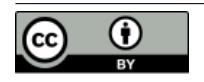
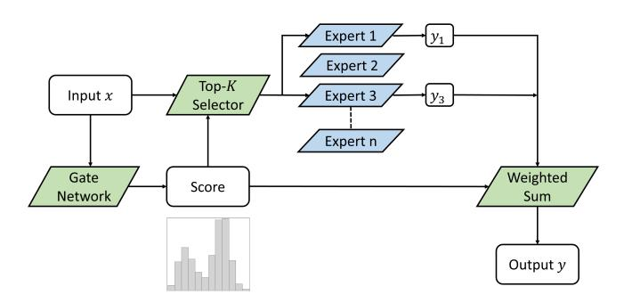

## ResMoE: Space-efficient Compression of Mixture of Experts LLMs via Residual Restoration

| Mengting Ai∗                                                                  | Tianxin Wei∗                                                    | Yifan Chen∗†                                                       | Zhichen Zeng                                                      | Ritchie Zhao                                                      |
|-------------------------------------------------------------------------------|-----------------------------------------------------------------|--------------------------------------------------------------------|-------------------------------------------------------------------|-------------------------------------------------------------------|
| UIUC                                                                          | UIUC                                                            | HKBU                                                               | UIUC                                                              | NVIDIA                                                            |
| Champaign, IL, USA                                                            | Champaign, IL, USA                                              | Hong Kong, CHN                                                     | Champaign, IL, USA                                                | Redmond, WA, USA                                                  |
| mai10@illinois.edu                                                            | twei10@illinois.edu                                             | yifanc@hkbu.edu.hk                                                 | zhichenz@illinois.edu                                             | rz252@cornell.edu                                                 |
| Girish Varatkar Apple Cupertino, CA, USA girish_v_varatkar@apple.com | Bita Darvish Rouhani NVIDIA USA brouhani@nvidia.com | Xianfeng Tang Amazon Palo Alto, CA, USA xianft@amazon.com | Hanghang Tong UIUC Champaign, IL, USA htong@illinois.edu | Jingrui He† UIUC Champaign, IL, USA jingrui@illinois.edu |

## Abstract

Mixture-of-Experts (MoE) Transformer, the backbone architecture of multiple phenomenal language models, leverages sparsity by activating only a fraction of model parameters for each input token. The sparse structure, while allowing constant time costs, results in space inefficiency: we still need to load all the model parameters during inference. We introduce ResMoE, an innovative MoE approximation framework that utilizes Wasserstein barycenter to extract a common expert (barycenter expert) and approximate the residuals between this barycenter expert and the original ones. ResMoE enhances the space efficiency for inference of large-scale MoE Transformers in a one-shot and data-agnostic manner without retraining while maintaining minimal accuracy loss, thereby paving the way for broader accessibility to large language models. We demonstrate the effectiveness of ResMoE through extensive experiments on Switch Transformer, Mixtral, and DeepSeekMoE models. The results show that ResMoE can reduce the number of parameters in an expert by up to 75% while maintaining comparable performance. The code is available at [https://github.com/iDEA](https://github.com/iDEA-iSAIL-Lab-UIUC/ResMoE)[iSAIL-Lab-UIUC/ResMoE.](https://github.com/iDEA-iSAIL-Lab-UIUC/ResMoE)

## Keywords

Mixture-of-Experts, Compression, Optimal Transport, Wasserstein Barycenter

#### ACM Reference Format:

Mengting Ai, Tianxin Wei, Yifan Chen, Zhichen Zeng, Ritchie Zhao, Girish Varatkar, Bita Darvish Rouhani, Xianfeng Tang, Hanghang Tong, and Jingrui He. 2025. ResMoE: Space-efficient Compression of Mixture of Experts LLMs via Residual Restoration. In Proceedings of the 31st ACM SIGKDD Conference on Knowledge Discovery and Data Mining V.1 (KDD '25), August 3–7, 2025, Toronto, ON, Canada. ACM, New York, NY, USA, [17](#page-16-0) pages. [https://doi.org/](https://doi.org/10.1145/3690624.3709196) [10.1145/3690624.3709196](https://doi.org/10.1145/3690624.3709196)

†Correspondence to: Yifan Chen and Jingrui He.

[This work is licensed under a Creative Commons Attribution](https://creativecommons.org/licenses/by/4.0/) [International 4.0 License.](https://creativecommons.org/licenses/by/4.0/)

KDD '25, August 3–7, 2025, Toronto, ON, Canada © 2025 Copyright held by the owner/author(s). ACM ISBN 979-8-4007-1245-6/25/08 <https://doi.org/10.1145/3690624.3709196>

## 1 Introduction

The profound impact of the Transformer architecture in the domain of machine learning is undeniable, for the fields including natural language processing [\[3,](#page-9-0) [14,](#page-9-1) [18,](#page-9-2) [45,](#page-10-0) [48,](#page-10-1) [61\]](#page-10-2) and computer vision [\[17,](#page-9-3) [39,](#page-10-3) [64\]](#page-10-4), to name a few. To further improve the capabilities of pre-trained large language models (LLMs), one general strategy is to scale up their parameters. Mixture-of-Experts (MoE) [\[52\]](#page-10-5) extends the traditional feedforward neural network (FFN) layer by replacing a single multilayer perceptron (MLP) with multiple MLPs, referred to as "experts". While enhancing the performance, sparse MoE keeps computing costs (FLOPs) comparable to the original dense model, as only a few selected experts will be activated each time. The framework of an MoE layer is demonstrated in Fig. [1.](#page-1-0) Specifically, the input token is passed to the router gate network, returning the sparse and normalized top- scores used to activate the following experts. Only experts with a score larger than 0 will be activated, and the continued results will then be calculated through those activated expert MLPs. The output will then be obtained through a weighted sum of each activated expert's output Switch Transformer [\[18\]](#page-9-2) exemplifies this approach by expanding the T5 model [\[48\]](#page-10-1) to an MoE structure, scaling it up to at most 2,048 times the size of the original dense T5 model. Similarly, Mixtral [\[30\]](#page-9-4) upscales Mistral 7B [\[29\]](#page-9-5) to an 8×7B MoE structure, achieving performance that matches or even surpasses that of Llama2 70B [\[60\]](#page-10-6). DeepSeekMoE [\[10\]](#page-9-6) utilizes fine-grained experts compared to the other structures, with 64 experts per layer.

However, the enormous number of parameters has now become a bottleneck for MoE Transformers [\[32\]](#page-9-7), since they require much more GPU memory to load the model even if only part of the parameters are activated each time. The expert size for Mixtral reaches 176.2M, and the presence of 8 or even more experts in each layer exacerbates the memory demands, bringing a strong need to compress the experts in the MoE structure. To give an example, the total model size of Mixtral is 87.0 GB, while the corresponding size of the dense model Mistral is only 13.5 GB.

To leverage the capabilities of MoE LLMs, we revisit several (seemingly unrelated while inherently connected) research avenues below. One approach is model fusion [\[2,](#page-9-8) [54\]](#page-10-7), which involves combining multiple general MLPs. This technique can be adapted to merge experts in MoE models as well. More recently, various studies

∗Mengting, Tianxin, and Yifan contributed equally to this work.

Figure 1: In this illustrative example of MoE layers, the Top-K Selector, along with the Gate Network-often referred to as the 'router'-selects Experts 1 and 3 based on their scores for the given input. Figure taken from [1].

have introduced the concept of expert merging [28, 35, 38, 56, 69] and expert pruning [41], as a method to reduce the number of experts within each layer of the MoE model. Nevertheless, we note the direct reduction in the total number of experts potentially leads to a substantial loss of the specialized knowledge that individual experts possess (see an illustrative analysis in Section 4.1).

To address the aforementioned issues, we introduce ResMoE, an MoE approximation framework. Our approach capitalizes on approximating the MoE models with fewer parameters by utilizing Wasserstein barycenter techniques [47]. We formulate a distributional representation of experts and extract their common characteristics to obtain the barycenter expert. Subsequently, we propose to employ either unstructured pruning [33] or singular value decomposition (SVD) [11] (as a pilot example) to approximate the residual matrices between this barycenter expert and each specific expert. In summary, the contribution of our work is three-fold:

- We introduce Wasserstein barycenter and residual restoration into MoE approximation, aiming to maintain the common and distinctive attributes of each expert with fewer parameters.
- We propose ResMoE, a practical MoE Transformer approximation framework that aims to improve space efficiency in a one-shot and data-agnostic manner, with no extra training required.
- We validate ResMoE through extensive experiments on both the encoder-decoder Switch Transformer model, as well as the decoder-only models, Mixtral and DeepSeekMoE. Our results demonstrate that ResMoE can reduce the number of parameters in an expert by up to 75% while incurring only marginal performance loss, verifying its effectiveness and versatility.

#### 2 Related Work

General model compression techniques. The focus of deep learning model compression research primarily involves system-level optimization. *Quantization* aims at hardware efficiency by reducing model weight bit-depth from 32-bit floating point (FP32) to 8-bit integers (INT8) [4, 13, 71] or even lower bits [7, 21, 37, 59]. Our focus, however, is on reducing the parameter count of the MoE model, making quantization methods not directly related.

Additionally, *knowledge distillation* [23, 27, 31] aims to transfer knowledge from pre-trained LLMs to smaller models. However, this approach requires extensive retraining, involving both the

original LLM and the compact model. *Truncated singular value decomposition* (SVD) [12] has been used to streamline CNNs by reducing redundancy through linear structure exploitation within networks, yet it faces limits in representational capacity, often leading to decreased performance due to overly aggressive dimension reduction. *Pruning techniques* [34, 40], evolving with the Lottery Tickets Hypothesis [19, LTH], seek efficient sub-networks within larger models but require extensive retraining to maintain accuracy. While some one-shot pruning methods [57, 63] do exist, they remain computationally expensive and are not specifically tailored for the structure of MoE, bringing concerns about whether such methods can adequately ensure that the compressed models retain their effectiveness for downstream tasks.

Mixture-of-Expert (MoE) transformer compression. Rather than applying existing compression techniques individually to the expert MLP, MC-SMoE [35], MEO [28], and OneS [69] merge the experts into smaller groups, reducing the count of the experts. Expert pruning [41, 44] follows a similar aspect, pruning the less important experts to reduce the size. This approach faces challenges in deciding the experts to retain, potentially leading to loss of information due to sub-optimal decisions. Gao et al. [22] instead proposed to keep each expert, divide them into several sections, and share the core section among them. This method does not align with our goal since they aimed to efficiently train a new MoE-like structure from scratch, instead of compressing an existing one. Alternatively, we note fusion-based methods [2, 54], originally proposed for consolidating distinct models into a single one, can be dynamically adapted for consolidating MoE's experts. These methods utilize the principles of permutation and optimal transport and are implemented layer-wise, which requires applying the permutations derived from preceding layers to the next one. The characteristic incurs overhead due to the extra time required for permutations.

#### 3 Preliminaries and Notation

This section provides the background of MoE, optimal transport, and Wasserstein barycenter.

## 3.1 Mixture-of-Experts Modules

Throughout this paper, we consider the classical setting of MoE modules for the ease of analysis, where each expert takes the form of a multilayer perceptron (MLP) in a feed-forward network (FFN) sublayer of a Transformer. It is worth noting that there exist different types of expert network architectures (c.f. Appendix B.3).

Each Mixture-of-Experts (MoE) layer comprises N experts. The k-th expert  $E_k$  (a function to transform input vector  $\mathbf{x}$  to a new feature) in an FFN sub-layer is denoted as:

$$E_k(\mathbf{x}) = \mathbf{W}_k^{(2)} \sigma \left( \mathbf{W}_k^{(1)} \mathbf{x} + \mathbf{b}_k^{(1)} \right) + \mathbf{b}_k^{(2)},$$

where  $\sigma(\cdot)$  is the element-wise activation function. The input  $\mathbf{x} \in \mathbb{R}^p$ , and  $(\mathbf{W}_k^{(1)}, \mathbf{b}_k^{(1)}) \in \mathbb{R}^{p_1 \times (p+1)}$ ,  $(\mathbf{W}_k^{(2)}, \mathbf{b}_k^{(2)}) \in \mathbb{R}^{p \times (p_1+1)}$  are respectively the weight matrices and bias vectors in the linear transforms of the MLP (with input/output dimension p and inner dimension pII). The output of the MoE layer is given by:  $\sum_{k=1}^N [G(\mathbf{x})]_k \cdot E_k(\mathbf{x})$ . Here  $G(\mathbf{x}) = \operatorname{Softmax} \left(\operatorname{TopK} \left(\mathbf{W}_g \mathbf{x}\right)\right)$  returns the normalized sparse router gating vector for all experts, where  $\operatorname{TopK}(g_i) = g_i$  when  $g_i$  is within the top-k values of  $\mathbf{g} \in \mathbb{R}^N$ , otherwise  $\operatorname{TopK}(g_i) = \mathbf{g}$ 

 $-\infty$ ;  $\mathbf{W}_g \in \mathbb{R}^{N \times p}$  represents the linear transform, turning the input  $\mathbf{x}$  into the logit for each expert. The whole framework of the MoE layer is shown in Fig. 1.

The space bottleneck [32] comes from the large size of experts (ranging from 8 to 64 and even more [10, 18]) and the tremendous size of the weight matrices in each expert (e.g., 176.2M parameters for each expert in Mixtral [30]). The sparse design renders the total number of parameters redundant compared to the base dense model. Even though only a part of the parameters is activated each time, the whole model still needs to be loaded in the RAM. In this paper, we aim to address the redundancy problem while retaining the effectiveness of pre-trained MoE models.

