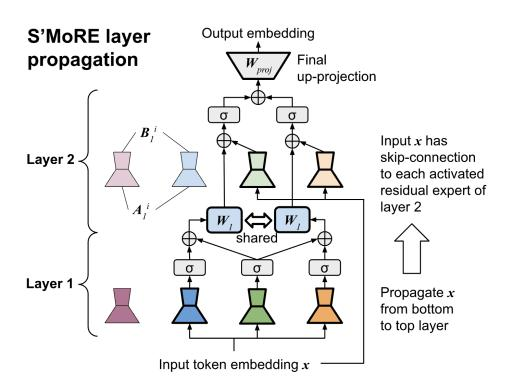
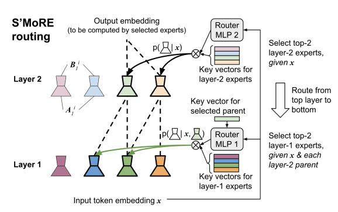
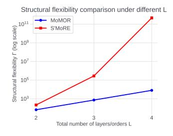
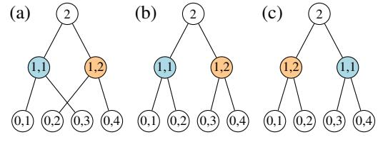
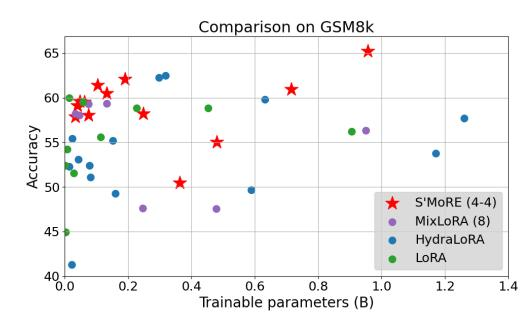

# 3 📚 S'MoRE

#### 3.1 Low-Rank MoE Variants

Mixture of low-rank experts (MoLRE). To improve parameter efficiency of Eq. 1, we can approximate its  $W^i$  by some low rank  $B^i \cdot A^i$  as defined in §2.1 (e.g., we can perform SVD on  $W^i$  and derive  $B^i \cdot A^i$  corresponding to the largest singular values). We term such a model family as mixture of low-rank experts (MoLRE) [Wu et al., 2024b, Dou et al., 2024, Li et al., 2024a]. MoLRE's operation is derived by updating Eq. 1 as follows:  $x' = \sum_{i=1}^s \texttt{ROUTE}\left(x\right)^i \cdot B^i \cdot A^i \cdot x$ 

Mixture of multi-order residues (MoMOR). We can generalize MoLRE's low-rank approximation into this form  $\boldsymbol{W}^i \approx \sum_{\ell=0}^{L-1} \boldsymbol{B}^i_{\ell} \cdot \boldsymbol{A}^i_{\ell}$ , where each  $\boldsymbol{B}^i_{\ell} \cdot \boldsymbol{A}^i_{\ell}$  has a low rank (so MoLRE corresponds to L=0). We call  $\boldsymbol{B}^i_{\ell} \cdot \boldsymbol{A}^i_{\ell}$  as the  $(\ell+1)^{\text{th}}$ -order residual term, and denote its rank as  $r_{\ell}$ . The sum  $\sum_{\ell=0}^{L-1} \boldsymbol{B}^i_{\ell} \cdot \boldsymbol{A}^i_{\ell}$  can have a rank up to  $\sum_{\ell=0}^{L-1} r_{\ell}$ , which is higher than the individual residuals.

- (a) Propagation of residuals across multiple S'MORE layers (see Eq. 3). Here we consider 2 layers. Layer 1 has 3 activated residuals, where the dark green residual is selected by both the light green and the light orange parents in layer 2.
- (b) Recursive routing of S'MoRE ( $\S 3.3$ ). The router first selects the layer 2 residuals for token x. Then it selects the layer 1 children conditioned on the activated layer 2 parent. We use a lightweight MLP to generate the query vector from the token embedding and the parent's key embedding.

Figure 1: Illustration of the layer propagation and routing process of S'MoRE.

We thus introduce mixture of multi-order residues (MoMOR), an extension to MoLRE. Let  $\mathcal{R}_{\ell} = \{B_{\ell}^1 \cdot A_{\ell}^1, B_{\ell}^2 \cdot A_{\ell}^2, \ldots\}$  be the set of order- $(\ell + 1)$  residues, MoMOR model performs the following:

$$\boldsymbol{x}' = \sum_{\ell=0}^{L-1} \sum_{i=1}^{s_{\ell}} \mathtt{ROUTE}_{\ell} \left( \boldsymbol{x} \right)^{i} \cdot \boldsymbol{B}_{\ell}^{i} \cdot \boldsymbol{A}_{\ell}^{i} \cdot \boldsymbol{x} \tag{2}$$

where the model dynamically selects and combines different orders of residuals via routing. MoMOR can adaptively distribute computation across different levels of approximation, improving efficiency and expressivity. Notably, when we set L=2 and  $\mathtt{ROUTE}_0\left(\boldsymbol{x}\right)^i$  as a dense gate, the order-1 experts are activated for all tokens. MoMOR becomes a *shared-expert* MoE. This is a design adopted by DeepSeek-v3 [DeepSeek-AI, 2024] and many others [Rajbhandari et al., 2022, Li et al., 2024a].

#### 3.2 Structural Mixture

In the following, "layer" refers to a S'More layer with a collection of residual experts, rather than a transformer layer. Based on MoMOR, we arrange all the residues  $\mathcal{R}_0, \ldots, \mathcal{R}_{L-1}$  into a L-layer structure. For each token x, we activate a sub-structure that interconnects correlated residues in adjacent layers. The token propagates along the sub-structure layer by layer. Each layer implements a lightweight function to aggregate previous-layer residues. Extending the standard MoE to multiple layers improves model capacity by drastically increasing the model's *structural flexibility* (§3.5).

**Parameters.** Let  $x \in \mathbb{R}^d$  be the d-dimensional token embedding. Layer  $\ell+1$  (for  $0 \le \ell \le L-1$ ) consists of  $s_\ell$  residual experts. Each expert i (with  $1 \le i \le s_\ell$ ) consists of a down-projection matrix  $A^i_\ell \in \mathbb{R}^{r_\ell \times d}$  and an up-projection matrix  $B^i_\ell \in \mathbb{R}^{d_{\ell+1} \times r_\ell}$ , where  $r_\ell$  is the experts' rank and  $d_{\ell+1}$  is the output dimension of layer  $\ell+1$ . Layer  $\ell+1$  also has a learnable  $W_\ell \in \mathbb{R}^{d_{\ell+1} \times d_\ell}$  that projects the layer- $\ell$  output to the  $d_{\ell+1}$ -dimensional subspace. Thus,  $\mathcal{R}_\ell$  consists of all  $A^i_\ell$  and  $B^i_\ell$  for  $1 \le i \le s_\ell$ .

**Propagation.** Token x propagates in the L-layer structure in two phases. In the  $\underline{routing}$  phase, the router activates the best-matching experts top-down (from layer L to 1). At layer L, the router selects experts from  $\mathcal{R}_{L-1}$  using standard gates (e.g., Fedus et al. [2022b]). At an intermediate layer  $\ell < L$ , the router computes the score to activate an expert in  $\mathcal{R}_{\ell-1}$ , conditioned on the already activated ancestors in layers  $\ell' > \ell$ . This ensures the selected children are connected to their activated parents. Different from the traditional routers, the S'MoRE router customizes a depth-L "residual tree" for each token. See §3.3 for router architecture and §3.5 for structural flexibility of the tree-based routing.

In the <u>aggregation</u> phase, the token propagates along the activated residual tree <u>bottom-up</u> (from layer 1 to L). Layer  $\ell+1$  aggregates the information from the activated children experts in  $\mathcal{R}_{\ell}$ , and generates output embedding for the parent expert in  $\mathcal{R}_{\ell+1}$ . For each parent expert i, define  $\mathcal{N}_{\ell}^{i}$  as the

set containing the indices of i's children experts1. Layer  $\ell + 1$  operates as follows:

$$\boldsymbol{x}_{\ell+1}^{i} = \sum_{n \in \mathcal{N}_{\ell}^{i}} \alpha_{\ell}^{i,n} \cdot \sigma \left( \boldsymbol{B}_{\ell}^{n} \cdot \boldsymbol{A}_{\ell}^{n} \cdot \boldsymbol{x} + \boldsymbol{W}_{\ell} \cdot \boldsymbol{x}_{\ell}^{n} \right)$$
(3)

where  $\sigma\left(\cdot\right)$  is a non-linear function which can be just an activation (e.g., ReLU [Agarap, 2018]). The scalar  $\alpha_{\ell}^{i,n}$  is the router-generated score, elaborated in §3.3. Inputs to Eq. 3 consist of two parts: 1) Raw token embedding  $\boldsymbol{x}$ , which acts as skip connection to residuals  $\boldsymbol{B}_{\ell}^{n} \cdot \boldsymbol{A}_{\ell}^{n}$  of various orders; and 2)  $\boldsymbol{x}_{\ell}^{n}$  output from the previous layer, which enables deep interaction among multi-order residuals given non-linear  $\sigma\left(\cdot\right)$  (compared to the shallow aggregation in Eq. 2). For  $\ell=0$ , input  $\boldsymbol{x}_{0}^{n}$  does not exist. To simplify notation, we define  $d_{0}:=0$ , making  $\boldsymbol{x}_{0}^{i}\in\mathbb{R}^{0}$  and  $\boldsymbol{W}_{0}\in\mathbb{R}^{d_{1}\times0}$  as an empty vector / matrix. Then Eq. 3 applies to all layers  $0\leq\ell\leq L-1$ . The last layer L has a single output node (i.e.,  $s_{L}=1$ ) generated by aggregating information from the entire residual tree. Define  $\boldsymbol{x}_{L}:=\boldsymbol{x}_{L}^{0}$ .

**Dimensionality**  $d_{\ell}$ . We should set the output  $d_{\ell}$  to 1) avoid information loss in the aggregation process, and 2) keep the overall L-layer propagation efficient. A naïve choice following LoRA is  $d_{\ell+1}=d\gg r_{\ell}$  (e.g., d=4096,  $r_{\ell}=16$ ), which makes multiplication with  $W_{\ell}$  prohibitively expensive. To reduce cost, we should find the smallest  $d_{\ell+1}$  that preserves the same amount of information as the vanilla setting  $d_{\ell+1}=d$ . The problem is equivalent to finding the maximum dimension of the subspace that  $\boldsymbol{x}_{\ell+1}^i$  (Eq. 3) can span for any  $N_{\ell}^i$ ,  $\boldsymbol{B}_{\ell}^n$ ,  $\boldsymbol{A}_{\ell}^n$  and activated i. To simplify discussion, ignore activation  $\sigma(\cdot)$ : 1) For any  $\boldsymbol{x}$ , output  $\boldsymbol{B}_{\ell}^n \cdot \boldsymbol{A}_{\ell}^n \cdot \boldsymbol{x}$  maximally spans a d'-dimensional subspace of the original  $\mathbb{R}^d$ , where  $d'=\min\{d_{\ell+1},r_{\ell}\}$ ; 2) There are  $s_{\ell}$  possible n, leading to  $s_{\ell}$  different d'-dimensional subspaces. When mutually orthogonal, they maximally span  $\min\{d_{\ell+1},s_{\ell}\cdot r_{\ell}\}$  dimensions; 3)  $\boldsymbol{W}_{\ell} \cdot \boldsymbol{x}_{\ell}^n$  can span another subspace of dimension  $\min\{d_{\ell+1},d_{\ell}\}$  defined by  $W_{\ell}$  (independent of n). So  $\boldsymbol{B}_{\ell}^n \cdot \boldsymbol{A}_{\ell}^n \cdot \boldsymbol{x} + \boldsymbol{W}_{\ell} \cdot \boldsymbol{x}_{\ell}^n$  maximally spans  $d''=\min\{d_{\ell+1},d_{\ell}+s_{\ell}\cdot r_{\ell}\}$  dimensions; 4) Since a subspace is closed under linear combinations,  $\sum_{n\in\mathcal{N}_{\ell}^i} \alpha_{\ell}^{i,n} (\boldsymbol{B}_{\ell}^n \cdot \boldsymbol{A}_{\ell}^n \cdot \boldsymbol{x} + \boldsymbol{W}_{\ell} \cdot \boldsymbol{x}_{\ell}^n)$  remains in the d''-dimensional subspace, regardless of  $N_{\ell}^i$ . For the vanilla case  $d_{\ell+1}=d$  with large enough d, we have  $d''=\min\{d_{\ell+1},d_{\ell}+s_{\ell}\cdot r_{\ell}\}=d_{\ell}+s_{\ell}\cdot r_{\ell}$ . Thus, the minimum  $d_{\ell+1}$  is d'':

$$d_{\ell+1} = d_{\ell} + s_{\ell} \cdot r_{\ell}$$
  $\Rightarrow$   $d_{\ell} = \sum_{i=0}^{\ell-1} s_i \cdot r_i$ , where  $d_0 := 0$  and  $\ell \in [0, L-1]$  (4)

**Final projection.** After the last layer L, we map the  $d_L$ -dimensional output  $\boldsymbol{x}_L$  to the final output dimension  $d_{\text{out}}$  (i.e.,  $d_{\text{out}}$  is the dimensionality of  $\boldsymbol{x}'$  in Eq. 1 and Eq. 2). We thus have a projection matrix  $\boldsymbol{W}_{\text{proj}} \in \mathbb{R}^{d_L \times d}$  that simply performs  $\boldsymbol{x}' = \boldsymbol{W}_{\text{proj}} \cdot \boldsymbol{x}_L$ .

#### 3.3 Hierarchical Routing

Fig. 1b illustrates the top-down routing. We start from layer L. The router computes  $p(i_{L-1} \mid \boldsymbol{x})$ , the probability to activate an expert  $i_{L-1}$  in  $\mathcal{R}_{L-1}$  given token  $\boldsymbol{x}$ . The top- $f_{L-1}$  experts with the highest  $p(i_{L-1} \mid \boldsymbol{x})$  are selected. Next, for each selected expert  $i_{L-1}$ , we compute  $p(i_{L-2} \mid i_{L-1}, \boldsymbol{x})$ , which is the conditional probability to activate  $i_{L-2}$  in  $\mathcal{R}_{L-2}$  given its activated parent  $i_{L-1}$  and  $\boldsymbol{x}$ . Each activated  $i_{L-1}$  further activates  $f_{L-2}$  children with the highest  $p(i_{L-2} \mid i_{L-1}, \boldsymbol{x})$ . Generally, the router computes the conditional probability  $p(i_{\ell-1} \mid i_{L-1}, \ldots i_{\ell}, \boldsymbol{x})$ , with  $i_{L-1}, \ldots i_{\ell}$  being all the activated ancestors of the candidate  $i_{\ell-1}$ . All activated experts form a depth-L tree. Each depth- $\ell$  node fans out to  $f_{L-\ell-1}$  children experts (the activated layer-L experts are the depth-1 tree nodes).

Let  $f_\ell$  be the fanout factor of each parent expert,  $F_\ell$  be the total number of experts selected from  $\mathcal{R}_\ell$  (i.e.,  $F_\ell$  is the total number of depth- $(L-\ell)$  experts in the activated tree). The same expert can be selected multiple times by ancestors on different paths – It is possible that  $F_\ell > s_\ell$ . We derive  $F_\ell$  as:

$$F_{\ell} = \prod_{i=\ell}^{L-1} f_i \tag{5}$$

**Router architecture.** For each expert i in  $\mathcal{R}_{\ell}$ , we instantiate a learnable m-dimensional key vector  $\mathbf{k}_{\ell}^{i} \in \mathbb{R}^{m}$ . For the whole candidate pool  $\mathcal{R}_{\ell}$ , we instantiate a neural network,  $\text{MLP}_{\ell}\left(\cdot\right)$ , to generate

&lt;sup>1We abuse notation here for ease of description. The nuance is that the same expert can be activated multiple times by different parents / ancestors. So i should refer to the index of a node in the activated tree, rather than the index of just an expert. Similarly, superscript n of  $\boldsymbol{x}_{\ell}^{n}$  should be updated to  $i \to n$  as a unique identifier (otherwise it creates ambiguity when expert n is a child of multiple parents). See Eq. 32 in Appendix §3.4.

an m-dimensional query vector based on x and the ancestors. The routing probability over  $\mathcal{R}_{\ell}$  is computed by the normalized key-query dot product. For a path of activated ancestors, "expert i' in  $\mathcal{R}_{\ell+1}$ , ..., expert  $i^{\prime \cdots \prime}$  in  $\mathcal{R}_{L-1}$ ", the router generates the query vector q and the router score  $\alpha_i^{\ell}$  as follows, where concat  $(\cdot)$  performs vector concatenation and softmax  $(\cdot)$  normalizes over  $\mathcal{R}_{\ell}$ .

$$\boldsymbol{q} = \mathtt{MLP}_{\ell}\left(\mathtt{concat}\left(\boldsymbol{x}, \boldsymbol{k}_{\ell+1}^{i'}, \cdots, \boldsymbol{k}_{L-1}^{i'\cdots i'}\right)\right)$$

$$\alpha_{\ell}^{i} = \operatorname{softmax}\left(\langle \boldsymbol{k}_{\ell}^{i}, \boldsymbol{q} \rangle\right) \tag{7}$$

**Computation optimization.** Eq. 6 can be computationally expensive when all  $MLP_{\ell}(\cdot)$  need to process the high-dimensional x. To reduce computation, we first project the d-dimensional x to a  $d_{\text{down}}$ -dimensional  $x_{\text{down}}$  (e.g., d = 4096,  $d_{\text{down}} = 24$ ), and then replace x with  $x_{\text{down}}$  in Eq. 6. The dimension of the input to  $MLP_{\ell}(\cdot)$  then becomes  $d_{down} + (L - \ell - 1) \cdot m$ .

Gating types. Our router and layer designs are compatible with various types of gates. In our experiments (§4), we have evaluated: 1. Dense gate [Tian et al., 2024], which activates all children experts  $(f_{\ell} = s_{\ell})$ ; 2. Sparse noisy top-k gate [Shazeer et al., 2017]; 3. Sparse switch gate [Fedus et al., 2022b]. The two sparse gates only activate a subset of the children experts ( $f_{\ell} < s_{\ell}$ ) by the top routing scores  $\alpha$ . To avoid expert under-utilization and ensure all experts see sufficient amount of tokens during training, we implement an auxiliary load-balance loss according to the original papers [Shazeer et al., 2017, Fedus et al., 2022b]. See Appendix B.1 for more algorithmic details.

#### 3.4 Parameter & Computation Efficiency

Although S'MoRE introduces structural learning modules, our design ensures similar efficiency to the vanilla LoRA (w.r.t. both computation and trainable parameters) under the same total rank.

**Parameter efficiency.** Each S'MoRE layer  $\ell+1$  consists of the following trainable parameters:  $B_{\ell}^{n}$ ,  $A_{\ell}^{n}$  and  $W_{\ell}$ . The total trainable parameters equals:

$$P_{\ell+1} = s_{\ell} \cdot (d \cdot r_{\ell} + r_{\ell} \cdot d_{\ell+1}) + d_{\ell} \cdot d_{\ell+1} = s_{\ell} \cdot d \cdot r_{\ell} + d_{\ell+1} \cdot (s_{\ell} \cdot r_{\ell} + d_{\ell}) \stackrel{\text{(a)}}{=} s_{\ell} \cdot d \cdot r_{\ell} + d_{\ell+1}^{2}$$
(8)

where the last step "(a)" is according to Eq. 4. The final projection matrix (end of §3.2) requires  $P_{\text{proj}} = d \cdot d_L$  parameters. So the total number of parameters for all S'MoRE layers equals:

$$P_{\text{proj}} + \sum_{\ell=1}^{L} P_{\ell} = d \cdot d_{L} + d \cdot \left(\sum_{\ell=0}^{L-1} s_{\ell} \cdot r_{\ell}\right) + \Delta \stackrel{\text{(b)}}{=} 2 \cdot d \cdot d_{L} + \Delta \stackrel{\text{(c)}}{\approx} 2 \cdot d \cdot d_{L}$$
(9)

where  $\Delta = \sum_{\ell=1}^L d_\ell^2$ . Step "(b)" is by Eq. 4;  $\Delta$  is the overhead due to multi-layer propagation. Since  $d_1 < \ldots < d_L \ll d$  (e.g.,  $d_L = 64$ , d = 4096), we have  $\Delta \ll 2 \cdot d \cdot d_L$ . This justifies step "(c)". In Table 1, we empirically validated the small overhead  $\Delta$ . With  $f_{\ell}=2$ ,  $s_{\ell}=4$ , and  $r_{\ell}=8$  or 16 for all layers  $\ell$  (consistent with the §4 experiments),  $\Delta$  is no more than 2% for 2-layer S'MoRE.

The router's trainable parameters come from: 1) down- Table 1: Overhead  $\Delta$  compared with projection for  $x_{\text{down}}$ , which requires  $d \cdot d_{\text{down}}$  parameters, the main computation cost  $2 \cdot d \cdot d_L$ 2) per-layer "query" MLP. By §3.3, the MLP's input dimension is  $d_{\text{down}} + (L - \ell) \cdot m$ , where  $m \ll d$  is the dimension of the "key" vectors. In practice, we set the MLP hidden dimension as m. Since m and  $d_{\text{down}}$  are both very small, the router's parameter count is practically negligible.

| $r_{\ell}$ | L | $d_L$ | $2 \cdot d \cdot d_L$ | Δ      | Overhead ratio |
|------------|---|-------|-----------------------|--------|----------------|
|            | 2 | 64    | 0.5M                  | 0.005M | 1.0%           |
| 8          | 3 | 96    | 0.8M                  | 0.014M | 1.8%           |
|            | 4 | 128   | 1.0M                  | 0.031M | 2.9%           |
|            | 2 | 128   | 1.0M                  | 0.020M | 2.0%           |
| 16         | 3 | 192   | 1.6M                  | 0.057M | 3.6%           |
|            | 4 | 256   | 2.1M                  | 0.123M | 5.9%           |

In total, S'MoRE approximately has  $2 \cdot d \cdot d_L$  parameters – the same as the parameter count for a vanilla LoRA with rank  $d_L$  (the 2 factor is due to LoRA's down- and up-project matrices A and B).

Computation cost. Following similar steps, we can derive the overhead in computation. The computation cost of the baseline LoRA is  $2 \cdot d \cdot d_L$ . The overhead introduced by S'MoRE is  $\Delta' \leq \sum_{\ell=0}^{L-1} F_{\ell} \cdot d_{\ell+1} \cdot (d_{\ell} + r_{\ell})$ , which is again *neglible* in practice. See Appendix C.1 for details.

#### 3.5 Model Capacity

We theoretically show S'MoRE enhances model capacity compared with baselines (see Appendix C.2 for proofs). First, we show that the two low-rank MoE variants in §3.1 are special cases of S'MoRE.

**Proposition 3.1.** S'MoRE can express MoLRE, when L = 1 and  $\sigma(\cdot)$  is the identity mapping.

**Proposition 3.2.** S'MoRE can express MoMOR, when setting  $\sigma(\cdot)$  as the identity mapping.

For any MoLRE (or MoMOR) model, we can find a corresponding S'MoRE that generates identical output as MoLRE (or MoMOR) for any input  $\boldsymbol{x}$ . Without  $\sigma$ , we can collapse a multi-layer S'MoRE into a single layer equivalent, where the dimensionality set by Eq. 4 ensures the same rank as MoMOR. Can S'MoRE be theoretically better than MoLRE and MoMOR, if we go beyond the constraints of Propositions 3.1 and 3.2 by setting L>1 and  $\sigma$  as non-linear mapping? To answer it, we analyze an MoE model's expressive power by quantifying the **structural flexibility**.

**Structural flexibility.** Let  $\Theta$  be the collection of all experts' parameters  $(B_{\ell}^i, A_{\ell}^i)$  and  $W_{\ell}$  for  $0 \le \ell \le L-1$  and all i). Given  $\Theta$ , when a token x comes, different routers may activate different residual experts, and thus generate different output embedding  $x_L$ . Therefore, we define  $\text{dist}(x;\Theta)$  as the number of distinct  $x_L$ . The larger  $\text{dist}(x;\Theta)$  can be, the more "structurally flexible" the model architecture is. Our focus here is on the multi-layer structure formed by the residual experts, rather than the router network (thus, we assume an ideal router for the following Theorems).

Next we prove S'MoRE's higher model capacity by quantifying structural flexibility. In the following, we treat  $\alpha_{\ell}^n$  as binary mask (1 for selected experts, and 0 otherwise) when generating  $x_L$ .

**Theorem 3.3.** The structural flexibility of MoMOR is upper-bounded by  $\Gamma_{\text{MoMOR}} = \max_{\boldsymbol{x},\Theta} \operatorname{dist}(\boldsymbol{x};\Theta) \leq \binom{s_{L-1}}{f_{L-1}} \cdot \prod_{\ell=0}^{L-2} \left(\sum_{i=f_{\ell}}^{\min\{F_{\ell},s_{\ell}\}} \binom{s_{\ell}}{i}\right).$ 

**Theorem 3.4.** Setting  $\sigma\left(\cdot\right)$  as an MLP, there exists some  $\Theta'$  such that the structural flexibility of S'MoRE is:  $\Gamma_{S'MoRE} = \min_{\boldsymbol{x}} \operatorname{dist}\left(\boldsymbol{x};\Theta'\right) = \prod_{\ell=0}^{L-1} \binom{s_{\ell}}{f_{\ell}}^{F_{\ell+1}}$ , where we define  $F_L := 1$ .

Above,  $\binom{s}{k} = \frac{s!}{k!(s-k)!}$  is the binomial coefficient that quantifies the number of ways to choose k out of s items, ignoring order.  $F_\ell$  is defined in Eq. 5. When increasing the number of layers,  $\Gamma_{\text{S'MoRE}}$  exceeds the upper bound  $\Gamma_{\text{MoMOR}}$  by orders of magnitude. The reason is that for MoMOR, the  $\binom{s_\ell}{i}$  terms are summed over  $F_\ell$ , while for S'MoRE,  $F_\ell$  becomes the **exponent** of  $\binom{s_\ell}{f_\ell}$ . In Fig. 2, we calculate the theoretical  $\Gamma_{\text{MoMOR}}$  and  $\Gamma_{\text{S'MoRE}}$  under depth L. Consistent with our experimental setup (§4.1), we set  $s_\ell = 4$  and  $f_\ell = 2$  for all  $\ell$ . Clearly,  $\Gamma_{\text{S'MoRE}}$  is substantially higher than  $\Gamma_{\text{MoMOR}}$  even for shallow models (L=2), and  $\Gamma_{\text{S'MoRE}}$  grows exponentially faster than  $\Gamma_{\text{MoMOR}}$  when increasing L.

Figure 2:  $\Gamma_{\text{S'MORE}}$  and  $\Gamma_{\text{MoMOR}}$  w.r.t. L (with  $s_{\ell} = 4$ ,  $f_{\ell} = 2$ ).

We explain the intuition of the proof, and defer the details to Appendix C.2. First,  $\Gamma_{\text{S'MoRE}}$  quantifies the number of non-isomorphic depth-L trees that can be formed by any router. Each node at tree-level  $\ell$  (i.e., an expert in  $\mathcal{R}_{L-\ell}$ ; the same expert may appear multiple times at tree-level  $\ell$  under different ancestor paths) has  $\omega = \binom{s_{L-\ell-1}}{f_{L-\ell-1}}$  ways of selecting its children set. All nodes at tree-level  $\ell$  jointly contribute to a  $\omega^{F_{L-\ell}}$  factor. Secondly, S'MoRE can generate distinct outputs for all non-isomorphic sub-trees. We borrow conclusions from the Graph Neural Network literature. We view Eq. 3 as defining a variant of Graph Isomorphism Network (GIN) [Xu et al., 2019]. S'MoRE's L-layer propagation

Figure 3: Examples where the same set of activated experts interconnect differently. MoMOR always generates the same output for (a), (b) and (c), while S'MoRE can distinguish all the three cases. A variant of S'MoRE that performs activation  $\sigma$  differently (§3.6) can differentiate (a) from (b) or (c), but cannot differentiate (b) from (c). Note that (b) and (c) differ by swapped "1,1" and "1,2".

simulates the L-iteration Weisfeiler-Lehman (WL) test [Huang and Villar, 2021], where including non-linearly activated  $\sigma$  is the key to ensure an injective "color refinement" process in WL. It then follows that the L layer S'MoRE can distinguish non-isomorphic trees of depth L. Third, without activation  $\sigma$ , S'MoRE degrades to MoMOR, and is unable to distinguish many non-isomorphic depth-L trees. Fig. 3 shows 3 examples with L=2. Node 2 is the final output node (tree root). When we activate the same set of experts ("0,1", "0,2", "0,3", "0,4", "1,1", "1,2") but connect them differently (non-isomorphic), MoMOR always generates the same output while S'MoRE can produce different ones. This shows  $\Gamma_{\text{MoMOR}} < \Gamma_{\text{S'MoRE}}$  and S'MoRE's higher expressivity.

#### 3.6 Model Variants

**How activation**  $\sigma$  **affects structural learning.** Theorem 3.4 concretely shows the benefit of including activation  $\sigma$  in Eq. 3. What if we tweak Eq. 3 to let  $\sigma$  operate on  $\mathbf{x}_{\ell}^{n}$  rather than  $\mathbf{B}_{\ell}^{n} \cdot \mathbf{A}_{\ell}^{n} \cdot \mathbf{x} + \mathbf{W}_{\ell} \cdot \mathbf{x}_{\ell}^{n}$ ?

$$\boldsymbol{x}_{\ell+1}^{i} = \sum_{n \in \mathcal{N}_{\ell}^{i}} \alpha_{\ell}^{i,n} \cdot \left(\boldsymbol{B}_{\ell}^{n} \cdot \boldsymbol{A}_{\ell}^{n} \cdot \boldsymbol{x} + \boldsymbol{W}_{\ell} \cdot \boldsymbol{\sigma}\left(\boldsymbol{x}_{\ell}^{n}\right)\right)$$
(10)

We can then decompose Eq. 38 as  $\sum_{n \in \mathcal{N}_{\ell}^{i}} B_{\ell}^{n} \cdot A_{\ell}^{n} \cdot x + \sum_{n \in \mathcal{N}_{\ell}^{i}} W_{\ell} \cdot \sigma(x_{\ell}^{n})$  (ignoring  $\alpha_{\ell}^{i,n}$  for simplicity), and use Fig. 3 as an example to understand its expressive power. Trees (a) and (b) have the same layer-2 experts, "1,1" and "1,2", making their gray terms equivalent. Yet, their different layer-1 children combinations (tree (a) has "0,1" + "0,3" and "0,2" + "0,4", while tree (b) has "0,1" + "0,2" and "0,3" + "0,4") make their green terms different. This enables Eq. 38 to differentiate (a) from (b). Following this reasoning, for (b) and (c), their gray and green terms are both equal. Thus, Eq. 38 yields identical outputs for the two trees, even though they are non-isomorphic.

**Corollary 3.5.** Let  $\Gamma^{\ell}_{S',MORE}$  be the structural flexibility of  $\ell$ -layer S',MORE variant under Eq. 38. It satisfies the following recursion:  $\Gamma^{\ell}_{S',MORE}$  =  $\binom{s_{\ell-1}}{f_{\ell-1}} \cdot \binom{\Gamma^{\ell-1}_{S',MORE}}{f_{\ell-1}} + f_{\ell-1}^{-1}$ , where  $\Gamma^{0}_{S',MORE}$  := 1.

It is easy to see that S'MoRE under Eq. 3 is more expressive than S'MoRE \* under Eq. 38. Further, both S'MoRE variants are stronger than the baseline 1-layer MoEs. This is also illustrated by Fig. 3.

S'MoRE with cross-layer parameter sharing. We introduce S'MoRE  $^{\sharp}$ , another useful variant which lets the experts of different layers share the same parameters. i.e.,  $s:=s_{\ell}$  and  $r:=r_{\ell}$  are the same for all layers  $\ell$ . And  $A^i:=A^i_{\ell}$  and  $B^i:=B^i_{\ell}$  for all  $\ell$  and  $1\leq i\leq s$ . This means experts in different layers now operate in the same embedding subspace, and hence the intermediate hidden dimension  $d:=d_{\ell}$  is the same for all  $\ell$  — we update Eq. 4 as  $d=s\cdot r$ . The layers still propagate by Eq. 3.

We summarize the properties of S'MoRE  $^{\#}$ . Following similar derivation  $^{2}$  in §3.4 (plugging in d above), we conclude S'MoRE  $^{\#}$  has comparable parameter & computation efficiency as the vanilla LoRA. The structural flexibility below also has a similar form as Theorem 3.4 – S'MoRE and S'MoRE  $^{\#}$  exponentially boost structural flexibility of the 1-layer baselines, MoMOR and MoLRE, respectively.

**Corollary 3.6.** The structural flexibility of 
$$S$$
'MoRE  $^{\#}$  equals  $\prod_{\ell=0}^{L-1} {s \choose \ell}^{F_{\ell+1}}$  where  $F_L := 1$ .

Alternative router design (bottom-up version). In addition to the top-down router in  $\S 3.3$ , we can also perform bottom-up routing, making the routing and layer propagation flow along the same direction. The bottom-up router still aims at customizing different children experts for different parents. Yet, when routing bottom-up, the parent index is unknown when we select the children. So now the key vector k (see Eq. 6) is not directly associated with any specific parent expert. It instead represents a node position in the routing tree. See Appendix B.2 for details and tradeoff discussion.

## 4 Experiments

### 4.1 Experimental Setup

**Datasets.** We fine-tune on a diverse set of benchmarks, including ARC-c/e [Clark et al., 2018], Commonsense QA (CSQA) [Talmor et al., 2018], OpenBook QA (OBQA) [Mihaylov et al., 2018], Winogrande [Sakaguchi et al., 2021], GSM8K [Cobbe et al., 2021], and HumanEval [Chen et al., 2021]. For HumanEval, we follow Tian et al. [2024] to train the base LLM on CodeAlpaca [Chaudhary, 2023], and evaluate "Pass@1" on HumanEval. For all other datasets, we fine-tune on the training split and evaluate "Accuracy" on the test split. See Appendix §D.1 for more details.

**Base models & baselines.** We use LLaMA 3.2-1B, LLaMA 3-8B [Dubey et al., 2024] and Gemma 2-9B [Team et al., 2024b] as the base models. We insert adapters of different kinds: 1. LoRA [Hu et al., 2021]; 2. mixture of LoRA experts (MixLoRA [Li et al., 2024a]): the state-of-the art parameter efficient MoE adapter, which is essentially the single-layer version of S'MoRE; 3. HydraLoRA [Tian et al., 2024]: another state-of-the-art PEFT adapter implementing a MoE variant of LoRA by splitting LoRA's up-projection  $\boldsymbol{B}$  into multiple heads, and combining the multi-head outputs via scores

&lt;sup>2In S'MoRE #, the same expert may be activated in multiple layers. To avoid redundancy, we first collect the set of activated experts across all layers, and then compute  $B^i \cdot A^i \cdot x$  only once for each activated expert i.

Table 2: Comparison under two base models & three gate types. The hyperparameter search sets the same parameter budget for all models. The "Param." column denotes the trainable parameters (B) for the highest-accuracy model. In the "Method" column, number in parentheses denote the number of experts / heads ("4-4" denotes a 2-layer S'MoRE, each with 4 experts). Highest accuracy under the same gate is highlighted in **bold**, and highest accuracy across all gates is highlighted in **red**.

|           | Gate           | Method                                                                                       | AF Acc.                                                | RC-c Param.                                     |                                                                  | RC-e Param.                                     |                                                           | SQA Param.                                      |                                                           | BQA Param.                                      |                                                                  | grande Param.                                   | Avg Acc.                                               | Avg Param.                                      |
|-----------|----------------|----------------------------------------------------------------------------------------------|-----------------------------------------------------------|----------------------------------------------------|------------------------------------------------------------------|----------------------------------------------------|-----------------------------------------------------------|----------------------------------------------------|-----------------------------------------------------------|----------------------------------------------------|------------------------------------------------------------------|----------------------------------------------------|-----------------------------------------------------------|----------------------------------------------------|
|           |                | Base LoRA                                                                                 | 32.54 36.27                                            | 0 0.004                                         | 66.31 74.78                                                   | 0 0.002                                         | 23.67 63.80                                            | 0 0.063                                         | 43.80 71.20                                            | 0 0.031                                         | 50.75 50.59                                                   | 0 0.008                                         | 43.41 59.15                                            | 0 0.022                                         |
| 1B        | Dense          | HydraLoRA (4) HydraLoRA (8) MixLoRA (4) MixLoRA (8) S'MoRE (2-2) S'MoRE (4-4) | 35.93 35.93 39.66 39.32 <b>40.00</b> 39.66 | 0.006 0.012 0.021 0.021 0.017 0.017 | 73.54 72.31 72.84 74.78 <b>75.31</b> 74.43        | 0.023 0.007 0.134 0.270 0.085 0.085 | 66.34 62.08 65.44 66.42 66.99 <b>67.32</b> | 0.002 0.042 0.134 0.069 0.037 0.045 | 71.60 71.60 70.40 69.60 72.20 <b>72.80</b> | 0.023 0.012 0.134 0.134 0.085 0.202 | 50.75 50.99 51.30 51.14 <b>52.01</b> <b>52.01</b> | 0.012 0.012 0.007 0.037 0.015 0.168 | 59.63 58.58 59.93 60.25 <b>61.30</b> 61.24 | 0.013 0.017 0.086 0.106 0.048 0.103 |
| LLaMA 3.2 | Noisy top-k | MixLoRA (4) MixLoRA (8) S'MoRE (2-2) S'MoRE (4-4)                                   | 39.32 37.97 <b>39.66</b> <b>39.66</b>            | 0.037 0.069 0.029 0.037                   | 71.96 72.84 73.19 <b>74.96</b>                          | 0.069 0.270 0.135 0.135                   | 64.70 65.03 64.95 <b>66.26</b>                   | 0.134 0.134 0.135 0.102                   | 70.00 70.80 70.00 <b>71.40</b>                   | 0.134 0.270 0.102 0.135                   | 51.46 51.46 51.54 <b>52.17</b>                          | 0.069 0.069 0.029 0.273                   | 59.49 59.62 59.87 <b>60.89</b>                   | 0.089 0.162 0.086 0.136                   |
| Ι         | Switch         | MixLoRA (4) MixLoRA (8) S'MoRE (2-2) S'MoRE (4-4)                                   | 38.98 39.32 39.66 <b>40.34</b>                   | 0.021 0.021 0.029 0.021                   | 73.37 73.72 <b>74.78</b> <b>74.78</b>                   | 0.134 0.069 0.135 0.168                   | 66.42 65.85 66.75 <b>67.16</b>                   | 0.069 0.134 0.069 0.202                   | 72.00 71.80 71.40 <b>72.40</b>                   | 0.134 0.134 0.102 0.085                   | 51.22 51.30 <b>52.25</b> 52.09                          | 0.009 0.021 0.045 0.021                   | 60.40 60.40 60.97 <b>61.35</b>                   | 0.073 0.076 0.076 0.099                   |
|           |                | Base LoRA                                                                                 | 80.34 81.69                                            | 0 0.028                                         | 89.77 91.36                                                   | 0 0.028                                         | 70.35 81.00                                            | 0 0.028                                         | 73.80 87.00                                            | 0 0.028                                         | 59.91 81.77                                                   | 0 0.028                                         | 74.83 84.56                                            | 0 0.028                                         |
| 8B        | Dense          | HydraLoRA (4) HydraLoRA (8) MixLoRA (4) MixLoRA (8) S'MoRE (2-2) S'MoRE (4-4) | 83.39 81.69 81.69 82.37 82.37 82.71        | 0.013 0.079 0.026 0.132 0.090 0.190 | 91.53 91.53 <b>92.24</b> 91.71 <b>92.24</b> 91.89 | 0.160 0.015 0.247 0.247 0.190 0.247 | 81.82 81.49 81.24 81.00 <b>81.90</b>          | 0.013 0.024 0.033 0.033 0.037 0.033 | 88.20 86.60 89.40 88.60 89.40 <b>90.00</b> | 0.082 0.015 0.478 0.075 0.054 0.076 | 83.82 84.14 84.06 85.40 <b>88.24</b> 85.48        | 0.160 0.297 0.247 0.478 0.480 0.247 | 85.75 85.09 85.73 85.82 <b>86.83</b> 86.40 | 0.086 0.086 0.206 0.193 0.170 0.157 |
| 33        | Noisy top-k | MixLoRA (4) MixLoRA (8) S'MoRE (2-2) S'MoRE (4-4)                                   | 82.37 <b>83.39</b> 82.37 82.37                   | 0.075 0.950 0.305 0.104                   | 91.53 91.53 91.36 <b>91.71</b>                          | 0.247 0.247 0.090 0.305                   | 80.75 80.67 81.82 <b>82.06</b>                   | 0.075 0.075 0.104 0.047                   | 87.80 88.40 88.20 <b>90.00</b>                   | 0.075 0.247 0.047 0.480                   | 82.00 83.19 83.27 <b>85.48</b>                          | 0.478 0.478 0.190 0.714                   | 84.89 85.44 85.40 <b>86.32</b>                   | 0.190 0.399 0.147 0.330                   |
|           | Switch         | MixLoRA (4) MixLoRA (8) S'MoRE (2-2) S'MoRE (4-4)                                   | 82.37 82.03 83.05 <b>83.39</b>                   | 0.132 0.033 0.133 0.076                   | <b>92.95</b> 91.71 92.24 92.42                          | 0.478 0.132 0.061 0.305                   | 81.08 81.24 81.82 <b>82.15</b>                   | 0.047 0.047 0.029 0.047                   | 88.80 88.60 <b>89.80</b> <b>89.80</b>            | 0.478 0.247 0.076 0.305                   | 84.53 85.95 <b>86.42</b> 85.87                          | 0.247 0.950 0.247 0.305                   | 85.95 85.91 86.67 <b>86.73</b>                   | 0.276 0.282 0.109 0.208                   |

from a dense gate; and 4. S'MoRE: the multi-layer extension of the above. To further evaluate the generalizability, we implement 3 variants of MixLoRA and S'MoRE using different gates (see §3.3 and Appendix B.1): 2 sparse gates (noisy top-k [Shazeer et al., 2017] and switch-transformer [Fedus et al., 2022b] gates), and 1 dense gate (same as HydraLoRA [Tian et al., 2024]). See Appendix D.2.

**Training & evaluation methodology.** For hyperparameter tuning, we train all models using the same number of epochs, learning rate schedule, gradient accumulation steps and machine type. All models are trained under the LLaMA-Factory [Zheng et al., 2024] framework and evaluated with OpenCompass [Contributors, 2023b]. For hyperparameter search, we set an equal budget of trainable parameters, and vary the expert rank, the number of experts, the number of activated experts, etc. See Appendix D.2 for details of the hyperparameter range, and the hardware / software configuration.

#### 4.2 Main Results

Table 2 presents the comprehensive comparison on accuracy and parameter efficiency. For all the base model and the gate type, we consistently observe that S'MoRE achieves **significant accuracy improvement without sacrificing parameter efficiency**. Specifically, 1. Among all the methods, while LoRA's parameter counts are low, its average accuracy is also the lowest. This implies the necessity of more advanced PEFT adapters of higher model capacity. 2. For models using dense gates, HydraLoRA achieves the lowest parameter count. However, its average accuracy is notably lower than both the 1-layer MoE model MixLoRA and the 2-layer S'MoRE. Since for all models, we set the same parameter budget for hyperparameter tuning, this means that HydraLoRA cannot effectively utilize more parameters to boost its accuracy (see also Fig. 4). 3. On all gate types, S'MoRE achieves significantly higher average accuracy than all baselines. In particular, MixLoRA belongs to the MoLRE family (§3.1) whose layer operation can be categorized by Eq. 1. Thus, it can be seen as a single-layer S'MoRE. Clearly, building a two-layer structure ("2-2" or "4-4") from a flat layer of experts ("4" or "8") boosts the accuracy without requiring additional trainable parameters.

Table 4: Results on Gemma 2-9B. We evaluate on representative benchmarks due to limited resources.

| Method       | , ARC-e  |            | CSQA     |            | Winogrande |            | HumanEval |            | Avg           | Avg        |
|--------------|----------|------------|----------|------------|------------|------------|-----------|------------|---------------|------------|
| Method       | Accuracy | Param. (B) | Accuracy | Param. (B) | Accuracy   | Param. (B) | Pass@1    | Param. (B) | Acc. / Pass@1 | Param. (B) |
| LoRA         | 79.72    | 0.289      | 85.91    | 0.145      | 87.06      | 0.145      | 43.29     | 0.072      | 74.00         | 0.163      |
| MixLoRA (4)  | 85.54    | 0.059      | 85.83    | 0.096      | 88.79      | 0.169      | 43.29     | 0.096      | 75.86         | 0.105      |
| MixLoRA (8)  | 83.07    | 0.168      | 85.83    | 0.096      | 89.19      | 0.315      | 44.51     | 0.168      | 75.65         | 0.187      |
| S'MoRE (2-2) | 86.24    | 0.042      | 86.40    | 0.169      | 90.13      | 0.169      | 44.51     | 0.096      | 76.82         | 0.119      |
| S'MoRE (4-4) | 86.60    | 0.169      | 86.32    | 0.060      | 90.13      | 0.315      | 46.34     | 0.060      | 77.35         | 0.151      |

Table 5: S'MoRE on LLaMA 3.2-1B with more layers. We follow a simple hyperparameter tuning strategy, ensuring the same design space sizes and parameter budgets for the 2- and 3-layer variants.

| Layer sizes  | ARC-c    |                | ARC-e              |                | Commonsense QA        |                | OpenB                 | look QA        | Winogrande            |                |
|--------------|----------|----------------|--------------------|----------------|-----------------------|----------------|-----------------------|----------------|-----------------------|----------------|
|              | Accuracy | Param. (B)     | Accuracy           | Param. (B)     | Accuracy              | Param. (B)     | Accuracy              | Param. (B)     | Accuracy              | Param. (B)     |
| 2-2 2-2-2 |          | 0.017 0.017 | <b>75.31</b> 74.25 | 0.085 0.102 | 66.99 <b>67.40</b> | 0.037 0.053 | 72.20 <b>72.60</b> | 0.085 0.205 | 52.01 <b>52.88</b> | 0.011 0.011 |
| 4-4 4-4-4 |          | 0.017 0.029 | <b>74.43</b> 73.90 | 0.085 0.205 | 67.32 67.32        | 0.045 0.053 | 72.80 <b>73.60</b> | 0.202 0.202 | 52.01 <b>52.09</b> | 0.168 0.013 |

4. Finally, the comparable parameter counts of MixLoRA and S'MoRE implies that our multi-layer design introduces low parameter overhead, which is consistent with our analysis in §3.4.

Table 3: LLaMA 3-8B: model Accuracy / Pass@1, and the best-performing models' trainable parameters (B).

| Gate   | Method        | GS       | M8K        | HumanEval |            |  |
|--------|---------------|----------|------------|-----------|------------|--|
| Gate   | Method        | Accuracy | Param. (B) | Pass@1    | Param. (B) |  |
|        | Base model    | 55.95    | 0          | 26.22     | 0          |  |
|        | LoRA          | 59.97    | 0.014      | 43.29     | 0.014      |  |
|        | HydraLoRA (4) | 62.47    | 0.317      | 40.85     | 0.082      |  |
| •      | HydraLoRA (8) | 62.24    | 0.297      | 44.51     | 0.079      |  |
| Dense  | MixLoRA (4)   | 61.11    | 0.132      | 39.02     | 0.026      |  |
| õ      | MixLoRA (8)   | 59.36    | 0.132      | 40.85     | 0.033      |  |
| _      | S'MoRE (2-2)  | 62.40    | 0.104      | 42.07     | 0.090      |  |
|        | S'MoRE (4-4)  | 65.20    | 0.957      | 43.90     | 0.104      |  |
| Switch | MixLoRA (4)   | 59.67    | 0.047      | 42.68     | 0.075      |  |
|        | MixLoRA (8)   | 61.56    | 0.247      | 39.63     | 0.247      |  |
|        | S'MoRE (2-2)  | 62.47    | 0.133      | 45.73     | 0.190      |  |
|        | S'MoRE (4-4)  | 63.91    | 0.957      | 42.07     | 0.090      |  |

Figure 4: Change of accuracy w.r.t. trainable parameters, corresponding to models in Table 3.

#### 4.3 Results on GSM8K & HumanEval

We evaluate on GSM8K and HumanEval using LLaMA 3-8B. The observations on accuracy / Pass@1 and parameter efficiency from Table 3 is consistent with those from Table 2: S'MoRE achieves significant accuracy improvement while maintaining parameter efficiency. Fig. 4 helps us better understand how the model accuracy scales with the amount of trainable parameters. 1) For S'MoRE, the accuracy consistently increases with parameters in the low-parameter region (less then 0.2B). Then the accuracy drops when we keep increasing the parameters. Interestingly, in the region from 0.4B to 1B, we see an almost linear increase of accuracy w.r.t. parameters – the accuracy eventually surpasses that of all other models with a large margin at around 1B. 2) For HydraLoRA, its accuracy peaks at around 0.3B. Unlike S'MoRE, keeping increasing the parameters does not help with HydraLoRA's accuracy improvement. This observation is consistent with Table 2. 3) Similar to HydraLoRA, the 1-layer MixLoRA does not show good scaling of accuracy w.r.t. parameters. S'MoRE may discover good structures among experts, which in turn helps experts better utilize their parameters.

#### 4.4 Evaluation on Gemma

We extend our evaluation to the Gemma model family. Table 4 shows the comparison with representative baselines. Consistent with the observations on the LLaMA family, S'MoRE achieves significant boost in accuracy / Pass@1 with comparable or fewer parameters (see "MixLoRA (4) vs. S'MoRE (2-2)" and "MixLoRA (8) vs. S'MoRE (4-4)"). The performance gains across multiple model scales (1B, 7B, 9B) and model families (LLaMA, Gemma) reaffirm the benefits from structural mixture.

#### 4.5 Scaling up with Layers

We evaluate if increasing the number of S'MoRE layers can further improve accuracy. We follow a simple hyperparameter tuning strategy: for all the 2-layer S'MoRE under consideration, we add a  $3^{rd}$  layer with identical configuration (w.r.t. number of experts s, fanout f, expert dimension r, etc.)

as the 2nd layer. Thus, the sizes of the design spaces for the 3-layer and 2-layer S'MoRE are equal. We also enforce the same parameter budget for the 2- and 3-layer models. Table [5](#page-9-3) summarizes the comparison. Adding one more layer improves accuracy significantly in many cases. The accuracy improvements do not necessarily come at the cost of more parameters. For example, for Winogrande, "2-2-2" structure improves the accuracy of "2-2" by 0.87 with the same parameter count.

