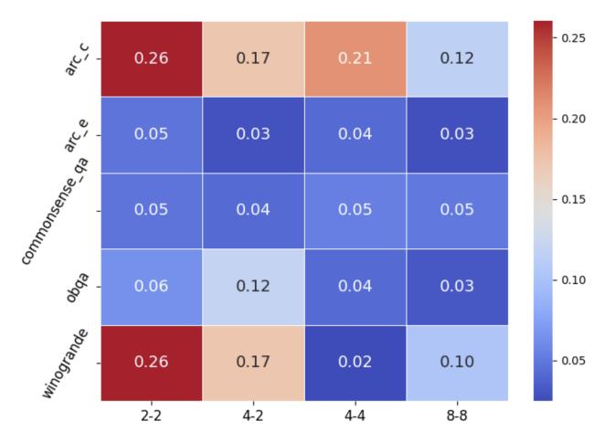

# D.4 Routing cost

Figure 5: Cost of router (Eq. [6\)](#page-5-1) relative to expert propagation (Eq. [3\)](#page-4-0), measured by their number of arithmetic operations. Here we consider S'MoRE with noisy top-k gate on LLaMA 3.2-1B

In Fig. [5,](#page-37-2) we visualize the router computation cost (Eq. [6\)](#page-5-1) relative to that of the experts' layer propagation (Eq. [3\)](#page-4-0), corresponding to the best-performing models in Table [2.](#page-8-0) The x-axis denotes the different S'MoRE structures (in Table [2,](#page-8-0) we do not include the results corresponding to the "4-2" and "8-8" S'MoRE architectures, due to space limit). The costs are measured by the total number of arithmetic operations performed by the routers versus by the experts. In general, when the residual rank rℓ is lower, the cost of routing becomes *relatively* higher (since the router operation is independent of the ranks). However, in all cases, the routing cost is insignificant compared to the cost of expert propagation (at most 26%). This is consistent with our theoretical complexity analysis in [§3.4.](#page-5-4)

