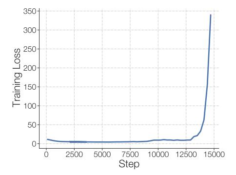
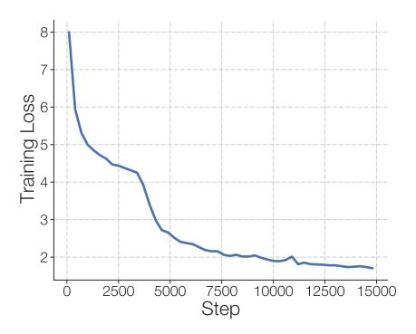

## ST-MOE: DESIGNING STABLE AND TRANSFERABLE SPARSE EXPERT MODELS

Barret Zoph∗ Google Brain Irwan Bello∗ † Google Brain

Sameer Kumar Google Nan Du Google Brain Yanping Huang Google Brain Jeff Dean Google Research Noam Shazeer† Google Brain William Fedus∗ Google Brain

## ABSTRACT

Scale has opened new frontiers in natural language processing – but at a high cost. In response, Mixture-of-Experts (MoE) and Switch Transformers have been proposed as an energy efficient path to even larger and more capable language models. But advancing the state-of-the-art across a broad set of natural language tasks has been hindered by training instabilities and uncertain quality during fine-tuning. Our work focuses on these issues and acts as a design guide. We conclude by scaling a sparse model to 269B parameters, with a computational cost comparable to a 32B dense encoder-decoder Transformer (Stable and Transferable Mixtureof-Experts or ST-MoE-32B). For the first time, a sparse model achieves stateof-the-art performance in transfer learning, across a diverse set of tasks including reasoning (SuperGLUE, ARC Easy, ARC Challenge), summarization (XSum, CNN-DM), closed book question answering (WebQA, Natural Questions), and adversarially constructed tasks (Winogrande, ANLI R3). [1](#page-0-0)

∗Equal contribution. Correspondence to {barretzoph,liamfedus}@google.com.

†Work was done while at Google.

1Code for our models is available at [https://github.com/tensorflow/mesh/blob/master/](https://github.com/tensorflow/mesh/blob/master/mesh_tensorflow/transformer/moe.py) [mesh\\_tensorflow/transformer/moe.py](https://github.com/tensorflow/mesh/blob/master/mesh_tensorflow/transformer/moe.py)

## CONTENTS

| 1 | Introduction 3                                                                                                                                                                                                                                                                 |    |  |  |  |  |
|---|-----------------------------------------------------------------------------------------------------------------------------------------------------------------------------------------------------------------------------------------------------------------------------------|----|--|--|--|--|
| 2 | Background                                                                                                                                                                                                                                                                        | 3  |  |  |  |  |
| 3 | Stabilizing Training of Sparse Models                                                                                                                                                                                                                                             | 5  |  |  |  |  |
|   | 3.1 Stability and Quality Tradeoffs when Removing Multiplicative Interactions                                                                                                                                                                                               | 6  |  |  |  |  |
|   | 3.2 Stability and Quality Tradeoffs when Adding Noise                                                                                                                                                                                                                          | 6  |  |  |  |  |
|   | 3.3 Stability and Quality Tradeoffs when Constraining Activations and Gradients                                                                                                                                                                                             | 7  |  |  |  |  |
|   | 3.4 Selecting a Precision Format: Trading Efficiency and Stability                                                                                                                                                                                                          | 8  |  |  |  |  |
| 4 | Fine-Tuning Performance of Sparse Models                                                                                                                                                                                                                                          | 9  |  |  |  |  |
|   | 4.1 Hypothesis: A Generalization Problem                                                                                                                                                                                                                                       | 9  |  |  |  |  |
|   | 4.2 Fine-Tuning a Subset of Model Parameters to Improve Generalization                                                                                                                                                                                                      | 11 |  |  |  |  |
|   | 4.3 Sparse and Dense Models Require Different Fine-Tuning Protocols                                                                                                                                                                                                            | 11 |  |  |  |  |
|   | 4.4 Sparse Models Are Robust to Dropped Tokens During Fine-Tuning                                                                                                                                                                                                              | 12 |  |  |  |  |
|   | 4.5 Inserting Sentinels Tokens During Fine-Tuning                                                                                                                                                                                                                           | 13 |  |  |  |  |
| 5 | Designing Sparse Models                                                                                                                                                                                                                                                           | 13 |  |  |  |  |
|   | 5.1 Setting the Number of Experts                                                                                                                                                                                                                                           | 13 |  |  |  |  |
|   | 5.2 Choosing the Capacity Factor and Routing Algorithm                                                                                                                                                                                                                         | 14 |  |  |  |  |
| 6 | Experimental Results                                                                                                                                                                                                                                                              | 16 |  |  |  |  |
|   | 6.1 ST-MoE-L                                                                                                                                                                                                                                                                   | 16 |  |  |  |  |
|   | 6.2 ST-MoE-32B                                                                                                                                                                                                                                                              | 16 |  |  |  |  |
| 7 | Tracing Tokens Through the Model                                                                                                                                                                                                                                                  | 19 |  |  |  |  |
|   | 7.1 Encoder Experts Exhibit Specialization                                                                                                                                                                                                                                  | 19 |  |  |  |  |
|   | 7.2 Decoder Experts Lack Specialization                                                                                                                                                                                                                                        | 19 |  |  |  |  |
|   | 7.3 Multilingual Experts Specialize, But Not by Language                                                                                                                                                                                                                    | 21 |  |  |  |  |
| 8 | Related Work                                                                                                                                                                                                                                                                      | 21 |  |  |  |  |
| 9 | Discussion                                                                                                                                                                                                                                                                        | 22 |  |  |  |  |
|   |                                                                                                                                                                                                                                                                                   | 24 |  |  |  |  |
| A | Token Load Balance Description                                                                                                                                                                                                                                                    | 31 |  |  |  |  |
| B |                                                                                                                                                                                                                                                                                   | 31 |  |  |  |  |
| C |                                                                                                                                                                                                                                                                                   | 32 |  |  |  |  |
| D |                                                                                                                                                                                                                                                                                   | 33 |  |  |  |  |
| E |                                                                                                                                                                                                                                                                                   | 34 |  |  |  |  |
| F |                                                                                                                                                                                                                                                                                   | 35 |  |  |  |  |
| G | Optimally Setting the Routing Threshold                                                                                                                                                                                                                                           | 36 |  |  |  |  |
| H | Mesh Layout for Data, Model and Expert Parallelism with Few Experts                                                                                                                                                                                                               | 36 |  |  |  |  |
| I | 10 Conclusion Router Z-Loss Training Dynamics Improved Architectural Modifications Batch Prioritized Routing for Lower Capacity Factors Pre-Training Dataset Details Full Fine-tuning Sensitivity Data Note on Communication Costs for Distributed Models 37 |    |  |  |  |  |
| J | Negative Results                                                                                                                                                                                                                                                                  | 38 |  |  |  |  |

## 1 INTRODUCTION

Sparse expert neural networks showcase the advantage of sheer scale and offer an efficient alternative to the static neural network architectures commonly used today [\(Raffel et al.,](#page-27-0) [2019;](#page-27-0) [Brown et al.,](#page-24-0) [2020;](#page-24-0) [Rae et al.,](#page-27-1) [2021\)](#page-27-1). Rather than applying the same parameters to all inputs, sparse expert networks dynamically select which parameters to use for each input [\(Shazeer et al.,](#page-28-0) [2017\)](#page-28-0). This allows for networks to vastly expand their number of parameters, while keeping the FLOPs per token roughly constant. These approaches have yielded state-of-the-art translation models [\(Lepikhin](#page-26-0) [et al.,](#page-26-0) [2020\)](#page-26-0), 4-7x pre-training speed-ups [\(Fedus et al.,](#page-25-0) [2021;](#page-25-0) [Artetxe et al.,](#page-24-1) [2021\)](#page-24-1), and GPT-3 level one-shot performance using 1/3 the energy training cost [\(Du et al.,](#page-24-2) [2021\)](#page-24-2). And despite a shocking number of parameters, sparse models reduce the carbon footprint for training large neural networks by an order of magnitude [\(Patterson et al.,](#page-27-2) [2021\)](#page-27-2). However, difficulties remain.

[Fedus et al.](#page-25-0) [\(2021\)](#page-25-0) observed that a sparse 1.6T parameter model achieved a 4x pre-training speed-up over the prior state-of-the-art [\(Raffel et al.,](#page-27-0) [2019\)](#page-27-0), but lagged smaller models when fine-tuned on common benchmarks like SuperGLUE. Similar gaps were observed in [Artetxe et al.](#page-24-1) [\(2021\)](#page-24-1) when MoE language models were fine-tuned on out-of-domain data. In response, Switch-XXL, a model with fewer parameters, but a 8x-larger computational footprint (FLOPs approximately equal to the largest T5 model), was proposed and improved quality on natural language understanding tasks. However, necessary pre-training was hampered by training instabilities previously undetected during smaller scale studies. These instabilities were later identified in other sparse models [\(Du et al.,](#page-24-2) [2021\)](#page-24-2). These results revealed a necessary balance of parameters *and* computation, but left an open question on how to reliably train these types of models.

Our aim in this paper is to increase the *practicality* and *reliability* of sparse models. We study these two issues and pre-train a 269B sparse model that achieves state-of-the-art results when fine-tuned across many competitive NLP benchmarks, including SuperGLUE. We also put forth additional analysis and a design guide (or at least, our heuristics) for sparse expert models. Furthermore, this work emphasizes *jointly* optimizing both the upstream pre-training and the downstream fine-tuning metrics to avoid discrepancies [\(Tay et al.,](#page-28-1) [2021\)](#page-28-1).

#### Contributions

- 1. A large-scale study of the quality-stability trade-offs of stability techniques.
- 2. An introduction of the *router z-loss* that resolves instability issues, while slightly improving model quality.
- 3. A fine-tuning analysis of sparse and dense models highlighting different hyperparameter sensitivity to the batch size and learning rate. We show bad hyperparameters result in virtually no fine-tuning gain over dense models, despite large pre-training speed-ups.
- 4. Architectural, routing and model design principles for designing Pareto efficient sparse models in a distributed setting.
- 5. A qualitative analysis tracing token routing decisions across expert layers.
- 6. A 269B sparse model (the Stable Transferable Mixture-of-Experts or ST-MoE-32B) which achieves state-of-the-art performance across a diverse set of natural language benchmarks.

## 2 BACKGROUND

Sparse expert models typically substitute a neural network layer with a set of *experts*, each having unique weights [\(Jacobs et al.,](#page-25-1) [1991;](#page-25-1) [Jordan and Jacobs,](#page-25-2) [1994\)](#page-25-2). Typically all the experts within a layer are of the same type and shape (homogeneous), however, varied (heterogeneous) expert-types are possible. Inputs are only processed by a subset of the experts to save computation, so a mechanism must be added to determine where to send each input. Usually a *router* or gating network determines where to send inputs (i.e. words, sentences, image patches, etc.), but alternative schemes have been proposed [\(Lewis et al.,](#page-26-1) [2021;](#page-26-1) [Roller et al.,](#page-27-3) [2021;](#page-27-3) [Zuo et al.,](#page-29-0) [2021;](#page-29-0) [Clark et al.,](#page-24-3) [2022\)](#page-24-3).

Specifically, in natural language processing, Shazeer et al. (2017) proposed a Mixture-of-Experts (MoE) layer which takes a token representation x as input and routes it to the best matched top-k experts selected out of a set  $\{E_i(x)\}_{i=1}^N$  of N experts. The router variable  $W_r$  produces logits  $h(x) = W_r \cdot x$  which are normalized via a softmax distribution over the available N experts at that layer. The gate-value for expert i is given by

$$p_i(x) = \frac{e^{h(x)_i}}{\sum_{j}^{N} e^{h(x)_j}}$$
 (1)

and the token x is routed to the experts with the highest top-k gate values (set of indices  $\mathcal{T}$ ). The output of the layer is the weighted sum of each expert's computation by the gate value

$$y = \sum_{i \in \mathcal{T}} p_i(x) E_i(x) \tag{2}$$

Originally proposed in LSTMs (Hochreiter and Schmidhuber, 1997), expert layers were later used in the Transformer (Vaswani et al., 2017) by Shazeer et al. (2018) and Lepikhin et al. (2020). Followon work by Fedus et al. (2021) simplified the MoE further to route tokens to a single expert (top-1) and reduced other costs to improve training efficiency.

To improve hardware utilization, most implementations of sparse models have static batch sizes for each expert (Shazeer et al., 2017; 2018; Lepikhin et al., 2020; Fedus et al., 2021). The *expert capacity* refers to the number of tokens that can be routed to each expert. If this capacity is exceeded (the router sends too many inputs to that expert) then the overflowed tokens have no computation applied to them and are passed to the next layer through a residual connection.

| Terminology                  | Definition                                                                                                                                                                                                                                                              |  |  |
|------------------------------|-------------------------------------------------------------------------------------------------------------------------------------------------------------------------------------------------------------------------------------------------------------------------|--|--|
| Expert                       | An independently-learned neural network with unique weights.                                                                                                                                                                                                            |  |  |
| Router                       | A network that computes the probability of each token getting sent to each expert.                                                                                                                                                                                      |  |  |
| <b>Top-</b> n <b>Routing</b> | Routing algorithm where each token is routed to $n$ experts.                                                                                                                                                                                                            |  |  |
| <b>Load Balancing Loss</b>   | An auxiliary (aux) loss to encourage each group of tokens to evenly distribute across experts.                                                                                                                                                                          |  |  |
| Group Size                   | The global batch size is split into smaller groups, each of size Group Size. Each group is considered separately for load balancing across experts. Increasing it increases memory, computation, and communication.                                                     |  |  |
| Capacity Factor (CF)         | Each expert can only process up to a fixed number of tokens, which is often set by evenly dividing across experts, $\frac{\text{tokens}}{\text{experts}}$ . The capacity factor can expand or contract this amount to $CF \cdot \frac{\text{tokens}}{\text{experts}}$ . |  |  |
| FFN                          | Acronym of Feed Forward Network (FFN) layer of Transformer consisting of linear, activation, linear.                                                                                                                                                                    |  |  |
| Encoder-Decoder              | A Transformer architectural variant that all of our models are based on. Consists of an encoder that does all-to-all attention on the inputs and a decoder that attends to the encoder and to its own inputs in an autoregressive manner.                               |  |  |
| allreduce                    | Communication primitive which sums a subset of $n$ tensors on $n$ different devices, then broadcasts the summed value to all $n$ devices. This is used in distributed training for gradient accumulation and model parallelism.                                         |  |  |
| all2all                      | Communication primitive where each device sends to every other device a part of its tensor. Used in sparse Transformer models for token routing.                                                                                                                        |  |  |
| (†/↓)                        | Indicates whether higher/lower values are better (e.g. accuracy/train loss).                                                                                                                                                                                            |  |  |

Table 1: **Terminology used throughout the paper.** 

The batch  $\mathcal{B}$  of input tokens is broken into  $\mathcal{G}$  unique groups across the data-parallelism dimension2, each with size  $\mathcal{B}/\mathcal{G}$ . The expert capacity is equal to CF · tokens/experts where CF represents the

&lt;sup>2Our implementation relies on einsums with one-hot tensors for dispatching and combining tensors to/from experts. The size of this one-hot tensor grows quadratically with the number of tokens being routed as a group which motivates breaking the batch into smaller groups. This may be avoided with sparse lookup operations.

capacity factor hyperparameter, experts is the number of experts and tokens is the group size. If the capacity factor is increased, it creates extra buffer so that fewer tokens will be dropped in case of load imbalance. However, increasing the capacity factor also increases the memory and computational costs, so there exists a trade off3.

Finally, an auxiliary load balancing loss encourages tokens to be roughly evenly distributed across the experts (Shazeer et al., 2017). This improves the hardware efficiency by ensuring that all accelerators are processing significant chunks of data in parallel as mentioned above. The details of the loss are presented in Appendix A. However, alternatives exist: Lewis et al. (2021) and Clark et al. (2022) treats balanced token allocation as an assignment problem and removes the auxiliary loss entirely.

#### 3 STABILIZING TRAINING OF SPARSE MODELS

Sparse models often suffer from training instabilities (Figure 1) worse than those observed in standard densely-activated Transformers.

Figure 1: **Training instabilities for sparse models.** We refer to training instabilities as divergences in the training loss. Above are two runs from sparse models FLOP-matched to the T5-XL version (Raffel et al., 2019) each trained with a batch size of 1M tokens using the Adafactor optimizer (Shazeer and Stern, 2018). (**Left**) An unstable training run. (**Right**) A stable training run.

It's straightforward to find changes that improve the *stability*, however, these often come at an untenable expense to model *quality* (for instance, using an arbitrarily small learning rate or using tight gradient clipping). We categorize and examine several approaches to improve stability. The stability techniques span generic fixes to Transformers as well as those specific to sparse models: (1) Remove multiplicative interactions (2) Inject model noise (3) Constrain activations, and gradients. We conclude with our recommendation: a new auxiliary loss, the *router z-loss*, which significantly improves training stability with no quality degradation. This is an adaptation of the z-loss used for final softmax logits in the Mesh Tensorflow codebase (Shazeer et al., 2018).

#### **Stabilizing Sparse Models**

- 1. Many methods stabilize sparse models, but at the expense of worse quality.
- 2. The router z-loss stabilizes models without quality degradation.
- **3.** Transformer modifications with more multiplicative components (GEGLU, RMS normalization) worsen stability, but boost quality.

**Designing a large-scale stability study.** We design a large-scale stability study of sparse models FLOP-matched to the T5-XL version (Raffel et al., 2019) pre-trained on the multilingual corpus mC4 (Xue et al., 2020). Each sparse model has 32 experts and we introduce a sparse MoE layer for

&lt;sup>3See Fedus et al. (2021) for a graphical illustration of how the capacity factor works.

every fourth FFN. The train capacity factor is 1.25 and the eval capacity factor is 2.0. See Table 11 for a more detailed description of models used throughout this paper. For each stability technique, we record the fraction that are stable, the mean quality (negative log perplexity on English), and the standard deviation over seeds.

The primary issue in constructing this study is that small models are rarely unstable but large unstable models are too costly to run for sufficient steps and seeds. We found a sparse model FLOP-matched to T5-XL to be good object of study because it was unstable roughly 1/3 of the runs, but was still relatively cheap to train. Furthermore, we run our instability experiments on multilingual data since we find this exacerbates model instabilities, allowing us to experiment on slightly smaller models. See Section 9 for more details. Our baseline configuration is trained using six random seeds and each configuration with a stability technique uses three random seeds. We use six seeds for the baseline to better characterize the instability rate and three seeds for the variants to save compute. Each model is pre-trained for 20k steps on mC4 using a masked language modeling objective (Fedus et al., 2018; Devlin et al., 2018).

