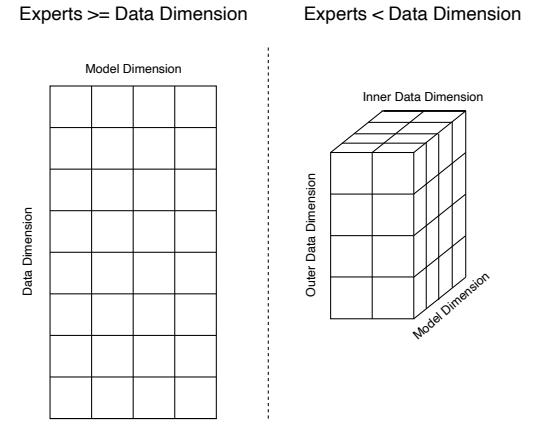

# H MESH LAYOUT FOR DATA, MODEL AND EXPERT PARALLELISM WITH FEW EXPERTS

We use data and model parallelism partitioning with Mesh-Tensorflow (Shazeer et al., 2018). The partitioning strategy works by first forming a logical 2D mesh of size  $d \times m$ , with the rows corresponding to the data dimension (d) and the columns as the model dimension (m) and the product equal to the total number of cores,  $n = d \times m$ . This mesh is only an abstraction. Each logical core must be mapped to a physical core, which is optimized through performance tuning.

As a refresher, each row in the mesh will have its own unique slice of the data and each column will have a unique slice of the model weights. The final gradient allreduce communication occurs across each individual column. The model parallelism allreduce communications occur across each row in the mesh. One constraint from this approach is that the number of rows must evenly

Figure 8: Data and model parallelism meshes used for distributing models. In this example there are a total of 32 processors (e.g. n = 32). (Left) A valid 2D mesh if the number of experts is greater than or equal to the data parallelism dimension. The data dimension has 8 rows (d) and the model dimension has 4 columns (m). (Right) A valid 3D mesh when we have fewer experts than the data parallelism dimension. The batch dimension is factorized into two new dimensions: inner data and outer data dimensions. Now we have 1 expert per inner data dimension (i). The 8 data rows in the left figure become 4 in the outer batch (o) and 2 in the inner batch (i) with 2 experts instead of 8.

divide the number of data sequences and the number of columns must evenly divide the model dimensions being partitioned.

But if we have *fewer* than d experts then this layout will not work. To allow for fewer experts than data parallelism rows in our mesh, we factorize the data dimension into two new dimensions: inner (i) and outer (o) where i x o = d and the number of experts equals i. This transforms the logical 2D mesh of shape d x m into a 3D mesh of shape o x i x m. See Figure [8](#page-36-1) for a visualization of both meshes [12](#page-36-2) .

## I NOTE ON COMMUNICATION COSTS FOR DISTRIBUTED MODELS

Communication operations (allreduce and all2all) can significantly impact sparse model training throughput (see Table [1](#page-3-1) for a description of the communication operations). allreduce calls are executed along model and batch dimensions, typically dominated by the model dimension allreduce calls that sum results of partial matrix multiplication operations from the workers. These calls are needed when matrix multiplications are partitioned across multiple cores (e.g. model parallelism). The gradient summation allreduce calls can be amortized away by training models with larger batch sizes since the gradient accumulation allreduce communication cost is independent of the batch size. To alleviate the memory issues of larger batch sizes, microbatches can be used. Microbatches do this by splitting the batch into n evenly divisible chunks and computing gradients on each sequentially, then summing.

To increase the allreduce throughput, more workers may need to be assigned to the model dimension (instead of batch dimension). However, increasing the number of workers may reduce compute per worker resulting in higher communication overheads that cancel some of the gains from higher communication throughput from allreduce. For the results in this paper, first we explored various model partitioning strategies. Next the shapes of the pre-training jobs were allocated based on performance benchmarking which showed the lowest cumulative communication overheads in allreduce and all2all.

12See Mesh Tensorflow for more details on the inner and outer batch: [https://github.com/](https://github.com/tensorflow/mesh/blob/master/mesh_tensorflow/transformer/moe.py) [tensorflow/mesh/blob/master/mesh\\_tensorflow/transformer/moe.py](https://github.com/tensorflow/mesh/blob/master/mesh_tensorflow/transformer/moe.py)

## J NEGATIVE RESULTS

We conclude with some ideas that yielded negative results in our setting.

Adding information if tokens were dropped to the router. We experimented with having the expert layer have information of whether the token was routed or dropped in the previous expert layers. We implemented this through counting the number of times a token was routed in all previous expert layers, having embeddings for each possible value and then adding this to the router embedding. We found that this made no difference in performance.

Adding explicit expert positional information. We experimented with adding explicit positional information into the outputs of the expert layer. We wanted to see if it either improved performance or sped up convergence during the beginning of training when expert layers were drastically changing. We did this through adding an embedding corresponding to what expert each token was sent (including an embedding if the token was dropped), but this did not improve performance.

Adding pre-training noise to fix pre-training and fine-tuning discrepancies. To help fix the pre-training perplexity and fine-tuning gap we tried pre-training the sparse models with a variety of different types of noise. The goal was to help pre-training match the fine-tuning conditions where dropout is used and more tokens can be dropped. Some of the noise types we tried adding during pre-training were dropout, dropping out full experts for a batch of tokens, and adding an entropy maximization auxiliary loss to the router. Unfortunately, all of the methods either hurt the pretraining quality too much or didn't end up helping the fine-tuning.

Load balancing in top-n routing over lower n-1 experts. In the standard top-n MoE formalization there is only loading balancing over the top expert a token is sent to. We experimented with adding an auxiliary load balancing term to the other n − 1 experts in top-n routing, but found this to provide minimal benefits.

Mixing pre-training and fine-tuning data to prevent overfitting. To help combat the overfitting of sparse models during fine-tuning, we tried mixing in pre-training span corruption data at varying amounts (e.g. 1%, 5%, 25%, ...) during fine-tuning. This ended up not helping the fine-tuning performance, but did increase the training loss.