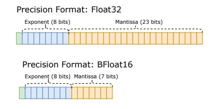
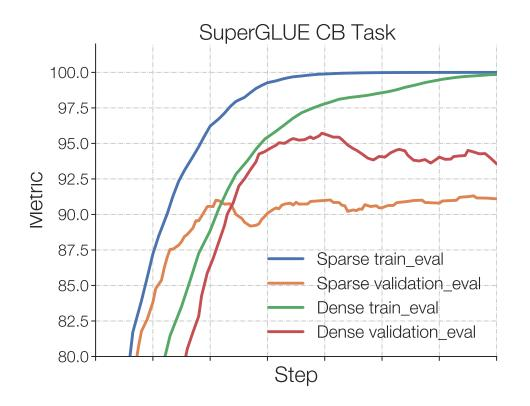
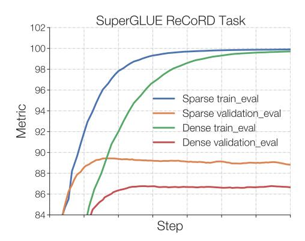
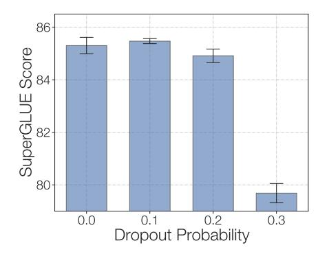
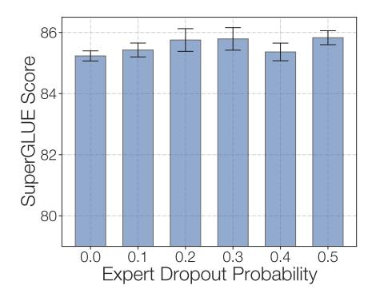
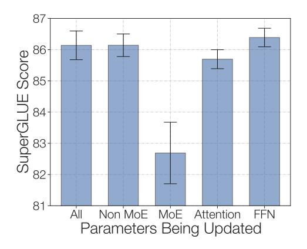
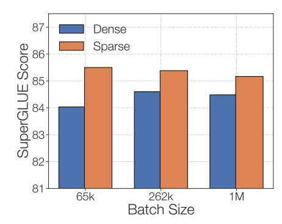
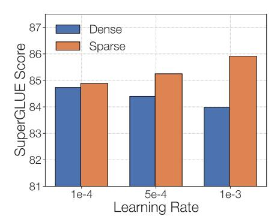
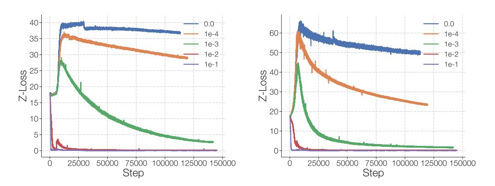

# 3.3 STABILITY AND QUALITY TRADEOFFS WHEN CONSTRAINING ACTIVATIONS AND GRADIENTS

One of the most successful approaches to stabilizing neural networks are constraints on activations, and gradients (Pascanu et al., 2013; Ioffe and Szegedy, 2015; Salimans and Kingma, 2016; Ba et al., 2016). A popular approach consists in the clipping of gradient norms to remedy exploding gradients while backpropagating through deep networks (Pascanu et al., 2013).

In this work, we use the Adafactor optimizer due to its memory efficiency (though recently introduced 8-bit optimizers (Dettmers et al., 2021) may offer better trade-offs). Instead of gradient clipping, Adafactor uses *update clipping*, where the changes to the weights are constrained to be below a certain norm. We experiment with tightening the update clipping to a smaller value.

Next, we study constraints on the logits going into the router. The router computes the probability distribution over the experts in float32 precision (i.e. selective precision) (Fedus et al., 2021). However, at the largest scales, we find this is insufficient to yield reliable training. To fix this, we introduce the *router z-loss*,

$$L_z(x) = \frac{1}{B} \sum_{i=1}^{B} \left( \log \sum_{j=1}^{N} e^{x_j^{(i)}} \right)^2$$
 (5)

where B is the number of tokens, N is the number of experts, and  $x \in \mathcal{R}^{B \times N}$  are the logits going into the router. This penalizes large logits into the gating network and Section 3.4 contains a more detailed explanation of why the z-loss before the router is useful.

Table 4 shows that both update clipping and the router z-loss stabilize the model in all 3 runs, but the update clipping significantly hurts the model quality. Therefore we use the z-loss method for fixing our model stability due to improved quality and stability4.

| Method                          | Fraction Stable | Quality (†)              |
|---------------------------------|-----------------|--------------------------|
| Baseline                        | 4/6             | $-1.755 \pm 0.02$        |
| Update clipping (clip $= 0.1$ ) | 3/3             | $-4.206 \pm 0.17$        |
| Router Z-Loss                   | 3/3             | <b>-1.741</b> $\pm 0.02$ |

Table 4: **Constraining weight updates and router logits.** Constraining the update clipping in Adafactor improves stability, but at a catastrophic loss of quality. Looser clipping values did not reliably stabilize training so we exclude them here. The router z-loss stabilizes the model without any quality degradation (in this case, we observe a slight quality boost).

The router z-loss introduces another hyperparameter  $(c_z)$ , which is the coefficient to weight this as part of the total loss optimized. The total loss is a linearly weighted combination of the cross entropy loss  $(L_{CE})$ , the auxiliary load balance loss  $(L_B)$ , and the router z-loss  $(L_Z)$ , yielding a total loss

$$L_{tot} = L_{CE} + c_B L_B + c_z L_Z \tag{6}$$

We choose a value of  $c_z = 0.001$  based on the best model quality after pre-training with a hyperparameter sweep. Appendix B logs the resulting losses over the course of pre-training.

#### 3.4 SELECTING A PRECISION FORMAT: TRADING EFFICIENCY AND STABILITY

As in most modern distributed Transformers we train with *mixed precision* (Micikevicius et al., 2017) 5. Weights are stored in float32 for gradient updates and then converted to bfloat16 when doing matrix multiplications in the forward and backward pass6. Furthermore, all activations are stored and operated on in bfloat16 and allreduce communications can be done in either bfloat16 or float32 numerical precision. For the largest model explored in this work (ST-MoE-32B presented later) we find speed-ups halving the numerical precision of the allreduce, however this also can destabilize the training so we keep this as float32 throughout this work.

A lower precision format enables more efficient models by reducing (a) communication costs between processors and memory, (b) computation costs, (c) memory for storing tensors (e.g. activations). However, lower precision formats come at the expense of larger roundoff errors which can lead to irrecoverable training instabilities.

| Number Range | Max <u>BFloat16</u> Roundoff Error | Max <u>Float32</u> Roundoff Error |  |
|--------------|---------------------------------------|--------------------------------------|--|
| [2, 4)       | 0.01563                               | 2.34x10^(-7)                         |  |
| [32, 64)     | 0.25                                  | 3.81x10^(-6)                         |  |
| [1024, 2048) | 8.0                                   | 0.00012                              |  |
| [2^20, 2^21) | 8192.0                                | 0.125                                |  |
| [2^30, 2^31) | 8288608.0                             | 128.0                                |  |

Figure 2: Numerical precision formats and roundoff errors. Larger numbers have larger roundoff errors. bfloat16 has up to 65,536x worse roundoff errors than float32. The router z-loss encourages the absolute magnitude of numbers to be small, which doesn't hinder model performance and reduces roundoff errors. The router z-loss is most effective into functions where larger errors can drastically change the relative output (e.g. exponential and sinusoidal functions).

&lt;sup>4We also experimented with adding z-losses onto the attention logits which also improves model instability without hurting model quality.

&lt;sup>5See Mesh Tensorflow for implementation details: https://github.com/tensorflow/mesh/blob/master/mesh\_tensorflow/

&lt;sup>6Matrix multiplications on TPUs perform multiplications in bfloat16 and accumulations in float32.

Understanding precision format and roundoff errors. Figure 2 reviews the properties of different precision formats and their corresponding roundoff errors for different number ranges. Numbers in any range of two consecutive powers of 2 (e.g. [2,4) and [1024, 2048)) are represented by a fixed number of mantissa bits (7 for bfloat16, 23 for float32). As a result, (1) bfloat16 will have about 65,536x (i.e. 23-7=16 additional bits and  $2^{16}=65536$ ) as large roundoff errors as float32 and (2) larger numbers have larger roundoff errors. Due to the 8 exponent bits, number can get as large as  $\approx 3e^{38}$ , which leads to even float32 having some issues with roundoff errors.

Sparse expert models are sensitive to roundoff errors because they have more exponential functions due to the routers. Sparse expert models introduce additional exponential functions – through the router – which can exacerbate roundoff errors7 and lead to training instabilities. While a roundoff error does not change the ordering of probabilities within a softmax operation, it does impact the routing of the second token in MoE due to relative thresholding (e.g. a token is only routed to its second place expert if the gating probability for the second expert is 1/5 as large as that of the first expert). Additionally, roundoff errors can drastically change the probability that scales the expert output – which we have found to be important. Finally, we conjecture that the higher stability we observed for decoder-only models (not shown here) was because they had fewer exponential functions. Section 9 contains a more detailed discussion.

An aside on the router z-loss. One might think that the router z-loss is a convoluted method replaceable by clipping logits (Wu et al., 2016). We explain why this is not the case. The goal is to minimize large roundoff errors going into exponential functions. Clipping the logits occurs *after* any roundoff errors – resulting in even larger discontinuities. In one view, clipping in itself is a roundoff error; conversely, the z-loss naturally encourages the model to produce logits that are small in value and thus more accurately modeled. Due to these dynamics, we ensure all exponentiated tensors are cast to float32. This hints at the possibility of better number formats for neural networks because of the unused exponent bits when z-losses are added throughout the network (see Section 9).

#### 4 FINE-TUNING PERFORMANCE OF SPARSE MODELS

The best performing language models are usually obtained by (1) pre-training on large amounts of data (e.g. the internet) followed by (2) fine-tuning on a task of interest (e.g. SuperGLUE). Promising new techniques have emerged as an alternative, including few-shot inference (Brown et al., 2020), prefix tuning (Li and Liang, 2021), prompt tuning (Lester et al., 2021), and adapter modules (Houlsby et al., 2019) – however, a quality gap still persists compared to fine-tuning. Because of this, we focus on fine-tuning in this work, but highlight recent successes of sparse models in few-shot settings from Du et al. (2021); Artetxe et al. (2021). Further, we leave as future work techniques that adapt large language models through reinforcement learning (Ouyang et al., 2022)

#### 4.1 Hypothesis: A Generalization Problem

Sparse models have performed remarkably well in the regime of large datasets, but have sometimes performed poorly when fine-tuning (Fedus et al., 2021; Artetxe et al., 2021). We present evidence for a (not so surprising) hypothesis that sparse models are prone to overfitting. We illustrate this problem through two tasks in SuperGLUE (Wang et al., 2019) – Commitment Bank (De Marneffe et al., 2019) and ReCORD (Zhang et al., 2018). Commitment Bank (CB) has 250 training examples while ReCORD has over 100,000. This significant size discrepancy facilitates a natural study for overfitting on two tasks selected as part of the same benchmark.

In Figure 3, we compare the fine-tuning characteristics of the Dense L and the ST-MoE-L model. Each model was pre-trained on 500B tokens from the C4 corpus (Raffel et al., 2019). The models

&lt;sup>7Exponential functions have the property that a small input perturbation can lead to a large difference in the output. As an example, consider inputting 10 logits to a softmax function with values of 128 and one logit with a value 128.5. A roundoff error of 0.5 in bfloat16 will alter the softmax output by 36% and incorrectly make all logits equal. The calculation goes from  $\frac{\exp(0)}{\exp(0)+10\cdot\exp(-0.5)}\approx 0.142 \text{ to } \frac{\exp(0)}{\exp(0)+10\cdot\exp(0)}\approx 0.091.$  This occurs because the max is subtracted from all logits (for numerical stability) in softmax operations and the roundoff error changes the number from 128.5 to 128. This example was in bfloat16, but analogous situations occur in float32 with larger logit values.

Figure 3: **Sparse models are prone to overfit.** We plot train and validation curves for our ST-MoE-L and a dense-L models fine-tuned on the CB task (250 train sequences) and ReCoRD (138k train sequences). In both cases, the sparse model learns more quickly on the train partition (blue exceeds green line). However, for the smaller CB task, the dense model outperforms the sparse model on the held-out validation set (red vs. orange). In contrast, on the larger ReCoRD task, the sparse model outperforms the dense model by several percentage points.

are designed to be roughly FLOP matched variants of the T5-Large encoder-decoder models from Raffel et al. (2019) with 770M parameters. The ST-MoE models have 32 experts with an expert layer frequency of 1/4 (every fourth FFN layer is replaced by an MoE layer). The pre-training and fine-tuning train capacity factor is 1.25 and the eval is 2.0. We evaluate performance on the held-out validation and train dataset partitions.

Across both tasks, the sparse model converges faster to 100% train set accuracy supporting that sparse models optimize effectively under a data distribution shift. On the larger task, ReCORD, the validation quality of the sparse model follows the boost in training and significantly exceeds the dense model. However, on the smaller task, CB, the sparse model lags its dense counterpart on heldout data. As per the recommendation of Fedus et al. (2021), we consider increasing the dropout within the expert hidden state (i.e. expert dropout), but find that at this scale, higher values only moderately improve quality (Figure 4). We study further improvements to fine-tuning in Section 4.2 and hyperparameter sensitivity in Section 4.3.

Figure 4: **Regularization studies of sparse models for fine-tuning**. For each setting, we train three random seeds till convergence on SuperGLUE. We find that increased regularization through dropout provides modest boosts. (**Left**) demonstrates peak SuperGLUE fine-tuning quality at a global dropout rate of 0.1. Higher values over-regularize and severely hurt quality. (**Right**) Starting with the best known global dropout rate of 0.1, we selectively increase the expert dropout (an independent dropout rate on the expert hidden activation). This yields further generalization benefits and is in line with the findings of Fedus et al. (2021).

#### 4.2 FINE-TUNING A SUBSET OF MODEL PARAMETERS TO IMPROVE GENERALIZATION

To combat overfitting we experiment updating only a subset of models parameters during fine-tuning. Figure 5 measures quality for updating 5 different subsets of parameters: all parameters (All), only non MoE parameters (Non MoE), only MoE parameters (MoE), only the self-attention and enc-dec attention parameters (Attention) and only the non MoE FFN parameters (FFN).

Figure 5: **Updating only a subset of model parameters during fine-tuning**. To improve the generalization of sparse models and combat overfitting, we fine-tune a subset of the model parameters. All results are with the ST-MoE-L model and are an average of 5 different random seeds. We observe that updating 3/5 of the subsets of parameters appear to work about the same, while fine-tuning only the MoE parameters results in a drastic quality reduction.

We observe that updating the non MoE parameters works about as well as updating all the parameters and updating only the FFN parameters works a bit better. Updating only the MoE parameters significantly degrades fine-tuning performance, which is where  $\approx\!80\%$  of model parameters are. Only updating the non MoE parameters can be an effective way to speedup and reduce memory for fine-tuning.

We hypothesize that fine-tuning only the MoE parameters leads to bad performance since expert layers only occur every 1/4 layers and a token will see at most two experts per layer. Therefore, updating the MoE parameters will affect much fewer layers and FLOPs than updating any other subset of the parameters we tried. Updating only the MoE parameters resulted in a much larger training loss than updating the non MoE parameters, even though there are significantly more parameters. We further observe that updating all the non-MoE parameters results in a higher training loss than updating all the parameters, but unfortunately this regularization effect didn't translate to better validation performance.

Further, one regularizer we tried was a dropout variant where entire experts were masked out stochastically during training. However, this failed to improve generalization in our preliminary studies. Appendix J expands on this experiment and contains other negative results.

#### 4.3 Sparse and Dense Models Require Different Fine-Tuning Protocols

How sensitive are sparse and dense models to the fine-tuning protocol? We study two hyperparameters: the batch size and the learning rate. We pretrain a Dense-L and ST-MoE-L on 500B tokens of C4 and then fine-tune on SuperGLUE. Figure 6 summarizes our experiments with the full data presented in Table 20 (Appendix F). Across all hyperparameter settings, the sparse models (orange) outperform the dense (blue) counterparts – however, the best setting for each can materially change results. Sparse and dense models have vastly different performance across different batch sizes and learning rates. Sparse models benefit from smaller batch sizes and a higher learning rate. Consistent with the overfitting hypothesis (Section 4.1), both these changes might improve generalization through higher noise in the fine-tuning process. Finally, we point out the importance of correctly tuning the batch size and learning rate during fine-tuning. Simply using the same fine-tuning hyper-

parameters that worked well for the dense model can mask any pre-training improvements obtained by the sparse model.

Figure 6: **Batch size and learning rate sensitivity.** We measure differences and sensitivity to fine-tuning protocols between dense (blue) and sparse (orange) models. Each bar is an average across 6 different runs with different hyperparameters. On SuperGLUE, sparse models benefit from noisier hyperparameters including small batch sizes and high learning rates. Dense models behave nearly oppositely. See Appendix F for all data.

#### 4.4 Sparse Models Are Robust to Dropped Tokens During Fine-Tuning

Sparse models route tokens to one or more experts at each layer. To make these models efficient in the SPMD paradigm with modern hardware, the expert capacity (the number of tokens each expert processes) needs to be fixed ahead of time (see Section 2 for more details). When an expert receives more tokens than its capacity, the extra tokens are dropped — no computation is applied to those tokens. We again try to prevent this by (1) pre-training with an auxiliary loss that promotes equal amounts of tokens getting sent to each expert and (2) a capacity factor (a hyperparameter) that adds room for extra tokens at each expert. We experiment with turning off the auxiliary loss during fine-tuning and using different capacity factors. Tables 5 reveals a surprising result that fine-tuning quality is not materially impacted by dropping up to 10-15% of tokens8. Studies on ST-MoE-32B corroborate that high capacity factors do not improve fine-tuning quality. This is in-line with findings of Yang et al. (2021) that unequal load balance may not significantly impact model quality.

| Model  | Train CF | Eval CF | Aux Loss | <b>Percent Tokens Dropped</b> | SuperGLUE (†)   |
|--------|----------|---------|----------|-------------------------------|-----------------|
| Sparse | 0.75     | 2.0     | Yes      | 10.6%                         | $86.5 \pm 0.21$ |
| Sparse | 1.25     | 2.0     | Yes      | 0.3%                          | 86.7            |
| Sparse | 2.0      | 3.0     | Yes      | 0.0%                          | 85.8            |
| Sparse | 4.0      | 5.0     | Yes      | 0.0%                          | 86.4            |
| Sparse | 0.75     | 2.0     | No       | 15.6%                         | 85.7            |
| Sparse | 1.25     | 2.0     | No       | 2.9%                          | 85.8            |
| Sparse | 2.0      | 3.0     | No       | 0.4%                          | 85.9            |
| Sparse | 4.0      | 5.0     | No       | 0.0%                          | 86.4            |

Table 5: **Sparse models are robust to dropped tokens when fine-tuning.** We find the fine-tuning quality on SuperGLUE is not impacted significantly across the values explored. Interestingly, dropping 10-15% of tokens can perform approximately as well as models that drop <1%. We also observe that load balance losses (Aux Loss) improve fine-tuning. The dropped token percentage corresponds to the fraction of dropped tokens across all expert layers at peak validation accuracy.

&lt;sup>8Token dropping may be a form of regularization and a more extensive study may be an interesting direction for future work.

### 4.5 INSERTING SENTINELS TOKENS DURING FINE-TUNING

Sentinel tokens denote masked sequences in the span-corruption objective [\(Fedus et al.,](#page-25-4) [2018;](#page-25-4) [Devlin](#page-24-4) [et al.,](#page-24-4) [2018\)](#page-24-4). This differs from any fine-tuning task we would likely encounter, leading to a domain mismatch between pre-training and fine-tuning. Table [6](#page-12-3) illustrates the difference. We examine whether modifying the fine-tuning task to look more like the pre-training task effects results.

| Objective               | Inputs                                        | Targets                                     |  |
|-------------------------|-----------------------------------------------|---------------------------------------------|--|
| Span Corruption         | I like <x> the pool <y> day .</y></x> | <x> going to <y> on a sunny</y></x> |  |
| Fine-Tuning             | What is the capital of Illinois ?             | Springfield                                 |  |
| Fine-Tuning + Sentinels | What is the capital of Illinois ? <x></x>     | <x> Springfield</x>                     |  |

Table 6: Inserting sentinels during fine-tuning mimics the pre-training span objective. We highlight the typical difference between span corruption and fine-tuning. We propose modifying the fine-tuning task to resemble pre-training by inserting sentinel tokens.

In Table [7](#page-12-4) we find that adding sentinel tokens while fine-tuning only improves Grammar Error Correction (GEC) [\(Rothe et al.,](#page-27-7) [2021\)](#page-27-7), but not SuperGLUE. We tried to further reduce the data distribution shift by inserting multiple sentinel tokens (as would be encountered by the model while pre-training), but again found no universal benefit. However, despite no consistent benefit on heldout data, we find that training convergence is accelerated for both dense and sparse models.

| Model  | Insert Sentinel Tokens | SuperGLUE (↑) | GEC (↑)     |
|--------|------------------------|---------------|-------------|
| Dense  | X                      | 84.9 ± 0.33   | 22.3 ± 0.25 |
| Dense  |                        | 85.1 ± 0.25   | 22.1 ± 0.42 |
| Sparse | X                      | 86.6 ± 0.18   | 22.2 ± 0.04 |
| Sparse |                        | 86.6 ± 0.24   | 22.9 ± 0.09 |

Table 7: Impact of sentinel tokens for fine-tuning. The addition of sentinel tokens (a similar concept used in [Lester et al.](#page-26-7) [\(2021\)](#page-26-7)) during fine-tuning has mixed performance on the two tasks we consider. SuperGLUE records the average score and GEC records the exact match. While we find it doesn't improve generalization, sentinel tokens can accelerate training convergence.

## 5 DESIGNING SPARSE MODELS

The design of dense models has been guided by the foundational work of [Kaplan et al.](#page-25-7) [\(2020\)](#page-25-7). But sparse models pose a myriad of additional questions: (1) How many experts to use? (2) Which routing algorithm? (3) What value for the capacity factor? (4) How does hardware change these decisions? In this section, we comment on these and offer recommendations for building Pareto efficient sparse models. Concurrently, [Clark et al.](#page-24-3) [\(2022\)](#page-24-3) provides additional design recommendations including higher layer frequency and top-1 routing as per [Fedus et al.](#page-25-0) [\(2021\)](#page-25-0).

#### Designing Sparse Models

- 1. In our setup, we recommend top-2 routing with 1.25 capacity factor and at most one expert per core.
- 2. The capacity factor can be changed during evaluation to adjust to new memory/compute requirements.
- 3. Dense layer stacking and a multiplicative bias can boost quality (Appendix [C\)](#page-31-0).

## 5.1 SETTING THE NUMBER OF EXPERTS

One of the first questions is the number of experts to use. [Fedus et al.](#page-25-0) [\(2021\)](#page-25-0) presented the scalingproperties of Switch Transformer which yielded monotonic pre-training benefits (on a step basis) on C4 up to 512-experts, [Kim et al.](#page-25-10) [\(2021\)](#page-25-10) up to 64-experts and [Clark et al.](#page-24-3) [\(2022\)](#page-24-3) up to 512-experts. But the incremental benefit quickly diminishes with many experts (>256) or equivalently, with very sparse models (<1% of experts activated).

However, reflecting on the specific hardware system can further guide this choice. The compute-tomemory ratio (operational intensity) can serve as an estimate of the efficiency of different operations [\(Williams et al.,](#page-28-13) [2009;](#page-28-13) [Shazeer,](#page-27-8) [2019\)](#page-27-8). A model is *memory bound* if the time to load tensors to the computing core (e.g. ALU/MMU) greatly exceeds the time required to do the computation on the tensors. On modern GPUs and TPUs, increasing this compute to memory ratio improves the efficiency.

Returning to sparse expert models, using more than one expert per core increases memory transfer, potentially hurting efficiency. Increasing the number of experts does not change the computation done (sparse models apply a fixed amount of computation to each input), but increases the memory transfer requirement (additional expert variables must be loaded from device memory). This *decreases* the compute-to-memory ratio[9](#page-13-1) .

On our TPU system, we recommend to one expert (or less) per core. Our largest models use both data and model parallelism where data parallelism is over "rows" and model-parallelism over "columns" of the logical mesh. We use ≤ 1 expert per data parallelism row to ensure the compute-to-memory ratio is high and to reduce the cores needed for evaluation and inference. Furthermore, using less experts lets us allocate more cores to the model parallelism "column" to have more FLOPs in our model. Appendix [H](#page-35-1) explains our mesh layouts for when we have fewer experts than data parallelism rows.

#### 5.2 CHOOSING THE CAPACITY FACTOR AND ROUTING ALGORITHM

We generalize top-1 routing [\(Fedus et al.,](#page-25-0) [2021;](#page-25-0) [Roller et al.,](#page-27-3) [2021\)](#page-27-3) and top-2 [\(Shazeer et al.,](#page-28-0) [2017;](#page-28-0) [Lepikhin et al.,](#page-26-0) [2020\)](#page-26-0) to study top-n routing where each token is processed by at most n experts. In this study, all models are pre-trained for 100k steps with 1M tokens per batch and sparse models have 32 experts and are FLOP matched to T5-Large [Raffel et al.](#page-27-0) [\(2019\)](#page-27-0). We draw two key conclusions.

First, increasing both the train and eval capacity factors (CF) improves quality as seen by comparing across the segmented blocks of Table [8.](#page-14-0) For instance, top-1 routing improves by +0.011 neg. log perp. when increasing from 1.0 → 1.25 train CF and top-2 routing improves +0.009 increasing from 1.25 → 2.0 train CF. To provide context for these numbers: tripling the size of a dense model (Dense-L to Dense-XL) yields a +0.090 neg. log perp. boost. Therefore, these CF boosts are ∼ 1/10th of that magnitude. But this comes at a cost. Increasing the capacity factor linearly increases the einsums costs, memory for activations, all2all communication costs, and model-parallelism allreduce communication costs for expert layers[10](#page-13-2) .

Second, there are small gains of top-(n+1) over top-n routing given a *fixed* capacity factor (Table [8\)](#page-14-0). For instance, top-2 routing improves +0.004 over top-1 at train CF of 1.25 or about 1/20th the boost of a dense model tripling. This revises an earlier recommendation from [Fedus et al.](#page-25-0) [\(2021\)](#page-25-0). The primary difference between these experimental setups was scale of compute. [Fedus et al.](#page-25-0) [\(2021\)](#page-25-0) trained 220M-FLOP matched models for 50B tokens. We find at an 8x larger scale of training (1B-FLOP matched models for 100B tokens) there is instead a small gain to route to more than one expert. Furthermore, at the larger experimental scale, the speed difference of top-n versus top- (n + 1) routing is negligible. Speed differences were observed in [Fedus et al.](#page-25-0) [\(2021\)](#page-25-0) because the router computation was a larger fraction of the total model computation.

9As an exercise to the reader, verify the operational intensity of the first expert computation is b·h b+h·e with b batch size, h hidden dimension, e number of experts.

10all2all and allreduce costs depend on the number of devices, batch size, dmodel and capacity factor, but not on the number of experts.

| Algorithm | Train CF | Eval CF | Neg. Log Perp. (↑) |
|-----------|----------|---------|--------------------|
| Dense-L   | —        | —       | -1.474             |
| Dense-XL  | —        | —       | -1.384             |
| Top-1     | 0.75     | 0.75    | -1.428             |
| Top-1     | 0.75     | 2.0     | -1.404             |
| Top-2     | 0.75     | 0.75    | -1.424             |
| Top-2     | 0.75     | 2.0     | -1.402             |
| Top-1     | 1.0      | 1.0     | -1.397             |
| Top-1     | 1.0      | 2.0     | -1.384             |
| Top-2     | 1.0      | 1.0     | -1.392             |
| Top-2     | 1.0      | 2.0     | -1.378             |
| Top-1     | 1.25     | 1.25    | -1.378             |
| Top-1     | 1.25     | 2.0     | -1.373             |
| Top-2     | 1.25     | 1.25    | -1.375             |
| Top-2     | 1.25     | 2.0     | -1.369             |
| Top-2     | 2.0      | 2.0     | -1.360             |
| Top-2     | 2.0      | 3.0     | -1.359             |
| Top-3     | 2.0      | 2.0     | -1.360             |
| Top-3     | 2.0      | 3.0     | -1.356             |

Table 8: Comparing capacity factors (CF) and routing algorithms. Increasing both train and eval CF improves performance. Increasing or decreasing the eval CF gives an additional lever if you have more or less compute at eval time. Next, there are smaller gains of top-(n + 1) over top-n routing across capacity factors. Because the quality improves, but the speed slows as the CF increases, the Pareto efficient CF must be determined by the specific hardware system.

The specific hardware-software system will determine the optimal n and capacity factor. For instance, if the system supports fast all2all and allreduce communications, larger capacity factors and larger n in top-n routing may be optimal. However, if the all2all and/or allreduce communications are slow, smaller capacity factors may dominate. In our case, the hardwaresoftware stack is the TPU and Mesh Tensorflow. We record the training speed of both our ST-MoE-L and ST-MoE-32B model in Table [9](#page-14-1) as we increase the train capacity factor. As the models scale, a higher capacity factor makes the models *increasingly* slower. The ST-MoE-L does not require model parallelism (it fits within accelerators memory, which implies no additional allreduce communications) making it better suited for high capacity factors than our ST-MoE-32B model. For our largest model, we therefore continue to use the smaller train capacity factor of 1.25 advocated by [Fedus et al.](#page-25-0) [\(2021\)](#page-25-0) for Pareto efficiency, differing from other work which use a larger and more expensive 2.0 capacity factor [\(Lepikhin et al.,](#page-26-0) [2020;](#page-26-0) [Du et al.,](#page-24-2) [2021\)](#page-24-2).

| Model      | Train CF | Step Time (s) (↓) |
|------------|----------|-------------------|
| ST-MoE-L   | 1.25     | 2.397             |
| ST-MoE-L   | 2.0      | 2.447 (+7%)       |
| ST-MoE-32B | 1.25     | 4.244             |
| ST-MoE-32B | 2.0      | 4.819 (+14%)      |

Table 9: Profiling sparse models on TPUs. Increasing the train capacity factor from 1.25 to 2.0 increases the step-time by +7% for the large (1B) model but by +14% for our 32B model. As the model size increases, we find the small quality gains of higher train capacity factors from Table [8](#page-14-0) are more than offset by the significant 14% slow-down. Note: the step time between ST-MoE-L and ST-MoE-32B are not comparable because they used a different number of cores.

Our results in this section focus on top-n routing, but we also experimented with a variety of other routing techniques in Appendix [J.](#page-37-0) We found most performed similarity or worse compared to top-n routing. However we found Batch Prioritized Routing (BPR), introduced in [Riquelme et al.](#page-27-9) [\(2021\)](#page-27-9), significantly helps performance for capacity factors less than one (Appendix [D\)](#page-32-0). We recommend BPR for larger models where all2all and allreduce are more expensive and lower capacity factors are optimal.

## 6 EXPERIMENTAL RESULTS

Given our improvements to training stability, fine-tuning and model design, we start by validating a sparse model approximately FLOP-matched to T5-Large [\(Raffel et al.,](#page-27-0) [2019\)](#page-27-0). We conclude this section by designing and training a 269B sparse parameter model (FLOP matched to a 32B dense model) which achieves state-of-the-art quality across a wide set of NLP tasks.

We studied the SuperGLUE [\(Wang et al.,](#page-28-11) [2019\)](#page-28-11) benchmark throughout this work which consists of tasks including sentiment analysis (SST-2), word sense disambiguation (WIC), sentence similarity (MRPC, STS-B, QQP), natural language inference (MNLI, QNLI, RTE, CB), question answering (MultiRC, RECORD, BoolQ), coreference resolution (WNLI, WSC) and sentence completion (COPA) and sentence acceptability (CoLA). We often observe good performance on SuperGLUE to correlate with (but not guarantee) performance across many NLP tasks. We also include a divers set of additional benchmarks. The CNN-DM [\(Hermann et al.,](#page-25-11) [2015\)](#page-25-11) and BBC XSum [\(Narayan et al.,](#page-26-8) [2018\)](#page-26-8) datasets are used to measure the ability to summarize articles. Question answering is probed with the SQuAD dataset [\(Rajpurkar et al.,](#page-27-10) [2016\)](#page-27-10) as well as on grade-school science questions in ARC Easy and ARC Reasoning Challenge [\(Clark et al.,](#page-24-9) [2018\)](#page-24-9). And as in [Roberts et al.](#page-27-11) [\(2020\)](#page-27-11), we evaluate the knowledge of our models by fine-tuning on three closed-book question answer datasets: Natural Questions [\(Kwiatkowski et al.,](#page-26-9) [2019\)](#page-26-9), Web Questions [\(Berant et al.,](#page-24-10) [2013\)](#page-24-10) and Trivia QA [\(Joshi et al.,](#page-25-12) [2017\)](#page-25-12). Closed-book simply refers to questions posed with no supplemental reference or context material. To gauge the model's common sense reasoning we evaluate it on the Winogrande Schema Challenge [\(Sakaguchi et al.,](#page-27-12) [2020\)](#page-27-12). And finally, we test our model's natural language inference capabilities on the Adversarial NLI Benchmark [\(Nie et al.,](#page-27-13) [2019\)](#page-27-13).

#### 6.1 ST-MOE-L

For simplicity and to cover dozens of tasks easily, we train on *mixtures* of the tasks listed rather than separately fine-tuning a model on each task. However, because the tasks vary in size considerably, equally sampling per the number of examples would over-sample large tasks and under-sample small ones. We therefore mix each task in proportion to the number of examples in its 'train' split (up to some max num examples=65536) as in [Raffel et al.](#page-27-0) [\(2019\)](#page-27-0). This means that tasks containing more than 65536 training examples are weighted as if they only contain max num examples.

Table [10](#page-16-0) summarizes the quality of a dense T5-Large (L) model and sparse model with approximately the same number of FLOPs pre-trained for 500k steps with a 1M batch size (524B tokens) on the C4 dataset [\(Raffel et al.,](#page-27-0) [2019\)](#page-27-0). The sequence length for the encoder was 512 and 114 for the decoder. We observe improvements on the validation (dev) sets across a wide array of tasks examining natural language understanding, question answering, and summarization. As seen in [Fedus](#page-25-0) [et al.](#page-25-0) [\(2021\)](#page-25-0), striking gains are observed in closed book question answering [\(Roberts et al.,](#page-27-11) [2020\)](#page-27-11).

Also, in support of the overfitting hypothesis presented in Section [4.1,](#page-8-1) we observe two of the smallest tasks CB and WSC (250 and 259 training examples, respectively), are the only ones where the sparse model does not yield gains over its dense counterpart. This again suggests that improved forms of regularization for sparse models may unleash greater performance.

#### 6.2 ST-MOE-32B

With quality validated at the scale of T5-Large, we seek to push the capabilities of sparse models through the ST-MoE-32B. When designing this, we sought a balance between FLOPs and parameters. High-FLOP sparse models were previously unstable in [Fedus et al.](#page-25-0) [\(2021\)](#page-25-0) in our setting (i.e. encoder-decoder models, Adafactor optimizer), but the router z-loss enabled us to proceed. For computational efficiency, we expanded the hidden size of the experts (df f in Table [11](#page-17-0) below)[11](#page-15-3). Finally, we increased the dkv to 128 for better performance on our hardware. The most salient changes are fewer overall parameters and more FLOPs per token relative to both Switch-C and Switch-XXL. Our

11allreduce activation communications introduced through model parallelism are independent of the hidden size, but not the model dimension, making it a good choice to increase.

| Name                 | Metric  | Split | Dense-L (↑) | ST-MoE-L (↑) | Gain (%) |
|----------------------|---------|-------|-------------|--------------|----------|
| SQuADv2              | F1      | dev   | 94.0        | 94.5         | +1%      |
| SQuADv2              | acc     | dev   | 87.6        | 88.1         | +1%      |
| SuperGLUE            | avg     | dev   | 85.1        | 87.4         | +3%      |
| BoolQ                | acc     | dev   | 87.1        | 88.6         | +2%      |
| Copa                 | acc     | dev   | 83.0        | 91.0         | +10%     |
| RTE                  | acc     | dev   | 91.0        | 92.1         | +1%      |
| WiC                  | acc     | dev   | 70.4        | 74.0         | +5%      |
| MultiRC              | F1      | dev   | 83.9        | 86.0         | +3%      |
| WSC                  | acc     | dev   | 95.2        | 93.3         | −2%      |
| ReCoRD               | acc     | dev   | 85.7        | 88.9         | +4%      |
| CB                   | acc     | dev   | 100         | 98.2         | −2%      |
| XSum                 | ROUGE-2 | dev   | 19.9        | 21.8         | +10%     |
| CNN-DM               | ROUGE-2 | dev   | 20.3        | 20.7         | +2%      |
| WinoGrande (XL)      | acc     | dev   | 75.4        | 81.7         | +8%      |
| ANLI (R3)            | acc     | dev   | 54.3        | 57.3         | +6%      |
| ARC-Easy             | acc     | dev   | 63.5        | 75.4         | +19%     |
| ARC-Challenge        | acc     | dev   | 50.2        | 56.9         | +13%     |
| Closed Book TriviaQA | acc     | dev   | 28.1        | 33.8         | +20%     |
| Closed Book NatQA    | acc     | dev   | 27.2        | 29.5         | +8%      |
| Closed Book WebQA    | acc     | dev   | 30.5        | 33.2         | +9%      |

Table 10: Fine-tuning performance of FLOP-matched dense and sparse models. Comparison of the dense-L baseline and the sparse FLOP-matched version (higher numbers better). We observe consistent gains across diverse tasks, using approximately the same amount of computation. The only two tasks without improvement from the sparse model are the two smallest: CB with 250 training examples and WSC with 259.

ST-MoE-32B has "only" 269B parameters and is approximately FLOP-matched to a dense Transformer with 32B parameters. The reduced parameter count from Switch-C and Switch-XXL eases the burden for both serving and fine-tuning. Finally, we use the sparse-dense stacking described in Appendix [C.](#page-31-0)

We pre-train for 1.5T tokens on a mixture of English-only C4 dataset [\(Raffel et al.,](#page-27-0) [2019\)](#page-27-0) and the dataset from GLaM [\(Du et al.,](#page-24-2) [2021\)](#page-24-2) summarized in Appendix [E.](#page-33-0) We use 1M tokens per batch, the Adafactor optimizer with default hyperparameters, and a learning rate warm-up of 10k steps followed by inverse square root decay. Our model follows the initialization scheme proposed in [Fedus et al.](#page-25-0) [\(2021\)](#page-25-0).

Table [12](#page-17-1) evaluates our ST-MoE-32B model against previous state-of-the-art approaches using inference-only (zero-shot, one-shot) as well as fine-tuning. On SuperGLUE, our model improves upon the prior state-of-the-art model, achieving an average score of 91.2 on the test server (93.2 validation accuracy) which is over one percentage point beyond estimated human capability. For both summarization datasets, XSum and CNN-DM, our model achieves state-of-the-art without additional changes to training or fine-tuning [\(Raffel et al.,](#page-27-0) [2019;](#page-27-0) [Liang et al.,](#page-26-10) [2021\)](#page-26-10). ST-MoE-32B improves the current state-of-the-art on the test server submissions for both ARC Easy (92.7 → 94.8) and ARC Challenge (81.4 → 86.5). On two of the three closed book QA tasks, we improve over the prior state-of-the-art. Closed book WebQA achieves a 47.4 accuracy (prior best of 42.8 from [Roberts et al.](#page-27-11) [\(2020\)](#page-27-11) and exceeds results from the zero-shot performance of the ERNIE 3.0 Titan 260B dense parameter model [\(Wang et al.,](#page-28-14) [2021\)](#page-28-14)). Closed book NatQA improves to 41.9 accuracy (prior best of 41.5 from [Karpukhin et al.](#page-25-13) [\(2020\)](#page-25-13)). We find significant improvements on adversarially constructed datasets (ANLI R3 and WinoGrande XL). ANLI R3 [\(Nie et al.,](#page-27-13) [2019\)](#page-27-13) improves the state-of-the-art to 74.7 (prior best of 53.4).

We note some weaknesses in our model. ST-MoE-32B has lackluster performance on the small SQuAD dataset, with an exact match score of 90.8 which falls short of the older benchmark set by the T5-XXL of 91.3. Furthermore, while setting a new state-of-the-art for SuperGLUE in aggregate,

| Model                           | Parameters     | FLOPs/seq      | $d_{model}$     | $FFN_{GEGLU}$           | $d_{ff}$     | $d_{kv}$ |
|---------------------------------|----------------|----------------|-----------------|-------------------------|--------------|----------|
| Dense-L                         | 0.8B           | 645B           | 1024            | ✓                       | 2816         | 64       |
| T5-XXL                          | 11.1B          | 6.3T           | 4096            | $\checkmark$            | 10240        | 64       |
| Switch-XXL                      | 395B           | 6.3T           | 4096            | ✓                       | 10240        | 64       |
| Switch-C                        | 1571B          | 890B           | 2080            |                         | 6144         | 64       |
| ST-MoE-L                        | 4.1B           | 645B           | 1024            | ✓                       | 2816         | 64       |
| ST-MoE-32B                      | 269B           | 20.2T          | 5120            | $\checkmark$            | 20480        | 128      |
|                                 |                |                |                 |                         |              |          |
|                                 |                |                |                 |                         |              |          |
| Model                           | Num. Heads     | Num. Layers    | Num. Experts    | Expert Layer Freq.      | Sparse-Dense |          |
| Model  Dense-L                  | Num. Heads     | Num. Layers    | Num. Experts    | Expert Layer Freq.      | Sparse-Dense |          |
|                                 |                | •              | Num. Experts    | Expert Layer Freq.      | Sparse-Dense |          |
| Dense-L                         | 16             | 27             | Num. Experts 64 | Expert Layer Freq.  1/4 | Sparse-Dense |          |
| Dense-L T5-XXL               | 16 64       | 27 24       | - -          | - -                  | Sparse-Dense |          |
| Dense-L T5-XXL Switch-XXL | 16 64 64 | 27 24 24 | - - 64    | - - 1/4           | Sparse-Dense |          |

Table 11: **Model comparisons.** A comparison of the Dense-L and T5-XXL, the two largest Switch Transformer variants (Switch-XXL and Switch-C), and the ST-MoE-L and ST-MoE-32B.  $d_{model}$  refers to the model hiddenstate size and  $d_{ff}$  is the internal size of the FFN layer.  $d_{kv}$  is the dimension of each attention head. Expert Layer Freq. is the fraction of FFN layers replaced with a sparse layer. Sparse-Dense refers to the architectural variant described in Appendix C.

|               |         |          | Pr         | evious Best | (†)                | Ours (†)  |
|---------------|---------|----------|------------|-------------|--------------------|-----------|
| Name          | Metric  | Split    | Zero-Shot  | One-Shot    | Fine-Tune          | Fine-Tune |
| SQuADv2       | F1      | dev      | $68.3^{e}$ | $70.0^{e}$  | $96.2^{a}$         | 96.3      |
| SQuADv2       | acc     | dev      | $62.1^{e}$ | $64.6^{e}$  | <b>91.3</b> $^{a}$ | 90.8      |
| SuperGLUE     | avg     | test     | _          | _           | 90.9               | 91.2      |
| BoolQ         | acc     | dev/test | $83.0^{e}$ | $82.8^{e}$  | 92.0               | 92.4      |
| Copa          | acc     | dev/test | $91.0^{d}$ | $92.0^{e}$  | 98.2               | 99.2      |
| RTE           | acc     | dev/test | $68.8^{e}$ | $71.5^{e}$  | 94.1               | 93.5      |
| WiC           | acc     | dev/test | $50.5^{e}$ | $52.7^{e}$  | <b>77.9</b>        | 77.7      |
| MultiRC       | F1      | dev/test | $72.9^{d}$ | $72.9^{d}$  | 88.6               | 89.6      |
| WSC           | acc     | dev/test | $84.9^{e}$ | $83.9^{e}$  | 97.3               | 96.6      |
| ReCoRD        | acc     | dev/test | $90.3^{e}$ | $90.8^{e}$  | 96.4               | 95.1      |
| CB            | acc     | dev/test | $46.4^{d}$ | $73.2^{e}$  | 99.2               | 98.0      |
| XSum          | ROUGE-2 | test     | _          | _           | $24.6^{h}$         | 27.1      |
| CNN-DM        | ROUGE-2 | test     | _          | _           | $21.6^{a}$         | 21.7      |
| WinoGrande XL | acc     | dev      | $73.4^{e}$ | $73.2^{d}$  | _                  | 96.1      |
| ANLI R3       | acc     | test     | $40.9^{e}$ | $40.8^{e}$  | 53.4               | 74.7      |
| ARC-Easy      | acc     | test     | $71.9^{e}$ | $76.6^{e}$  | $92.7^{g}$         | 95.2      |
| ARC-Challenge | acc     | test     | 51.4       | 53.2        | $81.4^{g}$         | 86.5      |
| CB TriviaQA   | em      | dev      | $68.0^{e}$ | $74.8^{e}$  | $61.6^{b}$         | 62.3      |
| CB NatQA      | em      | test     | $21.5^{e}$ | $23.9^{e}$  | $41.5^{c}$         | 41.9      |
| CB WebQA      | em      | test     | $38.0^{f}$ | 25.3        | $42.8^{b}$         | 47.4      |

Table 12: **ST-MoE-32B versus previous best for inference-only techniques and fine-tuned models.** A split of "dev/test" refers to dev split for Zero-Shot and One-Shot and test split for Fine-Tune quality. Data not available filled in with "–". Superscript letters denote the result:  $^a$ : Raffel et al. (2019)  $^b$ : Roberts et al. (2020)  $^c$ : Karpukhin et al. (2020),  $^d$ : Brown et al. (2020),  $^e$ : Du et al. (2021),  $^f$ : Wang et al. (2021),  $^g$ : UnifiedQA + ARC MC/DA + IR,  $^h$ : Zhang et al. (2020).

certain tasks, including small ones like CB, WSC, fail to improve. Finally, on closed book Trivia QA, our model improves over the fine-tuned baseline with SSM from [Roberts et al.](#page-27-11) [\(2020\)](#page-27-11), but fails to produce gains over both GPT-3 and GLAM.

While not the focus of this paper, we present the quality differential between recent advances in inference-only techniques like few-shot learning and fine-tuning on these tasks (GPT-3 [\(Brown](#page-24-0) [et al.,](#page-24-0) [2020\)](#page-24-0), GLAM [\(Du et al.,](#page-24-2) [2021\)](#page-24-2) and Gopher [\(Rae et al.,](#page-27-1) [2021\)](#page-27-1)). As expected and observed previously, fine-tuning outperforms zero/one-shot learning, but has the disadvantage of requiring additional training and different models for each task.

## 7 TRACING TOKENS THROUGH THE MODEL

Thus far we have presented quantitative measures and performance metrics. We change tack to explore *qualitative* features by visualizing how tokens are routed among the experts. We do so by passing a batch of tokens to the model and manually inspecting token assignment at each layer. We consider our ST-MoE-L model pre-trained either on the monolingual C4 corpus [\(Raffel et al.,](#page-27-0) [2019\)](#page-27-0) or on the multilingual mC4 corpus [\(Xue et al.,](#page-28-5) [2020\)](#page-28-5). On both the encoder and the decoder, the model has six sparse layers, each with 32 experts.

#### Preliminaries

The span corruption objective is to recover spans of variable-length contiguous segments masked out in the inputs. This is formatted as:

*Inputs: I went to* <*extra id 0*> *to buy* <*extra id 1*>

*Targets:* <*extra id 0*> *the store* <*extra id 1*> *milk*

In our encoder-decoder architecture, the inputs will be passed to the encoder and targets to the decoder.

Each group of tokens is routed jointly with load balancing across experts incentivized by an auxiliary loss as proposed in [Shazeer et al.](#page-28-0) [\(2017\)](#page-28-0) (see Appendix [A](#page-30-0) for details). Tokens compete for expert assignment against other tokens in their group, rather than the entire batch, and expert specialization is heavily influenced by the distribution of tokens in each group. The notion of groups is introduced to limit the cost of dispatching and gathering the correct tokens to the correct experts.

## 7.1 ENCODER EXPERTS EXHIBIT SPECIALIZATION

Our first observation is that, at each layer, at least one expert specializes in sentinel tokens (mask tokens that represent blanks to fill-in). Additionally, some encoder experts exhibit clear specialization, with some experts primarily operating on punctuation, verbs, proper names, counting, etc. Table [13](#page-19-0) presents a few notable example of specialization across encoder experts. And while we find many instances of specialization, these have been specifically extracted from many examples without a clear semantic or syntactic specialization.

#### 7.2 DECODER EXPERTS LACK SPECIALIZATION

In contrast, *expert specialization is far less noticeable in the decoder*. Not only are sentinel tokens routed somewhat uniformly across decoder experts (see Table [14\)](#page-19-1), but we also do not observe meaningful specialization (semantics or syntax) in decoder experts.

We hypothesize that this lack of meaningful expert specialization is caused by the *distribution of target tokens induced by the span corruption objective*. In particular, (a) a smaller number of tokens are routed jointly in the decoder due to longer sequence lengths in the encoder (e.g. group size is 2048 in the encoder vs 456 in the decoder in our setup) and (b) a higher proportion of tokens are sentinel tokens in the decoder. As a result, target tokens in each group typically cover a smaller semantic space (compared to the encoder), perhaps explaining the lack of expert specialization in the decoder. This intricate interplay between the architecture and the training objective invites further

| Expert specialization                               | Expert position               | Routed tokens                                                                                                                                                                                                                                                                                                                                                                                                                                                                                                                                                                                                                                                                                                                                                           |
|-----------------------------------------------------|-------------------------------|-------------------------------------------------------------------------------------------------------------------------------------------------------------------------------------------------------------------------------------------------------------------------------------------------------------------------------------------------------------------------------------------------------------------------------------------------------------------------------------------------------------------------------------------------------------------------------------------------------------------------------------------------------------------------------------------------------------------------------------------------------------------------|
| Sentinel tokens                                     | Layer 1 Layer 4 Layer 6 | been <extra 4="" id=""><extra 7="" id="">floral to <extra 10="" id=""><extra 12="" id=""><extra 15="" id=""> <extra 17="" id=""><extra 18="" id=""><extra 19="" id=""> <extra 0="" id=""><extra 1="" id=""><extra 2="" id=""> <extra 4="" id=""><extra 6="" id=""><extra 7="" id=""> <extra 12="" id=""><extra 13="" id=""><extra 14="" id=""> <extra 0="" id=""><extra 4="" id=""><extra 5="" id=""> <extra 6="" id=""><extra 7="" id=""><extra 14="" id=""> <extra 16="" id=""><extra 17="" id=""><extra 18="" id=""></extra></extra></extra></extra></extra></extra></extra></extra></extra></extra></extra></extra></extra></extra></extra></extra></extra></extra></extra></extra></extra></extra></extra></extra></extra></extra> |
| Punctuation                                         | Layer 2 Layer 6            | , , , , , , , , , - , , , , , ). ) , , , , , : . : , & , & & ? & - , , ? , , , . <extra 27="" id=""></extra>                                                                                                                                                                                                                                                                                                                                                                                                                                                                                                                                                                                                                                                         |
| Conjunctions and articles                           | Layer 3 Layer 6            | The the the the the the the the the The the the the the the The the the the a and and and and and and and or and a and . the the if ? a designed does been is not                                                                                                                                                                                                                                                                                                                                                                                                                                                                                                                                                                                              |
| Verbs                                               | Layer 1                       | died falling identified fell closed left posted lost felt left said read miss place struggling falling signed died falling designed based disagree submitted develop                                                                                                                                                                                                                                                                                                                                                                                                                                                                                                                                                                                              |
| Visual descriptions color, spatial position      | Layer 0                       | her over her know dark upper dark outer center upper blue inner yellow raw mama bright bright over open your dark blue                                                                                                                                                                                                                                                                                                                                                                                                                                                                                                                                                                                                                                            |
| Proper names                                        | Layer 1                       | A Mart Gr Mart Kent Med Cor Tri Ca Mart R Mart Lorraine Colin Ken Sam Ken Gr Angel A Dou Now Ga GT Q Ga C Ko C Ko Ga G                                                                                                                                                                                                                                                                                                                                                                                                                                                                                                                                                                                                                                            |
| Counting and numbers written and numerical forms | Layer 1                       | after 37 19. 6. 27 I I Seven 25 4, 54 I two dead we Some 2012 who we few lower each                                                                                                                                                                                                                                                                                                                                                                                                                                                                                                                                                                                                                                                                                  |

Table 13: Notable examples of specialization in encoder experts. We find experts that specialize in punctuation, conjunctions & articles, verbs, visual descriptions, proper names, counting & numbers. Across all layers (not shown), we observe experts that primarily operate on sentinel tokens (marked as <extra id x>). Note that a SentencePiece model [\(Kudo and Richardson,](#page-25-14) [2018\)](#page-25-14) will split a token if it doesn't exist in the vocabulary, e.g. Kenneth may become Ken, ne, th.

research on better leveraging sparsity and expert specialization in the decoder. Alternatively, future work could study simply removing the experts in the decoder layer, which also confers benefits during autoregressive decoding [\(Kudugunta et al.,](#page-26-11) [2021a\)](#page-26-11).

|         | Layer 1 | Layer 2 | Layer 3 | Layer 4 | Layer 5 | Layer 6 | Uniform (32-experts) |
|---------|---------|---------|---------|---------|---------|---------|----------------------|
| Encoder | 2.2     | 1.8     | 1.6     | 1.7     | 1.7     | 1.2     | 3.5                  |
| Decoder | 3.4     | 3.4     | 3.4     | 3.4     | 3.4     | 3.4     | 3.5                  |

Table 14: Entropy of routed sentinel tokens across encoder and decoder layers. We support our qualitative observation that encoder experts specialize, but decoder expert don't by computing the entropy over the routing for sentinel tokens. The encoder routing entropy is low, but the decoder router is high entropy, and nearly equal to uniform routing. Because each layer has 32-experts, a completely uniform distribution has entropy of 3.5.

#### 7.3 MULTILINGUAL EXPERTS SPECIALIZE, BUT NOT BY LANGUAGE

We next consider a *multilingual* sparse model pretrained on a mixture of different languages and inspect the expert specialization in the encoder. As in the monolingual case, we find strong evidence of expert specialization. Table 15 presents some examples of experts specializing in sentinel tokens, numbers, conjunctions & articles and proper names.

| Expert specialization       | Routed tokens                                                                                                                                                                                                                               |
|-----------------------------|---------------------------------------------------------------------------------------------------------------------------------------------------------------------------------------------------------------------------------------------|
| Sentinel tokens             | to <extra_id_6>to til <extra_id_9> <extra_id_10>to <extra_id_14><extra_id_17> <extra_id_19><extra_id_20><extra_id_21></extra_id_21></extra_id_20></extra_id_19></extra_id_17></extra_id_14></extra_id_10></extra_id_9></extra_id_6> |
| Numbers                     | \$50 comment .10.2016 ! 20 20 3 ! 5 1. ! 91 ? né ? 2 17 4 17 11 17 8 & 11 & 22:30 02 2016. ) iOS                                                                                                                                            |
| Conjunctions & Articles     | of of of their their of any this this your your am von this of Do of of This these our 的的于的在的在的 le les Le la di la sur sur 136 sur ののするのというのし                                                                                         |
| Prepositions & Conjunctions | For for or for for for from because https during https 并与和par c Pour à a par trè pour pour pour pour c とやのに ででなので- and and + c between and and                                                                                        |
| Proper names                | Life Apple iOS A IGT 众莫HB F HB A K A OPP OK HB A Gia C Gia C P Scand Wi G H Z PC G Z ハイPC G Ti CPU PC PC A キットOS                                                                                                                      |

Table 15: **Examples of specialization in multilingual experts (encoder)**. Multilingual experts also exhibit specialization, which sometimes spans across different languages (e.g. "for" and "pour"). Experts trained on multilingual mixtures do not exhibit language specialization.

One might expect experts to specialize in languages, which appears as a natural criterion for divvying up batches of data among experts. However, we find no evidence of language specialization (see Table 15). Routers instead pass tokens from English, Japanese, French and Chinese indiscriminately and the experts appear to be *multilingual*. But this lack of language specialization is less surprising when considering the mechanism of token routing and load balancing. Since each group of tokens may only contain one, to at most a few, languages (a group usually consists of 2-4 sequences in our setup), then all experts are encouraged to handle tokens from all languages. We experimented with a global load balance loss, however, this usually results in worse load-balance and worse model performance, so we leave further improving multilingual expert models as an area of open work (Section 9).

Our visualization reveals apparent specialization learned in our models (Tables 13, 15) for the encoder layers. Other expert specializations were also observed in the appendix of Shazeer et al. (2017). However, this leads to an interesting question of how architectures that eliminate learned routing Roller et al. (2021); Zuo et al. (2021) appear to perform well. An extensive study of the scaling properties of learned versus random routing could prove helpful as future work and help guide us to a better understanding of routing behavior.

#### 8 RELATED WORK

Mixture-of-Experts (MoE) date back at least three decade history to the work of Jacobs et al. (1991); Jordan and Jacobs (1994). In initial concepts, the MoE defined the entire neural network akin to ensemble methods. But later Eigen et al. (2013) extended the idea of including MoE as a *component* as part of deeper networks. Shazeer et al. (2017) then scaled this idea to a 137B parameter model to achieve state-of-the-art in machine translation. Most of the later work (including ours) follows this MoE as a component approach.

Scale in natural language processing. The remarkable success of scale in natural language processing (Kaplan et al., 2020; Brown et al., 2020) has reinvigorated MoE research evidenced by a

surge of recent work [\(Lepikhin et al.,](#page-26-0) [2020;](#page-26-0) [Fedus et al.,](#page-25-0) [2021;](#page-25-0) [Yang et al.,](#page-28-12) [2021;](#page-28-12) [Kim et al.,](#page-25-10) [2021;](#page-25-10) [Du et al.,](#page-24-2) [2021;](#page-24-2) [Artetxe et al.,](#page-24-1) [2021;](#page-24-1) [Zuo et al.,](#page-29-0) [2021;](#page-29-0) [Clark et al.,](#page-24-3) [2022\)](#page-24-3). Sparse expert models have been proposed as a method to achieve the results of large-scale dense models, more efficiently. [Fedus et al.](#page-25-0) [\(2021\)](#page-25-0) showed a 4x pre-train speed-up over T5-XXL [\(Raffel et al.,](#page-27-0) [2019\)](#page-27-0) and [Du et al.](#page-24-2) [\(2021\)](#page-24-2) matched the quality of GPT-3 [\(Brown et al.,](#page-24-0) [2020\)](#page-24-0) using only 1/3 of the energy. And in the span of the last twelve months, a milestone of efficiently training trillion parameter deep neural networks has been achieved by multiple groups [\(Fedus et al.,](#page-25-0) [2021;](#page-25-0) [Yang et al.,](#page-28-12) [2021;](#page-28-12) [Du et al.,](#page-24-2) [2021\)](#page-24-2), and most recently, [Lin et al.](#page-26-12) [\(2021\)](#page-26-12) introduced techniques to train a 10T parameter model. One side note is that the recent significant successes of sparse expert models have often been in settings with a lot of data and no distribution shift – two examples being language modeling/span corruption and machine translation [\(Shazeer et al.,](#page-28-0) [2017;](#page-28-0) [Lepikhin et al.,](#page-26-0) [2020;](#page-26-0) [Kim et al.,](#page-25-10) [2021;](#page-25-10) [Fedus et al.,](#page-25-0) [2021\)](#page-25-0). In contrast, discrepancies between strong pre-training quality and poor fine-tuning quality for sparse models have been observed in [Fedus et al.](#page-25-0) [\(2021\)](#page-25-0); [Narang et al.](#page-26-3) [\(2021\)](#page-26-3); [Artetxe et al.](#page-24-1) [\(2021\)](#page-24-1), but we expect advances in regularization techniques to continue to improve downstream quality.

Towards better routing algorithms. BASE layers [\(Lewis et al.,](#page-26-1) [2021\)](#page-26-1) recasts token routing as a linear assignment problem – removing the need for load balancing auxiliary losses. This work also demonstrated the efficacy of a single expert layer. [Clark et al.](#page-24-3) [\(2022\)](#page-24-3) studies in depth the scaling properties of a few different routing algorithms and propose their own variant of BASE layers that uses an optimal transport formulation. [Yang et al.](#page-28-12) [\(2021\)](#page-28-12) introduces the M6-T architecture and expert prototyping which splits experts into different groups and applies k top-1 routing procedures (contrasting with the top-k routing commonly used elsewhere). [Hazimeh et al.](#page-25-15) [\(2021\)](#page-25-15) proposed a continuously differentiable sparse gate with demonstrated improvements over vanilla top-k gating. Other work [\(Bengio et al.,](#page-24-12) [2016\)](#page-24-12) considered casting the routing selection as a reinforcement learning problem. More radical versions remove learning the routing entirely. Hash layers [\(Roller et al.,](#page-27-3) [2021\)](#page-27-3) shows *random* fixed routing (per hash functions) led to competitive performance with learned routing. [Zuo et al.](#page-29-0) [\(2021\)](#page-29-0) also proposed an algorithm which randomly selects experts during training and inference and found gains of 2 BLEU points over Switch Transformers and competitive scores with the larger models of [Kim et al.](#page-25-10) [\(2021\)](#page-25-10). Finally, [Fan et al.](#page-25-16) [\(2021\)](#page-25-16) designs an architecture with explicit language-specific sublayers (rather than allowing arbitrary routing as done in [Lepikhin et al.](#page-26-0) [\(2020\)](#page-26-0)) to yield gains of +1 BLEU.

Sparse expert models in other modalities. MoE and sparse experts model have also advanced results in modalities aside from language. [Riquelme et al.](#page-27-9) [\(2021\)](#page-27-9) designed a 15B parameter V-MoE to match state-of-the-art ImageNet [\(Deng et al.,](#page-24-13) [2009\)](#page-24-13) models with fewer computational resources. [Lou et al.](#page-26-13) [\(2021\)](#page-26-13) similarly showed a benefit over dense vision models by using MoE layers across both image patch and channel dimensions. Additionally, Automatic Speech Recognition has been improved by the SpeechMoE variants [\(You et al.,](#page-29-4) [2021a](#page-29-4)[;b\)](#page-29-5). [Kumatani et al.](#page-26-14) [\(2021\)](#page-26-14) reduced word error rates using MoE models in Sequence-to-Sequence Transformer and Transformer Transducer.

Improving deployment of sparse models. Initial expert designs (including this work) route each token separately to experts at that layer. One issue is that these type of architectures may be burdensome to serve since it requires sufficient memory for storing the parameters. Distillation was shown in [Fedus et al.](#page-25-0) [\(2021\)](#page-25-0) to be moderately effective, but recent approaches modified the routing to instead route full sentences or tasks [\(Kudugunta et al.,](#page-26-15) [2021b;](#page-26-15) [Zuo et al.,](#page-29-0) [2021\)](#page-29-0) which then permits extraction of sub-networks at time of serving (e.g. deploy only the network associated with the new task). As an alternative to distillation, [Kim et al.](#page-25-10) [\(2021\)](#page-25-10) considers directly pruning away experts not essential to the task of interest.

Multitask learning with MoE. We conclude our tour of recent MoE research with successes in multitask settings. [Ma et al.](#page-26-16) [\(2018\)](#page-26-16) recommended using a separate gating or router network for each task, an idea that may soon be revisited for Transformer architectures. Finally, [Gururangan et al.](#page-25-17) [\(2021\)](#page-25-17) recommends even greater modularity of language models and conditionally activates experts based on the domain/task label or by an inferred label.

## 9 DISCUSSION

While this work is on sparse models, these models intersect with many other interesting topics in machine learning such as adaptive computation, low-precision training, scaling principles, and neural network architecture advances. Our discussion therefore covers a broader range of topics surfaced during this research.

Unpredictable dynamics when pre-training on multilingual data. We often observe that the same model pre-trained on multilingual data will yield smaller pre-training speed-ups and be more unstable. One hypothesis is that this is due to the variance of sequences per group across batches. As a reminder, we encourage tokens *in a group* to be load-balanced. There are usually only 2-8 sequences per group (higher becomes expensive) where each sequence is written in a single language. Therefore, at most 2-8 languages must be balanced across experts – even when training with over 100 languages. This leads to high variance across groups and batches, resulting in chaotic and unpredictable routing. In a follow-up experiment (just highlighted for brevity), we pre-trained on a mixture of English C4 plus a small fraction of a fine-tuning task which similarly resulted in an unstable model.

The robustness of sparse models. Despite a paper focused on the details of sparse modelparticulars, zooming out we find them to be robust to a wide set of hyperparameters and architectural changes. Sparse models obtain great performance under a variety of routing algorithms, dropping high fractions of tokens, and different hyperparameters. While we did point out the importance of tuning the batch size and learning rate for fine-tuning, our intuition, in-line with [Kaplan et al.](#page-25-7) [\(2020\)](#page-25-7), is that the real winner is scale. For instance, Table [8](#page-14-0) shows larger gains to be had by simply increasing the capacity factor (i.e. FLOPs) rather than by more sophisticated routing (i.e. algorithms).

Adaptive computation. Sparse models are a subclass of adaptive computation models since each input gets different computation applied to it. In sparse models a token is routed to the expert(s) of its choosing. When capacity factors are less than one, the model learns to not apply computation to certain tokens. This has shown promise in computer vision [\(Riquelme et al.,](#page-27-9) [2021\)](#page-27-9) and our language experiments (Appendix [D\)](#page-32-0). We envision future models expanding this through heterogeneous experts (e.g. each expert applies differing computation). Intuitively, different input examples will likely require different amounts of processing depending on difficulty. Future models in this direction will be efficiently enabled through emerging computing infrastructures [\(Dean,](#page-24-14) [2021\)](#page-24-14).

Generalizing findings from small to large scale. A key issue we faced throughout our work was identifying small scale models and training setups that reflect larger scale experiments. This was evident in our stability studies in Section [3](#page-4-0) where experiments had to be run with XL sized models to surface relevant dynamics. For our architecture and routing algorithm experiments, we often find improvements vanish, or even reverse, when models are trained for longer or made larger. As one example, the top-n findings of [Fedus et al.](#page-25-0) [\(2021\)](#page-25-0) were reversed in our 8x larger-scale experiments presented here, which revealed small boosts of top-(n + 1) routing over top-n routing (see Table [8\)](#page-14-0).

Training models with even lower precision. The best method we found to stabilize our models without hurting (and sometimes improving) quality was the router z-loss. This is an auxiliary loss that encourages the model logits to have values smaller in absolute magnitude. Given the max range of numbers float32 and bfloat16 can support (∼ 3e 38), this leads us to believe most of this range is not needed, and compressing it actually might improve model training dynamics. Therefore, future precision formats might take into account more compressed exponential ranges to train certain classes of models.

Designing new operations with more multiplicative interactions. Section [3.1](#page-5-0) shows that operations with more multiplicative interactions than additions, or those that don't accumulate over many numbers, improve model performance. We test this further by injecting more multiplicative interactions into expert layers which speedup pre-training by 4% without any change to step-time (Appendix [C\)](#page-31-0). We think this hints at promising architectural improvements for models and could be a good design principle. Recently depthwise convolutions, which only accumulate 3-5 elements, have also been shown to greatly improve Transformer performance [\(So et al.,](#page-28-15) [2021\)](#page-28-15). These operations are especially exciting as elementwise multiplications typically do not introduce any communication overhead when using model parallelism (which makes operations like depthwise convolutions and our multiplicative interactions very efficient). While we did note these methods to increase model instabilities in Section [3.1,](#page-5-0) using the router z-loss in our models prevented any further instabilities.

Constrain activations to alleviate other undesirable model scaling dynamics. We observed two additional sources of training instability. (1) Encoder-decoder models are more unstable than decoder only models (for fixed amount of FLOPs). Encoder-decoder models have a higher ratio of attention layers (e.g. more exponential functions) due to having both self-attention and enc-dec attention layers for each FFN on the decoder. (2) Deeper models are more unstable than shallower models for a fixed amount of FLOPs. Deeper models also introduce more exponential functions through additional attention layers. We hypothesize that a contributing factor to both of these observations is simply the increased number of exponential functions found in the network. Future work could look at resolving these training dynamics by adding z-loss penalties to the attention softmaxes for non-sparse models, especially since we observed adding them didn't change model quality.

Dense and sparse models depend differently on hyperparameters. Our fine-tuning analysis in Section [4.3](#page-10-1) shows optimal fine-tuning hyperparameters differ significantly between dense and sparse models. In certain settings, fine-tuning hyperparamters that worked well for the dense model masked any improvements from the sparse model (despite large pre-training speedups). For new model classes, we recommend researchers and practitioners to extensively test key hyperparameters before prematurely abandoning a method.

## 10 CONCLUSION

We temper the over-exuberance for scale in [Fedus et al.](#page-25-0) [\(2021\)](#page-25-0) by showing how a model with 1/5th the size, but with a better balance of computation (FLOPs) to parameters – is a more effective sparse learner. Furthermore, this improves the usability of sparse models since it can be deployed with less memory overhead. Using our sparse model variant, we achieve SOTA across a wide range of the most competitive public benchmarks. We hope this work shows the power of model sparsity and accelerates the adoption of such models.

## ACKNOWLEDGEMENTS

We would like to thank Alex Passos, Ekin Cubuk, Margaret Li, Noah Constant, Oriol Vinyals, Basil Mustafa, Joan Puigcerver, Diego de Las Casas, Mike Lewis, and Ryan Sepassi for detailed comments and feedback on early versions of the draft. We also thank the Google Brain Team for useful discussions throughout the course of this work.

## REFERENCES

- Mikel Artetxe, Shruti Bhosale, Naman Goyal, Todor Mihaylov, Myle Ott, Sam Shleifer, Xi Victoria Lin, Jingfei Du, Srinivasan Iyer, Ramakanth Pasunuru, Giri Anantharaman, Xian Li, Shuohui Chen, Halil Akin, Mandeep Baines, Louis Martin, Xing Zhou, Punit Singh Koura, Brian O'Horo, Jeff Wang, Luke Zettlemoyer, Mona Diab, Zornitsa Kozareva, and Ves Stoyanov. Efficient large scale language modeling with mixtures of experts, 2021.
- Jimmy Lei Ba, Jamie Ryan Kiros, and Geoffrey E Hinton. Layer normalization. *arXiv preprint arXiv:1607.06450*, 2016.
- Emmanuel Bengio, Pierre-Luc Bacon, Joelle Pineau, and Doina Precup. Conditional computation in neural networks for faster models, 2016.
- Jonathan Berant, Andrew Chou, Roy Frostig, and Percy Liang. Semantic parsing on freebase from question-answer pairs. In *Proceedings of the 2013 conference on empirical methods in natural language processing*, pages 1533–1544, 2013.
- Tom B Brown, Benjamin Mann, Nick Ryder, Melanie Subbiah, Jared Kaplan, Prafulla Dhariwal, Arvind Neelakantan, Pranav Shyam, Girish Sastry, Amanda Askell, et al. Language models are few-shot learners. *arXiv preprint arXiv:2005.14165*, 2020.
- Aidan Clark, Diego de las Casas, Aurelia Guy, Arthur Mensch, Michela Paganini, Jordan Hoffmann, Bogdan Damoc, Blake Hechtman, Trevor Cai, Sebastian Borgeaud, et al. Unified scaling laws for routed language models. *arXiv preprint arXiv:2202.01169*, 2022.
- Peter Clark, Isaac Cowhey, Oren Etzioni, Tushar Khot, Ashish Sabharwal, Carissa Schoenick, and Oyvind Tafjord. Think you have solved question answering? try arc, the ai2 reasoning challenge. *arXiv preprint arXiv:1803.05457*, 2018.
- Yann N Dauphin, Angela Fan, Michael Auli, and David Grangier. Language modeling with gated convolutional networks. In *International conference on machine learning*, pages 933–941. PMLR, 2017.
- Marie-Catherine De Marneffe, Mandy Simons, and Judith Tonhauser. The commitmentbank: Investigating projection in naturally occurring discourse. In *proceedings of Sinn und Bedeutung*, volume 23, pages 107–124, 2019.
- Jeff Dean. Introducing pathways: A next-generation ai architecture. *Google AI Blog*, 2021.
- Jia Deng, Wei Dong, Richard Socher, Li-Jia Li, Kai Li, and Li Fei-Fei. Imagenet: A large-scale hierarchical image database. In *2009 IEEE conference on computer vision and pattern recognition*, pages 248–255. Ieee, 2009.
- Tim Dettmers, Mike Lewis, Sam Shleifer, and Luke Zettlemoyer. 8-bit optimizers via block-wise quantization, 2021.
- Jacob Devlin, Ming-Wei Chang, Kenton Lee, and Kristina Toutanova. Bert: Pre-training of deep bidirectional transformers for language understanding. *arXiv preprint arXiv:1810.04805*, 2018.
- Alexey Dosovitskiy, Lucas Beyer, Alexander Kolesnikov, Dirk Weissenborn, Xiaohua Zhai, Thomas Unterthiner, Mostafa Dehghani, Matthias Minderer, Georg Heigold, Sylvain Gelly, et al. An image is worth 16x16 words: Transformers for image recognition at scale. *arXiv preprint arXiv:2010.11929*, 2020.
- Nan Du, Yanping Huang, Andrew M. Dai, Simon Tong, Dmitry Lepikhin, Yuanzhong Xu, Maxim Krikun, Yanqi Zhou, Adams Wei Yu, Orhan Firat, Barret Zoph, Liam Fedus, Maarten Bosma, Zongwei Zhou, Tao Wang, Yu Emma Wang, Kellie Webster, Marie Pellat, Kevin Robinson, Kathy Meier-Hellstern, Toju Duke, Lucas Dixon, Kun Zhang, Quoc V Le, Yonghui Wu, Zhifeng Chen, and Claire Cui. Glam: Efficient scaling of language models with mixture-of-experts, 2021.
- David Eigen, Marc'Aurelio Ranzato, and Ilya Sutskever. Learning factored representations in a deep mixture of experts. *arXiv preprint arXiv:1312.4314*, 2013.

- Angela Fan, Shruti Bhosale, Holger Schwenk, Zhiyi Ma, Ahmed El-Kishky, Siddharth Goyal, Mandeep Baines, Onur Celebi, Guillaume Wenzek, Vishrav Chaudhary, et al. Beyond english-centric multilingual machine translation. *Journal of Machine Learning Research*, 22(107):1–48, 2021.
- William Fedus, Ian Goodfellow, and Andrew M Dai. Maskgan: Better text generation via filling in the . *arXiv preprint arXiv:1801.07736*, 2018.
- William Fedus, Barret Zoph, and Noam Shazeer. Switch transformers: Scaling to trillion parameter models with simple and efficient sparsity. *arXiv preprint arXiv:2101.03961*, 2021.
- Suchin Gururangan, Mike Lewis, Ari Holtzman, Noah A. Smith, and Luke Zettlemoyer. Demix layers: Disentangling domains for modular language modeling, 2021.
- Hussein Hazimeh, Zhe Zhao, Aakanksha Chowdhery, Maheswaran Sathiamoorthy, Yihua Chen, Rahul Mazumder, Lichan Hong, and Ed H. Chi. Dselect-k: Differentiable selection in the mixture of experts with applications to multi-task learning, 2021.
- Kaiming He, Xiangyu Zhang, Shaoqing Ren, and Jian Sun. Deep residual learning for image recognition, 2015.
- Dan Hendrycks and Kevin Gimpel. Gaussian error linear units (gelus). *arXiv preprint arXiv:1606.08415*, 2016.
- Karl Moritz Hermann, Tomas Kocisky, Edward Grefenstette, Lasse Espeholt, Will Kay, Mustafa Suleyman, and Phil Blunsom. Teaching machines to read and comprehend. In C. Cortes, N. Lawrence, D. Lee, M. Sugiyama, and R. Garnett, editors, *Advances in Neural Information Processing Systems*, volume 28, pages 1693–1701. Curran Associates, Inc., 2015. URL [https://proceedings.neurips.cc/paper/2015/file/](https://proceedings.neurips.cc/paper/2015/file/afdec7005cc9f14302cd0474fd0f3c96-Paper.pdf) [afdec7005cc9f14302cd0474fd0f3c96-Paper.pdf](https://proceedings.neurips.cc/paper/2015/file/afdec7005cc9f14302cd0474fd0f3c96-Paper.pdf).
- Sepp Hochreiter and Jurgen Schmidhuber. Long short-term memory. ¨ *Neural computation*, 9(8): 1735–1780, 1997.
- Neil Houlsby, Andrei Giurgiu, Stanislaw Jastrzebski, Bruna Morrone, Quentin De Laroussilhe, Andrea Gesmundo, Mona Attariyan, and Sylvain Gelly. Parameter-efficient transfer learning for nlp. In *International Conference on Machine Learning*, pages 2790–2799. PMLR, 2019.
- Sergey Ioffe and Christian Szegedy. Batch normalization: Accelerating deep network training by reducing internal covariate shift. In *International conference on machine learning*, pages 448– 456. PMLR, 2015.
- Robert A Jacobs, Michael I Jordan, Steven J Nowlan, and Geoffrey E Hinton. Adaptive mixtures of local experts. *Neural computation*, 3(1):79–87, 1991.
- Michael I Jordan and Robert A Jacobs. Hierarchical mixtures of experts and the em algorithm. *Neural computation*, 6(2):181–214, 1994.
- Mandar Joshi, Eunsol Choi, Daniel S Weld, and Luke Zettlemoyer. Triviaqa: A large scale distantly supervised challenge dataset for reading comprehension. *arXiv preprint arXiv:1705.03551*, 2017.
- Jared Kaplan, Sam McCandlish, Tom Henighan, Tom B Brown, Benjamin Chess, Rewon Child, Scott Gray, Alec Radford, Jeffrey Wu, and Dario Amodei. Scaling laws for neural language models. *arXiv preprint arXiv:2001.08361*, 2020.
- Vladimir Karpukhin, Barlas Ouz, Sewon Min, Patrick Lewis, Ledell Wu, Sergey Edunov, Danqi Chen, and Wen tau Yih. Dense passage retrieval for open-domain question answering, 2020.
- Young Jin Kim, Ammar Ahmad Awan, Alexandre Muzio, Andres Felipe Cruz Salinas, Liyang Lu, Amr Hendy, Samyam Rajbhandari, Yuxiong He, and Hany Hassan Awadalla. Scalable and efficient moe training for multitask multilingual models, 2021.
- Taku Kudo and John Richardson. Sentencepiece: A simple and language independent subword tokenizer and detokenizer for neural text processing. *arXiv preprint arXiv:1808.06226*, 2018.

- Sneha Kudugunta, Yanping Huang, Ankur Bapna, Maxim Krikun, Dmitry Lepikhin, Minh-Thang Luong, and Orhan Firat. Beyond distillation: Task-level mixture-of-experts for efficient inference. *arXiv preprint arXiv:2110.03742*, 2021a.
- Sneha Kudugunta, Yanping Huang, Ankur Bapna, Maxim Krikun, Dmitry Lepikhin, Minh-Thang Luong, and Orhan Firat. Beyond distillation: Task-level mixture-of-experts for efficient inference. *arXiv preprint arXiv:2110.03742*, 2021b.
- Kenichi Kumatani, Robert Gmyr, Felipe Cruz Salinas, Linquan Liu, Wei Zuo, Devang Patel, Eric Sun, and Yu Shi. Building a great multi-lingual teacher with sparsely-gated mixture of experts for speech recognition, 2021.
- Tom Kwiatkowski, Jennimaria Palomaki, Olivia Redfield, Michael Collins, Ankur Parikh, Chris Alberti, Danielle Epstein, Illia Polosukhin, Jacob Devlin, Kenton Lee, et al. Natural questions: a benchmark for question answering research. *Transactions of the Association for Computational Linguistics*, 7:453–466, 2019.
- Dmitry Lepikhin, HyoukJoong Lee, Yuanzhong Xu, Dehao Chen, Orhan Firat, Yanping Huang, Maxim Krikun, Noam Shazeer, and Zhifeng Chen. Gshard: Scaling giant models with conditional computation and automatic sharding. *arXiv preprint arXiv:2006.16668*, 2020.
- Brian Lester, Rami Al-Rfou, and Noah Constant. The power of scale for parameter-efficient prompt tuning. *arXiv preprint arXiv:2104.08691*, 2021.
- Mike Lewis, Shruti Bhosale, Tim Dettmers, Naman Goyal, and Luke Zettlemoyer. Base layers: Simplifying training of large, sparse models. *arXiv preprint arXiv:2103.16716*, 2021.
- Xiang Lisa Li and Percy Liang. Prefix-tuning: Optimizing continuous prompts for generation. *arXiv preprint arXiv:2101.00190*, 2021.
- Xiaobo Liang, Lijun Wu, Juntao Li, Yue Wang, Qi Meng, Tao Qin, Wei Chen, Min Zhang, and Tie-Yan Liu. R-drop: Regularized dropout for neural networks, 2021.
- Junyang Lin, An Yang, Jinze Bai, Chang Zhou, Le Jiang, Xianyan Jia, Ang Wang, Jie Zhang, Yong Li, Wei Lin, Jingren Zhou, and Hongxia Yang. M6-10t: A sharing-delinking paradigm for efficient multi-trillion parameter pretraining, 2021.
- Yuxuan Lou, Fuzhao Xue, Zangwei Zheng, and Yang You. Sparse-mlp: A fully-mlp architecture with conditional computation, 2021.
- Jiaqi Ma, Zhe Zhao, Xinyang Yi, Jilin Chen, Lichan Hong, and Ed H Chi. Modeling task relationships in multi-task learning with multi-gate mixture-of-experts. In *Proceedings of the 24th ACM SIGKDD International Conference on Knowledge Discovery & Data Mining*, pages 1930–1939, 2018.
- Paulius Micikevicius, Sharan Narang, Jonah Alben, Gregory Diamos, Erich Elsen, David Garcia, Boris Ginsburg, Michael Houston, Oleksii Kuchaiev, Ganesh Venkatesh, et al. Mixed precision training. *arXiv preprint arXiv:1710.03740*, 2017.
- Vinod Nair and Geoffrey E Hinton. Rectified linear units improve restricted boltzmann machines. In *Icml*, 2010.
- Sharan Narang, Hyung Won Chung, Yi Tay, William Fedus, Thibault Fevry, Michael Matena, Karishma Malkan, Noah Fiedel, Noam Shazeer, Zhenzhong Lan, et al. Do transformer modifications transfer across implementations and applications? *arXiv preprint arXiv:2102.11972*, 2021.
- Shashi Narayan, Shay B Cohen, and Mirella Lapata. Don't give me the details, just the summary! topic-aware convolutional neural networks for extreme summarization. *arXiv preprint arXiv:1808.08745*, 2018.
- Arvind Neelakantan, Luke Vilnis, Quoc V Le, Ilya Sutskever, Lukasz Kaiser, Karol Kurach, and James Martens. Adding gradient noise improves learning for very deep networks. *arXiv preprint arXiv:1511.06807*, 2015.

- Yixin Nie, Adina Williams, Emily Dinan, Mohit Bansal, Jason Weston, and Douwe Kiela. Adversarial nli: A new benchmark for natural language understanding. *arXiv preprint arXiv:1910.14599*, 2019.
- Long Ouyang, Jeff Wu, Xu Jiang, Diogo Almeida, Carroll L Wainwright, Pamela Mishkin, Chong Zhang, Sandhini Agarwal, Katarina Slama, Alex Ray, et al. Training language models to follow instructions with human feedback. 2022.
- Razvan Pascanu, Tomas Mikolov, and Yoshua Bengio. On the difficulty of training recurrent neural networks. In *International conference on machine learning*, pages 1310–1318. PMLR, 2013.
- David Patterson, Joseph Gonzalez, Quoc Le, Chen Liang, Lluis-Miquel Munguia, Daniel Rothchild, David So, Maud Texier, and Jeff Dean. Carbon emissions and large neural network training. *arXiv preprint arXiv:2104.10350*, 2021.
- Jack W. Rae, Sebastian Borgeaud, Trevor Cai, Katie Millican, Jordan Hoffmann, Francis Song, John Aslanides, Sarah Henderson, Roman Ring, Susannah Young, Eliza Rutherford, Tom Hennigan, Jacob Menick, Albin Cassirer, Richard Powell, George van den Driessche, Lisa Anne Hendricks, Maribeth Rauh, Po-Sen Huang, Amelia Glaese, Johannes Welbl, Sumanth Dathathri, Saffron Huang, Jonathan Uesato, John Mellor, Irina Higgins, Antonia Creswell, Nat McAleese, Amy Wu, Erich Elsen, Siddhant Jayakumar, Elena Buchatskaya, David Budden, Esme Sutherland, Karen Simonyan, Michela Paganini, Laurent Sifre, Lena Martens, Xiang Lorraine Li, Adhiguna Kuncoro, Aida Nematzadeh, Elena Gribovskaya, Domenic Donato, Angeliki Lazaridou, Arthur Mensch, Jean-Baptiste Lespiau, Maria Tsimpoukelli, Nikolai Grigorev, Doug Fritz, Thibault Sottiaux, Mantas Pajarskas, Toby Pohlen, Zhitao Gong, Daniel Toyama, Cyprien de Masson d'Autume, Yujia Li, Tayfun Terzi, Vladimir Mikulik, Igor Babuschkin, Aidan Clark, Diego de Las Casas, Aurelia Guy, Chris Jones, James Bradbury, Matthew Johnson, Blake Hechtman, Laura Weidinger, Iason Gabriel, William Isaac, Ed Lockhart, Simon Osindero, Laura Rimell, Chris Dyer, Oriol Vinyals, Kareem Ayoub, Jeff Stanway, Lorrayne Bennett, Demis Hassabis, Koray Kavukcuoglu, and Geoffrey Irving. Scaling language models: Methods, analysis & insights from training gopher, 2021.
- Colin Raffel, Noam Shazeer, Adam Roberts, Katherine Lee, Sharan Narang, Michael Matena, Yanqi Zhou, Wei Li, and Peter J Liu. Exploring the limits of transfer learning with a unified text-to-text transformer. *arXiv preprint arXiv:1910.10683*, 2019.
- Pranav Rajpurkar, Jian Zhang, Konstantin Lopyrev, and Percy Liang. Squad: 100,000+ questions for machine comprehension of text. *arXiv preprint arXiv:1606.05250*, 2016.
- Carlos Riquelme, Joan Puigcerver, Basil Mustafa, Maxim Neumann, Rodolphe Jenatton, Andre Su- ´ sano Pinto, Daniel Keysers, and Neil Houlsby. Scaling vision with sparse mixture of experts. *arXiv preprint arXiv:2106.05974*, 2021.
- Adam Roberts, Colin Raffel, and Noam Shazeer. How much knowledge can you pack into the parameters of a language model? *arXiv preprint arXiv:2002.08910*, 2020.
- Stephen Roller, Sainbayar Sukhbaatar, Arthur Szlam, and Jason Weston. Hash layers for large sparse models. *arXiv preprint arXiv:2106.04426*, 2021.
- Sascha Rothe, Jonathan Mallinson, Eric Malmi, Sebastian Krause, and Aliaksei Severyn. A simple recipe for multilingual grammatical error correction. *arXiv preprint arXiv:2106.03830*, 2021.
- Keisuke Sakaguchi, Ronan Le Bras, Chandra Bhagavatula, and Yejin Choi. Winogrande: An adversarial winograd schema challenge at scale. In *Proceedings of the AAAI Conference on Artificial Intelligence*, volume 34, pages 8732–8740, 2020.
- Tim Salimans and Durk P Kingma. Weight normalization: A simple reparameterization to accelerate training of deep neural networks. *Advances in neural information processing systems*, 29:901– 909, 2016.
- Noam Shazeer. Fast transformer decoding: One write-head is all you need. *arXiv preprint arXiv:1911.02150*, 2019.

- Noam Shazeer. Glu variants improve transformer, 2020.
- Noam Shazeer and Mitchell Stern. Adafactor: Adaptive learning rates with sublinear memory cost. In *International Conference on Machine Learning*, pages 4596–4604. PMLR, 2018.
- Noam Shazeer, Azalia Mirhoseini, Krzysztof Maziarz, Andy Davis, Quoc Le, Geoffrey Hinton, and Jeff Dean. Outrageously large neural networks: The sparsely-gated mixture-of-experts layer. *arXiv preprint arXiv:1701.06538*, 2017.
- Noam Shazeer, Youlong Cheng, Niki Parmar, Dustin Tran, Ashish Vaswani, Penporn Koanantakool, Peter Hawkins, HyoukJoong Lee, Mingsheng Hong, Cliff Young, et al. Mesh-tensorflow: Deep learning for supercomputers. In *Advances in Neural Information Processing Systems*, pages 10414–10423, 2018.
- Sam Shleifer, Jason Weston, and Myle Ott. Normformer: Improved transformer pretraining with extra normalization. *arXiv preprint arXiv:2110.09456*, 2021.
- David R So, Wojciech Manke, Hanxiao Liu, Zihang Dai, Noam Shazeer, and Quoc V Le. Primer: ´ Searching for efficient transformers for language modeling. *arXiv preprint arXiv:2109.08668*, 2021.
- Nitish Srivastava, Geoffrey E. Hinton, Alex Krizhevsky, Ilya Sutskever, and Ruslan Salakhutdinov. Dropout: a simple way to prevent neural networks from overfitting. *Journal of Machine Learning Research*, 15(1):1929–1958, 2014. URL [http://www.cs.toronto.edu/˜rsalakhu/](http://www.cs.toronto.edu/~rsalakhu/papers/srivastava14a.pdf) [papers/srivastava14a.pdf](http://www.cs.toronto.edu/~rsalakhu/papers/srivastava14a.pdf).
- Nassim Nicholas Taleb. *Antifragile: Things that gain from disorder*, volume 3. Random House Incorporated, 2012.
- Yi Tay, Mostafa Dehghani, Jinfeng Rao, William Fedus, Samira Abnar, Hyung Won Chung, Sharan Narang, Dani Yogatama, Ashish Vaswani, and Donald Metzler. Scale efficiently: Insights from pre-training and fine-tuning transformers. *arXiv preprint arXiv:2109.10686*, 2021.
- Ashish Vaswani, Noam Shazeer, Niki Parmar, Jakob Uszkoreit, Llion Jones, Aidan N Gomez, Łukasz Kaiser, and Illia Polosukhin. Attention is all you need. In *Advances in neural information processing systems*, pages 5998–6008, 2017.
- Alex Wang, Yada Pruksachatkun, Nikita Nangia, Amanpreet Singh, Julian Michael, Felix Hill, Omer Levy, and Samuel Bowman. Superglue: A stickier benchmark for general-purpose language understanding systems. In *Advances in Neural Information Processing Systems*, pages 3266– 3280, 2019.
- Shuohuan Wang, Yu Sun, Yang Xiang, Zhihua Wu, Siyu Ding, Weibao Gong, Shikun Feng, Junyuan Shang, Yanbin Zhao, Chao Pang, et al. Ernie 3.0 titan: Exploring larger-scale knowledge enhanced pre-training for language understanding and generation. *arXiv preprint arXiv:2112.12731*, 2021.
- Samuel Williams, Andrew Waterman, and David Patterson. Roofline: an insightful visual performance model for multicore architectures. *Communications of the ACM*, 52(4):65–76, 2009.
- Yonghui Wu, Mike Schuster, Zhifeng Chen, Quoc V Le, Mohammad Norouzi, Wolfgang Macherey, Maxim Krikun, Yuan Cao, Qin Gao, Klaus Macherey, et al. Google's neural machine translation system: Bridging the gap between human and machine translation. *arXiv preprint arXiv:1609.08144*, 2016.
- Linting Xue, Noah Constant, Adam Roberts, Mihir Kale, Rami Al-Rfou, Aditya Siddhant, Aditya Barua, and Colin Raffel. mt5: A massively multilingual pre-trained text-to-text transformer. *arXiv preprint arXiv:2010.11934*, 2020.
- An Yang, Junyang Lin, Rui Men, Chang Zhou, Le Jiang, Xianyan Jia, Ang Wang, Jie Zhang, Jiamang Wang, Yong Li, Di Zhang, Wei Lin, Lin Qu, Jingren Zhou, and Hongxia Yang. M6-t: Exploring sparse expert models and beyond, 2021.

- Zhao You, Shulin Feng, Dan Su, and Dong Yu. Speechmoe: Scaling to large acoustic models with dynamic routing mixture of experts, 2021a.
- Zhao You, Shulin Feng, Dan Su, and Dong Yu. Speechmoe2: Mixture-of-experts model with improved routing, 2021b.
- Biao Zhang and Rico Sennrich. Root mean square layer normalization. *arXiv preprint arXiv:1910.07467*, 2019.
- Jingqing Zhang, Yao Zhao, Mohammad Saleh, and Peter J. Liu. Pegasus: Pre-training with extracted gap-sentences for abstractive summarization, 2020.
- Sheng Zhang, Xiaodong Liu, Jingjing Liu, Jianfeng Gao, Kevin Duh, and Benjamin Van Durme. Record: Bridging the gap between human and machine commonsense reading comprehension. *arXiv preprint arXiv:1810.12885*, 2018.
- Simiao Zuo, Xiaodong Liu, Jian Jiao, Young Jin Kim, Hany Hassan, Ruofei Zhang, Tuo Zhao, and Jianfeng Gao. Taming sparsely activated transformer with stochastic experts, 2021.

#### A TOKEN LOAD BALANCE DESCRIPTION

The auxiliary load balancing loss from Shazeer et al. (2017) is also used to here to balance tokens across experts. Assume we have N experts indexed by i=1 to N and a batch  $\mathcal{B}$  with T tokens. The auxiliary loss is computed as the scaled dot-product between vectors f and P,

$$loss = \alpha \cdot N \cdot \sum_{i=1}^{N} f_i \cdot P_i \tag{7}$$

where  $f_i$  is the fraction of tokens dispatched to expert i,

$$f_i = \frac{1}{T} \sum_{x \in \mathcal{B}} \mathbb{1}\{\operatorname{argmax} p(x), i\}$$
 (8)

and  $P_i$  is the fraction of the router probability allocated for expert i,  $^2$ 

$$P_i = \frac{1}{T} \sum_{x \in \mathcal{B}} p_i(x) \tag{9}$$

Since we seek uniform routing of the batch of tokens across the N experts, we desire both vectors to have values of 1/N. The auxiliary loss of Equation 7 encourages uniform routing since it is minimized under a uniform distribution. The objective can also be differentiated as the P-vector is differentiable, but the f-vector is not. The final loss is multiplied by expert count N to keep the loss constant as the number of experts varies since under uniform routing  $\sum_{1}^{N} (f_i \cdot P_i) = \sum_{1}^{N} (\frac{1}{N} \cdot \frac{1}{N}) = \frac{1}{N}$ . Finally, a hyperparameter  $\alpha$  is a multiplicative coefficient for these auxiliary losses; throughout this work we use an  $\alpha = 10^{-2}$  which was sufficiently large to ensure load balancing while small enough to not to overwhelm the primary cross-entropy objective.

#### B ROUTER Z-LOSS TRAINING DYNAMICS

Figure 7 plots the router z-loss from Equation 5 across a coefficient sweep where the best value of  $c_z = 0.001$  is plotted in green for the encoder and decoder.

Figure 7: Sweeping loss coefficient  $(c_z)$  for Router Z-Loss. We plot the router z-losses over the course of pre-training without router z-loss (blue) and with increasing values of  $c_z$  (we selected coefficient associated with green curve for all later experiments). With values of 1e-2, or larger, the z-loss shrinks near to zero. The left plot shows an encoder layer and the right plot shows a decoder layer.

&lt;sup>2A potential source of confusion:  $p_i(x)$  is the probability of routing token x to expert i.  $P_i$  is the probability fraction to expert i across *all tokens* in the batch  $\mathcal{B}$ .

## C IMPROVED ARCHITECTURAL MODIFICATIONS

We consider a few small architecture variations here. The first modification was adding additional FFN layers (feed-forward network, see Table [1](#page-3-1) for more details) immediately before or after each MoE layer (referred to as Sparse-Dense). Table [16](#page-31-1) reveals the effectiveness of an FFN layer immediately preceding or following each sparse layer and that these extra FFN layers help less when added elsewhere in the network. Guaranteeing all tokens have at least one FFN applied to them between each attention layer appears useful.

| Model                                                           | Neg. Log Perp. (↑) | ∆     |
|-----------------------------------------------------------------|--------------------|-------|
| Dense model (baseline)                                          | -1.474             | -     |
| Dense model w/ extra FFN layers                                 | -1.452             | 0.022 |
| Sparse model (baseline)                                         | -1.383             | -     |
| Sparse model w/ extra FFN layer after each sparse layer         | -1.369             | 0.014 |
| Sparse model w/ extra FFN layer before each sparse layer        | -1.369             | 0.014 |
| Sparse model w/ extra FNN layers placed randomly in the network | -1.376             | 0.007 |

Table 16: A dense FFN immediately before or after each sparse layer improves quality. Inserting an extra dense FFN immediately before or after each sparse layer improves quality 2x as much as placing the dense layers (randomly) elsewhere in the network. All of the non-baseline models have the same amount of FFN layers added for fair comparisons. Note that improving perplexity becomes harder as the model gets better.

Second, we introduce an additional bias in the expert layers. All our models use the GELU-Linear FFN [\(Shazeer,](#page-28-6) [2020\)](#page-28-6), rather than the ReLU FFN:

$$\begin{aligned} \text{FFN}_{\text{ReLU}}(x) &= (\text{ReLU}(xW_1))W_2 \\ \text{FFN}_{\text{GEGLU}}(x) &= (\text{GELU}(xW_{11}) \odot xW_{12})W_2 \end{aligned}$$

The additive bias is a learned weight (B) added after the first matrix multiplication in the FFN layer of shape [batch, df f ]. The multiplicative bias (also referred to as a scale parameter) is a learned weight of the same shape, but does an elementwise multiplication. We initialize the additive bias to zeros and the multiplicative bias to ones.

$$\begin{aligned} & \text{FFN}_{\text{GEGLU}} + \text{Add Bias}(x) = [(\text{GELU}(xW_{11}) \odot xW_{12}) + B]W_2 \\ & \text{FFN}_{\text{GEGLU}} + \text{Mult Bias}(x) = [(\text{GELU}(xW_{11}) \odot xW_{12}) \odot B]W_2 \end{aligned}$$

Table [17](#page-31-2) shows the results of our different methods. Both the additive and multiplicative biases are essentially free: cheap to compute, adds few new parameters, and incurs no additional communication costs with model and expert parallelism. When using our router z-loss from Section [3.1,](#page-5-0) we observe no instabilities from the multiplicative bias. We do see that the multiplicative interactions improve performance, achieving a 4% speedup in convergence time over our strong sparse baseline. This hints that a promising avenue for future architectural research is finding new ways of adding more multiplicative interactions into networks.

| Model                                                  | Neg. Log. Perp. (↑) | ∆               |
|--------------------------------------------------------|---------------------|-----------------|
| Dense Baseline                                         | -1.474              | -               |
| Sparse Baseline                                        | -1.369              | -               |
| Sparse + Additive Bias Sparse + Multiplicative Bias | -1.371 -1.361    | -0.002 0.008 |

Table 17: More multiplicative interactions improve sparse model quality. Both the additive and the multiplicative bias add virtually no parameters or compute.

Finally, motivated by the work of [Roller et al.](#page-27-3) [\(2021\)](#page-27-3), we explored similar methods, but did not find improvements in our setting. We tried routing using the word embedding exclusively, as well as an additional input to the layer embedding for routing decisions. We toggled stopping the gradient through the word embedding or allowing it to have gradients propagated from the router. Using only the word embedding hurt quality, while using it in addition to the normal layer hidden activation was initially positive, but after pre-training for 50B+ tokens on models of scale 1B+ dense parameters it had a neutral effect. Appendix [J](#page-37-0) has further details on the experiments with negative results.

D BATCH PRIORITIZED ROUTING FOR LOWER CAPACITY FACTORS

Surprisingly, top-1 and top-2 routing work well with CF less than 1.0 despite token routing being done in a left to right order over the sequence. If N tokens are sent to an expert with only M spaces then N > M tokens will dropped. The ordering of the dropping is important: we drop tokens going left to right (e.g. tokens earlier in the sentence will be routed first over the end tokens). This is done to avoid the model cheating. If we dropped tokens in another ordering, the model gets information on what tokens are occurring later in the sequence based on if tokens are being dropped or not.

Batch Prioritized Routing (BPR) from [Riquelme et al.](#page-27-9) [\(2021\)](#page-27-9) was introduced in Vision Transformers [\(Dosovitskiy et al.,](#page-24-15) [2020\)](#page-24-15) for image classification. Our work explores BPR with top-1 routing in the context of language modeling. BPR aims to have a global view of all tokens to determine which tokens should be dropped instead of the left-to-right ordering. The algorithm works by looking at all N tokens getting sent to Expert i and then only routing the M ones with the highest probabilities from the router. Table [18](#page-33-1) shows that BPR top-1 routing improves performance over top-2 routing, especially when capacity factors are less than 1.0. We leave it to future work to try top-n BPR routing, which will hopefully yield larger improvments for higher capacity factors.

Importantly, BPR routing can only be done on the encoder side of the encoder-decoder model. On the encoder side there are not autoregressive predictions and all tokens can see each other. If you use BPR on the decoder, it learns to cheat by using future token information to improve current token predictions.

| Algorithm | Train CF | Eval CF | Neg. Log. Perp. (↑) |
|-----------|----------|---------|---------------------|
| Dense     | —        | —       | -1.474              |
| Dense-L   | —        | —       | -1.384              |
| BPR Top-1 | 0.5      | 0.5     | -1.433              |
| BPR Top-1 | 0.5      | 2.0     | -1.416              |
| Top-1     | 0.75     | 0.75    | -1.428              |
| Top-1     | 0.75     | 2.0     | -1.404              |
| Top-2     | 0.75     | 0.75    | -1.424              |
| Top-2     | 0.75     | 2.0     | -1.402              |
| BPR Top-1 | 0.75     | 0.75    | -1.409              |
| BPR Top-1 | 0.75     | 2.0     | -1.397              |
| Top-1     | 1.0      | 1.0     | -1.397              |
| Top-1     | 1.0      | 2.0     | -1.384              |
| Top-2     | 1.0      | 1.0     | -1.392              |
| Top-2     | 1.0      | 2.0     | -1.378              |
| BPR Top-1 | 1.0      | 1.0     | -1.386              |
| BPR Top-1 | 1.0      | 2.0     | -1.379              |
| Top-1     | 1.25     | 1.25    | -1.378              |
| Top-1     | 1.25     | 2.0     | -1.373              |
| Top-2     | 1.25     | 1.25    | -1.375              |
| Top-2     | 1.25     | 2.0     | -1.369              |
| BPR Top-1 | 1.25     | 1.25    | -1.376              |
| BPR Top-1 | 1.25     | 2.0     | -1.375              |

Table 18: Batch Prioritized Top-1 Routing (BPR) performance. BPR top-1 routing improves quality when capacity factors are ≤ 1. However, once the capacity factor reaches 1.25, the improvements greatly diminish and it underperforms top-2 routing. Future work can try BPR with top-2 routing, which should hopefully further improve the performance.

## E PRE-TRAINING DATASET DETAILS

The pre-training dataset used to train our Sparse 32B model is a mix of C4 [\(Raffel et al.,](#page-27-0) [2019\)](#page-27-0) and the dataset introduced in GLaM [\(Du et al.,](#page-24-2) [2021\)](#page-24-2).

| Dataset           | Tokens (B) | Weight in Mixture |
|-------------------|------------|-------------------|
| Filtered C4       | 183        | 0.17              |
| Filtered Webpages | 143        | 0.34              |
| Wikipedia         | 3          | 0.05              |
| Conversations     | 174        | 0.23              |
| Forums            | 247        | 0.02              |
| Books             | 390        | 0.17              |
| News              | 650        | 0.02              |

Table 19: Data and mixture weights in the training set. We sample from different dataset sources with probability proportional to "weight in mixture". The number of tokens listed are in billions (B). For more details on the C4 corpus see [Raffel et al.](#page-27-0) [\(2019\)](#page-27-0) and for the other datasets see [Du et al.](#page-24-2) [\(2021\)](#page-24-2).

## F FULL FINE-TUNING SENSITIVITY DATA

Table [20](#page-34-1) contains the raw data for Figure [6](#page-11-1) measuring the fine-tuning protocol sensitivity. Dense and Sparse are encoder-decoder models FLOP matched to T5-Large that were pre-trained for 500k steps with a batch size of 1M tokens on the C4 corpus.

| Model  | Learning Rate | Batch Size | Reset Optimizer Slot Vars | SuperGLUE (↑) |
|--------|---------------|------------|---------------------------|---------------|
| Dense  | 1e-3          | 1M         |                           | 84.8          |
| Dense  | 1e-3          | 1M         | X                         | 84.3          |
| Dense  | 5e-4          | 1M         |                           | 84.8          |
| Dense  | 5e-4          | 1M         | X                         | 84.2          |
| Dense  | 1e-4          | 1M         |                           | 84.0          |
| Dense  | 1e-4          | 1M         | X                         | 84.8          |
| Dense  | 1e-3          | 262k       |                           | 84.9          |
| Dense  | 1e-3          | 262k       | X                         | 83.7          |
| Dense  | 5e-4          | 262k       |                           | 84.9          |
| Dense  | 5e-4          | 262k       | X                         | 84.0          |
| Dense  | 1e-4          | 262k       |                           | 85.1          |
| Dense  | 1e-4          | 262k       | X                         | 85.0          |
| Dense  | 1e-3          | 65k        |                           | 83.7          |
| Dense  | 1e-3          | 65k        | X                         | 82.5          |
| Dense  | 5e-4          | 65k        |                           | 84.4          |
| Dense  | 5e-4          | 65k        | X                         | 84.1          |
| Dense  | 1e-4          | 65k        |                           | 84.9          |
| Dense  | 1e-4          | 65k        | X                         | 84.6          |
| Sparse | 1e-3          | 1M         |                           | 86.9          |
| Sparse | 1e-3          | 1M         | X                         | 85.9          |
| Sparse | 5e-4          | 1M         |                           | 86.1          |
| Sparse | 5e-4          | 1M         | X                         | 83.5          |
| Sparse | 1e-4          | 1M         |                           | 84.3          |
| Sparse | 1e-4          | 1M         | X                         | 84.3          |
| Sparse | 1e-3          | 262k       |                           | 86.2          |
| Sparse | 1e-3          | 262k       | X                         | 85.2          |
| Sparse | 5e-4          | 262k       |                           | 85.5          |
| Sparse | 5e-4          | 262k       | X                         | 84.8          |
| Sparse | 1e-4          | 262k       |                           | 85.1          |
| Sparse | 1e-4          | 262k       | X                         | 85.5          |
| Sparse | 1e-3          | 65k        |                           | 85.8          |
| Sparse | 1e-3          | 65k        | X                         | 85.5          |
| Sparse | 5e-4          | 65k        |                           | 86.5          |
| Sparse | 5e-4          | 65k        | X                         | 85.1          |
| Sparse | 1e-4          | 65k        |                           | 85.6          |
| Sparse | 1e-4          | 65k        | X                         | 84.5          |

Table 20: Fine-tuning protocol sensitivity. We vary the batch size, learning rate and whether we reset the optimizer slot variables for both dense and sparse models. Resetting the optimizer state during fine-tuning hurts performance. We observe a difference in optimal batch size and learning rate for sparse vs. dense models. Certain hyperparameter fine-tuning settings make the sparse and dense models perform almost exactly the same, showing the importance of correctly tuning the hyperparameters.

#### G OPTIMALLY SETTING THE ROUTING THRESHOLD

#### **Top-**n **Routing Algorithm**

- **1.** Route each token x to the expert with the highest router probability (gate1(x)).
- **2.** Normalize the top-n expert router scores for each token x, so gate  $\frac{\text{gate}_i(x)}{\sum_{i=1}^n \text{gate}_i(x)}$ .
- **3.** Route the token to the other n-1 experts (indexed by i) with probability min $(1.0, \frac{\text{gate}_i(x)}{\text{threshold}})$ . Threshold is a predefined hyperparameter that is typically set to 0.2.

We describe the MoE hyperparameters and how they should change as the routing algorithm changes. The MoE top-2 routing algorithm (Shazeer et al., 2017; 2018; Lepikhin et al., 2020) works as follows: first the router finds the expert that is assigned the higher router score (gate1) and always sends the token to that expert. The token is also sent to its second highest expert with probability  $\min(1.0, \text{gate}_2/\text{threshold})$ . The threshold is a hyperparameter that is typically set to 0.2, and  $\text{gate}_2$  is the token's router probability for the second highest expert. Note that  $\text{gate}_1$  and  $\text{gate}_2$  get normalized by the sum of their two scores, so they sum to one.

We trivially extend the top-2 algorithm to work for top-n routing here. Take the scores of the top-n experts per token and sum them, then renormalize each expert router score based on that sum. If the specific renormalized expert score has a higher value than the threshold (e.g. 0.2), then the token will be routed, otherwise it will be routed with probability  $\frac{\text{score}}{\text{threshold}}$ . At a high level this only routes the token to the next n-1 experts if their scores are not too much lower than the highest scored expert.

For top-3 routing vs top-2, the sum that the expert scores are normalized by is larger, therefore we experimented with *decreasing* the threshold. Our experimental results are shown in Table 21. Interestingly, we do observe the top-3 routing to slightly benefit from the lower threshold, while the opposite is true for top-2 routing.

We also experimented with an absolute threshold policy instead of a relative one. This is where the next n-1 tokens will be routed only if their router score is great than some pre-defined value (e.g. 0.2). We found it can achieve as good of performance if the threshold value is tuned.

| Algorithm | Train CF | Threshold | Neg. Log. Perp. (†) |
|-----------|----------|-----------|---------------------|
| Dense     | <u> </u> | _         | -1.474              |
| Dense-L   | _        | _         | -1.384              |
| Top-2     | 3.0      | 0.2       | -1.354              |
| Top-2     | 3.0      | 0.05      | -1.356              |
| Top-3     | 3.0      | 0.2       | -1.351              |
| Top-3     | 3.0      | 0.05      | -1.349              |

Table 21: **Performance of top-2 and top-3 routing with different thresholds.** Top-3 routing does slightly better with lower thresholds than top-2 routing.

