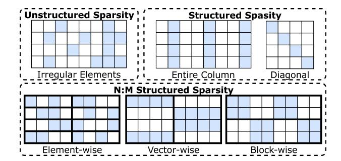
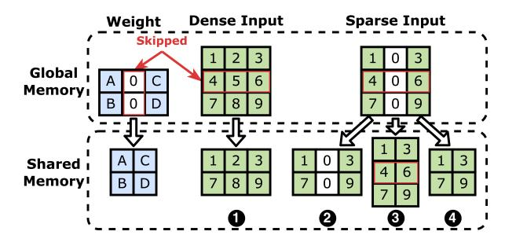

# 2 Background

### 2.1 Mixture-of-Experts (MoE)

Figure 1. MoE LLM Architecture.

The typical MoE-based models, as shown in Figure [1,](#page-1-0) consist of multiple Transformer Blocks[\[23,](#page-14-3) [35,](#page-14-2) [47,](#page-15-7) [57\]](#page-15-8). Each block includes attention, MoE and normalization layers. Within the MoE layer, a routing mechanism selects appropriate experts for each token. Tokens are then processed by Multilayer Perceptron (MLP) layers with multiple linear projections, called

Figure 2. Time Breakdown of MoE Models. Left: Without Flash-Attention; Right: With Flash-Attention.

Figure 3. Data Patterns in Different Sparse Formats. Blank cells represent sparse elements.

experts. The outputs of these experts are then propagated to the final output through a weighted sum.

Unlike traditional models that compute across all activations, MoE models enhance efficiency by selectively activating experts, enabling the computation of partial activations to be skipped[\[61\]](#page-15-9). The MoE architecture is promising as it improves model generality without increasing demands on storage and computation resources[\[23,](#page-14-3) [35,](#page-14-2) [48\]](#page-15-10). Research demonstrates that MoE models achieve competitive performance to larger dense models[\[45\]](#page-15-11).

Numerous studies, such as Flash-Attention[\[19,](#page-14-10) [20\]](#page-14-11) and KV cache[\[43\]](#page-15-12), have optimized the attention layer, however, the MoE layer has received less focus. The execution time breakdown for a transformer block is illustrated in Figure [2.](#page-2-0) Notably, the MoE layer, in most models, accounts for over half of the total processing time. With Flash-Attention enabled, the proportion of time consumed by the MoE layer exceeds 80% in these models. This phenomenon underscores the urgent need for optimizations of the MoE layer to enhance overall model efficiency.

## 2.2 Sparse Data Formats

Sparse computation employs different formats for data representation, providing a more efficient alternative to dense formats. These formats can be broadly categorized into two types: unstructured and structured, as illustrated in Figure [3.](#page-2-1) Unstructured formats such as Coordinate List (COO) and Compressed Sparse Row (CSR) organize non-zero elements without constraints of regular patterns. However,

Figure 4. 2:4 Sparse Encoding and Mapping for SpTC.

this flexibility complicates GPU processing as it impedes efficient parallel execution. Structured formats, which organize data into regular patterns like columns or diagonals, allow for efficient GPU processing but potentially lose critical features[\[26,](#page-14-7) [39,](#page-15-4) [42\]](#page-15-5).

N:M structured sparsity[\[31,](#page-14-12) [37,](#page-14-8) [52\]](#page-15-13) format imposes additional constraints on structured formats by requiring the retention of N units within every contiguous set of M units. These units can vary in granularity, ranging from individual elements to vectors or blocks, as illustrated in Figure [3.](#page-2-1) This format offers predictable patterns that facilitate efficient hardware implementation on accelerators, without compromising the flexibility and capability of feature representation. Given these advantages, our discussion will primarily focus on the N:M structured sparsity format.

## 2.3 Sparse Tensor Core (SpTC)

NVIDIA has introduced the third-generation Tensor Cores in its Ampere architecture GPUs, which can exploit the finegrained sparsity in model parameters[\[40\]](#page-15-6). The 2:4 sparse matrix multiplication operations are efficiently executed on SpTC, as illustrated in Figure [4.](#page-2-2) The original sparse matrix of size × is encoded into a non-zero data matrix and a 2-bits metadata matrix. The data matrix compresses all non-zero values into a dense format and the metadata matrix records the positions of non-zero elements in each contiguous set of 4 elements. NVIDIA's cuSPARSELt library provides kernels that support this format, enabling efficient compression and sparse operations[\[6\]](#page-13-2). Other GPU vendors also implement similar sparse arithmetic logic unit (ALU) in their products, such as the CDNA3 series GPUs (Instinct MI300) from AMD[\[3\]](#page-13-5). Additionally, modern deep learning frameworks such as PyTorch[\[2\]](#page-13-6) and compilers like LLVM[\[1\]](#page-13-7) now support specific data types, operators, and intermediate representations for 2:4 sparsity, further illustrating its widespread application. Besides existing kernels, programmers can utilize the SpTC in CUDA using the mma.sp instruction provided by Parallel Thread Execution (PTX) Instruction Set Architecture (ISA) since version 7.0, which provides the flexibility to customize kernels for various formats.

Figure 5. Redundancy in Data Flow of the MoE layer.

#### 3 Motivation

#### 3.1 Redundancy in Data Flow

In the MoE layer, input tokens I are routed and subsequently assigned to a subset of available experts. As illustrated in Figure 5, the initial input tensor is permuted into several new tensors, each corresponding to a certain expert. Specifically, the input tensor for expert  $E_i$  contains all the tokens that have been routed to  $E_i$ . The output of expert  $E_i$  is then propagated to a new tensor that matches the size of I, ensuring that the dimension of the MoE layer output aligns with the dimension of the original input.

During the input permutation phase, the creation of extra intermediate tensors necessitates additional memory management tasks, including *memory allocation* and *data movement*, thereby increasing the processing overhead. In the weighted un-permutation phase, the outputs of the experts are initially transferred from registers to the global memory on GPUs. Subsequently, the element-wise product operation reloads these outputs from global memory back into the registers. This *additional memory I/O* within GPUs introduces significant overheads, impacting overall performance efficiency. Therefore, these overheads necessitate a customized kernel capable of efficiently handling the sparsity in inputs.

## 3.2 Redundancy in Model Parameters

Recent research[13, 18, 24] has demonstrated redundancy in model parameters. In response, researchers have developed various sparse formats to accelerate the computing process by omitting the computation of redundant parameters.

With unstructured sparse formats like COO and CSR, individual parameters are removed based on their importance. Existing GPU kernels designed for these unstructured formats are primarily optimized for high-performance computing (HPC) applications, where the sparsity ratio often exceeds 95%[5, 14]. In contrast, sparsity ratios in LLMs typically fall between 50% and 90%[37]. Consequently, employing these unstructured formats in LLMs does not guarantee performance improvement, as the computational savings are often mitigated by the substantial overhead of decoding[40]. With structured sparse format, parameters in different patterns are removed by group. While this format provides significant performance improvements in computation, it also limits the expressiveness of the model and reduces accuracy.

Figure 6. Inefficient Memory Access when Input is Sparse. 

● illustrate the dense scenario. ● and ● lead to I/O amplification, while ● causes uncoalesced memory access.

Fortunately, the N:M structured sparse format provides both the benefits of these two formats. It has been demonstrated to have a negligible impact on the accuracy of LLMs with 50% or even larger sparse ratio[11, 15, 24, 40]. Meanwhile, hardware manufacturers like NVIDIA also provide hardware units (e.g. SpTC) to further accelerate the computation process. Therefore, to reduce the cost of computing redundant model parameters, kernels should be capable of handling this N:M structured sparse format.

