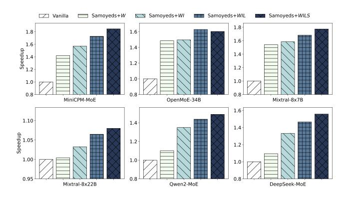

# 6.3 End-to-End Model Evaluation

We benchmark the end-to-end performance of Samoyeds and the baselines on various real-world leading MoE LLMs shown in Table [2.](#page-8-1) To accommodate the memory capacity constraints of GPUs, we measure the performance of a single decoder layer. This is justified by two observations: (1) prevalent MoE LLMs are decoder-only, with decoder layers accounting for over 90% of the total execution time and (2) the decoder layers share similar architectures and sizes, leading to comparable execution times. Notably, the input

Figure 16. Throughput under Different Batch Sizes.

for Samoyeds and other baselines remains consistent, ensuring identical routing distributions and guaranteeing a fair comparison.

6.3.1 Overall Model Performance. We initially compare the overall performance of these models using Samoyeds and other baselines, with a default sequence length of 4096 and a batch size of 1. For the OpenMoE-34B, we adjust the sequence length to 2048 due to its maximum sequence length constraints. Additionally, for DeepSeek-MoE and Qwen2- MoE, we increase the batch size to 16 to leverage the larger number of experts within these models. MegaBlocks and vLLM-DS are not supported in OpenMoE-34B due to incompatibility. Meanwhile, they both fail to complete processing Mixtral-8×22B due to OOM errors.

As illustrated in Figure [15,](#page-10-2) Samoyeds significantly outperforms all competing baselines. In particular, Samoyeds achieves a remarkable speedup of up to 2.36× (1.42× on average) compared to Transformers. Additionally, it delivers speedup of up to 1.31× and 1.30× relative to MegaBlocks and the SOTA baseline vLLM-DS, respectively. These results highlight the effectiveness of our optimization strategies in enhancing performance.

6.3.2 Throughput with Different Batch Sizes. We explore the throughput of various models across different batch sizes, as illustrated in Figure [16.](#page-10-3) For models equipped with smaller expert configurations, including Qwen2-MoE and DeepSeek-MoE, we maintain a sequence length of 4096 per batch. Conversely, for other models featuring larger experts,

**Table 3.** Maximum Batch Sizes for MoE Models.

| Model         | Transformers | MegaBlocks | vLLM-DS | Samoyeds | Boost over the Best Baseline |
|---------------|--------------|------------|---------|----------|---------------------------------|
| MiniCPM-MoE   | 118          | 89         | 91      | 123      | 1.04×                           |
| OpenMoE-34B   | 3            | -          | -       | 56       | 18.67×                          |
| Mixtral-8×7B  | 62           | 36         | 36      | 86       | 1.38×                           |
| Mixtral-8×22B | 30           | 0          | 0       | 53       | 1.77×                           |
| Qwen2-MoE     | 35           | 28         | 28      | 44       | 1.26×                           |
| DeepSeek-MoE  | 22           | 21         | 21      | 52       | 2.36×                           |

we reduce the sequence length to 1024 per batch to provide a clearer insight into throughput trends with increasing batch sizes. OpenMoE-34B is not supported by MegaBlocks and vLLM due to incompatibility.

Our method, Samoyeds, shows superior throughput compared to other baselines across a variety of configurations and batch sizes. Specifically, Samoyeds achieves significant speedups over the best baseline in all models as batch size increases. The speedup of different models is up to 1.31×, 2.23×, 1.58×, 1.09×, 1.04×, and 1.11×, compared to the best baseline, respectively. Notably, the throughput using MegaBlocks and vLLM-DS shows minimal fluctuation along with batch size increasing, in contrast, the throughput using Samoyeds method increases significantly before reaching a stable peak. The underlying reason for these observations is the improved parallelism as discussed previously in §6.1.2.

Furthermore, as illustrated in Table 3, the maximum batch size supported by Samoyeds exceeds that of other methods. Compared to Transformers, Samoyeds supports a significantly wider range of batch sizes (4.41× larger on average). Interestingly, the boost in maximum batch size of OpenMoE-34B is exceptionally higher, likely due to its unique computation process compared to other models. Notably, although approaches like MegaBlocks and vLLM-DS can accelerate model execution over Transformers, the maximum batch size supported for these approaches significantly decreases. They even fail to complete computations for Mixtral-8×22B with the batch size set to 1. This finding highlights the superior efficiency of Samoyeds in memory utilization, which in turn enhances its ability to process more batches concurrently.

## 6.4 Breakdown Analysis

In this section, we break down the performance enhancements brought by Samoyeds. *Vanilla* represents the standard Transformers framework. Then the optimizations are enabled step by step as illustrated in Figure 17.

We first enable leveraging sparsity in model weights, denoted as Samoyeds+W, by utilizing the kernel for sparsedense matrix multiplication. The introduction of weight pruning (Samoyeds+W), discussed in §3.2, results in an average speedup of  $1.27\times$  over Vanilla, peaking at  $1.54\times$ .

**Figure 17.** Breakdown Analysis on Samoyeds Optimizations. Methods are denoted by abbreviation letters. *W*: weight sparsity, *I*: input sparsity, *L*: data layout, *S*: data stationary.

Next, we eliminate the redundancy in data flow, labeled as Samoyeds+WI, by adopting the sparse-sparse matrix multiplication kernel. By eliminating the input permutation overhead, discussed in §3.1, Samoyeds+WI enhances performance by 1.39× on average compared to the Vanilla method. This configuration also outperforms Samoyeds+W in all tested models, with speedups reaching up to 1.23×. Notably, models with more experts, such as Qwen2-MoE and DeepSeek-MoE, experience a greater performance benefit due to their amplified performance loss from input permutation.

Furthermore, we evaluate the benefits of reducing transposition overhead, denoted as Samoyeds+WIT. With this graph-level optimization as previously discussed in §4.5, Samoyeds+WIT improves performance by up to  $1.08\times$  on average compared to Samoyeds+WI.

Finally, we incorporate the data stationary optimization referred to as *Samoyeds+WITS*. Overall, the increased data reuse, as discussed in §4.3, delivers an average speedup of 1.04× over the *Vanilla* approach.

#### 6.5 Accuracy Assessment

In this section, we first prune the model using the proposed Samoyeds sparse format to evaluate model accuracy. The inference solutions proposed in Samoyeds are fully decoupled from the pruning process, enabling seamless integration with SOTA pruning method such as WoodFisher[50], which is based on second-order pruning and SparseGPT[24], which operates without gradient information. In our experiments, we use the WoodFisher method provided by the SparseML framework. Notably, WoodFisher incurs significantly higher memory usage during pruning compared to other methods. Therefore, we select the most representative models within the models that are feasible under a limited memory budget, including Bert, Tiny-LLaMA and Qwen2-1.5B. Moreover, as demonstrated in prior research[24, 40, 50], maintaining accuracy during pruning is more challenging for smaller models, making them a compelling choice for evaluating

**Table 4.** F1 Score of Bert-Series Models pruned with different Samoyeds configurations on SQuAD 1.1 (higher is better).

| Model      | Dense | (1,2,16)           | (1,2,32)     | (4,8,32) | (8,16,32) |
|------------|-------|--------------------|--------------|----------|-----------|
| Bert-base  | 89.50 | <b>88.83</b> 88.26 | 88.48        | 88.57    | 88.60     |
| Bert-large | 88.86 |                    | <b>88.66</b> | 88.25    | 88.51     |

**Table 5.** Perplexity of Models pruned into different formats on GSM8K (lower is better).

| Model      | Dense | Unstructured | VENOM | Samoyeds |
|------------|-------|--------------|-------|----------|
| Tiny-LLaMA | 1.72  | 1.94         | 1.95  | 1.82     |
| Qwen2      | 1.92  | 1.96         | 2.26  | 2.01     |

**Figure 18.** Performance with **Figure 19.** Performance Com-Direct Porting. parison with PIT.

the effectiveness of our approach. To ensure fairness, a uniform sparsity ratio of 75% is enforced across all methods, excluding the dense baseline.

First, we analyze model accuracy across different sparse configurations. The sparse format is denoted as (N,M,V), corresponding to the structured sparse granularity configuration introduced in Section 4.1. As shown in Table 4, the accuracy of BERT models remains stable under varying sparse configurations. On the SQuAD 1.1 task, the Samoyeds sparse format retains over 99.3% of the original accuracy on average. Additionally, the accuracy of models pruned with Samoyeds sparse format is comparable to that of dense models and those pruned with unstructured methods (magnitudebased)[27, 28]. As shown in Table 5, the increase in perplexity for the GSM8K text generation tasks is only 0.06 and 0.05 for the Tiny-LLaMA-1B and Owen2-1.5B models, respectively. Notably, models pruned with the Samoyeds sparse format outperform those pruned with the SOTA structured pruning method, VENOM[12], by 56% and 73%, respectively.

## 6.6 Performance Portability Analysis

In this section, we assess the performance portability of Samoyeds across various hardware platforms with similar micro-architectures, including NVIDIA 3090, 4070 Super, 4090 and A100 40G GPUs. We directly port the kernel implementation on 4070S to other hardware and evaluate the performance using the synthetic dataset from §6.1.1, which contains 238 distinct problem sizes. As shown in Figure 18,

**Table 6.** Performance Portability under Suggested Adaptations. The results show the percentage of the synthetic set with improved, unchanged, or degraded performance after applying the adaptation.

| Portin Targe |                          | Adaptation  | Per Improved | f. Impact on Ca Unchanged | ases Degraded |
|-----------------|--------------------------|-------------|-----------------|------------------------------|------------------|
| A100            | SM↑ L2 Cache↓         | Tile Size ↓ | 55.9%           | 5.5%                         | 38.6%            |
| 3090            | Slower TC Bandwidth ↑ | Stage Num ↑ | 39.1%           | 49.6%                        | 11.3%            |

Samoyeds maintains 65.2% of its relative speedup over cuS-PARSELt on average, with 41.0% retained in the worst-case scenario. In contrast, VENOM loses 95% relative speedup on A100, exhibiting almost no improvement compared to cuSPARSELt. This performance discrepancy stems from two key factors: (1) While vendor libraries (e.g., cuBLAS, cuS-PARSELt) employ hardware-specific kernel configurations across different GPUs, both VENOM and Samoyeds are primarily optimized for their native development platforms. This architectural specialization inevitably diminishes their performance gains when deployed on different hardware. (2) VENOM suffers from memory-computation imbalance when porting to A100 as this GPU is equipped with higher memory bandwidth but slower tensor cores, which increases pipeline stalls during execution. However, Samoyeds mitigates this imbalance through its sparse memory access paradigm, leading to better portability when porting to A100.

Additionally, we further explore the potential adaptation rules to improve the performance given different hardware configurations. Specifically, the tiling size hyper-parameter affects the utilization of streaming multiprocessors (SMs) in parallel and the L2 cache hit rate. Meanwhile, the tensor core processing speed and memory bandwidth can affect the overlapping of the pipeline stages. As illustrated in Table 6, we propose several suggested adaptations for porting to different devices and evaluate the performance with and without these adaptations using the synthetic set described in §6.1.1. For instance, A100 GPU features more SMs but has a smaller L2 cache compared to 4070S. To fully exploit the parallelism of A100 and improve the L2 cache hit rate, it is suggested to employ smaller tiling sizes, which can lead to a performance boost in 55.9% of the tested cases.

## 6.7 Comparison with Compiler for Dynamic Sparsity

In this section, we compare the performance of Samoyeds against the SOTA compiler-based solution, PIT[59], which is specifically designed to leverage the dynamic sparse pattern that emerges in the execution of LLMs. It aggregates multiple sparse micro-tiles into dense tiles with its *Permutation Invariant Transformation*, improving overall GPU utilization. Figure 19 illustrates the normalized speedup of the MoE layer with different batch sizes and expert numbers.

Samoyeds outperforms PIT by 1.15× to 1.27×, depending on the configuration.

It should be noted that while PIT claims theoretical support leveraging the sparsity pattern along three dimensions for matrix multiplication, its practical implementation is limited to permutation along one dimension. Furthermore, PIT does not integrate the SpTC hardware into its compiler to further leverage the sparse computing capability of hardware. Consequently, PIT can only exploit the sparsity pattern that dynamically emerges in activations, which makes Samoyeds naturally outperform PIT, as demonstrated in our evaluation.

