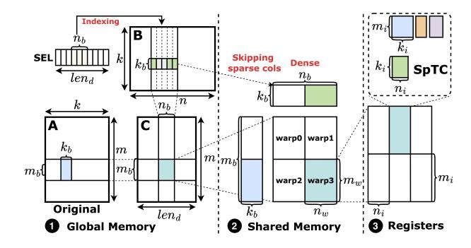
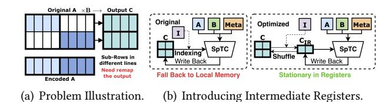
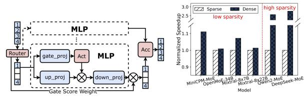
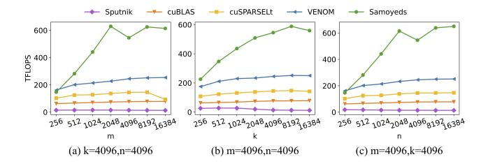

# <span id="page-4-2"></span>4.1 Dual-sided Sparse Data Format and Kernel Scheme

As discussed in §3.3, existing structured sparse data format can result in uncoalesced memory access or memory I/O amplification, thereby degrading overall kernel performance. Samoyeds firstly introduces a novel structured sparse format specifically tailored for sparse-sparse matrix multiplication in MoE computation, employing distinct sparsity patterns for weight and input matrices, as illustrated in Figure 7.

For weight matrices, the sparse pattern integrates 2:4 element-wise and vector-wise structured sparsity. Samoyeds employs the 2:4 pattern to align with the ISA requirements of the SpTC, leveraging the superior speedup of sparse ALU. Given that the 2:4 pattern enforces a fixed sparsity ratio of 50%, an additional sparse pattern is required to provide greater flexibility. The granularity of the added sparse pattern should be more coarse-grained to preserve the prior 2:4 element-wise sparse pattern. Prior studies[37] have proven block-wise sparsity is too coarse-grained to preserve model accuracy. Therefore, Samoyeds adopts vector-wise sparsity alongside the existing 2:4 sparsity, striking a balance between representation flexibility and accuracy preservation.

```
Algorithm 1: Samoyeds Kernel Scheme
   // Inputs in Samoyeds sparse format.
                                                     // Optimized Layout
   Input: A, Indices, Metadata, B, SEL
  Output: C
3 Init shared memory for A, Indices, B, SEL;
4 Init registers for A, Indices, Metadata, B, SEL, C;
5 Load All SEL from GMEM to SMEM;
   fetch \leftarrow 0;
7 for compute = 0 to \frac{k}{k_b} do
        Load Metadata from GMEM to Register;
                                                               // Packing
8
        while fetch < compute + num_{pipe} and fetch < \frac{k}{k_b} do
             // Fetch Stage
11
             Load I, A, B from GMEM to SMEM;
                                                                 // Tiling
12
             Commit group for pipeline;
             Increase fetch;
13
14
        end
        Wait group for pipeline;
15
        // Compute Stage
16
17
        Load I, A, B from SMEM to Register;
                                                                 // Tiling
        if compute \equiv 0 \pmod{\frac{V}{k_h}} then
18
19
             Shuffle C Register
                                                      // Data Stationary
20
        end
        Sparse MMA computations:
22 end
  Store C from Register to GMEM
                                                     // Optimized Layout
```

The weight sparse pattern is shown on the left of Figure 7. The original weight data is segmented into structured sparse blocks of size  $M \times V$ . Each vector within a block, termed as a Sub-Row, contains multiple SpTC units. Within each block, only N Sub-Rows are retained, while the others are pruned, where N depends on the target sparse ratio. The SpTC units within the selected Sub-Row are further pruned to conform to the sparse pattern supported by the hardware.

Based on the defined sparse pattern, the original weight is encoded into three components: data, indices, and metadata. The data matrix, with the shape of  $\frac{m}{M} \times \frac{k}{2}$ , serves as a compressed representation of the original sparse matrix of size  $m \times k$ . The compression ensures that elements are ordered sequentially, enabling GPU-friendly decoding during computation. The indices matrix, with size  $\frac{m}{M} \times \frac{k}{V}$ , captures the relative positions of the retained Sub-Rows within their respective blocks. Meanwhile, the metadata matrix, with size  $\frac{m}{M} \times \frac{k}{2}$ , details the sparse pattern for each SpTC unit. Notably, each item within the metadata matrix is encoded into 2-bits as required by the SpTC hardware specifications.

The input data sparse pattern, illustrated on the right of Figure 7, introduces a selection array (*SEL*) and encodes the columns in vector-wise sparsity way. Notably, this design naturally aligns with the sparsity pattern presented in token routing, ensuring mathematical equivalence with the original computation process.

To unleash the potential of the proposed sparse data format, Samoyeds customizes a GPU kernel to accelerate computation. The pseudo-code of the kernel is described in Algorithm 1. After receiving the encoded sparse input, the kernel begins with an initialization phase, followed by the fetch stage (line 10-13), where data is loaded from global

<span id="page-5-0"></span>

Figure 8. Tiling Strategy for GPU Memory Hierarchy.

memory to shared memory using the non-blocking *cp.async* instruction. This asynchronous copy operation is then committed in group. Next, in the compute stage (line 16-21), the kernel invokes the wait method for a specific group and synchronously loads data from shared memory into registers according to the predefined tiling size. Once all data are in place, the *mma.sp* instruction triggers SpTC to perform sparse computation. These two stages (fetch and compute) are efficiently overlapped using a pipeline mechanism. At the end of the kernel execution, the output matrix *C* is transferred from the registers back to global memory.

Notably, while our kernel scheme aligns with the typical execution flow of matrix multiplication kernel, adapting it to the unique Samoyeds data format and orchestrating various kernel optimization techniques—such as tiling, data stationary, packing, and optimized layout—is a non-trivial task. The following sections provide a detailed description of the optimizations implemented in Samoyeds to enhance performance.

#### 4.2 Enhanced Data Locality with Tiling

Tiling is a widely used technique in GPU kernel design that partitions data into equal-sized subsets to exploit data locality. By leveraging the multi-level memory hierarchy of GPUs, this approach significantly enhances memory access efficiency, reducing data-loading latency and increasing computational throughput. However, the Samoyeds data format encodes the original matrix into multiple matrices, fundamentally altering the data access patterns. Therefore, orchestrating an effective tiling strategy for these matrices becomes a non-trivial task.

As illustrated in Figure 8, we introduce a three-step tiling strategy to optimize Samoyeds kernel. Considering a  $m \times k \times n$  matrix multiply problem, denoted as  $C = A \times B$ . Notably, only  $len_d$  columns from matrix B are selected for computation, which are recorded in the selection array. For clarity, matrix A is presented in its original, non-encoded format. In step  $\mathbf{0}$ , each thread block is responsible for computing a tile of size  $m_b \times n_b$  in matrix C. During each iteration, data in the global memory is further partitioned along the k dimension. Each

<span id="page-5-1"></span>

<span id="page-5-2"></span>Figure 9. Data Stationary Optimization for Output Matrix.

thread block then loads segments of matrices A ( $m_b \times k_b$ ), B  $(k_b \times n_b)$  into shared memory. Note that although the tiling size for matrix B specifies  $n_b$  columns, the original layout in global memory includes more columns than  $n_b$  due to the omission of sparse columns. Only the columns identified by the mapping in the selection array are actually loaded, ensuring an efficient use of memory resources. In step 2, the output of matrix C is segmented and assigned to several warps, with each warp handling a tile size of  $m_w \times n_w$ . Given that threads in modern GPUs are organized into scheduling units called warps, each warp loads the corresponding sections of matrices A and B from shared memory into thread registers. In step **3**, these registers are further partitioned to align with the requirements of the SpTC hardware. The SpTC is then invoked to compute the output size of  $m_i \times n_i$  for acceleration. Moreover, since the metadata matrix, encoded in 2 bits, is relatively small, applying 3-step tiling leads to inefficient memory access on GPUs. Therefore, it skips the innermost tiling step and is loaded directly into registers. Similarly, the indices matrix is loaded using the 3-step tiling scheme but with a larger tiling size than the corresponding matrix A to enhance memory efficiency.

The selection of the tiling size requires careful consideration of multiple factors from various perspectives. First, hardware specifications impose constraints on the tiling size. Specifically, the values of  $(m_i, k_i, n_i)$  must comply with the requirements of the *mma.sp* instruction. Additionally, in the three-step tiling scheme, the amount of data loaded into shared memory and registers is bounded by available hardware resources. Second, while a larger tiling size improves data locality during kernel execution, a smaller tiling size increases parallelism by dividing the matrix into more execution units, thereby enhancing GPU hardware utilization. Consequently, a trade-off must be carefully balanced based on the specific problem size. Third, when integrated into MoE models, an excessively large subrow size V may degrade model accuracy. Additionally, the tiling size  $K_b$  for the reduction dimension K is constrained by V. Therefore, we employ a larger tile size in non-reduction dimensions (M and N) to improve data reuse while keeping  $K_b$  relatively small to avoid accuracy loss. Additionally, for models with more experts, the tiling size for N dimension should be reduced to avoid potential padding overhead or degraded hardware efficiency.

#### <span id="page-6-1"></span>4.3 Maximized Data Reuse with Data Stationary

Data stationary refers to the strategy of pinning data elements in faster memory hierarchy throughout the tiling loops. However, given that Samoyeds encodes data in a unique format, directly applying existing designs can result in suboptimal choices for stationary locations, potentially resulting in degraded kernel performance.

In matrix multiplication, the input matrices *A* and *B* are read-only. In contrast, the output matrix *C* requires both reading and writing in each tiling iteration. Thus, a well-established design approach[55] is keeping the input data in shared memory and maintaining the output data in registers.

However, when iterating on reduction along the k dimension, the Sub-Rows may span across different lines between sparse blocks, as illustrated in Figure 9(a). This presents a new challenge: when the tiling window shifts from one Sub-Row to another, the output of the SpTC must be remapped to different rows. Thus, when invoking the mma.sp instruction, it is crucial to carefully select the output registers based on the mappings recorded in the indices matrix to ensure the correctness of the computation. However, simply passing the indexed output to the instruction can result in the stationary location of output C falling back to local memory on GPU, as shown on the left of Figure 9(a), which will significantly reduce the kernel performance.

To address this challenge, we introduce additional intermediate registers  $C_{IR}$ , as shown on the right of Figure 9(b). All registers storing C are initialized to zero at the beginning of kernel execution. Stored C data is shuffled with  $C_{IR}$  according to the indices matrix every  $\frac{V}{k_b}$  iteration, which corresponds to the point when the tiling window shifts from one Sub-Row to another. This optimization minimizes frequent memory transfers between global memory and registers, thereby enhancing overall kernel performance with mathematical correctness.

Besides, Samoyeds adopts operator fusion to further enhance data reuse by improving cache utilization, eliminating intermediate results, increasing locality, and reducing data movement. This technique allows the succeeding operator to utilize the results of the preceding operator without roundtrips to global memory. Specifically, the activation function and its precedent operator are fused. Furthermore, the weighted accumulation operation, which contains a broadcast of scalar data and dot multiplication, is fused with matrix multiplication.

#### 4.4 Coalesced Memory Access with Data Packing

Data packing is a commonly used technique to enhance kernel performance by enabling coalesced memory access and maximizing memory bandwidth. However, the effectiveness of this technique is closely tied to the data representation

<span id="page-6-0"></span>

| Мар    | <b>Mapping:</b> $[row\_idx, col\_idx] \longrightarrow [\frac{col\_idx}{16} \times 8 + row\_idx \frac{\sqrt{8}}{8}, \frac{row\_idx}{8} \times 16 + col\_idx \frac{\sqrt{16}}{16}]$ |                       |                       |                       |                 |   |               |                 |                       |
|--------|-----------------------------------------------------------------------------------------------------------------------------------------------------------------------------------|-----------------------|-----------------------|-----------------------|-----------------|---|---------------|-----------------|-----------------------|
| Column | 03                                                                                                                                                                                | 47                    | 811                   | 1215                  | 1631            |   | Column<br>Row | 015             | 1631                  |
| 0      | T <sub>0</sub> [30]                                                                                                                                                               | T <sub>0</sub> [74]   | T <sub>0</sub> [118]  | T <sub>0</sub> [1512] | <del>-</del>    | - | ,0+           | T₀[150]         | T <sub>0</sub> [3116] |
| 1      | T <sub>4</sub>                                                                                                                                                                    | T <sub>4</sub>        | T <sub>4</sub>        | T <sub>4</sub>        | T <sub>5</sub>  | Ш | 1             | T <sub>4</sub>  | T <sub>4</sub>        |
|        |                                                                                                                                                                                   |                       |                       |                       |                 | Ш |               |                 |                       |
| 7      | T <sub>28</sub>                                                                                                                                                                   | T <sub>28</sub>       | T <sub>28</sub>       | T <sub>28</sub>       | T <sub>29</sub> | Ш | 7             | T <sub>28</sub> | T <sub>28</sub>       |
| 8      | T₀[1916]                                                                                                                                                                          | T <sub>0</sub> [2320] | T <sub>0</sub> [2724] | T <sub>0</sub> [3128] | T,              | - | 8             | Ť,              | T,:                   |
| 9      | T <sub>4</sub>                                                                                                                                                                    | T <sub>4</sub>        | T <sub>4</sub>        | T <sub>4</sub>        | T <sub>S</sub>  | Ш | 9             | T <sub>5</sub>  | T <sub>5</sub>        |
|        |                                                                                                                                                                                   |                       |                       |                       | 1               |   |               |                 |                       |
| 15     | T <sub>28</sub>                                                                                                                                                                   | T <sub>28</sub>       | T <sub>28</sub>       | T <sub>28</sub>       | T <sub>29</sub> |   | 15            | T <sub>29</sub> | T <sub>29</sub>       |
|        | (a) SPTC View                                                                                                                                                                     |                       |                       |                       |                 |   | (b)           | Memory V        | iew                   |

**Figure 10.** Packing Strategy with Reorganized Metadata.

format. Our newly proposed Samoyeds sparse format differs significantly from existing sparse formats, posing challenges for directly integrating existing optimizations into the Samoyeds kernel. Additionally, the data must be organized to align with the SpTC specifications, requiring customized packing designs. Samoyeds introduces a data packing strategy that optimally arranges the storage of data matrices *A* and *B*, as well as metadata.

According to the SpTC specification, the data of each thread is not contiguous in input matrices. For matrix A, data is packed in global memory according to the matrix format, and the transfer from global memory to shared memory conforms to the 128-bit memory transactions of modern GPUs. Compliance with the SpTC specification is achieved during transferring from shared memory to registers by invoking *ldmatrix* instructions. Additionally, data in shared memory is arranged with permutation to prevent bank conflicts. Considering matrix B, which retains row contiguity and exhibits column sparsity, we pack it with transposition in global memory. This transposition allows for contiguous memory access within rows and enables skipping over rows with zero values, optimizing memory bandwidth utilization through coalesced memory access. The approach for packing matrix *B* in shared memory and transferring data to registers mirrors that of matrix A.

However, for the metadata matrix, each element is encoded into the 2-bits format, incompatible with the specification of *ldmatrix* instruction. For efficient memory access, we propose a special packing format for the metadata matrix. Taking the mma.sp.m16n8k32 instruction for example, the metadata in bfloat type occupies a 32-bits register containing 16 2-bits vectors from the view of SpTC, as shown in Figure 10(a). We need to concatenate four consecutive metadata into a 16-bit metadata block and iterate twice to fill the 32-bits register. To avoid missing in the L2 cache, our proposed metadata packing for continuous access on device memory is shown in Figure 10(b). To be specific, the metadata is a 2-bits matrix with a size of 16×16. The element with location of [row\_idx, col\_idx] is mapped to the location of  $[row\_idx\%8 \times 2 + \frac{col\_idx}{8}, col\_idx\%8 + \frac{row\_idx}{8} \times 8]$ . Having got the new data mapping, the metadata loading for each thread is aligned to 32-bits, which is consistent with the 32-bits memory transactions of GPUs.

<span id="page-7-0"></span>

- (a) Output Sparsity in MoE Layer.
- <span id="page-7-1"></span>(b) Kernel Performance Improvement Optimized Output Layout.

Figure 11. Layout Optimization for Kernel Output.

## <span id="page-7-3"></span>4.5 Reduced Memory I/O with Optimized Layout

The data layout is crucial for optimizing GPU kernels, as an efficient layout reduces memory I/O and enhances computational performance. However, the constraints imposed by hardware instructions, combined with the sparsity inherent to the MoE computation, introduce additional challenges for data layout design. These limitations make existing solutions inefficient in such scenarios, necessitating specialized optimizations in the data layout.

Traditionally, the linear layer performs the operation xW, where x represents the input and W denotes the model weights. To align with SpTC hardware requirements, this computation is restructured to  $(W^T x^T)^T$ , where T denotes the matrix transpose operation. This transformation can significantly increase I/O volume across the memory hierarchy of GPUs. To mitigate this overhead, Samoyeds employs the three-step layout optimization for operands of kernels. Firstly, the transposition of the W matrix is performed during the offline model pruning phase, eliminating the memory I/O of transposition. Secondly, the input x for the MoE layer typically shows sparsity by row, corresponding to the token routing results, which allows for efficient contiguous storage in row-major format. Transposing this input prior to matrix multiplication would result in inefficient, scattered memory accesses, amplifying memory I/O. To address this, the transposition of the input is efficiently executed within the kernel as data transfers from global to shared memory, leveraging the hardware fast path feature of GPUs. Besides, the output transposition is integrated within the kernel, further minimizing memory I/O and boosting computational efficiency.

As shown in Figure 11(a), a typical expert layer consists of three linear layers: <code>gate\_proj</code>, <code>up\_proj</code>, and <code>down\_proj</code>. The token routing mechanism selects a subset of the input for each expert and aggregates the outputs from all experts with weighted accumulation (<code>Acc</code>). While the final output of the MoE module is dense after accumulation, the intermediate results within each expert exhibit a row-wise sparse pattern, with the sparsity ratio determined by the number of experts. This sparsity can lead to unnecessary memory transfers of zero values, causing performance degradation. To address

<span id="page-7-2"></span>**Table 1.** Hardware Support for Samoyeds on Prevalent GPUs.

|             |              | Mandatory     | Optional                    |                          |  |
|-------------|--------------|---------------|-----------------------------|--------------------------|--|
| GPU         | Architecture | Sparse<br>ALU | Asynchronous<br>Memory Copy | Collective<br>Load/Store |  |
| NVIDIA A100 | Ampere       | 1             | 1                           | 1                        |  |
| NVIDIA 4090 | Ada Lovelace | 1             | ✓                           | ✓                        |  |
| NVIDIA H100 | Hopper       | 1             | ✓                           | ✓                        |  |
| AMD W7900   | RDNA3        | X             | <b>X</b> *                  | <b>X</b> *               |  |
| AMD MI300   | CDNA3        | ✓             | <b>X</b> *                  | <b>X</b> *               |  |

this issue, Samoyeds adopts a compressed output layout that aligns with the input sparse pattern described in  $\S 2.2$ . This optimized layout eliminates redundant data transfers while preserving the mathematical equivalence of the computation. The performance gain achieved with this layout across varying input sparsity ratios is demonstrated in Figure 11(b). For typical MoE model configurations, this optimization speeds up the kernel by  $1.05\times$  on average for models with low input sparsity and  $2.66\times$  for models with higher sparsity.

## 5 Implementation

#### 5.1 Kernel Implementation

The Samoyeds kernels are implemented in CUDA, utilizing the SpTC hardware with inline assembly *mma.sp* instructions from NVIDIA PTX ISA. These kernels are compiled into a dynamic library via the NVIDIA CUDA Compiler (NVCC), making them accessible to other programs. Additionally, the compiled executable is exposed as a Python module through module registration with pybind11.

## 5.2 Compatibility with Different Hardware

The mandatory requirement of the Samoyeds kernel is sparse ALU, which is specifically designed for matrix multiplications involving a sparse matrix with 2:4 structured sparsity and a dense matrix. Beyond the computational units, memory efficiency can also influence kernel performance. On the one hand, the pipeline mechanism, foundational to this implementation, leverages asynchronous data movement (e.g. cp.async) and concurrent kernel execution to enhance throughput. On the other hand, the efficiency of kernel execution is further augmented by collective load and store (e.g. ldmatrix), which orchestrate multiple threads—such as those encapsulated by wrap in CUDA and wave in ROCm.

The Samoyeds kernel can be effectively adapted to other accelerators equipped with the aforementioned features. As demonstrated in Table 1, the Samoyeds kernel is compatible with most prevalent GPUs, including NVIDIA GPUs that incorporate Ampere architecture or more advanced versions[8], as well as AMD GPUs that are equipped with

CDNA3 architecture[3], which all satisfy the mandatory requirement for sparse ALU. However, the lack of native support for asynchronous memory copy and collective matrix load/store operations on AMD GPUs may lead to degradation in memory efficiency and increased development effort. Despite the applicability, the optimized kernel configuration (e.g. pipeline stages and tiling size) can be distinct on different hardware, based on their difference in resources, including the number of clusters/processors, cache line size, and shared memory capacity. The relationship between kernel configuration and hardware specification will be further explored in §6.6.

#### 6 Evaluation

The performance of Samoyeds system is evaluated on 3 distinct levels, including kernel-level performance improvements (§6.1), the enhancements achieved within the MoE layer (§6.2), the speedup and batch size benefits in end-to-end scenarios (§6.3). A breakdown analysis is provided in §6.4. Additionally, the accuracy of models pruned with Samoyeds sparse format are assessed in §6.5. Finally, the performance portability is examined in §6.6.

**Evaluation Setup.** The evaluation is conducted on the platforms equipped with Intel i7-12700 CPU, 16G×2 DDR5 memory, running Ubuntu 22.04LTS and installed with CUDA 12.1, cuSPARSELt 0.4.0, PyTorch 2.1.0, Transformers v4.40.0 and vLLM 0.4.0.post1. The GPU used in the evaluation is NVIDIA GeForce RTX 4070 Super (except in §6.6). The CPU frequency scaling is disabled in all experiments for fairness.

**Baselines.** *Kernel level:* The baselines for kernel level performance evaluation consist of several SOTA dense and sparse kernel libraries, including *cuBLAS*[4], *Sputnik*[26], *cuSPARSELt*[6] and *VENOM*[12]. *cuBLAS* and *cuSPARSELt* are black-box vendor-specific libraries provided by NVIDIA, which are manually written and optimized with expertise and present the peak performance on NVIDIA GPUs for dense and structured sparse operations, respectively. *Sputnik* is a leading open source library targeting accelerating the sparse operations in deep learning applications maintained by Google. *VENOM*, proposed in late 2023, accelerates sparse matrix multiplication with SpTC hardware, providing 1.38× speedup compared to the cuSPARSELt library.

Model level: We compare Samoyeds against three leading solutions: Transformers[56], the most popular framework for computing LLM models, with the latest released version (v4.40.0, on April 18, 2024); MegaBlocks[25], which is specifically designed and optimized for block-sparse operations in MoE computations, surpassing solutions like Tutel[32] and Megaron-LM[49]; and vLLM-DS[9, 17] which provides a SOTA fused kernel for the MoE process. It should be noticed that baseline vLLM-DS integrates the recent implementation and optimization of a fused kernel for MoE models (merged on March 2, 2024), achieving approximately a 2.8×

**Table 2.** Configurations of MoE Models.

<span id="page-8-1"></span>

| Model         | Expert | Hidden Size | Intermediate Size | Config Num |
|---------------|--------|-------------|-------------------|------------|
| Qwen2-MoE     | 60     | 1408        | 2048              | CFG#1      |
| DeepSeek-MoE  | 64     | 1408        | 2048              | CrG#1      |
| MiniCPM-MoE   | 8      | 2304        | 5760              | CFG#2      |
| OpenMoE-34B   | 32     | 3072        | 12288             | CFG#3      |
| Mixtral-8×7B  | 8      | 4096        | 14336             | CFG#4      |
| Mixtral-8×22B | 8      | 6144        | 16384             | CFG#5      |

<span id="page-8-2"></span>

**Figure 12.** Kernel Performance Comparison on Synthetic and Realistic Benchmarks. The synthetic benchmark covers 238 sizes; the realistic benchmark reflects typical model sizes.

speedup compared with previous non-fusion version[7]. To ensure fairness, all experiments in model level employs Flash-Attention2 in the decoder layer.

#### <span id="page-8-0"></span>6.1 Kernel Performance

<span id="page-8-3"></span>**6.1.1 Overall Kernel Performance.** The overall kernel-level performance of Samoyeds is evaluated on the synthetic benchmark to reveal the benefits of Samoyeds in wide application scenarios, and the realistic benchmark to present the performance benefits when applied to specific models. The synthetic benchmark consists of 238 distinct cases, with dimensions m, k, and n ranging from 256 to 16384. The cases in the realistic benchmark are extracted from MoE LLMs as detailed in Table 2.

The results are illustrated in Figure 12, demonstrating that Samoyeds consistently outperforms other baselines. For synthetic benchmark, shown on the left of Figure 12, compared to the SOTA sparse matrix library VENOM, Samoyeds kernel exhibits a speedup of up to 1.99×. Furthermore, the relative speedup over cuBLAS, cuSPARSELt, and Sputnik reaches as high as  $5.44\times$ ,  $3.18\times$ , and  $18.76\times$ , respectively. The results on the realistic benchmark are shown on the right of Figure 12. Samoyeds provides an average speedup of 2.33× (peaking at 2.49×) compared to the best baseline, VENOM. Compared to kernel libraries cuBLAS and cuSPARSELt, Samoyeds achieves average speedups of 3.95× and 4.29×, respectively. Despite being specifically optimized for sparse operations in deep learning, Sputnik still shows poor performance because it fails to leverage the structured pattern of the sparse data and hardware features. In contrast, Samoyeds significantly outperforms Sputnik, delivering an average speedup of 33.02×.

It is noteworthy that, under CFG#5, the overall throughput of both Samoyeds and VENOM is lower than that observed

<span id="page-9-1"></span>

Figure 13. Throughput Trend with Varying Operator Size.

with other configurations. This performance degradation is mainly caused by the skewness between dimensions m and n, with m being substantially larger. This imbalance leads to decreased memory efficiency during computation, a corner case that could be mitigated with a more sophisticated tiling implementation. It also adversely affects the throughput of other baseline kernels. Despite this, Samoyeds still offers a significant speed advantage over cuBLAS and cuSPARSELt under CFG#5, where VENOM does not, achieving a speedup of  $2.47\times$  relative to VENOM. These findings underscore the efficiency and practical applicability of Samoyeds in realworld computing scenarios, demonstrating its superiority over existing approaches in handling MoE computations.

<span id="page-9-2"></span>**6.1.2 Throughput with Different Operator Sizes.** We investigate the performance trends of Samoyeds kernel by profiling the throughput as matrix dimensions increase. The results, as illustrated in Figure 13, demonstrate that Samoyeds consistently outperforms all other baselines across nearly all matrix sizes. When compared to the best baseline, VENOM, Samoyeds achieves a speedup of up to  $2.77\times$  within a varying range of dimension m, and up to  $2.34\times$  and  $2.58\times$  for dimensions k and n, respectively.

As operand sizes scale up, the throughput of Samoyeds kernel increases significantly before reaching the peak performance. The reason for this increment varies with dimension. For dimension k, the initialization and write-back overhead of the kernel remains constant, allowing these costs to be amortized over a growing number of reduction computations. Consequently, the throughput of Samoyeds asymptotically approaches its maximum value as shown in Figure 13(b). For dimensions m and n, the number of warps per kernel increases as the operand sizes get larger. This increase allows the hardware warp scheduler to select from a larger pool of active warps when the current warp stalls, thereby optimizing resource utilization. This is reflected in Figure 13(a) & 13(c), where throughput scales linearly with dimensions m and n before it reaches a peak, benefiting from increased parallelism. These trends highlight the efficiency and scalability of Samoyeds across a wide range of matrix dimensions, underscoring its robust applicability in scenarios that require high computational throughput.

Notably, when dimensions *m* or *n* are set to 256, Samoyeds slightly underperforms compared to VENOM due to the

limited parallelism available at this kernel size, which can be addressed by implementing smaller kernel tiling sizes. Additionally, unlike other baselines presenting stable peak performance across varying operand sizes, fluctuations occur in Samoyeds kernels because our kernel has not been specially adapted for corner cases, indicating the potential for further refinement in Samoyeds kernels. Moreover, as shown in Figures 13(a) and 13(c), the performance exhibits a slight decline when the corresponding dimension size is 4096. This behavior can be explained by two factors: (1) as the size increases from 2048 to 4096, scheduling more warps on each SM leads to L1 cache eviction when switching between warps, which significantly reducing the cache hit rate by 76.38%, thereby degrading overall performance; (2) when the size further increases to 8192, the larger problem size enables better scheduling opportunities and amortizes the tail wave overhead, resulting in a 5.90% increase in active warps per scheduler and improved performance.

## <span id="page-9-0"></span>6.2 MoE Layer Performance

The current SOTA LLMs that employ the MoE technique can be categorized into two types. The first type utilizes multiple experts with identical routing priorities, where each token is dispatched to specific experts based on routing outcomes. The second type incorporates several isolated shared experts alongside individually routed experts. This setup enforces all tokens to be processed by all these shared experts in addition to their assigned routed experts. Therefore, it is crucial to demonstrate the effectiveness of Samoyeds under these two distinct routing types.

Figure 14 shows the speedup achieved on the MoE layer compared to the original Transformers solution. The configuration of the size and number of routed experts aligns with model configurations in Table 2, with the number of tokens set as 4096. The left of the figure displays results for MoE layers incorporating two isolated shared experts, while the right shows results for MoE layers without shared experts.

With shared experts enabled, Samoyeds achieves an average speedup of 1.46×, peaking at 1.73× compared to the most widely-used Transformers. Additionally, it outperforms MegaBlocks and the SOTA baseline vLLM-DS, providing a speedup of up to 1.66× and 1.53×, respectively. Without shared experts, Samoyeds achieves an average speedup of 1.45× and peaks at 1.68× compared to Transformers. Furthermore, Samoyeds surpasses other baselines in most models, including vLLM-DS.

Notably, the *NS* marker denotes *Not Supported*, as the OpenMoE-34B features a distinct activation function within the MLP layer, which is incompatible with the specialized kernels provided by MegaBlocks and vLLM-DS. Additionally, the OOM (Out-of-Memory) marker indicates that the corresponding solution failed to complete the computing process due to memory constraints. Samoyeds underperforms slightly when applied in the Mixtral-8×22B, due to

<span id="page-10-1"></span>

Figure 14. Execution Speedup for the MoE Layer. NS indicates not supported due to kernel incompatibility with OpenMoE-34B. OOM denotes out-of-memory errors preventing execution completion.

<span id="page-10-2"></span>

Figure 15. Speedup in End-to-end Latency of MoE Models.

the skewness in expert size, a tiling corner case previously discussed in [§6.1.1.](#page-8-3) This issue could be mitigated by further implementing different tiling sizes. In the same configuration, MegaBlocks suffers from significant slowdowns, and vLLM-DS encounters OOM errors, which highlights the robustness of Samoyeds in these conditions.

Moreover, in Qwen2-MoE and DeepSeek-MoE without shared experts, the speedup advantage of Samoyeds is less evident when compared to MegaBlocks and vLLM. This reduced performance can be attributed to two factors. Firstly, the smaller size of experts in these models results in lower parallelism, as discussed in [§6.1.2,](#page-9-2) leading to reduced computation speeds. Secondly, the number of tokens processed by each expert must be aligned with the tiling size of kernels. If this number does not align perfectly, the original input must be supplemented with empty tokens, creating extra computational work. Therefore, models with more experts will suffer severe padding overhead, considering the number of tokens each expert needs to process decreases. By simply implementing a smaller tiling size, the extra padding overhead can be saved, indicating further potential speedup improvements in Samoyeds.

