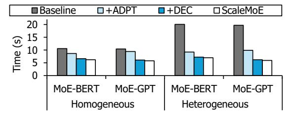

# *A. Experimental Setup*

We evaluate ScaleMoE on Amazon Elastic Compute Cloud, utilizing four p4d.24xlarge instances [25]. Each P4 instance consists of eight NVIDIA A100 40 GB GPUs, providing substantial parallelism for our experiments. The GPUs within the same node are connected via 600 GB/s NVLink 3.0, enabling high-bandwidth, low-latency intra-node communication. For inter-node communication, it uses Ultra Ethernet (100 Gbps).

As discussed in Section III-C, there is a huge network heterogeneity in cloud environments (up to 2×). To evaluate the performance implications of this heterogeneity, we configure the heterogeneous setup where the maximum bandwidth (100 Gbps) is twice the minimum bandwidth (50 Gbps). Specifically, we limit the Ethernet bandwidth of one node to

TABLE I: Model configurations for the experiments.

| Parameter               | Value            |
|-------------------------|------------------|
| Number of GPUs          | 32               |
| Batch size              | 512              |
| Sequence length         | 128              |
| Hidden dimension        | 768              |
| Number of layers        | 12               |
| Transformer model types | BERT, GPT        |
| Number of MoE layers    | 4, 6, 12         |
| Number of experts Ne    | 32, 64, 128      |
| Ratio of k to Ne        | 1:16, 1:32, 1:64 |

Fig. 13: The end-to-end performance comparison. We evaluate the performance implications of each optimization one by one: *adaptive all-to-all* (+ADPT), *dynamic expert clustering* (+DEC), *topology-aware expert remapping* (ScaleMoE).

50 Gbps, while the remaining nodes maintain a bandwidth of 100 Gbps. This configuration allows us to simulate and evaluate performance under heterogeneous network conditions that reflect real-world cloud environments.

Table I shows the model configurations for the experiments. To ensure consistency, we use the same configuration (i.e., the number of GPUs, batch size, sequence length, hidden dimension, and the number of layers). To show ScaleMoE's applicability, we use two Transformer-based models: BERT (encoder-only) and GPT (decoder-only). For each model, we vary the number of MoE layers (4, 6, 12) to analyze sensitivity across different MoE layer ratios. Furthermore, we conduct evaluations on different numbers of experts (Ne) (32, 64, 128) with different target selection ratios (k : Ne) (1/16, 1/32, 1/64). As mentioned in Section III-B, we primarily focus on the representative ratio (1/32). However, we also evaluate the other ratios (1/16, 1/64) to analyze their performance implications.

For the baseline, we use Tutel, one of the state-of-the-art open-source distributed frameworks for LLM-MoE models. Built on top of DeepSpeed, Tutel is widely adopted as a baseline in many studies [71]–[73] due to its capability of support large-scale environments (up to 256 GPUs). Also, it includes several advanced optimizations (e.g., efficient dispatcher, overlap strategy). We use the latest version of Tutel with the 2DH All-to-All configuration.

