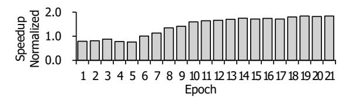
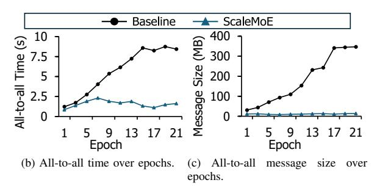
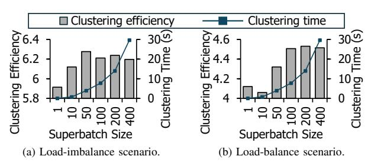

# *B. End-to-End Performance*

We evaluate end-to-end performance by measuring the average iteration time. To show the effectiveness of our optimizations, we compare the baseline by incrementally applying adaptive all-to-all communication (ADPT), dynamic expert clustering (DEC), and topology-aware expert remapping

TABLE II: The end-to-end performance comparison. We evaluate the performance implications of each optimization.

|           | Time (s)    |       |               |       |
|-----------|-------------|-------|---------------|-------|
| Method    | Homogeneous |       | Heterogeneous |       |
|           | MoE-        | MoE-  | MoE-          | MoE   |
|           | BERT        | GPT   | BERT          | GPT   |
| Baseline  | 10.60       | 10.42 | 20.04         | 19.67 |
| +ADPT     | 8.64        | 9.41  | 9.20          | 9.89  |
| +ADPT+DEC | 6.64        | 6.10  | 7.22          | 6.18  |
| ScaleMoE  | 6.20        | 5.78  | 6.96          | 5.94  |

(ScaleMoE). We use BERT and GPT models, and with 12 MoE layers, 32 experts, and k : Ne ratio (1/32). Each model is evaluated under homogeneous and heterogeneous network.

Figure 13 and Table II show the evaluation results. For the homogeneous network, ScaleMoE achieves average speedups of 1.71× and 1.81× for MoE-BERT and MoE-GPT, respectively. For the heterogeneous network, ScaleMoE achieves average speedups of 2.88× and 3.31× for MoE-BERT and MoE-GPT, respectively. Note that although some distributed training frameworks (e.g., Megatron-LM) support all-to-all variable (i.e., *alltoallv*) similar to our *adaptive all-to-all*, ScaleMoE still remains beneficial. By integrating *dynamic expert clustering* and *topology-aware expert remapping*, we effectively rebalance the load across experts and mitigate communication overhead caused by load imbalance. Even compared to the case when *alltoallv* is applied, ScaleMoE still achieves average speedups of 1.32× and 1.66× for MoE-BERT and MoE-GPT in the heterogeneous network, respectively. In addition, *adaptive all-to-all* is dispatcher-agnostic and integrates with frameworks (e.g., DeepSpeed, Megatron-LM) through hooks with minimal integration effort.

## *C. Performance Analysis Over Time*

As training progresses, expert selection is quickly biased towards specific experts (Section III-B). This increasing load imbalance results in inefficiency in all-to-all communication. In contrast, ScaleMoE can resolve this issue, thereby achieving more performance improvements as training progresses.

Figure 14 shows the performance analysis across epochs. Figure 14a shows that ScaleMoE achieves more speedup than the baseline as training progresses (up to 1.59×), which is expected as the load imbalance becomes more severe in higher epochs. For the in-depth performance analysis, we look into the all-to-all communication. Figure 14b shows the all-toall communication time. The baseline suffers from increasing communication time in higher epochs; however, ScaleMoE shows consistently low communication time throughout the training, demonstrating effective mitigation of load imbalance. Figure 14c shows the communication volumes of all-to-all operations. As expected, the message size keeps increasing in the baseline. In contrast, ScaleMoE significantly reduces the message size by discarding unnecessary zero padding.

## *D. Sensitivity Analysis*

The ratio of MoE layer. We first evaluate the ScaleMoE's performance across different MoE layer ratios: 0.33 (4-MoE

(a) Performance improvement across different epochs.

Fig. 14: The performance analysis over time, showing results from epoch 1 to epoch 21.

Fig. 15: Performance improvements across different MoE layer ratios in two network environments.

layers), 0.5 (6-MoE layers), and 1.0 (12-MoE layers). Figure 15 shows the evaluation results. We use both BERT and GPT models on two network configurations. In the homogeneous network (Figure 15a), ScaleMoE achieves average speedups of 1.51×, 1.62×, and 1.71× for MoE layer ratios of 0.33, 0.5, and 1.0, respectively. In the heterogeneous network (Figure 15b), ScaleMoE achieves average speedups of 2.52×, 2.99×, and 3.31× for the same ratios. As expected, ScaleMoE achieves higher performance improvements on higher MoE layer ratios. This is because the load imbalance becomes more severe as the MoE layer ratio increases, leading to higher all-to-all communication overheads(Section III-B). Notably, ScaleMoE achieves greater improvements in the heterogeneous network thanks to *topology-aware expert remapping*.

The ratio of k to  $N_e$ . We evaluate ScaleMoE's performance across different  $k:N_e$  ratios: 1/16, 1/32, and 1/64. In this experiment, we set k=2 and set the number of experts  $(N_e)$  to 32, 64, and 128, respectively, for the respective  $k:N_e$  ratios. Figure 16 shows the performance results across different ratios in two network environments. In the homogeneous network (Figure 16a), ScaleMoE achieves average speedups of  $1.65\times$ ,  $1.84\times$ , and  $1.87\times$  for the  $k:N_e$  ratios of 1/16, 1/32, and 1/64, respectively. Similarly, in the heterogeneous network (Figure 16b), ScaleMoE achieves average speedups of  $2.19\times$ ,

Fig. 16: Performance improvements across different  $k:N_e$  ratios in two network environments.

Fig. 17: Sensitivity analyses of superbatch sizes (1 to 400) measured on both load-imbalanced and balanced scenarios.

TABLE III: Effect of expert replication on local GPU memory access ratio, remote GPU memory access ratio, and GPU memory miss(i.e., host memory access) rate.

| Maximum Expert | Local      | Remote     | Miss     |
|----------------|------------|------------|----------|
| Replicas       | Access (%) | Access (%) | Rate (%) |
| 0              | 3.28       | 96.72      | 0.00     |
| 3              | 12.00      | 87.65      | 0.35     |
| 7              | 21.51      | 78.16      | 0.53     |
| 15             | 38.85      | 60.31      | 0.83     |
| 31             | 61.32      | 37.55      | 1.12     |

 $2.35\times$ , and  $2.47\times$  for the same ratios. In both scenarios, the results show that ScaleMoE achieves more performance improvements as the  $k:N_e$  ratio decreases. This is because the load imbalance becomes more severe with lower  $k:N_e$  ratios, as discussed in Section III-B.

**Superbatch size.** The superbatch size determines the frequency of clustering, directly influencing both the iteration time and the clustering time for each superbatch. A smaller superbatch size requires more frequent clustering, but it may harm clustering efficiency by not leveraging enough expert selection history. Conversely, a larger superbatch size reduces clustering frequency but increases clustering time, preventing the clustering overhead from overlapping with the iteration time. Therefore, it is important to find an optimal superbatch size. Figure 17 shows the sensitivity analyses across superbatch sizes (1 to 400). Figure 17a and Figure 17b show the sensitivity results for the load-imbalanced and balanced scenarios, respectively. In both cases, we find that superbatch 100 shows reasonable clustering overheads while maintaining the iteration time allowing full overlap of clustering operations.

**Replication Effect.** We evaluate the impact of the number of expert replicas on clustering efficiency. As shown

TABLE IV: Overhead breakdown for the 12-MoE-BERT model at epoch-21 with a superbatch size of 100. Most of them are hidden by the overlapping technique (See Section V).

| Overhead                         | Latency(ms) |  |
|----------------------------------|-------------|--|
| Dynamic Expert Clustering        | 3121.57     |  |
| Topology-aware Expert Remapping  | 2443.32     |  |
| Expert Exchange                  | 2226.48     |  |
| Clustering for Input             | 483.04      |  |
| Gather for Profiling             | 5.96        |  |
| All-gather for Zero Slicing      | 44.50       |  |
| All-reduce for Replicated Expert | 310.53      |  |

in Table III, a higher number of maximum replicas leads to better clustering efficiency, making more experts locally available (from 3.28% to 61.32%). Note that the number of maximum expert replicas refers to the upper bound; the actual number of replicated experts may be lower than this maximum. Replication maximizes local GPU HBM accesses, resulting in significant improvement. While this comes with a slight increase in miss rate (i.e., host memory access), it remains low (∼1%) due to the inherent imbalance in the expert selection, making host memory access overheads negligible.

