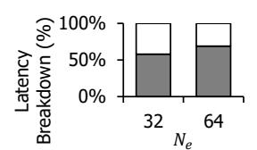
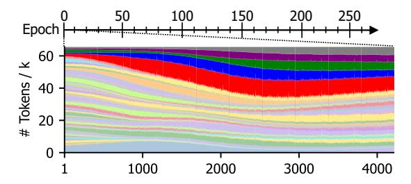
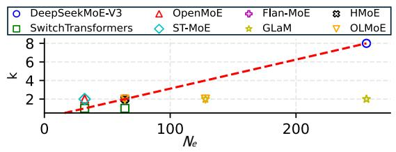
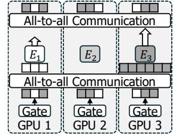

# *B. Mixture-of-experts (MoE)*

To overcome the limited size of FFNs, the mixtureof-experts (MoE) [47] is widely applied to the modern Transformer-based pre-trained models. Figure 1 provides the high-level overview of the MoE layer in Transformer. Figure 1a illustrates how MoE is applied to the Transformer block. The Transformer's FFN layer is replaced with the MoE layer. The MoE layer consists of a *trainable gating network* (Gate)

Fig. 1: Mixture-of-experts (MoE) with Transformer blocks.

and multiple FFNs (called *experts*) that can represent different domains. For each input, the gating network determines which experts should be activated, and only the selected experts are calculated (in this example, *expert-N* ( $E_N$ ) is activated).

$$G(x) = Softmax(TopK(x \cdot W_a)) \tag{1}$$

Equation 1 shows how the trainable gating network selects target experts. For each input token x, the network identifies the top-k most relevant experts. The gating weight  $(W_g)$  is updated during training. The gating mechanism inherently leads to the expert selection imbalance, where certain experts handle more input tokens than others [48]–[50]. To mitigate this issue, some studies propose capping the number of processed tokens for each expert or the auxiliary functions to make the gating network more balanced [16], [37], [51]–[53]. However, they compromise training quality [10], [54]–[56], and neither of them fully resolves the load imbalance issue [14], [50], [57].

With this sparse expert selection, the MoE layer can significantly reduce computational overheads; however, it still requires a large amount of memory. For example, an N-expert MoE layer requires N times the size of a vanilla FFN layer, which considerably increases the overall model size. This increasing model size constrains the MoE model's scalability due to the limited capacity of GPU memory.

#### C. Expert Parallelism

To address this memory bottleneck, the modern distributed training frameworks employ *expert parallelism*. Rather than holding all experts on each device (GPU), expert parallelism distributes the experts across different devices. By doing so, each device needs to store only a subset of the experts, thereby significantly reducing the overall memory requirements.

Figure 1b shows how expert parallelism partitions experts across multiple GPUs and how the input tokens are processed. The MoE layer's gating network first identifies the relevant experts for each input token. Then, through all-to-all communication, each input token is forwarded to the devices where its corresponding expert is located. Next, each device computes the FFNs for its assigned experts. Once the computations are finished, the outputs are sent back to the original devices via another all-to-all communication. Note that the all-to-all communication is a synchronous operation, requiring all devices to be ready before proceeding.

(a) Latency breakdown of 32-expert Transformer MoE model.

(b) Latency breakdown of the different number of experts.

(c) Latency breakdown of the different ratios of MoE layers.

Fig. 2: Latency breakdown of Transformer MoE models on various model configurations.

Expert parallelism successfully enhances the scalability of the distributed training framework; however, it also introduces a new performance challenge: *significant communication overhead*. In expert parallelism, all MoE layers necessitate two additional all-to-all communications, causing extra network overhead. We discuss the performance impact of expert parallelism in the following sections.

#### III. OBSERVATION AND MOTIVATION

#### A. High Communication Overhead

We identify that all-to-all communication is a major performance bottleneck in the distributed training frameworks for large-scale MoE models. Figure 2 presents various latency breakdown analyses to illustrate the overhead associated with all-to-all communication. Specifically, Figure 2a shows the latency breakdown result for the 32-expert Transformer MoE model in the 4-node, 32-GPU cluster environment (the detailed configurations in Section VI-A). The result indicates that the all-to-all communication accounts for up to 66% of the overall latency, which is quite substantial.

We also conduct various sensitivity analyses regarding the number of experts and the ratio of MoE layers. Figure 2b shows how the all-to-all communication overhead changes for different numbers of experts. We measure the latency breakdown for two Transformer MoE models: 32-expert (left) and 64-expert (right). For the 32-expert and 64-expert models, the all-to-all communication accounts for 58% and 69% of the entire latency overheads, respectively. We observe that the overheads from the all-to-all communication increase with more numbers of experts. This is because more experts require a larger data volume for all-to-all communication, while the amount of computations remains constant as the gating network selects the same number of experts. Figure 2c presents another sensitivity analysis of the ratio of MoE layers (i.e., the number of MoE layers / the number of Transformer blocks). We vary the number of MoE layers from 4, 6, and 12 out of 12 total Transformer blocks, resulting in the ratios of 4/12,

Fig. 3: The expert selection distribution changes over training steps, gradually becoming biased toward specific experts.

6/12, and 12/12, respectively. The results indicate that the all-to-all overhead become more significant as the ratio of MoE layers increases. This is because the total number of all-to-all communications increases with more numbers of MoE layers.

Given that many studies try to increase the number of experts and the ratio of MoE layers [16], [51] to enhance the models' reasoning power, the all-to-all communication overhead would become increasingly larger. This can significantly degrade the efficiency of distributed training frameworks for pre-trained models. Therefore, we need to optimize such a high communication overhead.

#### Observation 1

The all-to-all communication becomes a major performance bottleneck in the MoE models, and this communication overhead is getting more significant as both the number of experts and the ratio of MoE layers increase to enhance the models' reasoning power.

#### B. Load Imbalance in Expert Selection

**Expert selection imbalance.** We conduct a comprehensive profiling of various model configurations and observe that the Transformer MoE models experience severe load imbalance in the expert selection1. Our analysis reveals that the expert selection is naturally biased toward specific experts during the pre-training of MoE models.

Figure 3 shows how the distribution of expert selection changes over the pre-training process. We collect the expert selection of each token throughout the pre-training process and display the expert selection distribution for the 6th layer in the 64-expert top-2 Transformer MoE model. The entire pre-training process typically takes 28 epochs [58]; however, for the sake of simplicity, the figure only highlights the initial 10 epochs (i.e., 4000 iterations). The x- and y-axis represent training iterations and the expert selection distribution, respectively, and each colored area indicates a different expert. As shown, the expert selection rapidly becomes imbalanced. After iteration 3000, the most selected expert accounts for 13% (red), and the top 5 experts collectively account for 40% (red, blue, green, purple, gray). The imbalanced distribution

(a) The k and  $N_e$  values used in the state-of-the-art MoE models. The dotted red line indicates the k to  $N_e$  ratio of 1/32.

(b) The activated expert ratios by different target selection ratios.

(c) The activated expert ratios by MoE layer ratios.

Fig. 4: Load imbalance analysis across configurations, such as different ratios of k to the number of experts  $(N_e)$  (Figure 4b) and various MoE layer ratios (Figure 4c). Here, a lower ratio of activated experts (experts selected by more than  $1/N_e$  of tokens) means the expert selection is more imbalanced.

either persists throughout the rest of the pre-training process or becomes more severe.

To quantify this load imbalance problem, we conduct various sensitivity analyses across different configurations (Figure 4). Since the expert selection imbalance is highly correlated with the ratio (i.e., target selection ratio) of selected target experts (k in top-k gating networks) to the total number of experts ( $N_e$ ), we first comprehensively review the state-of-the-art Transformer MoE models [9], [16], [57], [59]–[63]. Figure 4a summarizes the k and  $N_e$  values used in these models. As shown, although the models employ different combinations of k and  $N_e$ , most of them have target selection ratios ( $k:N_e$ ) lower than 1/32 (dotted red line). Thus, in this work, we set the representative target selection ratio to 1/32.

To measure the degree of load imbalance, we define an activated expert ratio as the fraction of experts that are selected more frequently than in a fully balanced scenario. For example, if there are 100 experts and 60 experts are selected by more than 1% of input tokens, the activated expert ratio is 0.6. A smaller activated expert ratio indicates more load imbalance in the expert selection. Figure 4b shows the activated expert ratios for target selection ratios across various configurations: k (1, 2, 4, 8) and  $N_e$  (32, 64, 128). The activated expert ratio decreases as the target selection ratio decreases: 1:8 (66%), 1:16 (52%), 1:32 (41%), and 1:64 (29%), indicating that the models become more imbalanced as the target selection ratio decreases. Additionally, we observe that the ratio of MoE layers affects the expert selection imbalance. Figure 4c presents the activated expert ratios for different MoE layer ratios: 4/12, 6/12, 8/12, and 12/12. It shows that the activated

&lt;sup>1In this work, we use a standard top-k gating network. Various load-balancing techniques can compromise training quality and cannot fully resolve the load imbalance issue.

(a) Communication overhead analysis over 11 epochs.

(b) Computational process in the expert selection imbalance.

Fig. 5: Performance implications of the load imbalance.

expert ratio decreases as the MoE layer ratio increases: 4/12 (48%), 6/12 (45%), 8/12 (41%), and 12/12 (38%), indicating that more MoE layers exacerbate load imbalance.

